# STEPS TO FOLLOW

1. Go to AWS Terraform AWS provider:[AWS](https://registry.terraform.io/providers/hashicorp/aws/latest)
2. Click on USE PROVIDER
   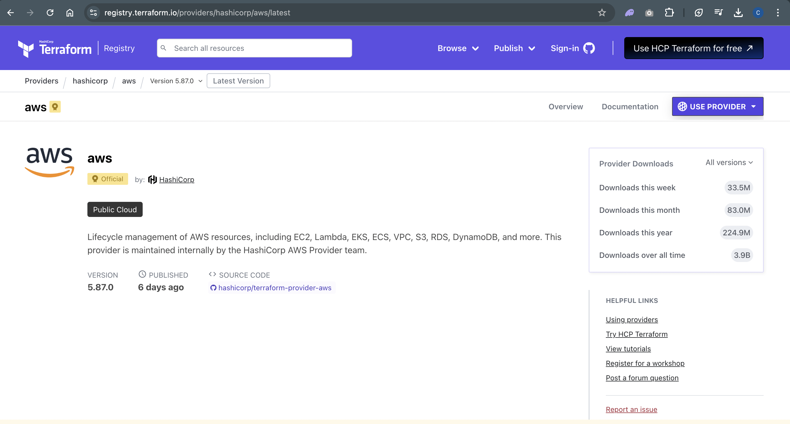
3. Copy and paste code in main.tf
   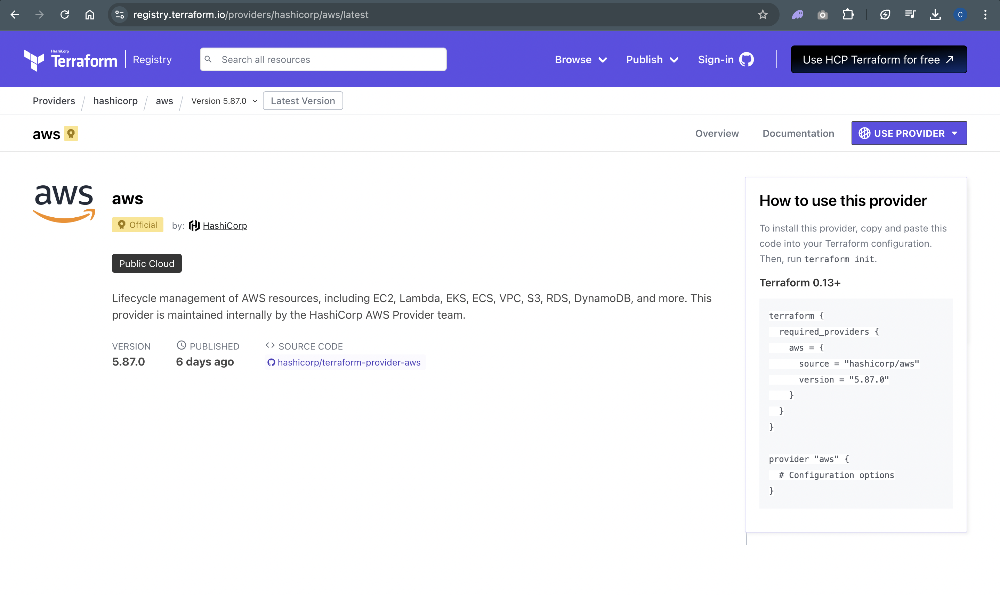

```
terraform {
  required_providers {
    aws = {
      source = "hashicorp/aws"
      version = "5.87.0"
    }
  }
}

provider "aws" {
  # Configuration options
}
```

## This Terraform configuration is setting up AWS as a provider for deploying infrastructure.

## What is happening?

### Initializing Terraform Block

```
terraform {
  required_providers {
    aws = {
      source  = "hashicorp/aws"
      version = "5.87.0"
    }
  }
}

```

- This block defines required providers (in this case, AWS).
- `aws = {}` defines AWS as the cloud provider.
- `source = "hashicorp/aws"` tells Terraform to download the AWS provider plugin from HashiCorp's official registry.
- `version = "5.87.0"` ensures Terraform uses version 5.87.0 of the AWS provider.

## Configuring the AWS Provider

```
provider "aws" {
  # Configuration options
}

```

```
provider "aws" {
  region     = "us-east-1"
  access_key = "your-access-key"
  secret_key = "your-secret-key"
}

```

- This tells Terraform to use the AWS provider for managing resources.
- You usually specify AWS credentials and a region here
- However, it's best practice to use environment variables or IAM roles instead of hardcoding credentials.

#

4. Now add code for AWS resource type, name, instance-type, ami, key_name, security_groups

```

resource "aws_instance" "K8s-Master-Node" {
  ami             = "ami-04b4f1a9cf54c11d0"   # ✅ Amazon Machine Image (AMI) for OS
  instance_type   = "t2.micro"               # ✅ Defines instance type (Free Tier eligible)
  key_name        = "awswebserverkey"        # ✅ SSH Key Pair name
  vpc_security_group_ids = ["sg-04a0292e2d6229ea0"] # ✅ List of Security Groups
  tags = {
    Name = "k8s-control-plane"               # ✅ Tags for easy identification
  }
}

```

5.

```
source .env
```

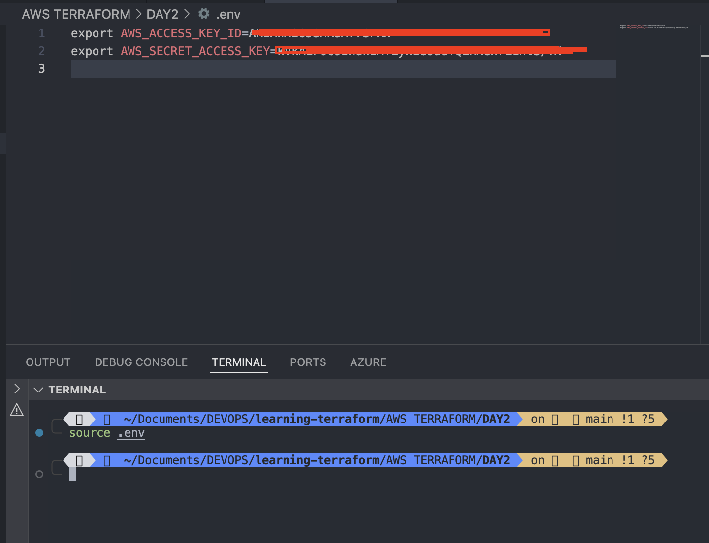

#

6. Initialize Terraform

```
 cd AWS-EC2
terraform init
```

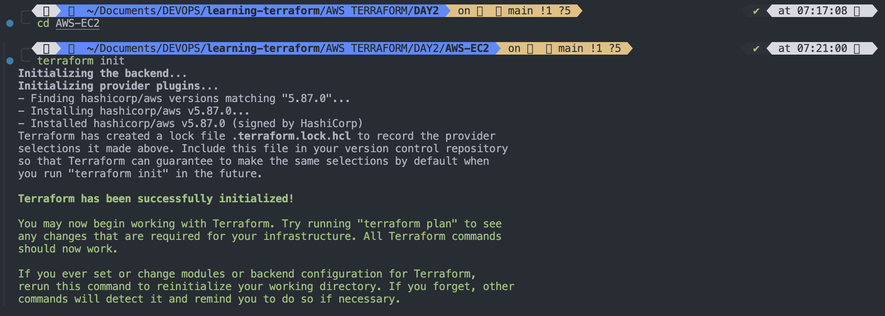

#

7. Preview the changes: Run `terraform plan` command

- See what Terraform will create before applying
- You may now begin working with Terraform. Try running `terraform plan` to see any changes that are required for your infrastructure. All Terraform commands should now work.
- If you ever set or change modules or backend configuration for Terraform,
  rerun this command to reinitialize your working directory. If you forget, other commands will detect it and remind you to do so if necessary.

```
terraform plan
```

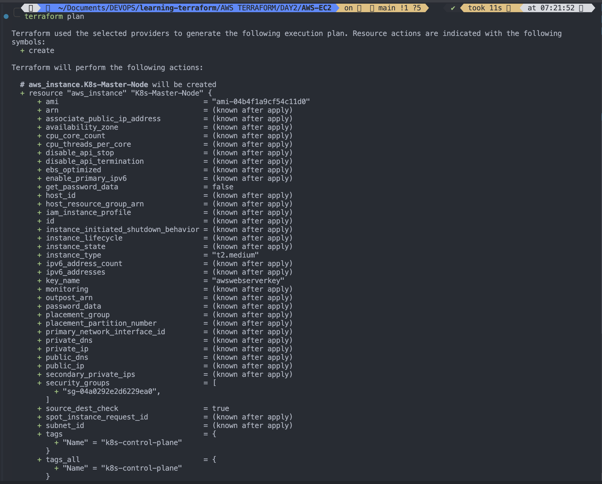
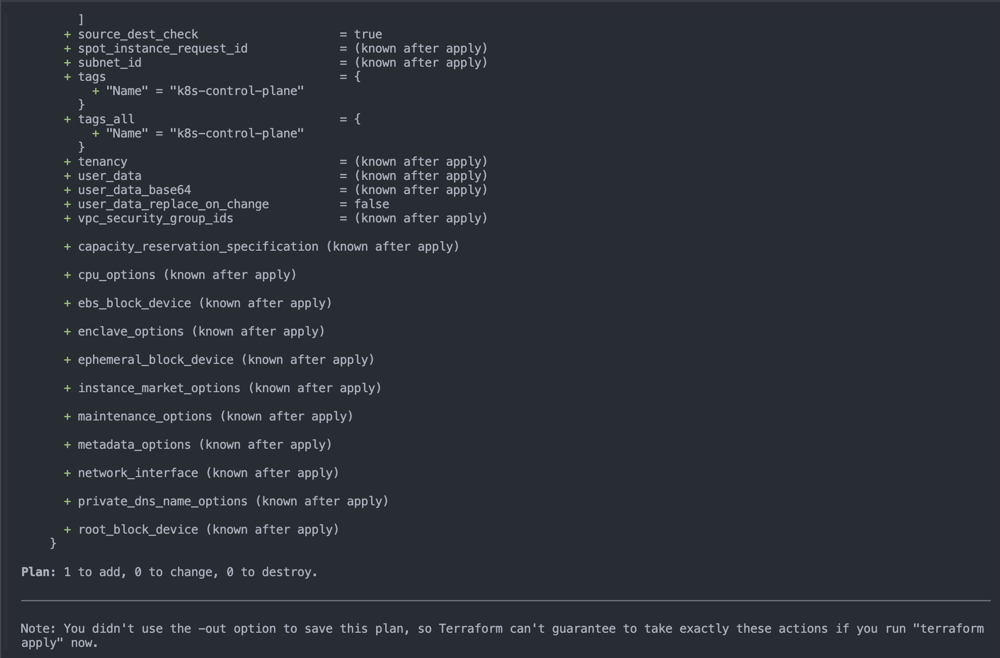

#

8. Validate the Configuration: `terraform validate`

- Check for syntax errors
  

#

9. Apply the Configuration (Create the Instance): `terraform apply` -auto-approve

- Run this command to deploy the EC2 instance

```
terraform apply
```

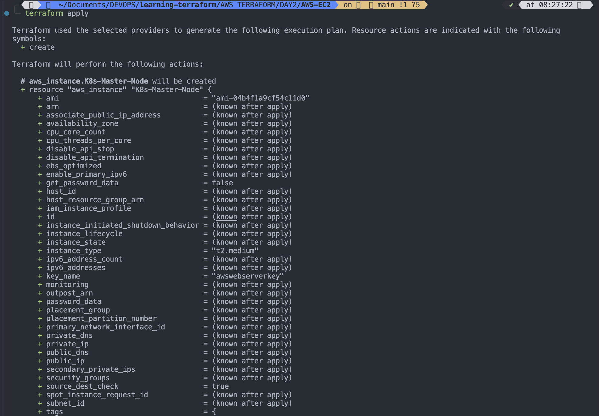
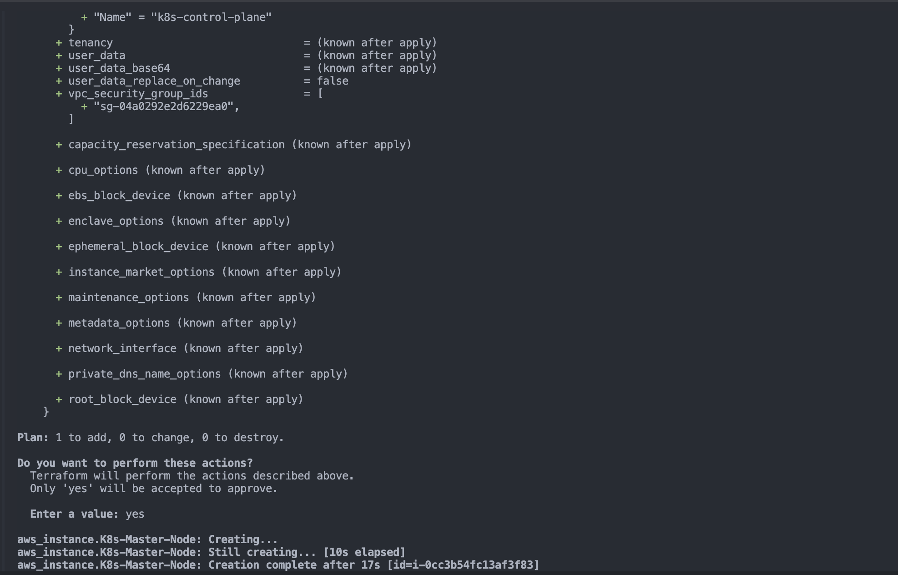
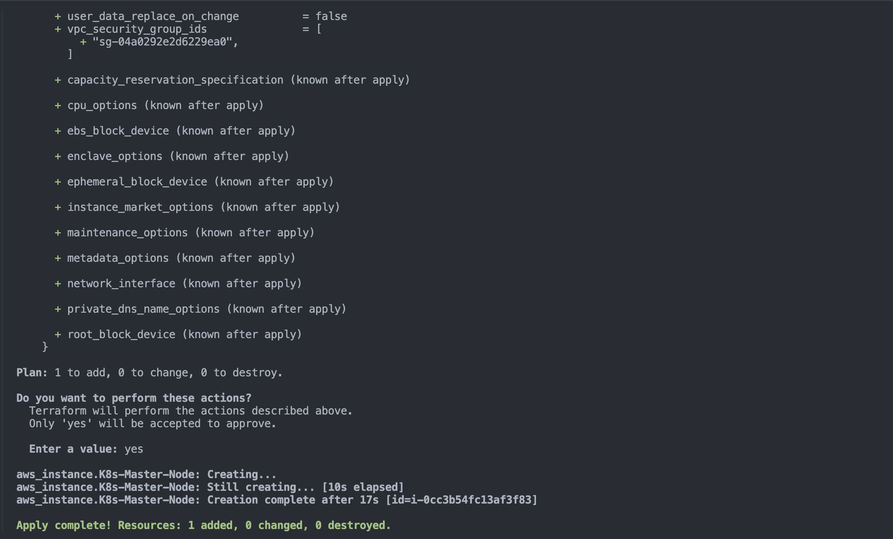

#

## verify the insatance on AWS console

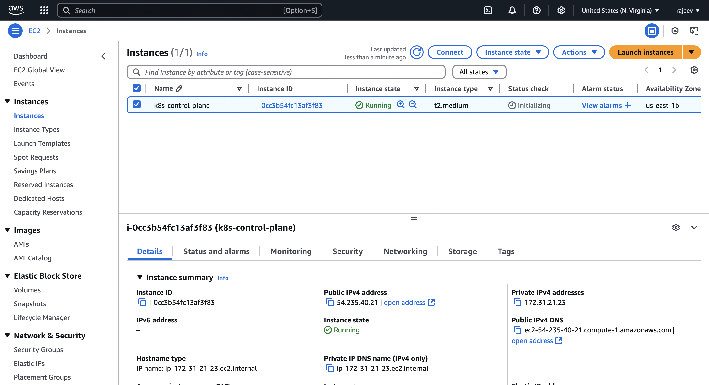

## 🔠Step-by-Step Breakdown

1.  `resource "aws_instance" "K8s-Master-Node"`
    - This declares an EC2 instance resource in Terraform.
    - `"K8s-Master-Node"` is the Terraform identifier for this instance.
    - Later, you can reference this instance using `aws_instance.K8s-Master-Node`
2.  ## `ami = "ami-04b4f1a9cf54c11d0"` (Amazon Machine Image)

    - The AMI ID `"ami-04b4f1a9cf54c11d0"` represents Amazon Linux 2.
    - AMI IDs are region-specific, so this might not work in another region.
    - To find an AMI for your region, run:

    ```
    aws ec2 describe-images --owners amazon --filters "Name=name,Values=amzn2-ami-hvm-*-x86_64-gp2"

    ```

    - If you need Ubuntu, replace with an Ubuntu AMI.
      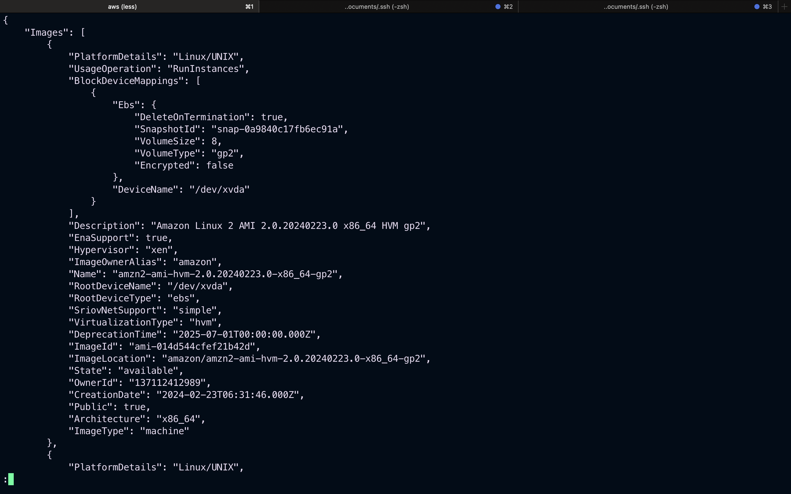
      
      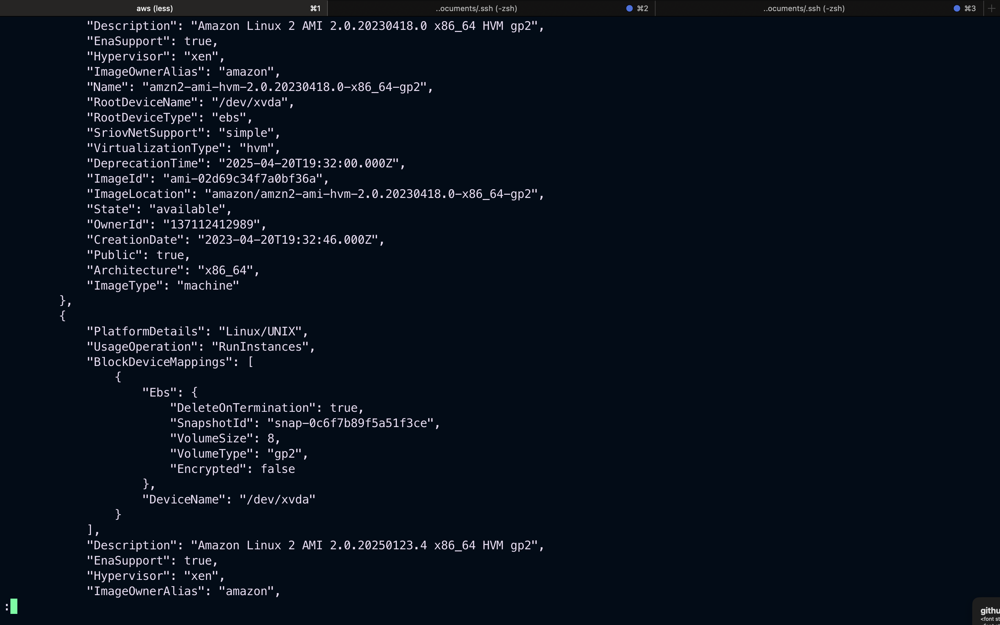
      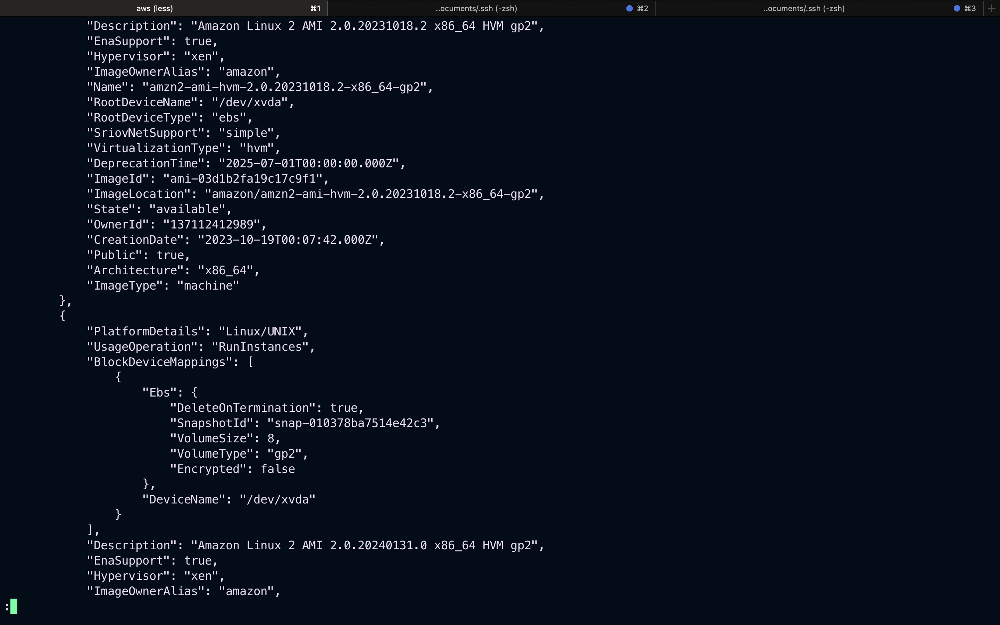

3.  `instance_type = "t2.micro"`
    - Defines the EC2 instance type (hardware specifications).
    - `t2.micro` is Free Tier eligible but may not be powerful enough for Kubernetes.
    - For better performance, use:
    - `t3.medium` (2 vCPUs, 4GB RAM)
    - `t3.large` (2 vCPUs, 8GB RAM)
4.  `key_name = "awswebserverkey"` (SSH Key Pair)

    - Specifies the SSH key pair to connect to the instance.
    - The key must exist in AWS before applying Terraform.
    - If you haven't created it, run

    ```
    aws ec2 create-key-pair --key-name awswebserverkey --query 'KeyMaterial' --output text > awswebserverkey.pem
    chmod 400 awswebserverkey.pem

    ```

    - To connect via SSH

    ```
     ssh -i awswebserverkey.pem ec2-user@<PUBLIC_IP>
    ```

5.  `security_groups = ["sg-04a0292e2d6229ea0"]`

    - Defines security group(s) for this instance.
    - The security group controls inbound and outbound traffic.
    - Ensure this allows SSH (port 22) and Kubernetes ports (6443, 10250, etc.).
    - To check security group rules:

    ```
     aws ec2 describe-security-groups --group-ids sg-04a0292e2d6229ea0

    ```

    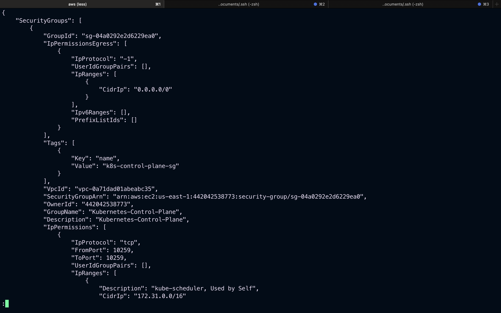
    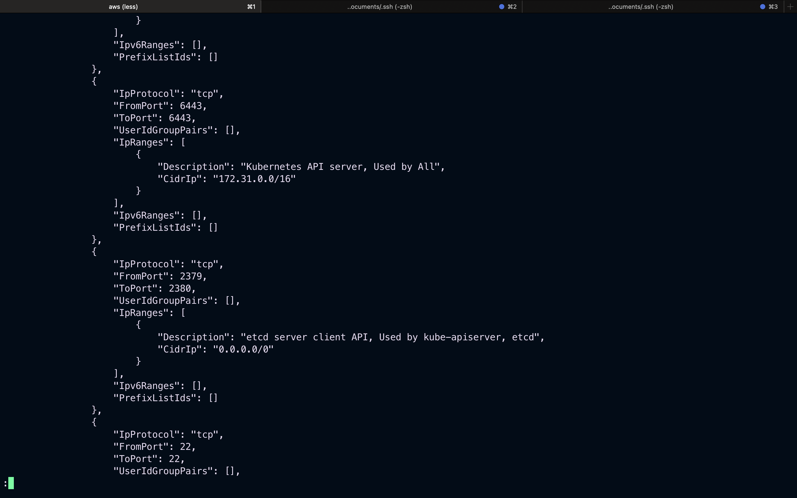
    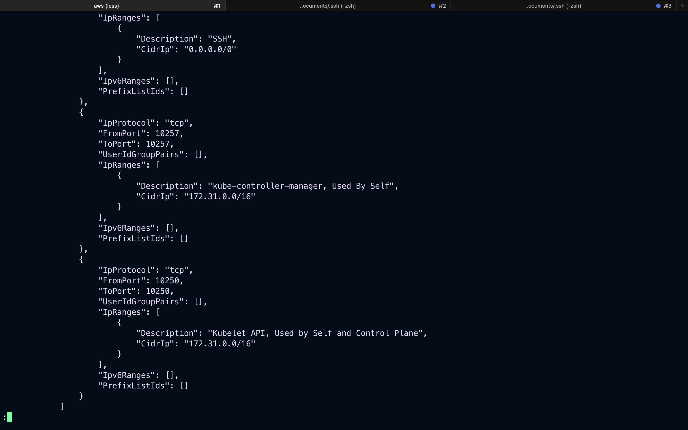

6.  `tags = { Name = "k8s-control-plane" }`

    - Adds a name tag for easy identification in AWS.
    - The correct key should be `"Name"` (uppercase)

    ```
     tags = {
     Name = "k8s-control-plane"  # ✅ Corrected
     }

    ```

#

#

#

#

```
# TERRAFORM AWS_PROVIDER
terraform {
  required_providers {
    aws = {
      source = "hashicorp/aws"
      version = "5.87.0"
    }
  }
}
# Here use environment variable for credentials or hardcode below your AWS_ACCESS_KEY and AWS_SECRET_ACCESS_KEY
provider "aws" {
  # Configuration options
  region = "us-east-1"
}
# Resource type and other details related to that specific resource
resource "aws_instance" "K8s-Master-Node" {
  ami = "ami-04b4f1a9cf54c11d0"
  instance_type = "t2.medium"
  key_name = "awswebserverkey"
  vpc_security_group_ids = ["sg-04a0292e2d6229ea0"]
  tags = {
    Name = "k8s-control-plane"
  }
}

resource "aws_instance" "K8s-Worker-Node-01" {
  ami = "ami-04b4f1a9cf54c11d0"
  instance_type = "t2.medium"
  key_name = "awswebserverkey"
  vpc_security_group_ids = ["sg-034dc0cc873c9388a"]
  tags = {
    Name = "k8s-worker-node-1"
  }
}

resource "aws_instance" "K8s-Worker-Node-02" {
  ami = "ami-04b4f1a9cf54c11d0"
  instance_type = "t2.medium"
  key_name = "awswebserverkey"
  vpc_security_group_ids = ["sg-034dc0cc873c9388a"]
  tags = {
    Name = "k8s-worker-node-2"
  }
}

```

```
terraform validate
terraform plan
terraform apply
```

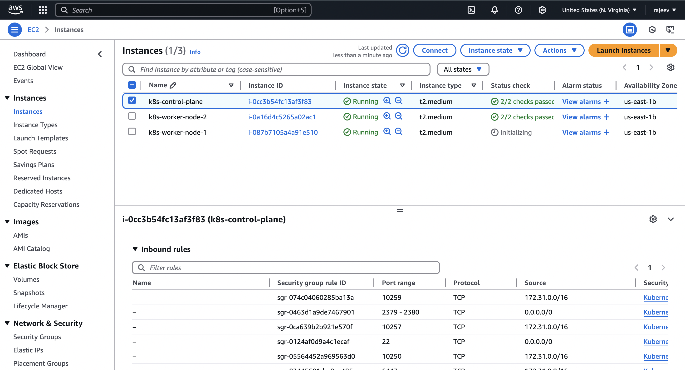

#

#

#

# 🛑 Stop Running Instances Using Terraform

- Terraform does not have a direct `stop` command for EC2 instances, but you can terminate or stop instances in multiple ways.
- If you want to `stop` the instance but keep it available for future use, update your Terraform code to use the `instance_state` attribute.

## Steps:

1. Modify the Terraform Code

```
# TERRAFORM AWS_PROVIDER
terraform {
  required_providers {
    aws = {
      source = "hashicorp/aws"
      version = "5.87.0"
    }
  }
}
# Here use environment variable for credentials or hardcode below your AWS_ACCESS_KEY and AWS_SECRET_ACCESS_KEY
provider "aws" {
  # Configuration options
  region = "us-east-1"
}
# Resource type and other details related to that specific resource
resource "aws_instance" "K8s-Master-Node" {
  ami = "ami-04b4f1a9cf54c11d0"
  instance_type = "t2.medium"
  key_name = "awswebserverkey"
  vpc_security_group_ids = ["sg-04a0292e2d6229ea0"]
  tags = {
    Name = "k8s-control-plane"
    # Stop the instance instead of terminating
    instance_state = "stopped"
  }
}

resource "aws_instance" "K8s-Worker-Node-01" {
  ami = "ami-04b4f1a9cf54c11d0"
  instance_type = "t2.medium"
  key_name = "awswebserverkey"
  vpc_security_group_ids = ["sg-034dc0cc873c9388a"]
  tags = {
    Name = "k8s-worker-node-1"
    # Stop the instance instead of terminating
    instance_state = "stopped"
  }
}

resource "aws_instance" "K8s-Worker-Node-02" {
  ami = "ami-04b4f1a9cf54c11d0"
  instance_type = "t2.medium"
  key_name = "awswebserverkey"
  vpc_security_group_ids = ["sg-034dc0cc873c9388a"]
  tags = {
    Name = "k8s-worker-node-2"
    # Stop the instance instead of terminating
    instance_state = "stopped"
  }
}
```

2. Apply the changes

- 🔹 This will stop the instance instead of terminating it.

```
terraform apply -auto-approve
```

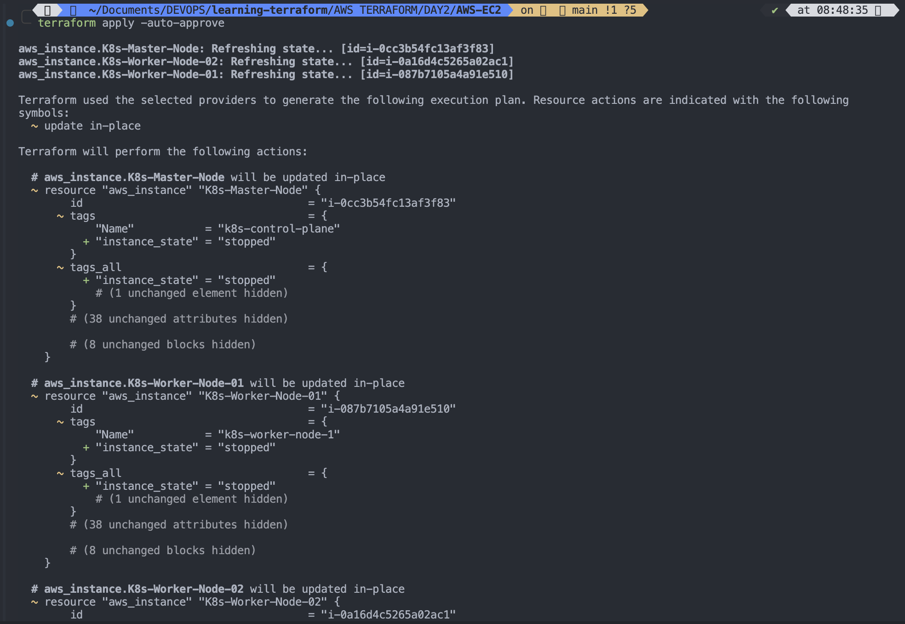
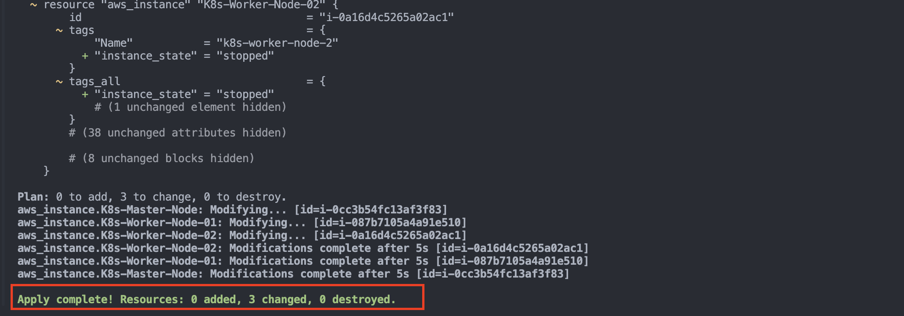

## Verify the changes on AWS console

#

#

# Terminate EC2 Instances

- If you want to completely remove the EC2 instance, run
- 🔹 This will delete the instance.

```
terraform destroy -target=aws_instance.K8s-Master-Node -auto-approve

```

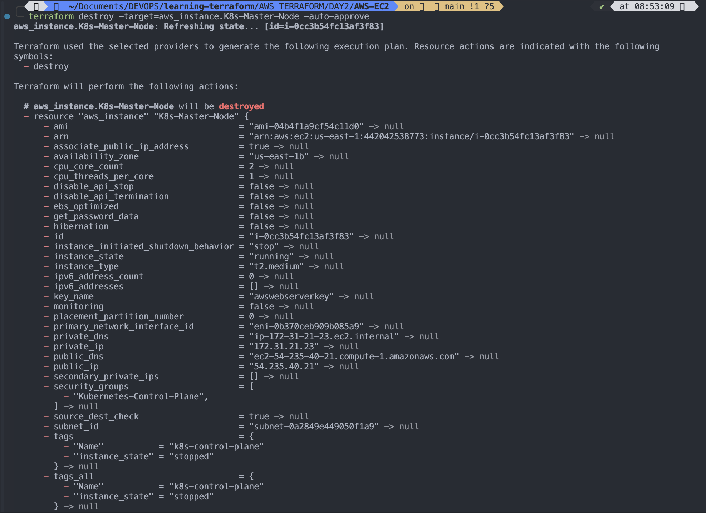
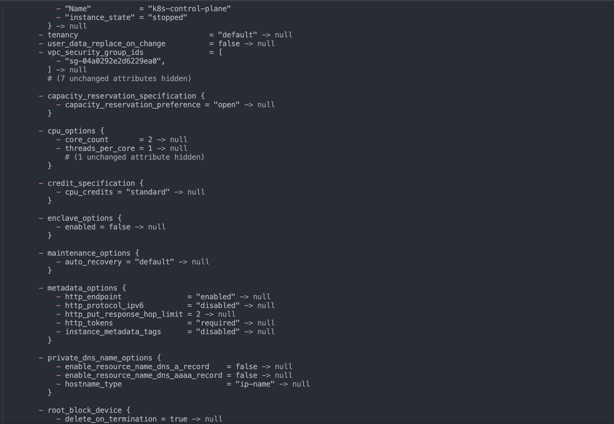
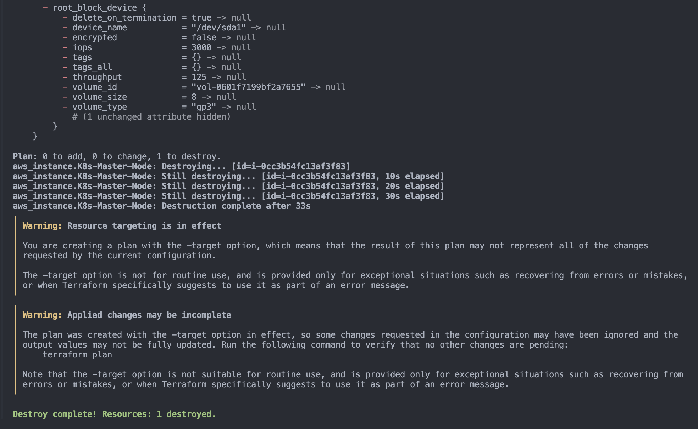

#

# Verify the changes using AWS console

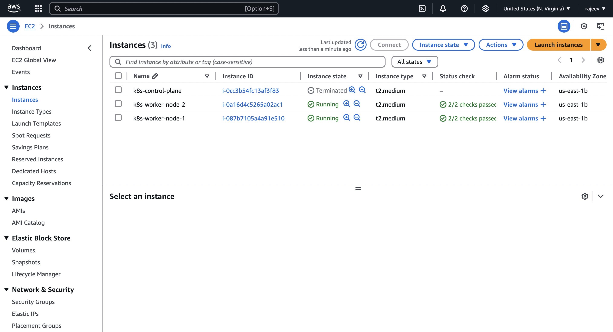

# If you want to destroy all resources in your Terraform state:

- Now we have 2 running instance
  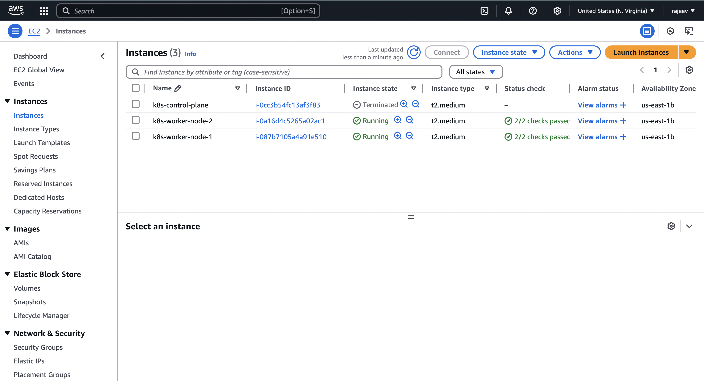

```
terraform destroy -auto-approve
```

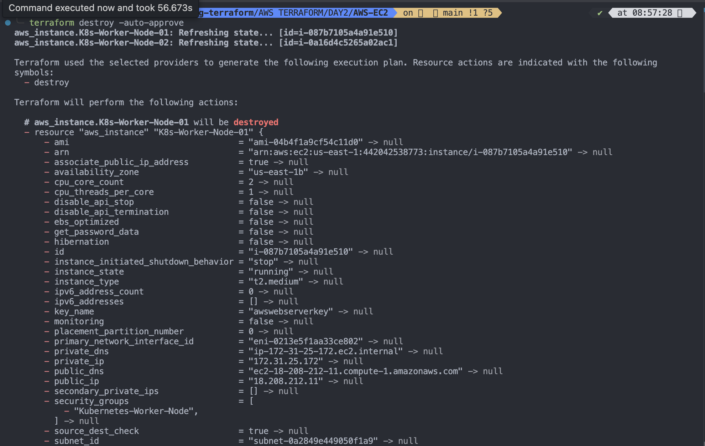
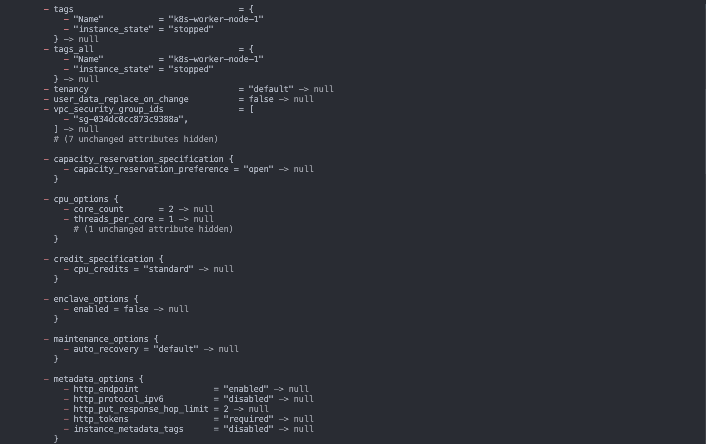
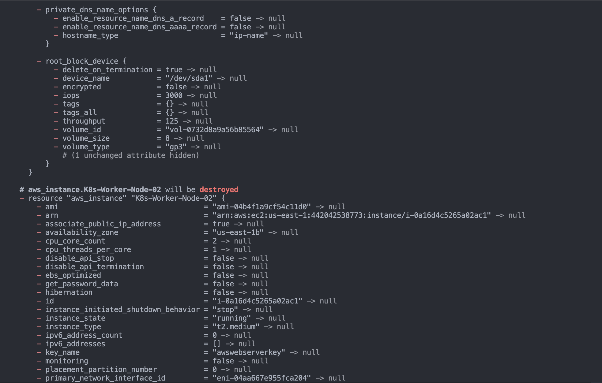
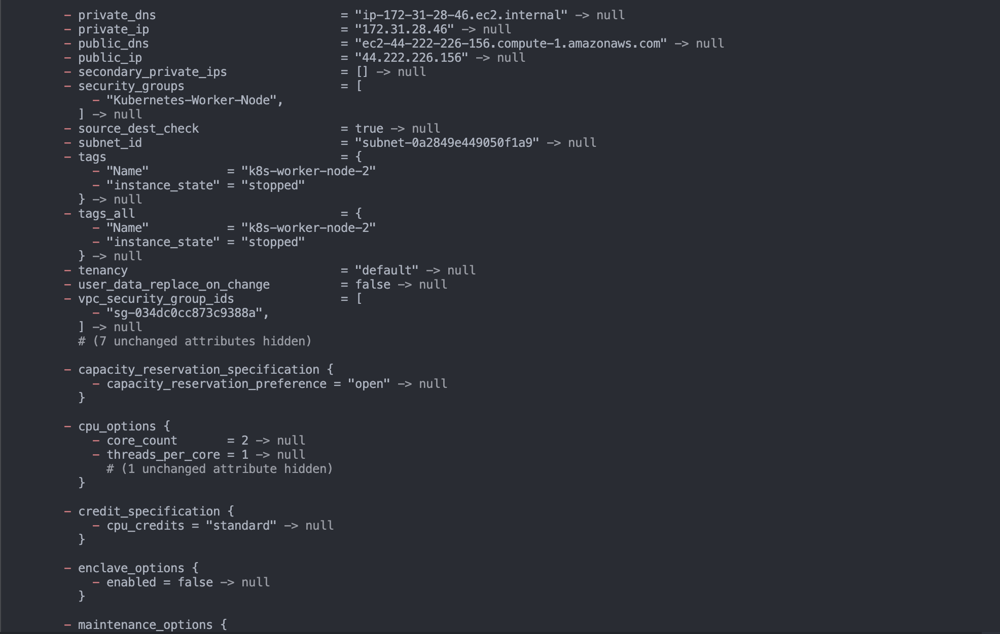
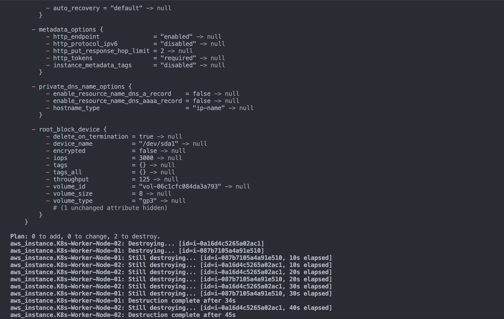
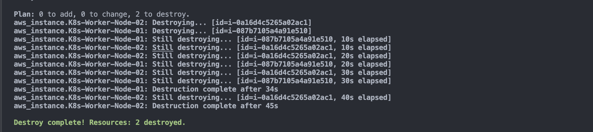

## Verify the changes using AWS console

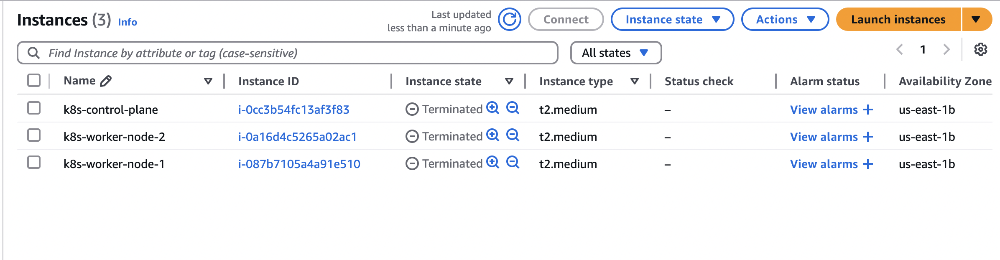

#

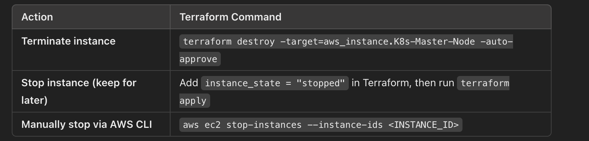

#

# List running instances using Terraform

-Terraform itself does not have a direct command to list running instances, but you can retrieve this information using Terraform state or AWS CLI.

## Use Terraform State to List EC2 Instances

- If Terraform is managing the instances, you can use
- This lists all instances managed by Terraform.

```
terraform state list | grep aws_instance
```

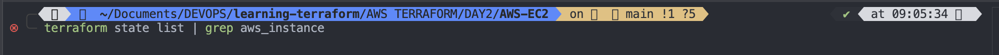

> Just now we terminated all the three instance so it returns nothing.

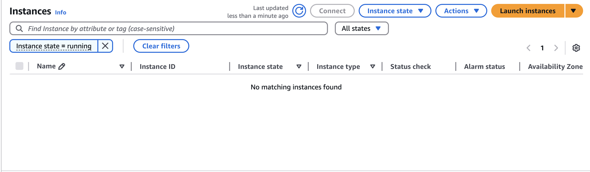

#

# To get details of a specific instance

- This will display instance details, including its current state.

```
terraform state show aws_instance.<instance-name>

```

# Use AWS CLI to List Running Instances

- If you want to check only running instances, use

```
aws ec2 describe-instances --filters "Name=instance-state-name,Values=running" --query 'Reservations[*].Instances[*].[InstanceId, State.Name, Tags]' --output table

```

- This will display all running instances with their ID, state, and tags in a table format.
- If you want only the instance IDs

```
aws ec2 describe-instances --filters "Name=instance-state-name,Values=running" --query 'Reservations[*].Instances[*].InstanceId' --output text

```

# Use Terraform Output (If Defined in Configuration)

- If your Terraform configuration includes an `output.tf` file with an instance ID output, you can run

```
terraform output
```

OR

```
terraform output instance_id
```

- If not defined, you can add this to your main.tf

```
output "instance_id" {
  value = aws_instance.K8s-Master-Node.id
}

```

Then run:

```
terraform apply
terraform output instance_id

```


