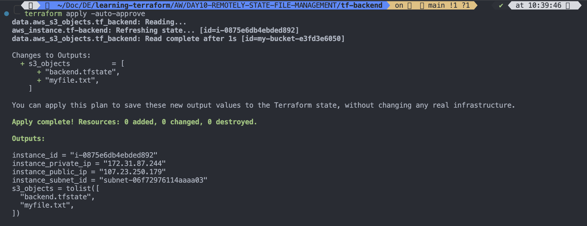

# Remotely state management

`STEPS`

`1`. Create one `AWS s3 bucket`

```sh
touch aws_s3.tf
```

```hcl

terraform {
  required_providers {
    aws = {
      source = "hashicorp/aws"
      version = "5.87.0"
    }
    random = {
      source = "hashicorp/random"
      version = "3.6.3"
    }

  }
}

variable "aws_region" {
  description = "The AWS region to deploy resources"
  type = string
  default = "us-east-1"
}


# Using Random Provider to generate random id
resource "random_id" "random_provider_example" {
  byte_length = 5

}

# Add an S3 bucket resource

resource "aws_s3_bucket" "demo-bucket" {
  bucket = "my-bucket-${random_id.random_provider_example.hex}" # must be unique globaly
  tags = {
    Name = "MyTerraformS3Bucket"
    Environment = "Dev"
  }
}

# To enable bucket versioning for the bucket, add
resource "aws_s3_bucket_versioning" "versioning_example" {
  bucket = aws_s3_bucket.demo-bucket.id
  versioning_configuration {
    status = "Disabled"
  }

}


# Make S3 Bucket Private/Public(Optional)
# To control access using ACL(Access Control List)
#resource "aws_s3_bucket_acl" "example_acl" {
  #bucket = aws_s3_bucket.my-unique-terraform-bucket-2025.id
  #acl = "private" # Options: private, public-read, public-read-write, authenticated-read
  #}

# Use the Object Ownership setting instead: Modify your S3 bucket resource to explicitly set the ownership control:
resource "aws_s3_bucket_ownership_controls" "example" {
  bucket = aws_s3_bucket.demo-bucket.id

  rule {
    object_ownership = "BucketOwnerEnforced"
  }
}

# Upload file to s3 bucket
resource "aws_s3_object" "bucket_file" {
  bucket = aws_s3_bucket.demo-bucket.bucket
  source = "./demofile.txt"
  key =  "myfile.txt"

}


```

```
terraform init
terraform validate
terraform plan
terraform validate
```


---

2. Launch `EC2 INSTANCE`

- create variables.tf file

```sh
touch variables.tf
```

- write into variables.tf

```
# AWS PROVIDER
terraform {
  required_providers {
    aws = {
      source = "hashicorp/aws"
      version = "5.88.0"
    }
  }
  # BACKEND BLOCK
  backend "s3" {
    bucket = "my-bucket-e3fd3e6050"
    key = "backend.tfstate"
    region = "us-east-1"

  }
}


# REGION VARIABLE
variable "aws_region" {
  description = "AWS_REGION to create AWS resources"
  type = string
  default = "us-east-1"
}

# INSTANCE_TYPE_VARIABLE
variable "aws_instance_type" {
  description = "Instance Type to create AWS EC2 INSTANCES"
  type = string
  default = "t2.micro"

}

# AWS UBUNTU AMI VARIABLE
variable "AWS_UBUNTU_AMI" {
  description = "UBUNTU IMAGE AMI"
  type = string
  default = "ami-04b4f1a9cf54c11d0"

}

# AWS AMAZON LINUX AMI
variable "AWS_AMAZON_LINUX_AMI" {
  description = "Amazon Linux AMI"
  type = string
  default = "ami-053a45fff0a704a47"

}

variable "INSTANCE_NAME" {
  description = "Instance name and tag"
  default = {
    Name = "terraform-app-server"
  }

}

```

---

- Crete outputs.tf file

```sh
touch outputs.tf
```

- Write into `outputs.tf` file

```
# TO GET INSTANCE ID
output "instance_id" {
  value = aws_instance.tf-backend.id

}

# TO GET PUBLIC IP OF EC2 INSTANCE
output "instance_public_ip" {
  value = aws_instance.tf-backend.public_ip

}

# TO GET PRIVATE IP OF EC2 INSTANCE
output "instance_private_ip" {
  value = aws_instance.tf-backend.private_ip

}

# TO GET SUBNET GROUP
output "instance_subnet_id" {
  value = aws_instance.tf-backend.subnet_id

}

```

---

- Crete `main.tf` file

```sh
touch main.tf
```

- Write into `main.tf` file to create an EC2 instance

```
# Use AWS Provider block is written in variables.tf file
# Backend block is written in variables.tf file


# AWS CONFIGURATION
provider "aws" {
  # Configuration options
  region = var.aws_region # Used aws_region variable from variables.tf file
}

resource "aws_instance" "tf-backend" {
  ami = var.AWS_AMAZON_LINUX_AMI # Used AWS_AMAZON_LINUX_AMI variable from variables.tf file
  instance_type = var.aws_instance_type #Used aws_instance_type variable from variables.tf file
  key_name = "awswebserverkey"
  vpc_security_group_ids = ["sg-034dc0cc873c9388a"]
  tags = var.INSTANCE_NAME # Used INSTANCE_NAME variable from variables.tf file

}


```

---

3. Initialize Terraform using `terraform init` command

```
terraform init
```


---

4. Validate syntax using `terraform validate` command

```
terraform validate
```


---

5. Review changes using `terraform plan` command

```
terraform plan
```


---

6. Apply to create resources using `terraform apply` command

```
terraform apply
```


---

7. Verify changes

- Using `terraform state list` command

```sh
terraform state list | grep aws_instance
```


---

- Using `AWS console`
  

---

8. List AWS S3 bucket objects

- Add below code to `main.tf file`

```
data "aws_s3_objects" "tf_backend" {
  bucket = "my-bucket-e3fd3e6050"  # Replace with your actual bucket name
}

```

---

- Updated `main.tf` file

```
# AWS PROVIDER BLOCK AND BACKEND BLOCK IS WRITTEN IN variables.tf file

# AWS CONFIGURATION
provider "aws" {
  # Configuration of AWS
  region = var.aws_region
}

# CREATE aws_instance resource
resource "aws_instance" "tf-backend" {
  ami = var.AWS_UBUNTU_AMI
  instance_type = var.aws_instance_type
  key_name = "awswebserverkey"
  vpc_security_group_ids = ["sg-034dc0cc873c9388a"]
  tags = var.INSTANCE_NAME


}

data "aws_s3_objects" "tf_backend" {
  bucket = "my-bucket-e3fd3e6050"  # Replace with your actual bucket name
}

```

- To check the contents of an AWS S3 bucket using Terraform, you can use the `aws_s3_bucket_object` data source
- Terraform provides the `aws_s3_bucket_objects` data source to list objects in an S3 bucket.
- Add below code in outputs.tf file to list objects in an S3 buckets

```
output "s3_objects" {
  description = "List of objects in the S3 bucket"
  value       = data.aws_s3_bucket_objects.example.keys
}

```

---

- Updated outputs.tf file

```
# TO GET INSTANCE ID
output "instance_id" {
  description = "Get tf_backend server EC2 instance id"
  value = aws_instance.tf-backend.id

}

# TO GET PUBLIC IP OF EC2 INSTANCE
output "instance_public_ip" {
  description = "Get public ip of tf_backend server"
  value = aws_instance.tf-backend.public_ip

}

# TO GET PRIVATE IP OF EC2 INSTANCE
output "instance_private_ip" {
  description = "Get private ip of tf_backend server"
  value = aws_instance.tf-backend.private_ip

}

# TO GET SUBNET GROUP
output "instance_subnet_id" {
  description = "Instance subnet Id of tf_backend server"
  value = aws_instance.tf-backend.subnet_id

}

# list objects in an S3 buckets
output "s3_objects" {
  description = "List of objects in the S3 bucket"
  value       = data.aws_s3_objects.tf_backend.keys
}

```

---

- Validate, plan and apply changes

```sh
terraform validate
terraform plan
terraform apply -auto-approve
```


---


---



---

9. Now list s3 objects to check `backend.tfstate` is there or not

```
terraform output
```


- Let's see the backend.tfstate file content in s3 bucket

```json
{
  "version": 4,
  "terraform_version": "1.10.5",
  "serial": 2,
  "lineage": "ce6a9ce1-bc39-d857-0efa-d0c92b458e2a",
  "outputs": {
    "instance_id": {
      "value": "i-0875e6db4ebded892",
      "type": "string"
    },
    "instance_private_ip": {
      "value": "172.31.87.244",
      "type": "string"
    },
    "instance_public_ip": {
      "value": "107.23.250.179",
      "type": "string"
    },
    "instance_subnet_id": {
      "value": "subnet-06f72976114aaaa03",
      "type": "string"
    },
    "s3_objects": {
      "value": ["backend.tfstate", "myfile.txt"],
      "type": ["list", "string"]
    }
  },
  "resources": [
    {
      "mode": "data",
      "type": "aws_s3_objects",
      "name": "tf_backend",
      "provider": "provider[\"registry.terraform.io/hashicorp/aws\"]",
      "instances": [
        {
          "schema_version": 0,
          "attributes": {
            "bucket": "my-bucket-e3fd3e6050",
            "common_prefixes": [],
            "delimiter": null,
            "encoding_type": null,
            "fetch_owner": null,
            "id": "my-bucket-e3fd3e6050",
            "keys": ["backend.tfstate", "myfile.txt"],
            "max_keys": 1000,
            "owners": [],
            "prefix": null,
            "request_charged": "",
            "request_payer": null,
            "start_after": null
          },
          "sensitive_attributes": []
        }
      ]
    },
    {
      "mode": "managed",
      "type": "aws_instance",
      "name": "tf-backend",
      "provider": "provider[\"registry.terraform.io/hashicorp/aws\"]",
      "instances": [
        {
          "schema_version": 1,
          "attributes": {
            "ami": "ami-04b4f1a9cf54c11d0",
            "arn": "arn:aws:ec2:us-east-1:442042538773:instance/i-0875e6db4ebded892",
            "associate_public_ip_address": true,
            "availability_zone": "us-east-1a",
            "capacity_reservation_specification": [
              {
                "capacity_reservation_preference": "open",
                "capacity_reservation_target": []
              }
            ],
            "cpu_core_count": 1,
            "cpu_options": [
              {
                "amd_sev_snp": "",
                "core_count": 1,
                "threads_per_core": 1
              }
            ],
            "cpu_threads_per_core": 1,
            "credit_specification": [
              {
                "cpu_credits": "standard"
              }
            ],
            "disable_api_stop": false,
            "disable_api_termination": false,
            "ebs_block_device": [],
            "ebs_optimized": false,
            "enable_primary_ipv6": null,
            "enclave_options": [
              {
                "enabled": false
              }
            ],
            "ephemeral_block_device": [],
            "get_password_data": false,
            "hibernation": false,
            "host_id": "",
            "host_resource_group_arn": null,
            "iam_instance_profile": "",
            "id": "i-0875e6db4ebded892",
            "instance_initiated_shutdown_behavior": "stop",
            "instance_lifecycle": "",
            "instance_market_options": [],
            "instance_state": "running",
            "instance_type": "t2.micro",
            "ipv6_address_count": 0,
            "ipv6_addresses": [],
            "key_name": "awswebserverkey",
            "launch_template": [],
            "maintenance_options": [
              {
                "auto_recovery": "default"
              }
            ],
            "metadata_options": [
              {
                "http_endpoint": "enabled",
                "http_protocol_ipv6": "disabled",
                "http_put_response_hop_limit": 2,
                "http_tokens": "required",
                "instance_metadata_tags": "disabled"
              }
            ],
            "monitoring": false,
            "network_interface": [],
            "outpost_arn": "",
            "password_data": "",
            "placement_group": "",
            "placement_partition_number": 0,
            "primary_network_interface_id": "eni-015ce5f32b0e84979",
            "private_dns": "ip-172-31-87-244.ec2.internal",
            "private_dns_name_options": [
              {
                "enable_resource_name_dns_a_record": false,
                "enable_resource_name_dns_aaaa_record": false,
                "hostname_type": "ip-name"
              }
            ],
            "private_ip": "172.31.87.244",
            "public_dns": "ec2-107-23-250-179.compute-1.amazonaws.com",
            "public_ip": "107.23.250.179",
            "root_block_device": [
              {
                "delete_on_termination": true,
                "device_name": "/dev/sda1",
                "encrypted": false,
                "iops": 3000,
                "kms_key_id": "",
                "tags": {},
                "tags_all": {},
                "throughput": 125,
                "volume_id": "vol-005a9ba45b8f33ae8",
                "volume_size": 8,
                "volume_type": "gp3"
              }
            ],
            "secondary_private_ips": [],
            "security_groups": ["Kubernetes-Worker-Node"],
            "source_dest_check": true,
            "spot_instance_request_id": "",
            "subnet_id": "subnet-06f72976114aaaa03",
            "tags": {
              "Name": "terraform-app-server"
            },
            "tags_all": {
              "Name": "terraform-app-server"
            },
            "tenancy": "default",
            "timeouts": null,
            "user_data": null,
            "user_data_base64": null,
            "user_data_replace_on_change": false,
            "volume_tags": null,
            "vpc_security_group_ids": ["sg-034dc0cc873c9388a"]
          },
          "sensitive_attributes": [],
          "private": "eyJlMmJmYjczMC1lY2FhLTExZTYtOGY4OC0zNDM2M2JjN2M0YzAiOnsiY3JlYXRlIjo2MDAwMDAwMDAwMDAsImRlbGV0ZSI6MTIwMDAwMDAwMDAwMCwicmVhZCI6OTAwMDAwMDAwMDAwLCJ1cGRhdGUiOjYwMDAwMDAwMDAwMH0sInNjaGVtYV92ZXJzaW9uIjoiMSJ9"
        }
      ]
    }
  ],
  "check_results": null
}
```

---

10. Now let's destroy EC2 instance using `terraform destroy` command and see wether backend.tfstate file is getting updated or not

```
terraform destroy -auto-approve
```

```hcl
terraform destroy -auto-approve
data.aws_s3_objects.tf_backend: Reading...
aws_instance.tf-backend: Refreshing state... [id=i-0875e6db4ebded892]
data.aws_s3_objects.tf_backend: Read complete after 2s [id=my-bucket-e3fd3e6050]

Terraform used the selected providers to generate the following execution plan. Resource actions are indicated with the following
symbols:
  - destroy

Terraform will perform the following actions:

  # aws_instance.tf-backend will be destroyed
  - resource "aws_instance" "tf-backend" {
      - ami                                  = "ami-04b4f1a9cf54c11d0" -> null
      - arn                                  = "arn:aws:ec2:us-east-1:442042538773:instance/i-0875e6db4ebded892" -> null
      - associate_public_ip_address          = true -> null
      - availability_zone                    = "us-east-1a" -> null
      - cpu_core_count                       = 1 -> null
      - cpu_threads_per_core                 = 1 -> null
      - disable_api_stop                     = false -> null
      - disable_api_termination              = false -> null
      - ebs_optimized                        = false -> null
      - get_password_data                    = false -> null
      - hibernation                          = false -> null
      - id                                   = "i-0875e6db4ebded892" -> null
      - instance_initiated_shutdown_behavior = "stop" -> null
      - instance_state                       = "running" -> null
      - instance_type                        = "t2.micro" -> null
      - ipv6_address_count                   = 0 -> null
      - ipv6_addresses                       = [] -> null
      - key_name                             = "awswebserverkey" -> null
      - monitoring                           = false -> null
      - placement_partition_number           = 0 -> null
      - primary_network_interface_id         = "eni-015ce5f32b0e84979" -> null
      - private_dns                          = "ip-172-31-87-244.ec2.internal" -> null
      - private_ip                           = "172.31.87.244" -> null
      - public_dns                           = "ec2-107-23-250-179.compute-1.amazonaws.com" -> null
      - public_ip                            = "107.23.250.179" -> null
      - secondary_private_ips                = [] -> null
      - security_groups                      = [
          - "Kubernetes-Worker-Node",
        ] -> null
      - source_dest_check                    = true -> null
      - subnet_id                            = "subnet-06f72976114aaaa03" -> null
      - tags                                 = {
          - "Name" = "terraform-app-server"
        } -> null
      - tags_all                             = {
          - "Name" = "terraform-app-server"
        } -> null
      - tenancy                              = "default" -> null
      - user_data_replace_on_change          = false -> null
      - vpc_security_group_ids               = [
          - "sg-034dc0cc873c9388a",
        ] -> null
        # (7 unchanged attributes hidden)

      - capacity_reservation_specification {
          - capacity_reservation_preference = "open" -> null
        }

      - cpu_options {
          - core_count       = 1 -> null
          - threads_per_core = 1 -> null
            # (1 unchanged attribute hidden)
        }

      - credit_specification {
          - cpu_credits = "standard" -> null
        }

      - enclave_options {
          - enabled = false -> null
        }

      - maintenance_options {
          - auto_recovery = "default" -> null
        }

      - metadata_options {
          - http_endpoint               = "enabled" -> null
          - http_protocol_ipv6          = "disabled" -> null
          - http_put_response_hop_limit = 2 -> null
          - http_tokens                 = "required" -> null
          - instance_metadata_tags      = "disabled" -> null
        }

      - private_dns_name_options {
          - enable_resource_name_dns_a_record    = false -> null
          - enable_resource_name_dns_aaaa_record = false -> null
          - hostname_type                        = "ip-name" -> null
        }

      - root_block_device {
          - delete_on_termination = true -> null
          - device_name           = "/dev/sda1" -> null
          - encrypted             = false -> null
          - iops                  = 3000 -> null
          - tags                  = {} -> null
          - tags_all              = {} -> null
          - throughput            = 125 -> null
          - volume_id             = "vol-005a9ba45b8f33ae8" -> null
          - volume_size           = 8 -> null
          - volume_type           = "gp3" -> null
            # (1 unchanged attribute hidden)
        }
    }

Plan: 0 to add, 0 to change, 1 to destroy.

Changes to Outputs:
  - instance_id         = "i-0875e6db4ebded892" -> null
  - instance_private_ip = "172.31.87.244" -> null
  - instance_public_ip  = "107.23.250.179" -> null
  - instance_subnet_id  = "subnet-06f72976114aaaa03" -> null
  - s3_objects          = [
      - "backend.tfstate",
      - "myfile.txt",
    ] -> null
aws_instance.tf-backend: Destroying... [id=i-0875e6db4ebded892]
aws_instance.tf-backend: Still destroying... [id=i-0875e6db4ebded892, 10s elapsed]
aws_instance.tf-backend: Still destroying... [id=i-0875e6db4ebded892, 20s elapsed]
aws_instance.tf-backend: Still destroying... [id=i-0875e6db4ebded892, 30s elapsed]
aws_instance.tf-backend: Destruction complete after 36s

Destroy complete! Resources: 1 destroyed.

```


---

- Now let's check the AWS S3 bucket file got updated or not

  - Go to console
  - Search S3
  - Click on you bucket, here in this example bucket name is `my-bucket-e3fd3e6050`
  - click on the `backend.tfstate` file
  - Now click on `open` button on top right corner
    
  - check the content
    

        ```json
          {
         "version": 4,
         "terraform_version": "1.10.5",
         "serial": 3,
         "lineage": "ce6a9ce1-bc39-d857-0efa-d0c92b458e2a",
         "outputs": {},
         "resources": [],
         "check_results": null
         }
        ```

    > As we can see above after destroy the instance our `backend.tfstate` file also got updated.

---

`Now you can start hands-on using above steps`
