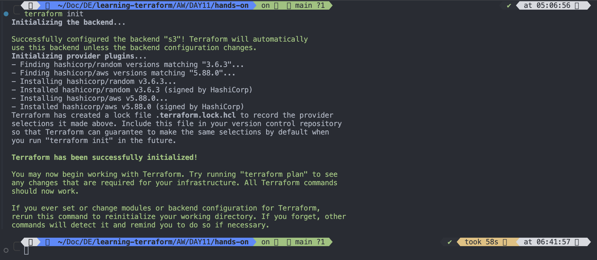
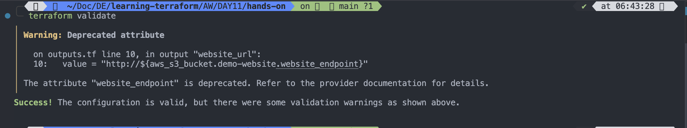
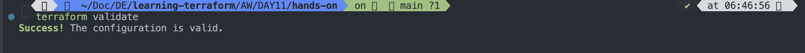
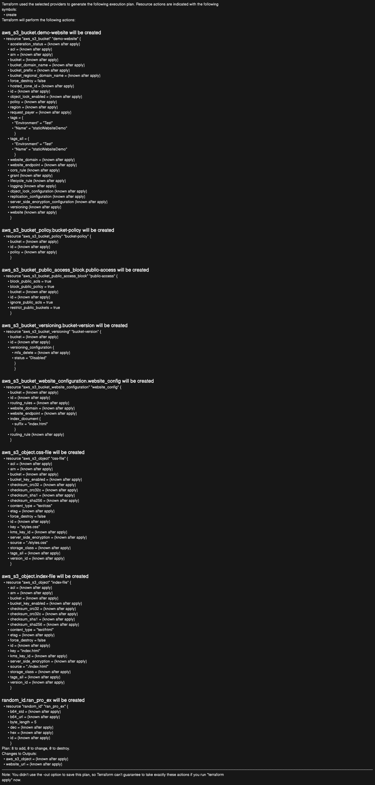
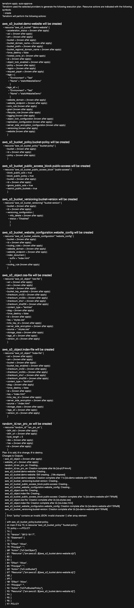
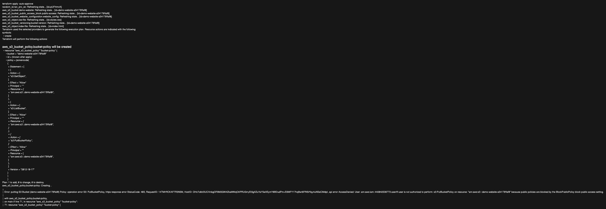
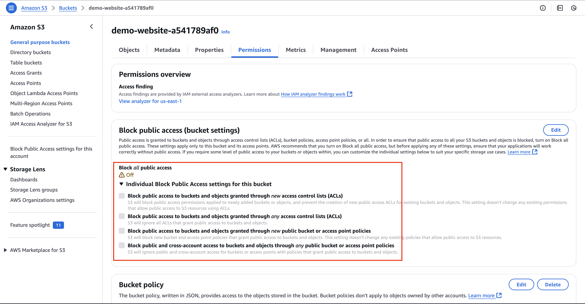
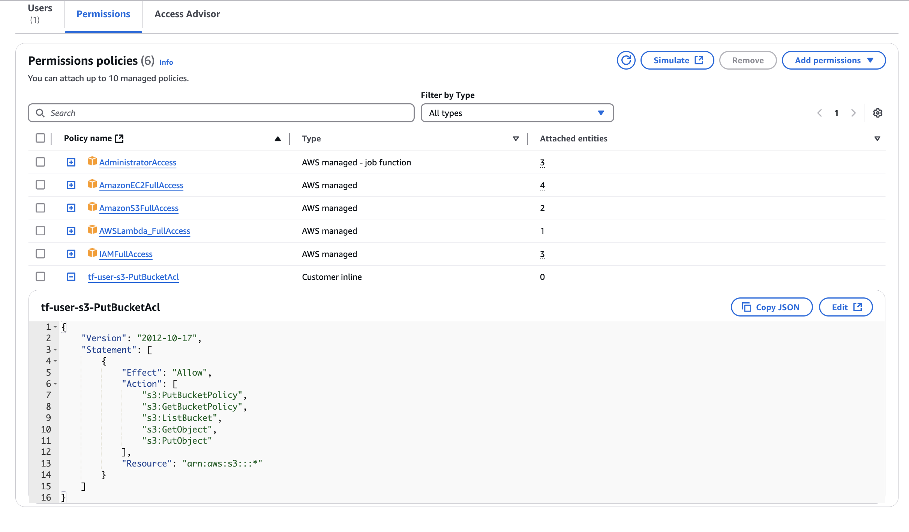
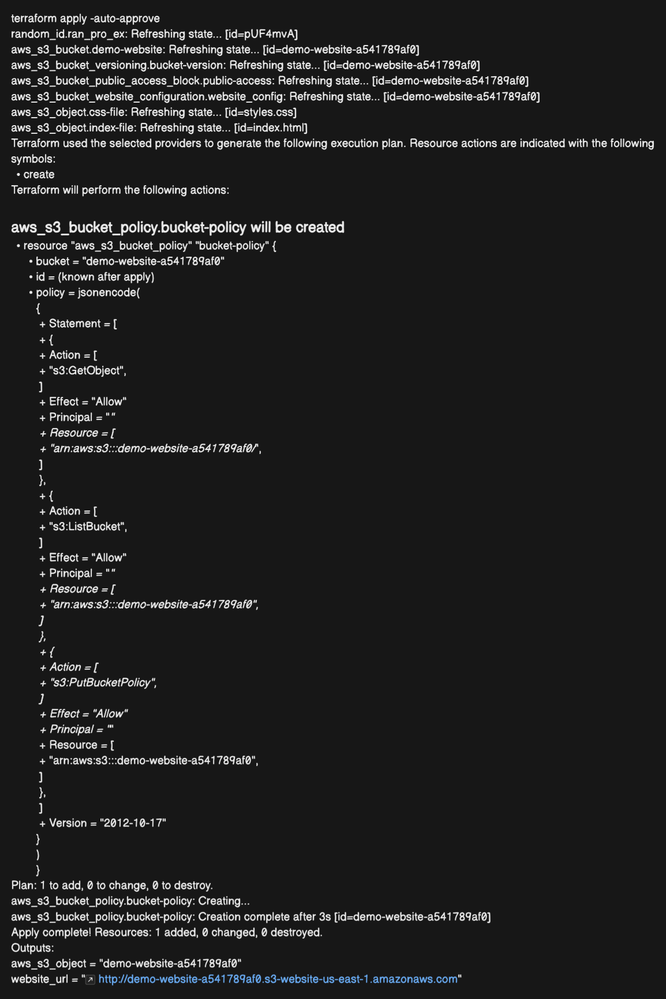
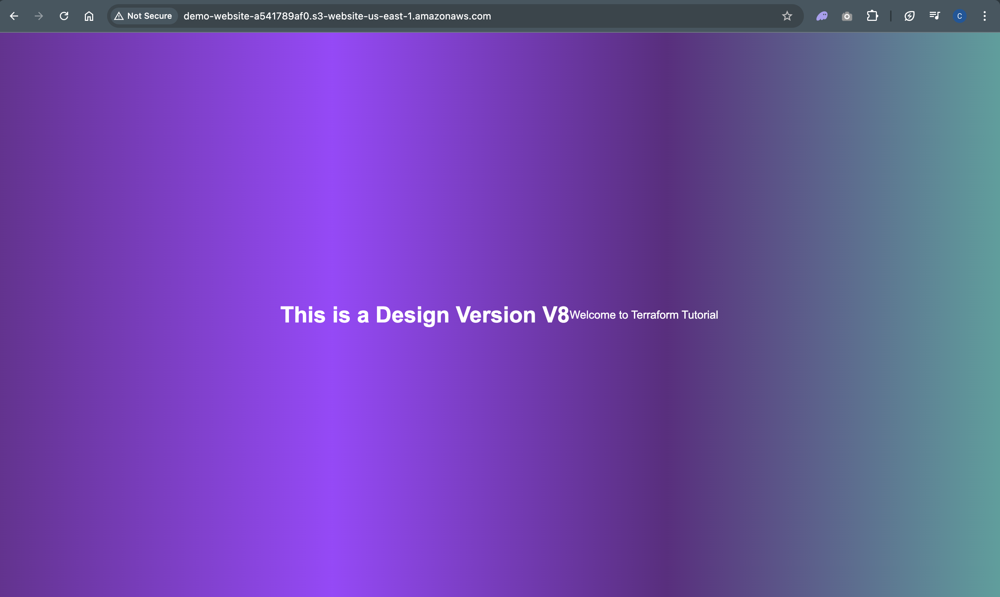

# Deploy Static Website on AWS S3

`Steps`

1. Write `index.html` and `styles.sh` file

```sh
touch index.html
```

```sh
<!DOCTYPE html>
<html lang="en">

<head>
    <meta charset="UTF-8">
    <meta http-equiv="X-UA-Compatible" content="IE=edge">
    <meta name="viewport" content="width=device-width, initial-scale=1.0">
    <link rel="stylesheet" href="styles.css">
    <title>Document</title>
</head>

<body>
    <h1>This is a Design Version V8</h1>
    <p>Welcome to Terraform Tutorial</p>
</body>

</html>
```

---

```sh
touch styles.css
```

```css
/* styles.css */
body {
  /* Set a gradient background from purple to teal */
  background: linear-gradient(to right, #6a3093, #a044ff, #5f2c82, #49a09d);
  font-family: Arial, sans-serif;
  /* Sets a clean, modern font for the body text */
  color: white;
  /* Sets the text color to white for better contrast */
  margin: 0;
  /* Removes default margin */
  padding: 0;
  /* Removes default padding */
  display: flex;
  /* Enables flexbox layout */
  justify-content: center;
  /* Centers content horizontally */
  align-items: center;
  /* Centers content vertically */
  height: 100vh;
  /* Makes the body take the full height of the viewport */
}

h1 {
  font-size: 2em;
  /* Sets the size of the header text */
  text-align: center;
  /* Centers the header text */
}
```

---

2. Create `variables.tf` file

```
touch variables.tf
```

```hcl
# Terraform AWS provider
terraform {
  required_providers {
    aws = {
      source = "hashicorp/aws"
      version = "5.88.0"
    }
    # Random Providers
    random = {
      source = "hashicorp/random"
      version = "3.6.3"
    }
  }
  # Stores the state as a given key in a given bucket on Amazon S3.
  # AWS S3 Backend block to manage state management
  # Now terraform start managing state in  backend.tf file
  # Which is in AWS S3 Bucket
  backend "s3" {
    bucket = "my-bucket-e3fd3e6050"
    key    = "backend.tfstate"
    region = "us-east-1"
  }
}


# Region Variable
variable "N_Virginia" {
  description = "N. Virginia"
  type = string
  default = "us-east-1"
}


# Tags for s3 bucket
variable "s3_tag" {
  description = "AWS S3 Tag or Name"
  default = {
    Name = "staticWebsiteDemo"
    Environment = "Test"
  }

}
```

---

3. Create `outputs.tf` file to query output terraform data

```sh
touch outputs.tf
```

```hcl
# For list S3 Objects
output "aws_s3_object" {
  description = "List Bucket Objects"
  value = aws_s3_bucket.demo-website.id

}
# Output the Website URL Add this to get the S3 static website URL:

output "website_url" {
  value = "http://${aws_s3_bucket.demo-website.website_endpoint}"
}

```

---

4. Create main.tf file which is terraform configuration file

```sh
touch main.tf
```

```hcl
# Terraform AWS and RANDOM provider block is written in the variables.tf file
# AWS S3 backend block is written in the variables.tf file
# AWS S3 backend block is used to manage state file remotely on AWS S3

# Terraform configuration
provider "aws" {
  # Write configuration here
  region = var.N_Virginia
}

# Use Random provider to create random number
resource "random_id" "ran_pro_ex" {
  byte_length = 5
}

# Resources to create S3 bucket creation
# Step1
resource "aws_s3_bucket" "demo-website" {
  bucket = "demo-website-${random_id.ran_pro_ex.hex}"
  tags = var.s3_tag

}
# Step2
#aws_s3_bucket_public_access_block
resource "aws_s3_bucket_public_access_block" "public-access" {
  bucket = aws_s3_bucket.demo-website.id
  block_public_acls = true # Defaults to false
  block_public_policy = true # Defaults to false
  ignore_public_acls = true # Defaults to false
  restrict_public_buckets = true # Defaults to false


}
# Step3
# Bucket versioning
resource "aws_s3_bucket_versioning" "bucket-version" {
  bucket = aws_s3_bucket.demo-website.id
  versioning_configuration {
    status = "Disabled" # By default it is "Disable", Change to enable if needed
  }

}

# Till here we wrote the bucket creation code
# Now Upload the File
 #Step 4
# Upload index.html file
resource "aws_s3_object" "index-file" {
  bucket = aws_s3_bucket.demo-website.id
  key = "index.html"
  source = "./index.html"
  content_type = "text/html"

}
# Step5
# Upload error.html file
resource "aws_s3_object" "css-file" {
  bucket = aws_s3_bucket.demo-website.id
  key = "styles.css"
  source = "./styles.css"
  content_type = "text/css"

}

# Till here we created bucket, enables public access, kept bucket versioning diasbled(default option) and uploaded index.html, style.css files
# Now to deploy static website, we need a bucket policy
# Step 6
# Bucket Policy
# The bucket policy must allow public read access to both files:

resource "aws_s3_bucket_policy" "bucket-policy" {
  bucket = aws_s3_bucket.demo-website.id
  policy = <<POLICY
{
  "Version": "2012-10-17",
  "Statement": [
    {
      "Effect": "Allow",
      "Principal": "*",
      "Action": ["s3:GetObject"],
      "Resource": ["arn:aws:s3:::${aws_s3_bucket.demo-website.id}/*"]
    }
    {
      "Effect": "Allow",
      "Principal": "*",
      "Action": ["s3:ListBucket"],
      "Resource": ["arn:aws:s3:::${aws_s3_bucket.demo-website.id}"]
    }
    {
      "Effect": "Allow",
      "Principal": "*",
      "Action": ["s3:PutBucketPolicy"],
      "Resource": ["arn:aws:s3:::${aws_s3_bucket.demo-website.id}"]
    }
  ]
}

POLICY
}

# Till now we did everything, now the last one is to enable Static website hosting option(In AWS CONSOLE it is available at last option)
# To enable Static Website Hosting for an S3 bucket using Terraform, you need to use the aws_s3_bucket_website_configuration resource.
#aws_s3_bucket_website_configuration
#Step7
resource "aws_s3_bucket_website_configuration" "website_config" {
  bucket = aws_s3_bucket.demo-website.id
  index_document {
    suffix = "index.html"
  }

}

```

---

5. Initialize Terraform using `terraform init` command

```sh
terraform init
```



---

- To ckeck the syntax use `terraform validate` command

```sh
terraform validate
```


`Fix it`
Change outputs.tf content from

```hcl
output "website_url" {
  value = "http://${aws_s3_bucket.demo-website.website_endpoint}"
}
```

to

```hcl
output "website_url" {
  value = "http://${aws_s3_bucket_website_configuration.website_config.website_endpoint}"
}
```

Now run again `terraform validate`


---

6. To review the changes before apply use `terraform plan` command

```sh
terraform plan
```



---

7. After review if all looks fine then apply it using `terraform apply -auto-approve` command to create or modify resources

```
terraform apply -auto-approve
```



- The error "invalid character '{' after array element" occurs because your JSON policy contains a syntax error:
- 👉 Each object inside the "Statement" array must be separated by a comma (,).

Let's fix it, we missed a comma(,) after closing bracker of s3:GetObject and s3:ListBucket.

---


`Fix it`

- The error message "AccessDenied: User is not authorized to perform: s3:PutBucketPolicy because public policies are blocked by the BlockPublicPolicy setting" means that your S3 bucket has public access blocked due to the block_public_policy = true setting in aws_s3_bucket_public_access_block.

## 🔥 Why Is This Happening?

- Your S3 bucket does not allow public policies because of these settings in aws_s3_bucket_public_access_block

```
block_public_policy = true
restrict_public_buckets = true

```

This prevents you from applying the public bucket policy that makes the S3 website accessible.

## ✅ Fix: Allow Public Policies

- Modify the aws_s3_bucket_public_access_block resource and set block_public_policy = false so that the bucket can accept a public policy

```
resource "aws_s3_bucket_public_access_block" "public-access" {
  bucket = aws_s3_bucket.demo-website.id
  block_public_acls = true    # Keeps ACLs blocked
  block_public_policy = false # ✅ ALLOW public policies
  ignore_public_acls = true    # Keeps ignoring ACLs
  restrict_public_buckets = false # ✅ ALLOW public access
}

```

```
terraform apply -auto-approve
```

Output

```
Error: putting S3 Bucket (demo-website-a541789af0) Policy: operation error S3: PutBucketPolicy, https response error StatusCode: 403, RequestID: 7W9CD6ECP7DQFQ61, HostID: BzurBrMAKaHpvHVc3amvOSw7bsAHIOc979KIvKoRYR8uzUcqECgFeJro1+EqEPyQGcYMUacPWdLlC2TrNIaB0+zrXKrWzYSaOP+zG3q/d7I=, api error AccessDenied: User: arn:aws:iam::442042538773:user/tf-user is not authorized to perform: s3:PutBucketPolicy on resource: "arn:aws:s3:::demo-website-a541789af0" because public policies are blocked by the BlockPublicPolicy block public access setting.
│
│   with aws_s3_bucket_policy.bucket-policy,
│   on main.tf line 71, in resource "aws_s3_bucket_policy" "bucket-policy":
│   71: resource "aws_s3_bucket_policy" "bucket-policy" {
```

`FIX_THE_ISSUE`

1. Update `public_access_block`

```
#aws_s3_bucket_public_access_block
resource "aws_s3_bucket_public_access_block" "public-access" {
  bucket = aws_s3_bucket.demo-website.id
  block_public_acls = false # Defaults to true
  block_public_policy = false # Defaults to true
  ignore_public_acls = false # Defaults to true
  restrict_public_buckets = false # Defaults to true
}
```

Output


---

2. Verify IAM Permissions for `tf-user` (check your own user name)

- The IAM user (`tf-user`) must have the `s3:PutBucketPolicy` permission.

  - Go to AWS IAM Console → `IAM Users`
  - Select the user `tf-user`
  - Click Permissions → Check for the following permission in any attached policy

  ```json
  {
    "Effect": "Allow",
    "Action": [
      "s3:PutBucketPolicy",
      "s3:GetBucketPolicy",
      "s3:ListBucket",
      "s3:GetObject",
      "s3:PutObject"
    ],
    "Resource": "arn:aws:s3:::demo-website-a541789af0/*"
  }
  ```

  - If missing, add the above JSON policy in an inline policy or attach the AmazonS3FullAccess policy temporarily.
    

3. Now apply again using `terraform apply -auto-approve` command

```sh
terraform apply -auto-approve
```

`Output`


4. Now check the link of s3-bucket-static-website

```
http://demo-website-a541789af0.s3-website-us-east-1.amazonaws.com
```



---

`main.tf` Final code

```hcl
# Terraform AWS and RANDOM provider block is written in the variables.tf file
# AWS S3 backend block is written in the variables.tf file
# AWS S3 backend block is used to manage state file remotely on AWS S3

# Terraform configuration
provider "aws" {
  # Write configuration here
  region = var.N_Virginia
}

# Use Random provider to create random number
resource "random_id" "ran_pro_ex" {
  byte_length = 5
}

# Resources to create S3 bucket creation
# Step1
resource "aws_s3_bucket" "demo-website" {
  bucket = "demo-website-${random_id.ran_pro_ex.hex}"
  tags = var.s3_tag

}
# Step2
#aws_s3_bucket_public_access_block
resource "aws_s3_bucket_public_access_block" "public-access" {
  bucket = aws_s3_bucket.demo-website.id
  block_public_acls = false # Defaults to true
  block_public_policy = false # Defaults to true
  ignore_public_acls = false # Defaults to true
  restrict_public_buckets = false # Defaults to true


}
# Step3
# Bucket versioning
resource "aws_s3_bucket_versioning" "bucket-version" {
  bucket = aws_s3_bucket.demo-website.id
  versioning_configuration {
    status = "Disabled" # By default it is "Disable", Change to enable if needed
  }

}

# Till here we wrote the bucket creation code
# Now Upload the File
 #Step 4
# Upload index.html file
resource "aws_s3_object" "index-file" {
  bucket = aws_s3_bucket.demo-website.id
  key = "index.html"
  source = "./index.html"
  content_type = "text/html"

}
# Step5
# Upload error.html file
resource "aws_s3_object" "css-file" {
  bucket = aws_s3_bucket.demo-website.id
  key = "styles.css"
  source = "./styles.css"
  content_type = "text/css"

}

# Till here we created bucket, enables public access, kept bucket versioning diasbled(default option) and uploaded index.html, style.css files
# Now to deploy static website, we need a bucket policy
# Step 6
# Bucket Policy
# The bucket policy must allow public read access to both files:

resource "aws_s3_bucket_policy" "bucket-policy" {
  bucket = aws_s3_bucket.demo-website.id
  policy = <<POLICY
{
  "Version": "2012-10-17",
  "Statement": [
    {
      "Effect": "Allow",
      "Principal": "*",
      "Action": ["s3:GetObject"],
      "Resource": ["arn:aws:s3:::${aws_s3_bucket.demo-website.id}/*"]
    },
    {
      "Effect": "Allow",
      "Principal": "*",
      "Action": ["s3:ListBucket"],
      "Resource": ["arn:aws:s3:::${aws_s3_bucket.demo-website.id}"]
    },
    {
      "Effect": "Allow",
      "Principal": "*",
      "Action": ["s3:PutBucketPolicy"],
      "Resource": ["arn:aws:s3:::${aws_s3_bucket.demo-website.id}"]
    }
  ]
}

POLICY
}

# Till now we did everything, now the last one is to enable Static website hosting option(In AWS CONSOLE it is available at last option)
# To enable Static Website Hosting for an S3 bucket using Terraform, you need to use the aws_s3_bucket_website_configuration resource.
#aws_s3_bucket_website_configuration
#Step7
resource "aws_s3_bucket_website_configuration" "website_config" {
  bucket = aws_s3_bucket.demo-website.id
  index_document {
    suffix = "index.html"
  }

}


```

`outputs.tf`

```hcl
# For list S3 Objects
output "aws_s3_object" {
  description = "List Bucket Objects"
  value = aws_s3_bucket.demo-website.id

}
# Output the Website URL Add this to get the S3 static website URL:

#output "website_url" {
  #value = "http://${aws_s3_bucket.demo-website.website_endpoint}"
#}
output "website_url" {
  value = "http://${aws_s3_bucket_website_configuration.website_config.website_endpoint}"
}

```

`variables.tf`

```hcl
# Terraform AWS provider
terraform {
  required_providers {
    aws = {
      source = "hashicorp/aws"
      version = "5.88.0"
    }
    # Random Providers
    random = {
      source = "hashicorp/random"
      version = "3.6.3"
    }
  }
  # Stores the state as a given key in a given bucket on Amazon S3.
  # AWS S3 Backend block to manage state management
  # Now terraform start managing state in  backend.tf file
  # Which is in AWS S3 Bucket
  backend "s3" {
    bucket = "my-bucket-e3fd3e6050"
    key    = "backend.tfstate"
    region = "us-east-1"
  }
}


# Region Variable
variable "N_Virginia" {
  description = "N. Virginia"
  type = string
  default = "us-east-1"
}


# Tags for s3 bucket
variable "s3_tag" {
  description = "AWS S3 Tag or Name"
  default = {
    Name = "staticWebsiteDemo"
    Environment = "Test"
  }

}
```

---

8. Delete all terraform managed resources using `terraform destroy`, Note it will delete all the resouces created using present working project directory

```sh
terraform destroy -auto-approve
```

```json
terraform destroy -auto-approve
random_id.ran_pro_ex: Refreshing state... [id=pUF4mvA]
aws_s3_bucket.demo-website: Refreshing state... [id=demo-website-a541789af0]
aws_s3_bucket_policy.bucket-policy: Refreshing state... [id=demo-website-a541789af0]
aws_s3_bucket_versioning.bucket-version: Refreshing state... [id=demo-website-a541789af0]
aws_s3_bucket_public_access_block.public-access: Refreshing state... [id=demo-website-a541789af0]
aws_s3_bucket_website_configuration.website_config: Refreshing state... [id=demo-website-a541789af0]
aws_s3_object.index-file: Refreshing state... [id=index.html]
aws_s3_object.css-file: Refreshing state... [id=styles.css]

Terraform used the selected providers to generate the following execution plan. Resource actions are indicated with the following
symbols:
  - destroy

Terraform will perform the following actions:

  # aws_s3_bucket.demo-website will be destroyed
  - resource "aws_s3_bucket" "demo-website" {
      - arn                         = "arn:aws:s3:::demo-website-a541789af0" -> null
      - bucket                      = "demo-website-a541789af0" -> null
      - bucket_domain_name          = "demo-website-a541789af0.s3.amazonaws.com" -> null
      - bucket_regional_domain_name = "demo-website-a541789af0.s3.us-east-1.amazonaws.com" -> null
      - force_destroy               = false -> null
      - hosted_zone_id              = "Z3AQBSTGFYJSTF" -> null
      - id                          = "demo-website-a541789af0" -> null
      - object_lock_enabled         = false -> null
      - policy                      = jsonencode(
            {
              - Statement = [
                  - {
                      - Action    = "s3:GetObject"
                      - Effect    = "Allow"
                      - Principal = "*"
                      - Resource  = "arn:aws:s3:::demo-website-a541789af0/*"
                    },
                  - {
                      - Action    = "s3:ListBucket"
                      - Effect    = "Allow"
                      - Principal = "*"
                      - Resource  = "arn:aws:s3:::demo-website-a541789af0"
                    },
                  - {
                      - Action    = "s3:PutBucketPolicy"
                      - Effect    = "Allow"
                      - Principal = "*"
                      - Resource  = "arn:aws:s3:::demo-website-a541789af0"
                    },
                ]
              - Version   = "2012-10-17"
            }
        ) -> null
      - region                      = "us-east-1" -> null
      - request_payer               = "BucketOwner" -> null
      - tags                        = {
          - "Environment" = "Test"
          - "Name"        = "staticWebsiteDemo"
        } -> null
      - tags_all                    = {
          - "Environment" = "Test"
          - "Name"        = "staticWebsiteDemo"
        } -> null
      - website_domain              = "s3-website-us-east-1.amazonaws.com" -> null
      - website_endpoint            = "demo-website-a541789af0.s3-website-us-east-1.amazonaws.com" -> null
        # (2 unchanged attributes hidden)

      - grant {
          - id          = "7ef16b64f6d75a8db562219572349540eabb2ef76ddc3433cdbf6343c6e9dfcd" -> null
          - permissions = [
              - "FULL_CONTROL",
            ] -> null
          - type        = "CanonicalUser" -> null
            # (1 unchanged attribute hidden)
        }

      - server_side_encryption_configuration {
          - rule {
              - bucket_key_enabled = false -> null

              - apply_server_side_encryption_by_default {
                  - sse_algorithm     = "AES256" -> null
                    # (1 unchanged attribute hidden)
                }
            }
        }

      - versioning {
          - enabled    = false -> null
          - mfa_delete = false -> null
        }

      - website {
          - index_document           = "index.html" -> null
            # (3 unchanged attributes hidden)
        }
    }

  # aws_s3_bucket_policy.bucket-policy will be destroyed
  - resource "aws_s3_bucket_policy" "bucket-policy" {
      - bucket = "demo-website-a541789af0" -> null
      - id     = "demo-website-a541789af0" -> null
      - policy = jsonencode(
            {
              - Statement = [
                  - {
                      - Action    = [
                          - "s3:GetObject",
                        ]
                      - Effect    = "Allow"
                      - Principal = "*"
                      - Resource  = [
                          - "arn:aws:s3:::demo-website-a541789af0/*",
                        ]
                    },
                  - {
                      - Action    = [
                          - "s3:ListBucket",
                        ]
                      - Effect    = "Allow"
                      - Principal = "*"
                      - Resource  = [
                          - "arn:aws:s3:::demo-website-a541789af0",
                        ]
                    },
                  - {
                      - Action    = [
                          - "s3:PutBucketPolicy",
                        ]
                      - Effect    = "Allow"
                      - Principal = "*"
                      - Resource  = [
                          - "arn:aws:s3:::demo-website-a541789af0",
                        ]
                    },
                ]
              - Version   = "2012-10-17"
            }
        ) -> null
    }

  # aws_s3_bucket_public_access_block.public-access will be destroyed
  - resource "aws_s3_bucket_public_access_block" "public-access" {
      - block_public_acls       = false -> null
      - block_public_policy     = false -> null
      - bucket                  = "demo-website-a541789af0" -> null
      - id                      = "demo-website-a541789af0" -> null
      - ignore_public_acls      = false -> null
      - restrict_public_buckets = false -> null
    }

  # aws_s3_bucket_versioning.bucket-version will be destroyed
  - resource "aws_s3_bucket_versioning" "bucket-version" {
      - bucket                = "demo-website-a541789af0" -> null
      - id                    = "demo-website-a541789af0" -> null
        # (1 unchanged attribute hidden)

      - versioning_configuration {
          - status     = "Disabled" -> null
            # (1 unchanged attribute hidden)
        }
    }

  # aws_s3_bucket_website_configuration.website_config will be destroyed
  - resource "aws_s3_bucket_website_configuration" "website_config" {
      - bucket                = "demo-website-a541789af0" -> null
      - id                    = "demo-website-a541789af0" -> null
      - website_domain        = "s3-website-us-east-1.amazonaws.com" -> null
      - website_endpoint      = "demo-website-a541789af0.s3-website-us-east-1.amazonaws.com" -> null
        # (2 unchanged attributes hidden)

      - index_document {
          - suffix = "index.html" -> null
        }
    }

  # aws_s3_object.css-file will be destroyed
  - resource "aws_s3_object" "css-file" {
      - arn                           = "arn:aws:s3:::demo-website-a541789af0/styles.css" -> null
      - bucket                        = "demo-website-a541789af0" -> null
      - bucket_key_enabled            = false -> null
      - content_type                  = "text/css" -> null
      - etag                          = "5baa81b9ec9f4c0ce77953e1beaf28ab" -> null
      - force_destroy                 = false -> null
      - id                            = "styles.css" -> null
      - key                           = "styles.css" -> null
      - metadata                      = {} -> null
      - server_side_encryption        = "AES256" -> null
      - source                        = "./styles.css" -> null
      - storage_class                 = "STANDARD" -> null
      - tags                          = {} -> null
      - tags_all                      = {} -> null
        # (13 unchanged attributes hidden)
    }

  # aws_s3_object.index-file will be destroyed
  - resource "aws_s3_object" "index-file" {
      - arn                           = "arn:aws:s3:::demo-website-a541789af0/index.html" -> null
      - bucket                        = "demo-website-a541789af0" -> null
      - bucket_key_enabled            = false -> null
      - content_type                  = "text/html" -> null
      - etag                          = "eb27088850abab9050508b0c20e7e7d3" -> null
      - force_destroy                 = false -> null
      - id                            = "index.html" -> null
      - key                           = "index.html" -> null
      - metadata                      = {} -> null
      - server_side_encryption        = "AES256" -> null
      - source                        = "./index.html" -> null
      - storage_class                 = "STANDARD" -> null
      - tags                          = {} -> null
      - tags_all                      = {} -> null
        # (13 unchanged attributes hidden)
    }

  # random_id.ran_pro_ex will be destroyed
  - resource "random_id" "ran_pro_ex" {
      - b64_std     = "pUF4mvA=" -> null
      - b64_url     = "pUF4mvA" -> null
      - byte_length = 5 -> null
      - dec         = "709768026864" -> null
      - hex         = "a541789af0" -> null
      - id          = "pUF4mvA" -> null
    }

Plan: 0 to add, 0 to change, 8 to destroy.

Changes to Outputs:
  - aws_s3_object = "demo-website-a541789af0" -> null
  - website_url   = "http://demo-website-a541789af0.s3-website-us-east-1.amazonaws.com" -> null
aws_s3_bucket_public_access_block.public-access: Destroying... [id=demo-website-a541789af0]
aws_s3_bucket_policy.bucket-policy: Destroying... [id=demo-website-a541789af0]
aws_s3_bucket_versioning.bucket-version: Destroying... [id=demo-website-a541789af0]
aws_s3_bucket_website_configuration.website_config: Destroying... [id=demo-website-a541789af0]
aws_s3_object.css-file: Destroying... [id=styles.css]
aws_s3_object.index-file: Destroying... [id=index.html]
aws_s3_bucket_versioning.bucket-version: Destruction complete after 0s
aws_s3_object.css-file: Destruction complete after 1s
aws_s3_object.index-file: Destruction complete after 1s
aws_s3_bucket_website_configuration.website_config: Destruction complete after 2s
aws_s3_bucket_policy.bucket-policy: Destruction complete after 2s
aws_s3_bucket_public_access_block.public-access: Destruction complete after 2s
aws_s3_bucket.demo-website: Destroying... [id=demo-website-a541789af0]
aws_s3_bucket.demo-website: Destruction complete after 1s
random_id.ran_pro_ex: Destroying... [id=pUF4mvA]
random_id.ran_pro_ex: Destruction complete after 0s

Destroy complete! Resources: 8 destroyed.
```

--

`Important Links`

- Types of providers supported by Terraform:
  [Terraform Providers](https://registry.terraform.io/search/providers?namespace=hashicorp)
- AWS Website Access (Policy change for S3):
  [Add a bucket Policy](https://docs.aws.amazon.com/AmazonS3/latest/userguide/WebsiteAccessPermissionsReqd.html#bucket-policy-static-site)
- Terraform Registry Module LINK - [Terraform Registry](https://registry.terraform.io/)
- Terraform Random Providers: [random-providers](https://registry.terraform.io/providers/hashicorp/random/latest/docs)
- Stores the state as a given key in a given bucket on Amazon S3:[Terraform backend S3](https://developer.hashicorp.com/terraform/language/backend/s3)
- [aws_s3_bucket_public_access_block](https://registry.terraform.io/providers/hashicorp/aws/latest/docs/resources/s3_bucket_public_access_block.html)

---
