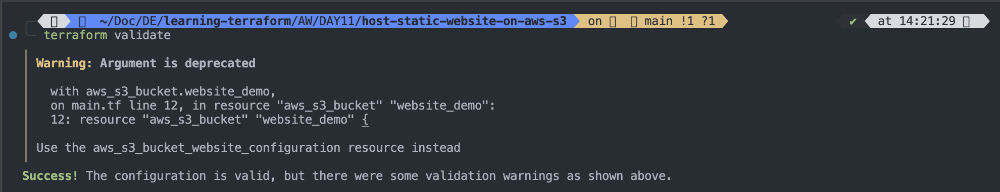
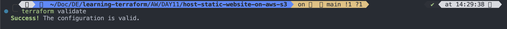
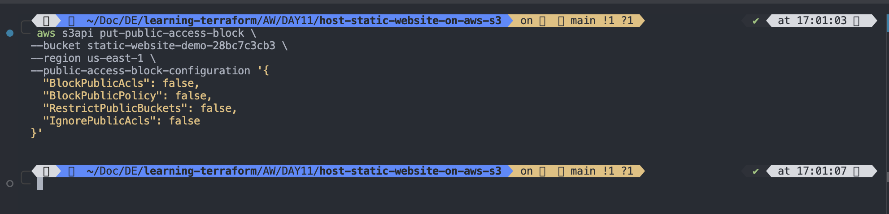
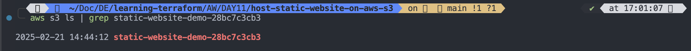

`main.tf`

```hcl
# Terraform provider and backend configurations (Defined in variables.tf)
provider "aws" {
  region = var.aws_region
}

# Generate a random ID to ensure bucket name uniqueness
resource "random_id" "random_provider_example" {
  byte_length = 5
}

# Create AWS S3 Bucket for hosting a static website
resource "aws_s3_bucket" "website_demo" {
  bucket = "static-website-demo-${random_id.random_provider_example.hex}"

  tags = {
    Name        = "staticWebsiteDemo"
    Environment = "Test"
  }

  website {
    index_document = "index.html"
    error_document = "error.html"
  }
}

# Enable/Disable bucket versioning
resource "aws_s3_bucket_versioning" "my_versioning" {
  bucket = aws_s3_bucket.website_demo.id

  versioning_configuration {
    status = "Disabled"  # Change to "Enabled" if versioning is needed
  }
}

# Make S3 Bucket Public (Optional) using ACL
resource "aws_s3_bucket_acl" "acl_control" {
  bucket = aws_s3_bucket.website_demo.id
  acl    = "public-read"
}

# Upload index.html file
resource "aws_s3_object" "index_file" {
  bucket       = aws_s3_bucket.website_demo.id
  key          = "index.html"
  source       = "./index.html"
  content_type = "text/html"
}

# Upload error.html file
resource "aws_s3_object" "error_file" {
  bucket       = aws_s3_bucket.website_demo.id
  key          = "error.html"
  source       = "./error.html"
  content_type = "text/html"
}

# Bucket Policy to Allow Public Access
resource "aws_s3_bucket_policy" "public_access" {
  bucket = aws_s3_bucket.website_demo.id
  policy = <<POLICY
{
  "Version": "2012-10-17",
  "Statement": [
    {
      "Effect": "Allow",
      "Principal": "*",
      "Action": "s3:GetObject",
      "Resource": "arn:aws:s3:::${aws_s3_bucket.website_demo.id}/*"
    }
  ]
}
POLICY
}

```

`Error`

```
terraform validate
╷
│ Warning: Argument is deprecated
│
│   with aws_s3_bucket.website_demo,
│   on main.tf line 12, in resource "aws_s3_bucket" "website_demo":
│   12: resource "aws_s3_bucket" "website_demo" {
│
│ Use the aws_s3_bucket_website_configuration resource instead
╵
Success! The configuration is valid, but there were some validation warnings as shown above.
```



---

`Solution`

- The warning is due to the deprecated website block inside `aws_s3_bucket`. AWS now recommends using `aws_s3_bucket_website_configuration` instead of defining website directly inside the bucket resource.

---

- ✅ Fixed Terraform Code

```hcl
# Terraform provider and backend configurations (Defined in variables.tf)
provider "aws" {
  region = var.aws_region
}

# Generate a random ID to ensure bucket name uniqueness
resource "random_id" "random_provider_example" {
  byte_length = 5
}

# Create AWS S3 Bucket for hosting a static website
resource "aws_s3_bucket" "website_demo" {
  bucket = "static-website-demo-${random_id.random_provider_example.hex}"

  tags = {
    Name        = "staticWebsiteDemo"
    Environment = "Test"
  }
}

# Separate resource for Website Configuration
resource "aws_s3_bucket_website_configuration" "website_config" {
  bucket = aws_s3_bucket.website_demo.id

  index_document {
    suffix = "index.html"
  }

  error_document {
    key = "error.html"
  }
}

# Enable/Disable bucket versioning
resource "aws_s3_bucket_versioning" "my_versioning" {
  bucket = aws_s3_bucket.website_demo.id

  versioning_configuration {
    status = "Disabled"  # Change to "Enabled" if versioning is needed
  }
}

# Make S3 Bucket Public (Optional) using ACL
resource "aws_s3_bucket_acl" "acl_control" {
  bucket = aws_s3_bucket.website_demo.id
  acl    = "public-read"
}

# Upload index.html file
resource "aws_s3_object" "index_file" {
  bucket       = aws_s3_bucket.website_demo.id
  key          = "index.html"
  source       = "./index.html"
  content_type = "text/html"
}

# Upload error.html file
resource "aws_s3_object" "error_file" {
  bucket       = aws_s3_bucket.website_demo.id
  key          = "error.html"
  source       = "./error.html"
  content_type = "text/html"
}

# Bucket Policy to Allow Public Access
resource "aws_s3_bucket_policy" "public_access" {
  bucket = aws_s3_bucket.website_demo.id
  policy = <<POLICY
{
  "Version": "2012-10-17",
  "Statement": [
    {
      "Effect": "Allow",
      "Principal": "*",
      "Action": "s3:GetObject",
      "Resource": "arn:aws:s3:::${aws_s3_bucket.website_demo.id}/*"
    }
  ]
}
POLICY
}


```

---

- 🔹 `What’s Changed?`

  - ✅ Removed `website {}` block from `aws_s3_bucket` (deprecated).
  - ✅ Added `aws_s3_bucket_website_configuration` → This is the new recommended way.
  - ✅ Still maintains public access with `aws_s3_bucket_policy`.

  ***

  ```
  terraform validate
  ```

  

  ***

`ERROR`

```
terraform apply -auto-approve
random_id.random_provider_example: Refreshing state... [id=KLx8PLM]
aws_s3_bucket.website_demo: Refreshing state... [id=static-website-demo-28bc7c3cb3]
aws_s3_bucket_website_configuration.website_config: Refreshing state... [id=static-website-demo-28bc7c3cb3]
aws_s3_bucket_versioning.my_versioning: Refreshing state... [id=static-website-demo-28bc7c3cb3]
aws_s3_object.index_file: Refreshing state... [id=index.html]
aws_s3_object.error_file: Refreshing state... [id=error.html]

Terraform used the selected providers to generate the following execution plan. Resource actions are indicated with the following
symbols:
  + create

Terraform will perform the following actions:

  # aws_s3_bucket_acl.acl_control will be created
  + resource "aws_s3_bucket_acl" "acl_control" {
      + acl    = "public-read"
      + bucket = "static-website-demo-28bc7c3cb3"
      + id     = (known after apply)

      + access_control_policy (known after apply)
    }

  # aws_s3_bucket_policy.public_access will be created
  + resource "aws_s3_bucket_policy" "public_access" {
      + bucket = "static-website-demo-28bc7c3cb3"
      + id     = (known after apply)
      + policy = jsonencode(
            {
              + Statement = [
                  + {
                      + Action    = "s3:GetObject"
                      + Effect    = "Allow"
                      + Principal = "*"
                      + Resource  = "arn:aws:s3:::static-website-demo-28bc7c3cb3/*"
                    },
                ]
              + Version   = "2012-10-17"
            }
        )
    }

Plan: 2 to add, 0 to change, 0 to destroy.
aws_s3_bucket_policy.public_access: Creating...
aws_s3_bucket_acl.acl_control: Creating...
╷
│ Error: creating S3 Bucket (static-website-demo-28bc7c3cb3) ACL: operation error S3: PutBucketAcl, https response error StatusCode: 403, RequestID: TKE7SQ1D3Q0H9ZVM, HostID: CzYyZoxr0ibi1pEXBu/T6Xu10EJK4fZRCnB5LdUJ3cEheJI4mnH/1rnBCbdSZmqNweVWBeVCwSI=, api error AccessDenied: User: arn:aws:iam::442042538773:user/tf-user is not authorized to perform: s3:PutBucketAcl on resource: "arn:aws:s3:::static-website-demo-28bc7c3cb3" because public access control lists (ACLs) are blocked by the BlockPublicAcls block public access setting.
│
│   with aws_s3_bucket_acl.acl_control,
│   on main.tf line 46, in resource "aws_s3_bucket_acl" "acl_control":
│   46: resource "aws_s3_bucket_acl" "acl_control" {
│
╵
╷
│ Error: putting S3 Bucket (static-website-demo-28bc7c3cb3) Policy: operation error S3: PutBucketPolicy, https response error StatusCode: 403, RequestID: TKE79FAVCHR3NX5S, HostID: ic76ZAw/8qhRx0KlYQQX2FY15wVL0hdJDrOWlYlxUumbtd7NPAtcXJIyX8tZ8mfSo8ZWktaEXJI=, api error AccessDenied: User: arn:aws:iam::442042538773:user/tf-user is not authorized to perform: s3:PutBucketPolicy on resource: "arn:aws:s3:::static-website-demo-28bc7c3cb3" because public policies are blocked by the BlockPublicPolicy block public access setting.
│
│   with aws_s3_bucket_policy.public_access,
│   on main.tf line 68, in resource "aws_s3_bucket_policy" "public_access":
│   68: resource "aws_s3_bucket_policy" "public_access" {

```

`SOLUTION`

# Fixing S3 Access Denied Error in Terraform

## 🔍 Problem

When running `terraform apply`, you encounter the following errors:

```
Error: creating S3 Bucket ACL: operation error S3: PutBucketAcl, AccessDenied: User is not authorized to perform: s3:PutBucketAcl
```

```
Error: putting S3 Bucket Policy: operation error S3: PutBucketPolicy, AccessDenied: User is not authorized to perform: s3:PutBucketPolicy
```

### Cause

AWS **Block Public Access** settings prevent public ACLs and public bucket policies from being applied.

---

## ✅ Solution: Disable Block Public Access

You need to disable the **Block Public Access** settings before applying your Terraform configuration.

### **Option 1: Using AWS Console**

1. **Go to the AWS S3 Console**:  
   👉 [AWS S3 Console](https://s3.console.aws.amazon.com/s3/home)
2. Locate your S3 bucket: `static-website-demo-<random_id>`
3. Click on the **Permissions** tab.
4. Scroll to **Block Public Access (Bucket Settings)** and click **Edit**.
5. **Uncheck the following settings**:
   - ✅ **Block all public access**
   - ✅ **Block public ACLs**
   - ✅ **Block public bucket policies**
6. Click **Save changes**.

---

### **Option 2: Using AWS CLI**

If you prefer using the AWS CLI, run this command:

```sh
aws s3api put-public-access-block \
  --bucket static-website-demo-28bc7c3cb3 \
  --public-access-block-configuration "BlockPublicAcls=false,BlockPublicPolicy=false,RestrictPublicBuckets=false,IgnorePublicAcls=false"
```

Replace `<random_id>` with the actual bucket name.

---

## 🔄 Retry Terraform Apply

Now that public access is allowed, run:

```sh
terraform apply -auto-approve
```

`ERROR`

```sh
aws s3api put-public-access-block \
  --bucket static-website-demo-28bc7c3cb3 \
  --public-access-block-configuration "BlockPublicAcls=false,BlockPublicPolicy=false,RestrictPublicBuckets=false,IgnorePublicAcls=false"

Could not connect to the endpoint URL: "https://static-website-demo-28bc7c3cb3.s3.hF6cTO9dpApCoBPCtvRVQ3INvc3c0KXjauF2Oem1.amazonaws.com/?publicAccessBlock"

```

`SOLUTION`

- It looks like you're getting an endpoint error while trying to update the public access block settings for your S3 bucket. Here are some steps to troubleshoot and fix this issue:

### 🔍 Possible Reasons and Fixes

1️⃣ Check Your AWS Region

- The error suggests an issue with the S3 endpoint. Verify that you are using the correct region by running:

```
aws configure get region

```

- If the region is incorrect, update it with:

```
aws configure set region <your-region>

```

- Then, try the command again, explicitly specifying the region:

```sh
aws s3api put-public-access-block \
  --bucket static-website-demo-28bc7c3cb3 \
  --region us-east-1 \
  --public-access-block-configuration '{
    "BlockPublicAcls": false,
    "BlockPublicPolicy": false,
    "RestrictPublicBuckets": false,
    "IgnorePublicAcls": false
  }'

```



---

2️⃣ Verify the Bucket Exists

- Check if the bucket exists and is accessible:

```sh
aws s3 ls | grep static-website-demo-28bc7c3cb3

```



---

3️⃣ Check Your IAM Permissions

- The IAM user you're using might not have the required permissions. Ensure the IAM user has the following permissions:

```json
{
  "Effect": "Allow",
  "Action": [
    "s3:PutBucketPolicy",
    "s3:PutBucketAcl",
    "s3:PutPublicAccessBlock"
  ],
  "Resource": "arn:aws:s3:::static-website-demo-28bc7c3cb3"
}
```

- To check your current IAM permissions, run:

```sh
aws sts get-caller-identity

```

Output

```json
{
    "UserId": "AIDAWN26J3MKZLUCNMU34",
    "Account": "442042538773",
    "Arn": "arn:aws:iam::442042538773:user/tf-user"
}
...skipping...
{
    "UserId": "AIDAWN26J3MKZLUCNMU34",
    "Account": "442042538773",
    "Arn": "arn:aws:iam::442042538773:user/tf-user"
}
```

- Then, verify that the IAM role has the correct S3 permissions in the AWS IAM Console.

---

4️⃣ Try Using the AWS Console
If the CLI command fails, try disabling Block Public Access from the AWS Management Console:

1.  Go to S3 Console → Select your bucket.
2.  Navigate to Permissions.
    3.Scroll to Block Public Access settings for this bucket.
3.  Click Edit and turn off:

        - Block all public access
        - Block public policy
        - Block public ACLs
        - Restrict public buckets
        - Save changes.

    Then, try running your Terraform apply command again.

# [CLICK ME TO SOLVE ACCESS DENIED ERROR](https://docs.aws.amazon.com/AmazonS3/latest/userguide/troubleshoot-403-errors.html?icmpid=docs_amazons3_console)

# [using-with-s3-policy-actions](https://docs.aws.amazon.com/AmazonS3/latest/userguide/using-with-s3-policy-actions.html)
