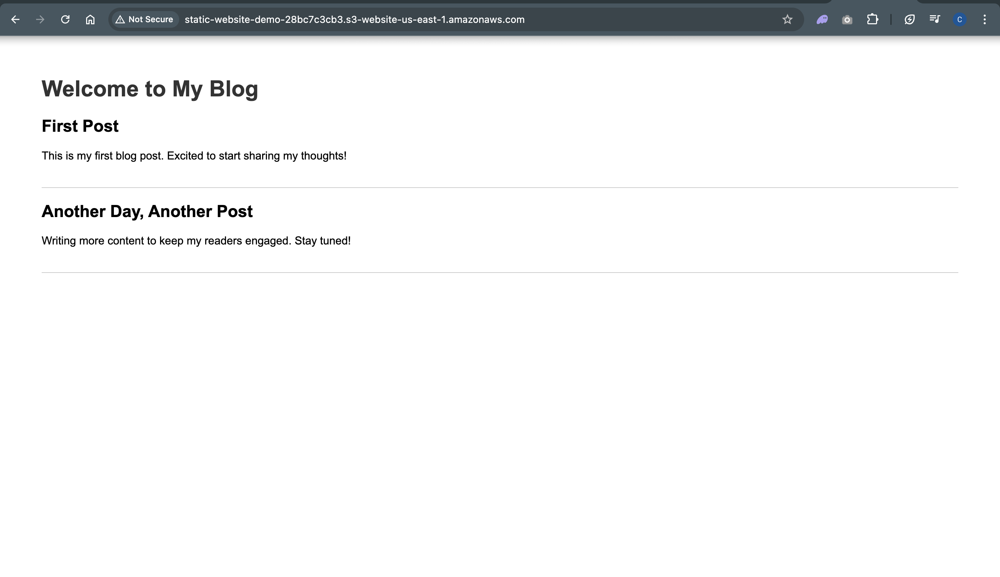
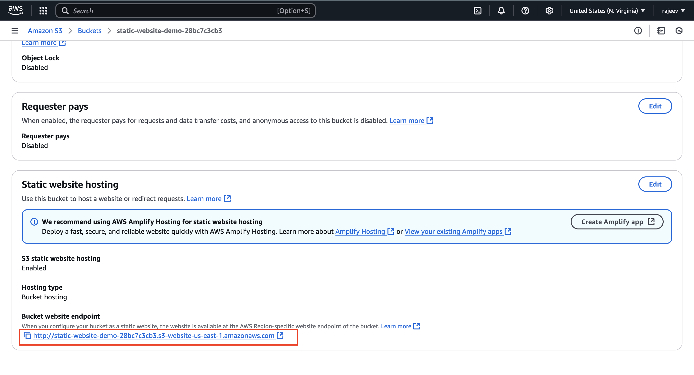

# Deploy a Static Website on AWS S3 using Terraform

## Step 1: Prerequisites

Before you begin, ensure you have the following installed:

- **Terraform** (Download from [terraform.io](https://www.terraform.io/downloads))
- **AWS CLI** (Download from [aws.amazon.com/cli](https://aws.amazon.com/cli/))
- **An AWS account** with appropriate permissions to create S3 buckets and policies.

## Step 2: Initialize Terraform Configuration

Create a new directory for your Terraform project and navigate to it:

```sh
mkdir terraform-s3-static-site
cd terraform-s3-static-site
```

Create a new Terraform file (`main.tf`) and open it in a text editor.

## Step 3: Define the AWS Provider

In `main.tf`, add the AWS provider configuration:

```hcl
provider "aws" {
  region = "us-east-1"  # Change to your preferred region
}
```

## Step 4: Create an S3 Bucket

Add the following to `main.tf` to create an S3 bucket for hosting the website:

```hcl
resource "aws_s3_bucket" "website_bucket" {
  bucket = "my-static-website-bucket"  # Replace with a unique bucket name
  acl    = "public-read"

  website {
    index_document = "index.html"
    error_document = "error.html"
  }
}
```

## Step 5: Upload Website Files

To host a static website, upload `index.html` and `error.html` files:

```hcl
resource "aws_s3_bucket_object" "index" {
  bucket       = aws_s3_bucket.website_bucket.bucket
  key          = "index.html"
  source       = "./index.html"  # Ensure this file exists in your Terraform directory
  content_type = "text/html"
  acl          = "public-read"
}

resource "aws_s3_bucket_object" "error" {
  bucket       = aws_s3_bucket.website_bucket.bucket
  key          = "error.html"
  source       = "./error.html"
  content_type = "text/html"
  acl          = "public-read"
}
```

## Step 6: Deploy an Online Blog Website

Create an `index.html` file with the following blog template:

```html
<!DOCTYPE html>
<html lang="en">
  <head>
    <meta charset="UTF-8" />
    <meta name="viewport" content="width=device-width, initial-scale=1.0" />
    <title>My Blog</title>
    <style>
      body {
        font-family: Arial, sans-serif;
        margin: 40px;
        padding: 20px;
      }
      h1 {
        color: #333;
      }
      .blog-post {
        border-bottom: 1px solid #ccc;
        padding-bottom: 20px;
        margin-bottom: 20px;
      }
    </style>
  </head>
  <body>
    <h1>Welcome to My Blog</h1>
    <div class="blog-post">
      <h2>First Post</h2>
      <p>This is my first blog post. Excited to start sharing my thoughts!</p>
    </div>
    <div class="blog-post">
      <h2>Another Day, Another Post</h2>
      <p>Writing more content to keep my readers engaged. Stay tuned!</p>
    </div>
  </body>
</html>
```

Create an `error.html` file with the following content:

```html
<!DOCTYPE html>
<html lang="en">
  <head>
    <meta charset="UTF-8" />
    <meta name="viewport" content="width=device-width, initial-scale=1.0" />
    <title>Page Not Found</title>
    <style>
      body {
        font-family: Arial, sans-serif;
        text-align: center;
        padding: 50px;
      }
      h1 {
        font-size: 50px;
        color: red;
      }
      p {
        font-size: 20px;
      }
    </style>
  </head>
  <body>
    <h1>404</h1>
    <p>Oops! The page you are looking for does not exist.</p>
  </body>
</html>
```

## Step 7: Apply the Terraform Configuration

1. Initialize Terraform:

   ```sh
   terraform init
   ```

2. Plan the changes:

   ```sh
   terraform plan
   ```

3. Apply the changes:
   ```sh
   terraform apply -auto-approve
   ```

## Step 8: Access the Static Website

After deployment, retrieve the website URL using:

```sh
echo "http://$(terraform output website_url)"
```

Or manually check the website URL in AWS:

```
http://my-static-website-bucket.s3-website-us-east-1.amazonaws.com
```

Replace `my-static-website-bucket` with your actual bucket name.

```
http://static-website-demo-28bc7c3cb3.s3-website-us-east-1.amazonaws.com/
```




## Step 9: Cleanup (Optional)

If you no longer need the S3 website, destroy the resources:

```sh
terraform destroy -auto-approve
```

## Conclusion

You have successfully deployed a static website on AWS S3 using Terraform! 🎉

For further customization, consider using **CloudFront** for CDN caching and **Route 53** for a custom domain name.

---

# Final Code

`index.html`

```
<!DOCTYPE html>
<html lang="en">
  <head>
    <meta charset="UTF-8" />
    <meta name="viewport" content="width=device-width, initial-scale=1.0" />
    <title>My Blog</title>
    <style>
      body {
        font-family: Arial, sans-serif;
        margin: 40px;
        padding: 20px;
      }
      h1 {
        color: #333;
      }
      .blog-post {
        border-bottom: 1px solid #ccc;
        padding-bottom: 20px;
        margin-bottom: 20px;
      }
    </style>
  </head>
  <body>
    <h1>Welcome to My Blog</h1>
    <div class="blog-post">
      <h2>First Post</h2>
      <p>This is my first blog post. Excited to start sharing my thoughts!</p>
    </div>
    <div class="blog-post">
      <h2>Another Day, Another Post</h2>
      <p>Writing more content to keep my readers engaged. Stay tuned!</p>
    </div>
  </body>
</html>

```

---

`error.html`

```
<!DOCTYPE html>
<html lang="en">
  <head>
    <meta charset="UTF-8" />
    <meta name="viewport" content="width=device-width, initial-scale=1.0" />
    <title>Page Not Found</title>
    <style>
      body {
        font-family: Arial, sans-serif;
        text-align: center;
        padding: 50px;
      }
      h1 {
        font-size: 50px;
        color: red;
      }
      p {
        font-size: 20px;
      }
    </style>
  </head>
  <body>
    <h1>404</h1>
    <p>Oops! The page you are looking for does not exist.</p>
  </body>
</html>

```

---

1. Create `variables.tf` file

```sh
touch variables.tf
```

```hcl
# AWS PROVIDER
terraform {
  required_providers {
    aws = {
      source = "hashicorp/aws"
      version = "5.88.0"
    }
    # Random Provider
    random = {
      source = "hashicorp/random"
      version = "3.6.3"
    }
  }
  # BACKEND BLOCK
  backend "s3" {
    bucket = "my-bucket-e3fd3e6050"
    key = "backend.tfstate"
    region = "us-east-1"

  }
}


# REGION VARIABLE
variable "aws_region" {
  description = "AWS_REGION to create AWS resources"
  type = string
  default = "us-east-1"
}

# INSTANCE_TYPE_VARIABLE
variable "aws_instance_type" {
  description = "Instance Type to create AWS EC2 INSTANCES"
  type = string
  default = "t2.micro"

}

# AWS UBUNTU AMI VARIABLE
variable "AWS_UBUNTU_AMI" {
  description = "UBUNTU IMAGE AMI"
  type = string
  default = "ami-04b4f1a9cf54c11d0"

}

# AWS AMAZON LINUX AMI
variable "AWS_AMAZON_LINUX_AMI" {
  description = "Amazon Linux AMI"
  type = string
  default = "ami-053a45fff0a704a47"

}

variable "INSTANCE_NAME" {
  description = "Instance name and tag"
  default = {
    Name = "terraform-app-server"
  }

}

```

---

2. Create `main.tf` file

```sh
touch main.tf
```

```hcl
# Terraform provider and backend configurations (Defined in variables.tf)
provider "aws" {
  region = var.aws_region
}

# Generate a random ID to ensure bucket name uniqueness
resource "random_id" "random_provider_example" {
  byte_length = 5
}

# Create AWS S3 Bucket for hosting a static website
resource "aws_s3_bucket" "website_demo" {
  bucket = "static-website-demo-${random_id.random_provider_example.hex}"

  tags = {
    Name        = "staticWebsiteDemo"
    Environment = "Test"
  }


}

resource "aws_s3_bucket_website_configuration" "website_config" {
  bucket = aws_s3_bucket.website_demo.id
  index_document {
    suffix = "index.html"
  }
  error_document {
    key = "error.html"
  }

}


# Enable/Disable bucket versioning
resource "aws_s3_bucket_versioning" "my_versioning" {
  bucket = aws_s3_bucket.website_demo.id

  versioning_configuration {
    status = "Disabled"  # Change to "Enabled" if versioning is needed
  }
}

# Make S3 Bucket Public (Optional) using ACL
resource "aws_s3_bucket_acl" "acl_control" {
  bucket = aws_s3_bucket.website_demo.id
  acl    = "public-read"
}

# Upload index.html file
resource "aws_s3_object" "index_file" {
  bucket       = aws_s3_bucket.website_demo.id
  key          = "index.html"
  source       = "./index.html"
  content_type = "text/html"
}

# Upload error.html file
resource "aws_s3_object" "error_file" {
  bucket       = aws_s3_bucket.website_demo.id
  key          = "error.html"
  source       = "./error.html"
  content_type = "text/html"
}

# Bucket Policy to Allow Public Access
resource "aws_s3_bucket_policy" "public_access" {
  bucket = aws_s3_bucket.website_demo.id
  policy = <<POLICY
{
  "Version": "2012-10-17",
  "Statement": [
    {
      "Effect": "Allow",
      "Principal": "*",
      "Action": "s3:GetObject",
      "Resource": "arn:aws:s3:::${aws_s3_bucket.website_demo.id}/*"
    }
  ]
}
POLICY
}


```

---

3.terraform( init, validate, plan, apply)

```
terraform init
terraform validate
terraform plan
terraform apply
```

```
http://static-website-demo-28bc7c3cb3.s3-website-us-east-1.amazonaws.com/
```


---

4. Destroy using `terraform destroy` command

```
terraform destroy -auto-approve
```

OUTPUT

```hcl
random_id.random_provider_example: Refreshing state... [id=KLx8PLM]
aws_s3_bucket.website_demo: Refreshing state... [id=static-website-demo-28bc7c3cb3]
aws_s3_bucket_website_configuration.website_config: Refreshing state... [id=static-website-demo-28bc7c3cb3]
aws_s3_bucket_versioning.my_versioning: Refreshing state... [id=static-website-demo-28bc7c3cb3]
aws_s3_bucket_policy.public_access: Refreshing state... [id=static-website-demo-28bc7c3cb3]
aws_s3_object.index_file: Refreshing state... [id=index.html]
aws_s3_object.error_file: Refreshing state... [id=error.html]

Terraform used the selected providers to generate the following execution plan. Resource actions are indicated with the following
symbols:
  - destroy

Terraform will perform the following actions:

  # aws_s3_bucket.website_demo will be destroyed
  - resource "aws_s3_bucket" "website_demo" {
      - arn                         = "arn:aws:s3:::static-website-demo-28bc7c3cb3" -> null
      - bucket                      = "static-website-demo-28bc7c3cb3" -> null
      - bucket_domain_name          = "static-website-demo-28bc7c3cb3.s3.amazonaws.com" -> null
      - bucket_regional_domain_name = "static-website-demo-28bc7c3cb3.s3.us-east-1.amazonaws.com" -> null
      - force_destroy               = false -> null
      - hosted_zone_id              = "Z3AQBSTGFYJSTF" -> null
      - id                          = "static-website-demo-28bc7c3cb3" -> null
      - object_lock_enabled         = false -> null
      - policy                      = jsonencode(
            {
              - Statement = [
                  - {
                      - Action    = "s3:GetObject"
                      - Effect    = "Allow"
                      - Principal = "*"
                      - Resource  = "arn:aws:s3:::static-website-demo-28bc7c3cb3/*"
                    },
                ]
              - Version   = "2012-10-17"
            }
        ) -> null
      - region                      = "us-east-1" -> null
      - request_payer               = "BucketOwner" -> null
      - tags                        = {
          - "Environment" = "Test"
          - "Name"        = "staticWebsiteDemo"
        } -> null
      - tags_all                    = {
          - "Environment" = "Test"
          - "Name"        = "staticWebsiteDemo"
        } -> null
      - website_domain              = "s3-website-us-east-1.amazonaws.com" -> null
      - website_endpoint            = "static-website-demo-28bc7c3cb3.s3-website-us-east-1.amazonaws.com" -> null
        # (2 unchanged attributes hidden)

      - grant {
          - id          = "7ef16b64f6d75a8db562219572349540eabb2ef76ddc3433cdbf6343c6e9dfcd" -> null
          - permissions = [
              - "FULL_CONTROL",
            ] -> null
          - type        = "CanonicalUser" -> null
            # (1 unchanged attribute hidden)
        }

      - server_side_encryption_configuration {
          - rule {
              - bucket_key_enabled = false -> null

              - apply_server_side_encryption_by_default {
                  - sse_algorithm     = "AES256" -> null
                    # (1 unchanged attribute hidden)
                }
            }
        }

      - versioning {
          - enabled    = false -> null
          - mfa_delete = false -> null
        }

      - website {
          - error_document           = "error.html" -> null
          - index_document           = "index.html" -> null
            # (2 unchanged attributes hidden)
        }
    }

  # aws_s3_bucket_policy.public_access will be destroyed
  - resource "aws_s3_bucket_policy" "public_access" {
      - bucket = "static-website-demo-28bc7c3cb3" -> null
      - id     = "static-website-demo-28bc7c3cb3" -> null
      - policy = jsonencode(
            {
              - Statement = [
                  - {
                      - Action    = "s3:GetObject"
                      - Effect    = "Allow"
                      - Principal = "*"
                      - Resource  = "arn:aws:s3:::static-website-demo-28bc7c3cb3/*"
                    },
                ]
              - Version   = "2012-10-17"
            }
        ) -> null
    }

  # aws_s3_bucket_versioning.my_versioning will be destroyed
  - resource "aws_s3_bucket_versioning" "my_versioning" {
      - bucket                = "static-website-demo-28bc7c3cb3" -> null
      - id                    = "static-website-demo-28bc7c3cb3" -> null
        # (1 unchanged attribute hidden)

      - versioning_configuration {
          - status     = "Disabled" -> null
            # (1 unchanged attribute hidden)
        }
    }

  # aws_s3_bucket_website_configuration.website_config will be destroyed
  - resource "aws_s3_bucket_website_configuration" "website_config" {
      - bucket                = "static-website-demo-28bc7c3cb3" -> null
      - id                    = "static-website-demo-28bc7c3cb3" -> null
      - website_domain        = "s3-website-us-east-1.amazonaws.com" -> null
      - website_endpoint      = "static-website-demo-28bc7c3cb3.s3-website-us-east-1.amazonaws.com" -> null
        # (2 unchanged attributes hidden)

      - error_document {
          - key = "error.html" -> null
        }

      - index_document {
          - suffix = "index.html" -> null
        }
    }

  # aws_s3_object.error_file will be destroyed
  - resource "aws_s3_object" "error_file" {
      - arn                           = "arn:aws:s3:::static-website-demo-28bc7c3cb3/error.html" -> null
      - bucket                        = "static-website-demo-28bc7c3cb3" -> null
      - bucket_key_enabled            = false -> null
      - content_type                  = "text/html" -> null
      - etag                          = "2f40f4acbea57832cd8112949e0570c2" -> null
      - force_destroy                 = false -> null
      - id                            = "error.html" -> null
      - key                           = "error.html" -> null
      - metadata                      = {} -> null
      - server_side_encryption        = "AES256" -> null
      - source                        = "./error.html" -> null
      - storage_class                 = "STANDARD" -> null
      - tags                          = {} -> null
      - tags_all                      = {} -> null
        # (13 unchanged attributes hidden)
    }

  # aws_s3_object.index_file will be destroyed
  - resource "aws_s3_object" "index_file" {
      - arn                           = "arn:aws:s3:::static-website-demo-28bc7c3cb3/index.html" -> null
      - bucket                        = "static-website-demo-28bc7c3cb3" -> null
      - bucket_key_enabled            = false -> null
      - content_type                  = "text/html" -> null
      - etag                          = "f6a73dc0771325e16882daa9684d23b9" -> null
      - force_destroy                 = false -> null
      - id                            = "index.html" -> null
      - key                           = "index.html" -> null
      - metadata                      = {} -> null
      - server_side_encryption        = "AES256" -> null
      - source                        = "./index.html" -> null
      - storage_class                 = "STANDARD" -> null
      - tags                          = {} -> null
      - tags_all                      = {} -> null
        # (13 unchanged attributes hidden)
    }

  # random_id.random_provider_example will be destroyed
  - resource "random_id" "random_provider_example" {
      - b64_std     = "KLx8PLM=" -> null
      - b64_url     = "KLx8PLM" -> null
      - byte_length = 5 -> null
      - dec         = "174960950451" -> null
      - hex         = "28bc7c3cb3" -> null
      - id          = "KLx8PLM" -> null
    }

Plan: 0 to add, 0 to change, 7 to destroy.
aws_s3_bucket_versioning.my_versioning: Destroying... [id=static-website-demo-28bc7c3cb3]
aws_s3_bucket_policy.public_access: Destroying... [id=static-website-demo-28bc7c3cb3]
aws_s3_object.error_file: Destroying... [id=error.html]
aws_s3_object.index_file: Destroying... [id=index.html]
aws_s3_bucket_website_configuration.website_config: Destroying... [id=static-website-demo-28bc7c3cb3]
aws_s3_bucket_versioning.my_versioning: Destruction complete after 0s
aws_s3_object.error_file: Destruction complete after 2s
aws_s3_object.index_file: Destruction complete after 2s
aws_s3_bucket_website_configuration.website_config: Destruction complete after 2s
aws_s3_bucket_policy.public_access: Destruction complete after 2s
aws_s3_bucket.website_demo: Destroying... [id=static-website-demo-28bc7c3cb3]
aws_s3_bucket.website_demo: Destruction complete after 1s
random_id.random_provider_example: Destroying... [id=KLx8PLM]
random_id.random_provider_example: Destruction complete after 0s

Destroy complete! Resources: 7 destroyed.
```
