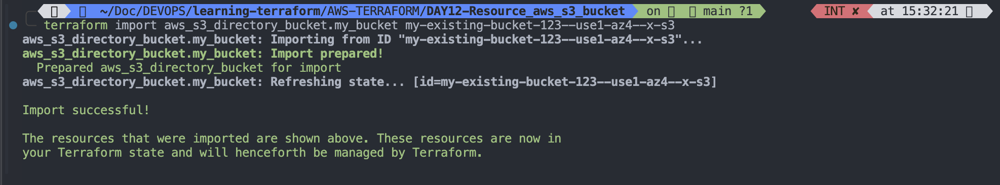
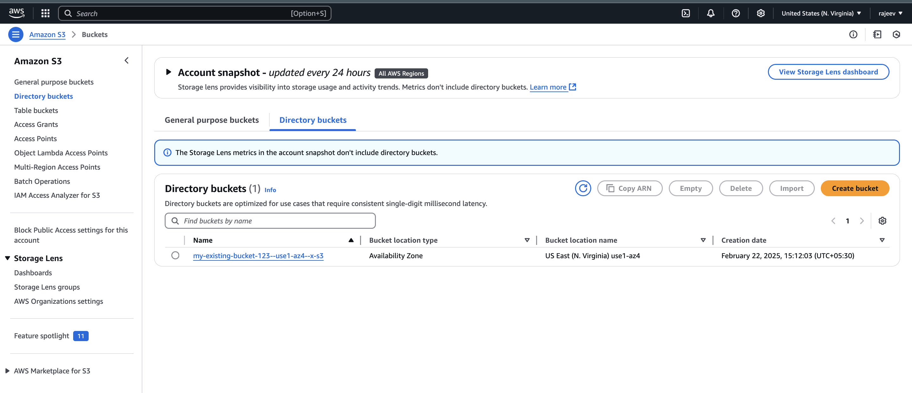
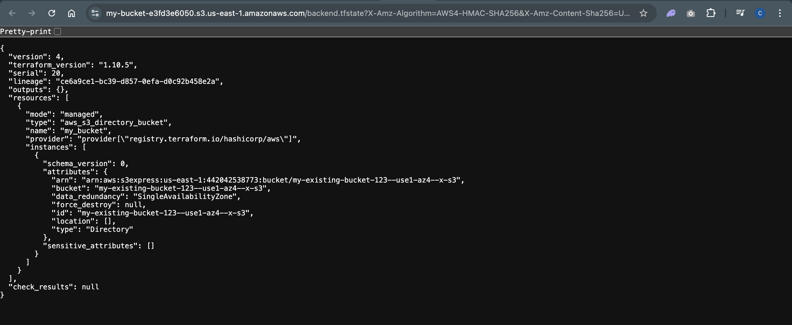
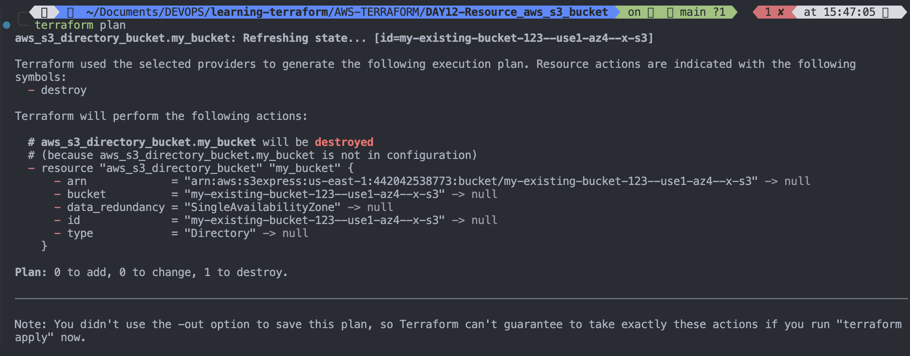
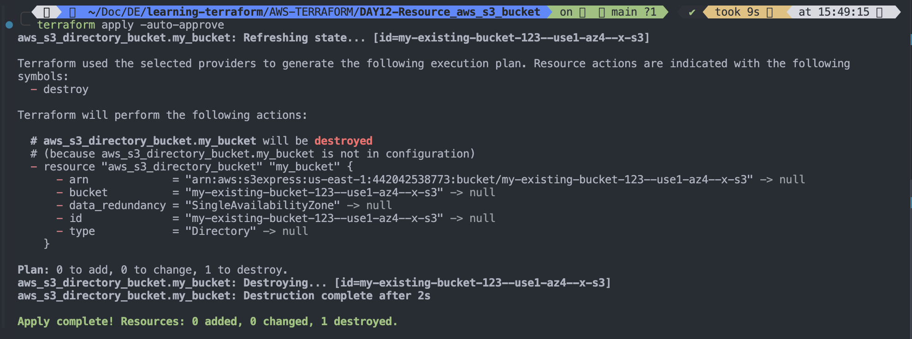
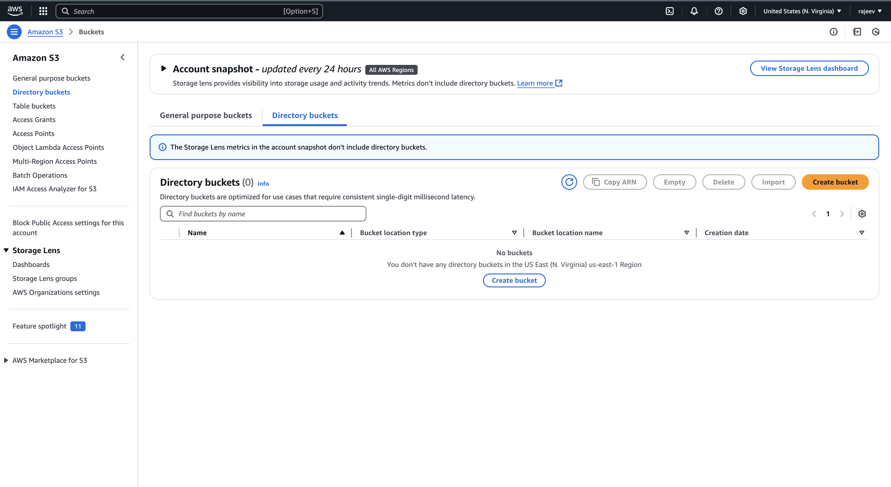
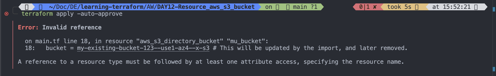

# Resource: aws-s3-bucket

# `Provides a S3 bucket resource.`

- This resource provides functionality for managing S3 general purpose buckets in an AWS Partition.
- To manage Amazon S3 Express directory buckets, use the `aws_directory_bucket` resource.

# `aws_directory_bucket`

## Provides an Amazon S3 Express directory bucket resource.

```
resource "aws_s3_directory_bucket" "example" {
  bucket = "example--usw2-az1--x-s3"

  location {
    name = "usw2-az1"
  }
}

```

## Argument Reference

### This resource supports the following arguments:

- `bucket` - `(Required)` Name of the bucket. The name must be in the format `[bucket_name]--[azid]--x-s3`. Use the `aws_s3_bucket` resource to manage general
- `data_redundancy` - (Optional, Default:`SingleAvailabilityZone`) Data redundancy. Valid values: `SingleAvailabilityZone`.

- `force_destroy` - (Optional, Default:`false`) Boolean that indicates all objects should be deleted from the bucket when the bucket is destroyed so that the bucket can be destroyed without error. These objects are not recoverable. This only deletes objects when the bucket is destroyed, not when setting this parameter to `true`. Once this parameter is set to `true`, there must be a successful `terraform apply` run before a destroy is required to update this value in the resource state. Without a successful `terraform apply` after this parameter is set, this flag will have no effect. If setting this field in the same operation that would require replacing the bucket or destroying the bucket, this flag will not work. Additionally when importing a bucket, a successful `terraform apply` is required to set this value in state before it will take effect on a destroy operation.

- location - (Required) Bucket location.

---

```hcl
resource "aws_s3_directory_bucket" "example" {
  bucket = "example--usw2-az1--x-s3"

  location {
    name = "usw2-az1"
  }
}
```

---

- type - (Optional, Default:`Directory`) Bucket type. Valid values: `Directory`.

## Attribute Reference

- This resource exports the following attributes in addition to the arguments above:

  - id - (Deprecated, use `bucket` instead) Name of the bucket.
  - arn - ARN of the bucket.

## Import

In Terraform v1.5.0 and later, use an `import` block to `import` an Amazon S3 Express directory bucket using bucket. For example:

```py
import {
  to = aws_s3_directory_bucket.example
  id = "example--usw2-az1--x-s3"
}

```

- Using terraform import, `import` S3 bucket using bucket. For example:

```
% terraform import aws_s3_directory_bucket.example example--usw2-az1--x-s3
```

---

### Let's break down the Terraform import command

- `terraform import`: This is the core command used to bring existing infrastructure (that wasn't created by Terraform) under Terraform's management. It doesn't create the resource in AWS; it just tells Terraform about it.
- `aws_s3_directory_bucket.example`: This identifies the resource within your Terraform configuration.
  - aws_s3_directory_bucket: This specifies the resource type. It's a directory bucket in S3.
  - example: This is the name you've given to this specific directory bucket resource in your Terraform configuration file (e.g., main.tf). It's a logical name you chose.
- `example--usw2-az1--x-s3`: This is the actual ID of the existing S3 directory bucket in AWS. This is the crucial part. It's how Terraform links your configuration to the real-world resource. Directory bucket names have a very specific structure.

### Simplified Example

- Let's say you have an S3 directory bucket named `my-existing-bucket-123` that you created manually through the AWS console or CLI.
- You want to manage it with Terraform.

1. Terraform Configuration (main.tf):

```hcl
resource "aws_s3_directory_bucket" "my_bucket" {
  bucket = "my-existing-bucket-123" # This will be updated by the import, and later removed.
}
```

The `bucket` argument is initially set to the actual `bucket` name. We'll remove this after the import.

---

2. Import Command

```sh
terraform import aws_s3_directory_bucket.my_bucket my-existing-bucket-123

```



---

- `aws_s3_directory_bucket.my_bucket`: Refers to the resource block in your `main.tf` file. `my_bucket` is the logical name.
- `my-existing-bucket-123`: The actual name of the S3 directory bucket in AWS.

---

3. After Import:

### Terraform will:

- Connect to AWS.
- Find the S3 directory bucket with the name my-existing-bucket-123.
  

---

- Update your Terraform state file.
  

```json
{
  "version": 4,
  "terraform_version": "1.10.5",
  "serial": 20,
  "lineage": "ce6a9ce1-bc39-d857-0efa-d0c92b458e2a",
  "outputs": {},
  "resources": [
    {
      "mode": "managed",
      "type": "aws_s3_directory_bucket",
      "name": "my_bucket",
      "provider": "provider[\"registry.terraform.io/hashicorp/aws\"]",
      "instances": [
        {
          "schema_version": 0,
          "attributes": {
            "arn": "arn:aws:s3express:us-east-1:442042538773:bucket/my-existing-bucket-123--use1-az4--x-s3",
            "bucket": "my-existing-bucket-123--use1-az4--x-s3",
            "data_redundancy": "SingleAvailabilityZone",
            "force_destroy": null,
            "id": "my-existing-bucket-123--use1-az4--x-s3",
            "location": [],
            "type": "Directory"
          },
          "sensitive_attributes": []
        }
      ]
    }
  ],
  "check_results": null
}
```

- Update the bucket argument in your terraform code.
- Remove `Bucket` Argument:
  Now, remove the `bucket` argument from your Terraform configuration:

```hcl
resource "aws_s3_directory_bucket" "my_bucket" {
  # Bucket name is now managed by the import.
}
```

---

5. Plan and Apply:

```hcl
terraform plan
terraform apply
```





---

Terraform will now recognize the bucket as under its management. The plan will show no changes. The apply will confirm this.

```
terraform apply -auto-approve
```



---

### Key Points

- `Resource Name vs. ID`: The resource name (e.g., `my_bucket`) is a logical name. The ID (e.g., `my-existing-bucket-123`) is the actual name in AWS.
- `State File`: `terraform import` updates the Terraform state file.
- `No Creation`: `terraform import` does not create the resource.
- `Directory Buckets`: Directory buckets have specific naming conventions. Ensure you have the correct ID.
- <mark style="color:">Remove</mark> `bucket` <mark style="color:">argument</mark>: After successful import, remove the bucket argument from your configuration.

---

### Troubleshooting

- `Incorrect ID`: Double-check the bucket name in AWS.
- `Resource Already Managed`: If Terraform already manages the bucket, you'll get an error. You might need to remove it from the state file (with caution!).
- `Permissions`: Ensure your AWS credentials have the necessary permissions.
- `Cannot import non-existent remote object` :

While attempting to import an existing object to "aws_s3_directory_bucket.my_bucket", the provider detected that no object exists with
│ the given id. Only pre-existing objects can be imported; check that the id is correct and that it is associated with the provider's
│ configured region or endpoint, or use "terraform apply" to create a new remote object for this resource.

---

## Important Links to follow

1. Argument Reference:
   [argument reference](https://registry.terraform.io/providers/hashicorp/aws/latest/docs/resources/s3_bucket#argument-reference)
2. CORS rule : [CORS rule](https://registry.terraform.io/providers/hashicorp/aws/latest/docs/resources/s3_bucket#cors-rule)
3. Grant: [Grant](https://registry.terraform.io/providers/hashicorp/aws/latest/docs/resources/s3_bucket#grant)
4. Lifecycle rule: [lifecycle rule](https://registry.terraform.io/providers/hashicorp/aws/latest/docs/resources/s3_bucket#lifecycle-rule)
5. [Expiration](https://registry.terraform.io/providers/hashicorp/aws/latest/docs/resources/s3_bucket#expiration)
6. [Transition](https://registry.terraform.io/providers/hashicorp/aws/latest/docs/resources/s3_bucket#transition)
7. [Logging](https://registry.terraform.io/providers/hashicorp/aws/latest/docs/resources/s3_bucket#logging)
8. [Replictaion Configuration](https://registry.terraform.io/providers/hashicorp/aws/latest/docs/resources/s3_bucket#replication-configuration)
9. [Server side encryption configuration](https://registry.terraform.io/providers/hashicorp/aws/latest/docs/resources/s3_bucket#server-side-encryption-configuration)
10. [versioning](https://registry.terraform.io/providers/hashicorp/aws/latest/docs/resources/s3_bucket#versioning)
11. [website](https://registry.terraform.io/providers/hashicorp/aws/latest/docs/resources/s3_bucket#website)
12. [Attribute Reference](https://registry.terraform.io/providers/hashicorp/aws/latest/docs/resources/s3_bucket#attribute-reference)
13. [timeouts](https://registry.terraform.io/providers/hashicorp/aws/latest/docs/resources/s3_bucket#timeouts)
14. [import](https://registry.terraform.io/providers/hashicorp/aws/latest/docs/resources/s3_bucket#import)
15.
16.
