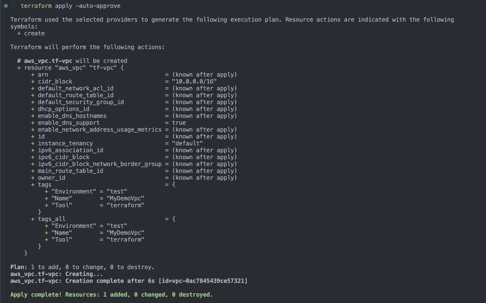

# Create VPC ONLY

# Resouce to create VPC ONLY

`Steps`

- Create `provides.tf`, `main.tf`, `backend.tf`

1.  Name tag/ Name of the VPC

---

2.  IPv4 CIDR block , if you want to use IPV6 then write IPV4 CIDR block

- Specify an IPv4 CIDR block (or IP address range) for your VPC.
- If there is an Amazon VPC IP Address Manager (IPAM) IPv4 address pool available in this Region, you can get a CIDR from an IPAM pool. If you select an IPAM pool, the size of the CIDR is limited by the allocation rules on the IPAM pool (allowed minimum, allowed maximum, and default).
- If there is no IPv4 IPAM pool in this Region, you can manually input an IPv4 CIDR. The CIDR block size must have a size between /16 and /28.

---

3. Tenancy

- You can run instances in your VPC on single-tenant, dedicated hardware.
- Select Default to ensure that instances launched in this VPC use the tenancy attribute specified at launch or if you are creating a VPC for Outposts private connectivity.
- Select Dedicated to ensure that instances launched in this VPC are run on dedicated tenancy instances regardless of the tenancy attribute specified at launch.
- If your Outposts VPCs require private connectivity, you must select Default.

---

4. Tags

---

5. `terraform init`

```sh
terraform init
Initializing the backend...
Initializing provider plugins...
- Finding hashicorp/aws versions matching "5.88.0"...
- Finding hashicorp/random versions matching "3.6.3"...
- Installing hashicorp/aws v5.88.0...
- Installed hashicorp/aws v5.88.0 (signed by HashiCorp)
- Installing hashicorp/random v3.6.3...
- Installed hashicorp/random v3.6.3 (signed by HashiCorp)
Terraform has created a lock file .terraform.lock.hcl to record the provider
selections it made above. Include this file in your version control repository
so that Terraform can guarantee to make the same selections by default when
you run "terraform init" in the future.

Terraform has been successfully initialized!

You may now begin working with Terraform. Try running "terraform plan" to see
any changes that are required for your infrastructure. All Terraform commands
should now work.

If you ever set or change modules or backend configuration for Terraform,
rerun this command to reinitialize your working directory. If you forget, other
commands will detect it and remind you to do so if necessary.
```

---

6. `terraform plan`

```sh
Terraform used the selected providers to generate the following execution plan. Resource actions are indicated with the following
symbols:
  + create

Terraform will perform the following actions:

  # aws_vpc.tf-vpc will be created
  + resource "aws_vpc" "tf-vpc" {
      + arn                                  = (known after apply)
      + cidr_block                           = "10.0.0.0/16"
      + default_network_acl_id               = (known after apply)
      + default_route_table_id               = (known after apply)
      + default_security_group_id            = (known after apply)
      + dhcp_options_id                      = (known after apply)
      + enable_dns_hostnames                 = (known after apply)
      + enable_dns_support                   = true
      + enable_network_address_usage_metrics = (known after apply)
      + id                                   = (known after apply)
      + instance_tenancy                     = "default"
      + ipv6_association_id                  = (known after apply)
      + ipv6_cidr_block                      = (known after apply)
      + ipv6_cidr_block_network_border_group = (known after apply)
      + main_route_table_id                  = (known after apply)
      + owner_id                             = (known after apply)
      + tags                                 = {
          + "Environment" = "test"
          + "Name"        = "MyDemoVpc"
          + "Tool"        = "terraform"
        }
      + tags_all                             = {
          + "Environment" = "test"
          + "Name"        = "MyDemoVpc"
          + "Tool"        = "terraform"
        }
    }

Plan: 1 to add, 0 to change, 0 to destroy.

─────────────────────────────────────────────────────────────────────────────────────────────────────────────────────────────────────────

Note: You didn't use the -out option to save this plan, so Terraform can't guarantee to take exactly these actions if you run "terraform
apply" now.
```

---

7. `terraform apply -auto-approve`

```sh
Terraform used the selected providers to generate the following execution plan. Resource actions are indicated with the following
symbols:
  + create

Terraform will perform the following actions:

  # aws_vpc.tf-vpc will be created
  + resource "aws_vpc" "tf-vpc" {
      + arn                                  = (known after apply)
      + cidr_block                           = "10.0.0.0/16"
      + default_network_acl_id               = (known after apply)
      + default_route_table_id               = (known after apply)
      + default_security_group_id            = (known after apply)
      + dhcp_options_id                      = (known after apply)
      + enable_dns_hostnames                 = (known after apply)
      + enable_dns_support                   = true
      + enable_network_address_usage_metrics = (known after apply)
      + id                                   = (known after apply)
      + instance_tenancy                     = "default"
      + ipv6_association_id                  = (known after apply)
      + ipv6_cidr_block                      = (known after apply)
      + ipv6_cidr_block_network_border_group = (known after apply)
      + main_route_table_id                  = (known after apply)
      + owner_id                             = (known after apply)
      + tags                                 = {
          + "Environment" = "test"
          + "Name"        = "MyDemoVpc"
          + "Tool"        = "terraform"
        }
      + tags_all                             = {
          + "Environment" = "test"
          + "Name"        = "MyDemoVpc"
          + "Tool"        = "terraform"
        }
    }

Plan: 1 to add, 0 to change, 0 to destroy.
aws_vpc.tf-vpc: Creating...
aws_vpc.tf-vpc: Creation complete after 6s [id=vpc-0ac7845439ce57321]

Apply complete! Resources: 1 added, 0 changed, 0 destroyed.

```




---

8. Create `public` and `private` subnets

```sh
touch subnets.tf
```

```hcl
# Create public and private subnets

resource "aws_subnet" "public_subnet_myDemoVpc" {
  vpc_id = "vpc-0ac7845439ce57321" # Replace it with your VPC id
  cidr_block = "10.0.1.0/24"
  tags = {
    Name = "public_subnet_myDemoVpc"
  }
}
resource "aws_subnet" "private_subnet_myDemoVpc" {
  vpc_id = "vpc-0ac7845439ce57321" # Replace it with your VPC id
  cidr_block = "10.0.2.0/24"
  tags = {
    Name = "private_subnet_myDemoVpc"
  }

}

```

- Now run `terraform plan` and `terraform apply`

```sh
terraform plan
```

```sh
aws_vpc.tf-vpc: Refreshing state... [id=vpc-0ac7845439ce57321]

Terraform used the selected providers to generate the following execution plan. Resource actions are indicated with the following
symbols:
  + create

Terraform will perform the following actions:

  # aws_subnet.private_subnet_myDemoVpc will be created
  + resource "aws_subnet" "private_subnet_myDemoVpc" {
      + arn                                            = (known after apply)
      + assign_ipv6_address_on_creation                = false
      + availability_zone                              = (known after apply)
      + availability_zone_id                           = (known after apply)
      + cidr_block                                     = "10.0.2.0/24"
      + enable_dns64                                   = false
      + enable_resource_name_dns_a_record_on_launch    = false
      + enable_resource_name_dns_aaaa_record_on_launch = false
      + id                                             = (known after apply)
      + ipv6_cidr_block_association_id                 = (known after apply)
      + ipv6_native                                    = false
      + map_public_ip_on_launch                        = false
      + owner_id                                       = (known after apply)
      + private_dns_hostname_type_on_launch            = (known after apply)
      + tags                                           = {
          + "Name" = "private_subnet_myDemoVpc"
        }
      + tags_all                                       = {
          + "Name" = "private_subnet_myDemoVpc"
        }
      + vpc_id                                         = "vpc-0ac7845439ce57321"
    }

  # aws_subnet.public_subnet_myDemoVpc will be created
  + resource "aws_subnet" "public_subnet_myDemoVpc" {
      + arn                                            = (known after apply)
      + assign_ipv6_address_on_creation                = false
      + availability_zone                              = (known after apply)
      + availability_zone_id                           = (known after apply)
      + cidr_block                                     = "10.0.1.0/24"
      + enable_dns64                                   = false
      + enable_resource_name_dns_a_record_on_launch    = false
      + enable_resource_name_dns_aaaa_record_on_launch = false
      + id                                             = (known after apply)
      + ipv6_cidr_block_association_id                 = (known after apply)
      + ipv6_native                                    = false
      + map_public_ip_on_launch                        = false
      + owner_id                                       = (known after apply)
      + private_dns_hostname_type_on_launch            = (known after apply)
      + tags                                           = {
          + "Name" = "public_subnet_myDemoVpc"
        }
      + tags_all                                       = {
          + "Name" = "public_subnet_myDemoVpc"
        }
      + vpc_id                                         = "vpc-0ac7845439ce57321"
    }

Plan: 2 to add, 0 to change, 0 to destroy.

─────────────────────────────────────────────────────────────────────────────────────────────────────────────────────────────────────────

Note: You didn't use the -out option to save this plan, so Terraform can't guarantee to take exactly these actions if you run "terraform
apply" now.
```

---

```sh
terraform apply -auto-approve
```

```sh
terraform apply -auto-approve
aws_vpc.tf-vpc: Refreshing state... [id=vpc-0ac7845439ce57321]

Terraform used the selected providers to generate the following execution plan. Resource actions are indicated with the following
symbols:
  + create

Terraform will perform the following actions:

  # aws_subnet.private_subnet_myDemoVpc will be created
  + resource "aws_subnet" "private_subnet_myDemoVpc" {
      + arn                                            = (known after apply)
      + assign_ipv6_address_on_creation                = false
      + availability_zone                              = (known after apply)
      + availability_zone_id                           = (known after apply)
      + cidr_block                                     = "10.0.2.0/24"
      + enable_dns64                                   = false
      + enable_resource_name_dns_a_record_on_launch    = false
      + enable_resource_name_dns_aaaa_record_on_launch = false
      + id                                             = (known after apply)
      + ipv6_cidr_block_association_id                 = (known after apply)
      + ipv6_native                                    = false
      + map_public_ip_on_launch                        = false
      + owner_id                                       = (known after apply)
      + private_dns_hostname_type_on_launch            = (known after apply)
      + tags                                           = {
          + "Name" = "private_subnet_myDemoVpc"
        }
      + tags_all                                       = {
          + "Name" = "private_subnet_myDemoVpc"
        }
      + vpc_id                                         = "vpc-0ac7845439ce57321"
    }

  # aws_subnet.public_subnet_myDemoVpc will be created
  + resource "aws_subnet" "public_subnet_myDemoVpc" {
      + arn                                            = (known after apply)
      + assign_ipv6_address_on_creation                = false
      + availability_zone                              = (known after apply)
      + availability_zone_id                           = (known after apply)
      + cidr_block                                     = "10.0.1.0/24"
      + enable_dns64                                   = false
      + enable_resource_name_dns_a_record_on_launch    = false
      + enable_resource_name_dns_aaaa_record_on_launch = false
      + id                                             = (known after apply)
      + ipv6_cidr_block_association_id                 = (known after apply)
      + ipv6_native                                    = false
      + map_public_ip_on_launch                        = false
      + owner_id                                       = (known after apply)
      + private_dns_hostname_type_on_launch            = (known after apply)
      + tags                                           = {
          + "Name" = "public_subnet_myDemoVpc"
        }
      + tags_all                                       = {
          + "Name" = "public_subnet_myDemoVpc"
        }
      + vpc_id                                         = "vpc-0ac7845439ce57321"
    }

Plan: 2 to add, 0 to change, 0 to destroy.
aws_subnet.public_subnet_myDemoVpc: Creating...
aws_subnet.private_subnet_myDemoVpc: Creating...
aws_subnet.private_subnet_myDemoVpc: Creation complete after 3s [id=subnet-0ec42a3ca3284516f]
aws_subnet.public_subnet_myDemoVpc: Creation complete after 3s [id=subnet-02732ba75e2be5cc9]

Apply complete! Resources: 2 added, 0 changed, 0 destroyed.
```

`public_subnet_myDemoVpc`

`Route table`

`tags`


---

`private_subnet_myDemoVpc`

`Route table`

`tags`


---

`Rresource map`


---

9. Create an Internet Gateway (For Public Subnets)

- If your public subnet needs internet access, attach an Internet Gateway (IGW) to your VPC.
  `terraform code`

```hcl
# If your public subnets needs internet access, attach an internet gateway to your vpc

resource "aws_internet_gateway" "MyDemoVpc-IGW" {
  vpc_id = "vpc-0ac7845439ce57321" # Replace with your own VPC ID
  tags = {
    Name = "MyDemoVpc-IGW"
  }

}

```

---

```sh
terraform validate
terraform plan
```


---

```sh
terraform apply -auto-approve
```

`Output`:

```sh
aws_subnet.private_subnet_myDemoVpc: Refreshing state... [id=subnet-0ec42a3ca3284516f]
aws_vpc.tf-vpc: Refreshing state... [id=vpc-0ac7845439ce57321]
aws_subnet.public_subnet_myDemoVpc: Refreshing state... [id=subnet-02732ba75e2be5cc9]

Terraform used the selected providers to generate the following execution plan. Resource actions are indicated with the following
symbols:
  + create

Terraform will perform the following actions:

  # aws_internet_gateway.MyDemoVpc-IGW will be created
  + resource "aws_internet_gateway" "MyDemoVpc-IGW" {
      + arn      = (known after apply)
      + id       = (known after apply)
      + owner_id = (known after apply)
      + tags     = {
          + "Name" = "MyDemoVpc-IGW"
        }
      + tags_all = {
          + "Name" = "MyDemoVpc-IGW"
        }
      + vpc_id   = "vpc-0ac7845439ce57321"
    }

Plan: 1 to add, 0 to change, 0 to destroy.
aws_internet_gateway.MyDemoVpc-IGW: Creating...
aws_internet_gateway.MyDemoVpc-IGW: Creation complete after 2s [id=igw-06599081680722fa4]

Apply complete! Resources: 1 added, 0 changed, 0 destroyed.
```

`Check state to list all the created resources till now`

```sh
terraform state
```

`Output`

```hcl
terraform state list
aws_internet_gateway.MyDemoVpc-IGW
aws_subnet.private_subnet_myDemoVpc
aws_subnet.public_subnet_myDemoVpc
aws_vpc.tf-vpc
```


---

10. Update Route Tables

- Default Route table created with VPC
  
- Public Subnet Route Table: Add a route to the Internet Gateway so that public instances can access the internet.
- Private Subnet Route Table: If needed, set up a NAT Gateway (later steps).
- Terraform Code (For Public Subnet)

```sh
touch route-tables.tf
```

```hcl
# Resouces to update Route table
resource "aws_route" "public_internet_access" {
  route_table_id = "rtb-069aeb561f17d1f8a" # Replace with your route table id
  destination_cidr_block = "0.0.0.0/0" # All network
  gateway_id = "igw-06599081680722fa4" # Replace with your own internet gateway id

}
```

- Run following command to update Internet Gateway

```sh
terraform plan
terraform apply -auto-approve
```

`Output`

```sh
terraform plan
aws_internet_gateway.MyDemoVpc-IGW: Refreshing state... [id=igw-06599081680722fa4]
aws_vpc.tf-vpc: Refreshing state... [id=vpc-0ac7845439ce57321]
aws_subnet.private_subnet_myDemoVpc: Refreshing state... [id=subnet-0ec42a3ca3284516f]
aws_subnet.public_subnet_myDemoVpc: Refreshing state... [id=subnet-02732ba75e2be5cc9]

Terraform used the selected providers to generate the following execution plan. Resource actions are indicated with the following
symbols:
  + create

Terraform will perform the following actions:

  # aws_route.public_internet_access will be created
  + resource "aws_route" "public_internet_access" {
      + destination_cidr_block = "0.0.0.0/0"
      + gateway_id             = "igw-06599081680722fa4"
      + id                     = (known after apply)
      + instance_id            = (known after apply)
      + instance_owner_id      = (known after apply)
      + network_interface_id   = (known after apply)
      + origin                 = (known after apply)
      + route_table_id         = "rtb-069aeb561f17d1f8a"
      + state                  = (known after apply)
    }

Plan: 1 to add, 0 to change, 0 to destroy.

─────────────────────────────────────────────────────────────────────────────────────────────────────────────────────────────────────────

Note: You didn't use the -out option to save this plan, so Terraform can't guarantee to take exactly these actions if you run "terraform
apply" now.
```

`Output: terraform apply -auto-approve`

```sh
terraform apply -auto-approve
aws_internet_gateway.MyDemoVpc-IGW: Refreshing state... [id=igw-06599081680722fa4]
aws_subnet.private_subnet_myDemoVpc: Refreshing state... [id=subnet-0ec42a3ca3284516f]
aws_subnet.public_subnet_myDemoVpc: Refreshing state... [id=subnet-02732ba75e2be5cc9]
aws_vpc.tf-vpc: Refreshing state... [id=vpc-0ac7845439ce57321]

Terraform used the selected providers to generate the following execution plan. Resource actions are indicated with the following
symbols:
  + create

Terraform will perform the following actions:

  # aws_route.public_internet_access will be created
  + resource "aws_route" "public_internet_access" {
      + destination_cidr_block = "0.0.0.0/0"
      + gateway_id             = "igw-06599081680722fa4"
      + id                     = (known after apply)
      + instance_id            = (known after apply)
      + instance_owner_id      = (known after apply)
      + network_interface_id   = (known after apply)
      + origin                 = (known after apply)
      + route_table_id         = "rtb-069aeb561f17d1f8a"
      + state                  = (known after apply)
    }

Plan: 1 to add, 0 to change, 0 to destroy.
aws_route.public_internet_access: Creating...
aws_route.public_internet_access: Creation complete after 4s [id=r-rtb-069aeb561f17d1f8a1080289494]

Apply complete! Resources: 1 added, 0 changed, 0 destroyed.
```

---

- Now check all the aws resources created till now

```sh
terraform state list
```

`Output`

```sh
terraform state list
aws_internet_gateway.MyDemoVpc-IGW
aws_route.public_internet_access
aws_subnet.private_subnet_myDemoVpc
aws_subnet.public_subnet_myDemoVpc
aws_vpc.tf-vpc
```

- Verify the route table change
  

---

11. Create a Security Group

- Define a Security Group to control inbound and outbound traffic.

`Terraform Code`

```hcl

```

---

12. Create Security Groups
    `terraform code`

```hcl
# Define a Security Group Resources to control inbound and outbound traffic.

# Allow SSH
resource "aws_security_group" "allow_ssh" {
  vpc_id = var.vpc_id
  name = "allow_ssh"

  # Allow SSH
  ingress = {
    from_port = 22
    to_port = 22
    protocol = "tcp"
    cidr_blocks = ["0.0.0.0/0"] # Change to your IP for security
  }
  egress {
    from_port   = 0
    to_port     = 0
    protocol    = "-1"
    cidr_blocks = ["0.0.0.0/0"]
  }
  tags = {
    Neme = "allow_ssh"
  }
}

# Allow HTTP
resource "aws_security_group" "allow_http" {
  vpc_id = var.vpc_id
  name = "allow_http"

  ingress = {
    from_port = 80
    to_port = 80
    protocol = tcp
    cidr_block = ["0.0.0.0/0"] # Change to your IP for security
  }
  egress {
    from_port   = 0
    to_port     = 0
    protocol    = "-1"
    cidr_blocks = ["0.0.0.0/0"]
  }

  tags = {
    Neme = "allow_http"
  }
}

# Allow https
resource "aws_security_group" "allow_https" {
  description = "Allow https at port 443"
  vpc_id = var.vpc_id
  name = "allow_https"

  ingress = {
    from_port = 443
    to_port = 443
    protocol = "tcp"
    cidr_block = ["0.0.0.0/0"] # Change to your IP for security
  }
  egress {
    from_port   = 0
    to_port     = 0
    protocol    = "-1"
    cidr_blocks = ["0.0.0.0/0"]
  }

  tags = {
    Neme = "allow_https"
  }
}
```

`Run`

```sh
terraform validate
```

`Output:`

```sh
terraform validate
╷
│ Error: Incorrect attribute value type
│
│   on security-groups.tf line 9, in resource "aws_security_group" "allow_ssh":
│    9:   ingress = {
│   10:     from_port = 22,
│   11:     to_port = 22,
│   12:     protocol = "tcp",
│   13:     cidr_blocks = ["0.0.0.0/0"] # Change to your IP for security
│   14:   }
│
│ Inappropriate value for attribute "ingress": set of object required.
╵
╷
│ Error: Invalid reference
│
│   on security-groups.tf line 34, in resource "aws_security_group" "allow_http":
│   34:     protocol = tcp,
│
│ A reference to a resource type must be followed by at least one attribute access, specifying the resource name.
╵
╷
│ Error: Incorrect attribute value type
│
│   on security-groups.tf line 55, in resource "aws_security_group" "allow_https":
│   55:   ingress = {
│   56:     from_port = 443,
│   57:     to_port = 443,
│   58:     protocol = "tcp",
│   59:     cidr_block = ["0.0.0.0/0"] # Change to your IP for security
│   60:   }
│
│ Inappropriate value for attribute "ingress": set of object required.
```

`Let's solve it`

## 🔍 Issues in your code

- ingress should be a block, not an object ({} → ingress {})
  - The error "Inappropriate value for attribute 'ingress'" happens because ingress should be defined as a block, not a map (i.e., {} is incorrect).
- Incorrect attribute name: cidr_block → cidr_blocks

  - In ingress, the correct attribute is cidr_blocks (plural), not cidr_block (singular).

- Protocol should be a string (tcp → "tcp")
  - You need to wrap "tcp" in quotes.
- Incorrect tag key: Neme → Name

  - There is a typo in your tag keys: Neme should be Name.

`✅ Corrected Code`

```hcl
# Allow SSH
resource "aws_security_group" "allow_ssh" {
  vpc_id = var.vpc_id
  name   = "allow_ssh"

  # Allow SSH
  ingress {
    from_port   = 22
    to_port     = 22
    protocol    = "tcp"
    cidr_blocks = ["0.0.0.0/0"] # Change to your IP for security
  }

  egress {
    from_port   = 0
    to_port     = 0
    protocol    = "-1"
    cidr_blocks = ["0.0.0.0/0"]
  }

  tags = {
    Name = "allow_ssh"
  }
}

# Allow HTTP
resource "aws_security_group" "allow_http" {
  vpc_id = var.vpc_id
  name   = "allow_http"

  ingress {
    from_port   = 80
    to_port     = 80
    protocol    = "tcp"
    cidr_blocks = ["0.0.0.0/0"] # Change to your IP for security
  }

  egress {
    from_port   = 0
    to_port     = 0
    protocol    = "-1"
    cidr_blocks = ["0.0.0.0/0"]
  }

  tags = {
    Name = "allow_http"
  }
}

# Allow HTTPS
resource "aws_security_group" "allow_https" {
  description = "Allow https at port 443"
  vpc_id      = var.vpc_id
  name        = "allow_https"

  ingress {
    from_port   = 443
    to_port     = 443
    protocol    = "tcp"
    cidr_blocks = ["0.0.0.0/0"] # Change to your IP for security
  }

  egress {
    from_port   = 0
    to_port     = 0
    protocol    = "-1"
    cidr_blocks = ["0.0.0.0/0"]
  }

  tags = {
    Name = "allow_https"
  }
}

```

`Run again terraform validate`


---

# 🔥 Key Fixes

- ✅ Used ingress {} block instead of ingress = {}
- ✅ Changed cidr_block → cidr_blocks
- ✅ Wrapped tcp in double quotes ("tcp")
- ✅ Fixed Neme → Name

- `Run`

```sh
terraform plan
```

`Output:`

```sh
terraform plan
aws_internet_gateway.MyDemoVpc-IGW: Refreshing state... [id=igw-06599081680722fa4]
aws_vpc.tf-vpc: Refreshing state... [id=vpc-0ac7845439ce57321]
aws_route.public_internet_access: Refreshing state... [id=r-rtb-069aeb561f17d1f8a1080289494]
aws_subnet.public_subnet_myDemoVpc: Refreshing state... [id=subnet-02732ba75e2be5cc9]
aws_subnet.private_subnet_myDemoVpc: Refreshing state... [id=subnet-0ec42a3ca3284516f]

Terraform used the selected providers to generate the following execution plan. Resource actions are indicated with the following
symbols:
  + create

Terraform will perform the following actions:

  # aws_security_group.allow_http will be created
  + resource "aws_security_group" "allow_http" {
      + arn                    = (known after apply)
      + description            = "Managed by Terraform"
      + egress                 = [
          + {
              + cidr_blocks      = [
                  + "0.0.0.0/0",
                ]
              + from_port        = 0
              + ipv6_cidr_blocks = []
              + prefix_list_ids  = []
              + protocol         = "-1"
              + security_groups  = []
              + self             = false
              + to_port          = 0
                # (1 unchanged attribute hidden)
            },
        ]
      + id                     = (known after apply)
      + ingress                = [
          + {
              + cidr_blocks      = [
                  + "0.0.0.0/0",
                ]
              + from_port        = 80
              + ipv6_cidr_blocks = []
              + prefix_list_ids  = []
              + protocol         = "tcp"
              + security_groups  = []
              + self             = false
              + to_port          = 80
                # (1 unchanged attribute hidden)
            },
        ]
      + name                   = "allow_http"
      + name_prefix            = (known after apply)
      + owner_id               = (known after apply)
      + revoke_rules_on_delete = false
      + tags                   = {
          + "Name" = "allow_http"
        }
      + tags_all               = {
          + "Name" = "allow_http"
        }
      + vpc_id                 = "vpc-0ac7845439ce57321"
    }

  # aws_security_group.allow_https will be created
  + resource "aws_security_group" "allow_https" {
      + arn                    = (known after apply)
      + description            = "Allow https at port 443"
      + egress                 = [
          + {
              + cidr_blocks      = [
                  + "0.0.0.0/0",
                ]
              + from_port        = 0
              + ipv6_cidr_blocks = []
              + prefix_list_ids  = []
              + protocol         = "-1"
              + security_groups  = []
              + self             = false
              + to_port          = 0
                # (1 unchanged attribute hidden)
            },
        ]
      + id                     = (known after apply)
      + ingress                = [
          + {
              + cidr_blocks      = [
                  + "0.0.0.0/0",
                ]
              + from_port        = 443
              + ipv6_cidr_blocks = []
              + prefix_list_ids  = []
              + protocol         = "tcp"
              + security_groups  = []
              + self             = false
              + to_port          = 443
                # (1 unchanged attribute hidden)
            },
        ]
      + name                   = "allow_https"
      + name_prefix            = (known after apply)
      + owner_id               = (known after apply)
      + revoke_rules_on_delete = false
      + tags                   = {
          + "Name" = "allow_https"
        }
      + tags_all               = {
          + "Name" = "allow_https"
        }
      + vpc_id                 = "vpc-0ac7845439ce57321"
    }

  # aws_security_group.allow_ssh will be created
  + resource "aws_security_group" "allow_ssh" {
      + arn                    = (known after apply)
      + description            = "Managed by Terraform"
      + egress                 = [
          + {
              + cidr_blocks      = [
                  + "0.0.0.0/0",
                ]
              + from_port        = 0
              + ipv6_cidr_blocks = []
              + prefix_list_ids  = []
              + protocol         = "-1"
              + security_groups  = []
              + self             = false
              + to_port          = 0
                # (1 unchanged attribute hidden)
            },
        ]
      + id                     = (known after apply)
      + ingress                = [
          + {
              + cidr_blocks      = [
                  + "0.0.0.0/0",
                ]
              + from_port        = 22
              + ipv6_cidr_blocks = []
              + prefix_list_ids  = []
              + protocol         = "tcp"
              + security_groups  = []
              + self             = false
              + to_port          = 22
                # (1 unchanged attribute hidden)
            },
        ]
      + name                   = "allow_ssh"
      + name_prefix            = (known after apply)
      + owner_id               = (known after apply)
      + revoke_rules_on_delete = false
      + tags                   = {
          + "Name" = "allow_ssh"
        }
      + tags_all               = {
          + "Name" = "allow_ssh"
        }
      + vpc_id                 = "vpc-0ac7845439ce57321"
    }

Plan: 3 to add, 0 to change, 0 to destroy.

─────────────────────────────────────────────────────────────────────────────────────────────────────────────────────────────────────────

Note: You didn't use the -out option to save this plan, so Terraform can't guarantee to take exactly these actions if you run "terraform
apply" now.

```

`Run`

```sh
terraform apply -auto-approve
```

`Output:`

```sh
terraform apply -auto-approve
aws_vpc.tf-vpc: Refreshing state... [id=vpc-0ac7845439ce57321]
aws_subnet.private_subnet_myDemoVpc: Refreshing state... [id=subnet-0ec42a3ca3284516f]
aws_subnet.public_subnet_myDemoVpc: Refreshing state... [id=subnet-02732ba75e2be5cc9]
aws_internet_gateway.MyDemoVpc-IGW: Refreshing state... [id=igw-06599081680722fa4]
aws_route.public_internet_access: Refreshing state... [id=r-rtb-069aeb561f17d1f8a1080289494]

Terraform used the selected providers to generate the following execution plan. Resource actions are indicated with the following
symbols:
  + create

Terraform will perform the following actions:

  # aws_security_group.allow_http will be created
  + resource "aws_security_group" "allow_http" {
      + arn                    = (known after apply)
      + description            = "Managed by Terraform"
      + egress                 = [
          + {
              + cidr_blocks      = [
                  + "0.0.0.0/0",
                ]
              + from_port        = 0
              + ipv6_cidr_blocks = []
              + prefix_list_ids  = []
              + protocol         = "-1"
              + security_groups  = []
              + self             = false
              + to_port          = 0
                # (1 unchanged attribute hidden)
            },
        ]
      + id                     = (known after apply)
      + ingress                = [
          + {
              + cidr_blocks      = [
                  + "0.0.0.0/0",
                ]
              + from_port        = 80
              + ipv6_cidr_blocks = []
              + prefix_list_ids  = []
              + protocol         = "tcp"
              + security_groups  = []
              + self             = false
              + to_port          = 80
                # (1 unchanged attribute hidden)
            },
        ]
      + name                   = "allow_http"
      + name_prefix            = (known after apply)
      + owner_id               = (known after apply)
      + revoke_rules_on_delete = false
      + tags                   = {
          + "Name" = "allow_http"
        }
      + tags_all               = {
          + "Name" = "allow_http"
        }
      + vpc_id                 = "vpc-0ac7845439ce57321"
    }

  # aws_security_group.allow_https will be created
  + resource "aws_security_group" "allow_https" {
      + arn                    = (known after apply)
      + description            = "Allow https at port 443"
      + egress                 = [
          + {
              + cidr_blocks      = [
                  + "0.0.0.0/0",
                ]
              + from_port        = 0
              + ipv6_cidr_blocks = []
              + prefix_list_ids  = []
              + protocol         = "-1"
              + security_groups  = []
              + self             = false
              + to_port          = 0
                # (1 unchanged attribute hidden)
            },
        ]
      + id                     = (known after apply)
      + ingress                = [
          + {
              + cidr_blocks      = [
                  + "0.0.0.0/0",
                ]
              + from_port        = 443
              + ipv6_cidr_blocks = []
              + prefix_list_ids  = []
              + protocol         = "tcp"
              + security_groups  = []
              + self             = false
              + to_port          = 443
                # (1 unchanged attribute hidden)
            },
        ]
      + name                   = "allow_https"
      + name_prefix            = (known after apply)
      + owner_id               = (known after apply)
      + revoke_rules_on_delete = false
      + tags                   = {
          + "Name" = "allow_https"
        }
      + tags_all               = {
          + "Name" = "allow_https"
        }
      + vpc_id                 = "vpc-0ac7845439ce57321"
    }

  # aws_security_group.allow_ssh will be created
  + resource "aws_security_group" "allow_ssh" {
      + arn                    = (known after apply)
      + description            = "Managed by Terraform"
      + egress                 = [
          + {
              + cidr_blocks      = [
                  + "0.0.0.0/0",
                ]
              + from_port        = 0
              + ipv6_cidr_blocks = []
              + prefix_list_ids  = []
              + protocol         = "-1"
              + security_groups  = []
              + self             = false
              + to_port          = 0
                # (1 unchanged attribute hidden)
            },
        ]
      + id                     = (known after apply)
      + ingress                = [
          + {
              + cidr_blocks      = [
                  + "0.0.0.0/0",
                ]
              + from_port        = 22
              + ipv6_cidr_blocks = []
              + prefix_list_ids  = []
              + protocol         = "tcp"
              + security_groups  = []
              + self             = false
              + to_port          = 22
                # (1 unchanged attribute hidden)
            },
        ]
      + name                   = "allow_ssh"
      + name_prefix            = (known after apply)
      + owner_id               = (known after apply)
      + revoke_rules_on_delete = false
      + tags                   = {
          + "Name" = "allow_ssh"
        }
      + tags_all               = {
          + "Name" = "allow_ssh"
        }
      + vpc_id                 = "vpc-0ac7845439ce57321"
    }

Plan: 3 to add, 0 to change, 0 to destroy.
aws_security_group.allow_ssh: Creating...
aws_security_group.allow_http: Creating...
aws_security_group.allow_https: Creating...
aws_security_group.allow_https: Creation complete after 8s [id=sg-07ce3fd2a630b0b73]
aws_security_group.allow_http: Creation complete after 8s [id=sg-00fb285f671c8d266]
aws_security_group.allow_ssh: Creation complete after 8s [id=sg-06a9af6aea0f39361]

Apply complete! Resources: 3 added, 0 changed, 0 destroyed.
```

- Now verify the changes

```sh
terraform state list | grep aws_security
```

`Output:`

```sh
terraform state list | grep aws_security

aws_security_group.allow_http
aws_security_group.allow_https
aws_security_group.allow_ssh
```


---

- Now list all the terrform managed list

```sh
terraform state list
```

`Output`

```sh
terraform state list

aws_internet_gateway.MyDemoVpc-IGW
aws_route.public_internet_access
aws_security_group.allow_http
aws_security_group.allow_https
aws_security_group.allow_ssh
aws_subnet.private_subnet_myDemoVpc
aws_subnet.public_subnet_myDemoVpc
aws_vpc.tf-vpc
```

---

13. Launch an EC2 Instance

- Deploy an EC2 instance into the public subnet.
- Create ec2-instance-in-myDempVpc.tf file and write terraform code to create an EC2 instance in myDemoVpc

```sh
touch ec2-instance-in-myDempVpc.tf
```

```hcl
# Create EC2 instance in myDemoVpc VPC

resource "aws_instance" "web_server" {
  ami = "ami-04b4f1a9cf54c11d0"
  instance_type = "t2.micro"
  #subnet_id = "subnet-02732ba75e2be5cc9" #Replace with your own public subnet ID
  subnet_id = aws_subnet.public_subnet_myDemoVpc.id
  vpc_security_group_ids = aws_subnet.public_subnet_myDemoVpc.id
  associate_public_ip_address = true

  tags = {
    Name = "web_server"
  }
}
```

`Run`: `terraform validate`

`Output`

```sh
terraform validate
Success! The configuration is valid.
```

`Run:` `terraform plan`

`Output:`

```sh
terraform plan
aws_subnet.public_subnet_myDemoVpc: Refreshing state... [id=subnet-02732ba75e2be5cc9]
aws_security_group.allow_https: Refreshing state... [id=sg-07ce3fd2a630b0b73]
aws_subnet.private_subnet_myDemoVpc: Refreshing state... [id=subnet-0ec42a3ca3284516f]
aws_vpc.tf-vpc: Refreshing state... [id=vpc-0ac7845439ce57321]
aws_security_group.allow_ssh: Refreshing state... [id=sg-06a9af6aea0f39361]
aws_internet_gateway.MyDemoVpc-IGW: Refreshing state... [id=igw-06599081680722fa4]
aws_route.public_internet_access: Refreshing state... [id=r-rtb-069aeb561f17d1f8a1080289494]
aws_security_group.allow_http: Refreshing state... [id=sg-00fb285f671c8d266]

Planning failed. Terraform encountered an error while generating this plan.

╷
│ Error: Incorrect attribute value type
│
│   on ec2-instance-in-myDemo-vpv.tf line 8, in resource "aws_instance" "web_server":
│    8:   vpc_security_group_ids = aws_subnet.public_subnet_myDemoVpc.id
│     ├────────────────
│     │ aws_subnet.public_subnet_myDemoVpc.id is "subnet-02732ba75e2be5cc9"
│
│ Inappropriate value for attribute "vpc_security_group_ids": set of string required.
```

`Let's Solve it`

1.  aws_subnet.public_subnet_myDemoVpc.id is a subnet ID, not a security group ID.

- vpc_security_group_ids expects a list of security group IDs, not a subnet ID.

2. ✅ Solution: Use Security Group IDs
   `Change`

```hcl
vpc_security_group_ids = aws_subnet.public_subnet_myDemoVpc.id

```

`to`

```
vpc_security_group_ids = [aws_subnet.public_subnet_myDemoVpc.id]

```

OR if you have multiple security groups:

```hcl
vpc_security_group_ids = [
  aws_security_group.allow_ssh.id,
  aws_security_group.allow_http.id,
  aws_security_group.allow_https.id
]
```

`Run again terraform plan`

```sh
terraform plan
aws_subnet.public_subnet_myDemoVpc: Refreshing state... [id=subnet-02732ba75e2be5cc9]
aws_subnet.private_subnet_myDemoVpc: Refreshing state... [id=subnet-0ec42a3ca3284516f]
aws_internet_gateway.MyDemoVpc-IGW: Refreshing state... [id=igw-06599081680722fa4]
aws_vpc.tf-vpc: Refreshing state... [id=vpc-0ac7845439ce57321]
aws_security_group.allow_https: Refreshing state... [id=sg-07ce3fd2a630b0b73]
aws_security_group.allow_ssh: Refreshing state... [id=sg-06a9af6aea0f39361]
aws_route.public_internet_access: Refreshing state... [id=r-rtb-069aeb561f17d1f8a1080289494]
aws_security_group.allow_http: Refreshing state... [id=sg-00fb285f671c8d266]

Terraform used the selected providers to generate the following execution plan. Resource actions are indicated with the following
symbols:
  + create

Terraform will perform the following actions:

  # aws_instance.web_server will be created
  + resource "aws_instance" "web_server" {
      + ami                                  = "ami-04b4f1a9cf54c11d0"
      + arn                                  = (known after apply)
      + associate_public_ip_address          = true
      + availability_zone                    = (known after apply)
      + cpu_core_count                       = (known after apply)
      + cpu_threads_per_core                 = (known after apply)
      + disable_api_stop                     = (known after apply)
      + disable_api_termination              = (known after apply)
      + ebs_optimized                        = (known after apply)
      + enable_primary_ipv6                  = (known after apply)
      + get_password_data                    = false
      + host_id                              = (known after apply)
      + host_resource_group_arn              = (known after apply)
      + iam_instance_profile                 = (known after apply)
      + id                                   = (known after apply)
      + instance_initiated_shutdown_behavior = (known after apply)
      + instance_lifecycle                   = (known after apply)
      + instance_state                       = (known after apply)
      + instance_type                        = "t2.micro"
      + ipv6_address_count                   = (known after apply)
      + ipv6_addresses                       = (known after apply)
      + key_name                             = (known after apply)
      + monitoring                           = (known after apply)
      + outpost_arn                          = (known after apply)
      + password_data                        = (known after apply)
      + placement_group                      = (known after apply)
      + placement_partition_number           = (known after apply)
      + primary_network_interface_id         = (known after apply)
      + private_dns                          = (known after apply)
      + private_ip                           = (known after apply)
      + public_dns                           = (known after apply)
      + public_ip                            = (known after apply)
      + secondary_private_ips                = (known after apply)
      + security_groups                      = (known after apply)
      + source_dest_check                    = true
      + spot_instance_request_id             = (known after apply)
      + subnet_id                            = "subnet-02732ba75e2be5cc9"
      + tags                                 = {
          + "Name" = "web_server"
        }
      + tags_all                             = {
          + "Name" = "web_server"
        }
      + tenancy                              = (known after apply)
      + user_data                            = (known after apply)
      + user_data_base64                     = (known after apply)
      + user_data_replace_on_change          = false
      + vpc_security_group_ids               = [
          + "subnet-02732ba75e2be5cc9",
        ]

      + capacity_reservation_specification (known after apply)

      + cpu_options (known after apply)

      + ebs_block_device (known after apply)

      + enclave_options (known after apply)

      + ephemeral_block_device (known after apply)

      + instance_market_options (known after apply)

      + maintenance_options (known after apply)

      + metadata_options (known after apply)

      + network_interface (known after apply)

      + private_dns_name_options (known after apply)

      + root_block_device (known after apply)
    }

Plan: 1 to add, 0 to change, 0 to destroy.

─────────────────────────────────────────────────────────────────────────────────────────────────────────────────────────────────────────

Note: You didn't use the -out option to save this plan, so Terraform can't guarantee to take exactly these actions if you run "terraform
apply" now.
```

2.Updated file is

```hcl
# Create EC2 instance in myDemoVpc VPC

resource "aws_instance" "web_server" {
  ami = "ami-04b4f1a9cf54c11d0"
  instance_type = "t2.micro"
  #subnet_id = "subnet-02732ba75e2be5cc9" #Replace with your own public subnet ID
  subnet_id = aws_subnet.public_subnet_myDemoVpc.id
  vpc_security_group_ids = [aws_subnet.public_subnet_myDemoVpc.id]

  # Or
  #vpc_security_group_ids = [
  #aws_security_group.allow_ssh.id,
  #aws_security_group.allow_http.id,
  #aws_security_group.allow_https.id
  #]

  associate_public_ip_address = true

  tags = {
    Name = "web_server"
  }
}
```

- Now check terraform managed resources

```sh
terraform state list
```


---

## `Run:` `terraform apply -auto-approve` to create AWS EC2 instance

`Output;` Getting Error so let's check and troubleshoot it

```sh
terraform apply -auto-approve
aws_route.public_internet_access: Refreshing state... [id=r-rtb-069aeb561f17d1f8a1080289494]
aws_internet_gateway.MyDemoVpc-IGW: Refreshing state... [id=igw-06599081680722fa4]
aws_subnet.public_subnet_myDemoVpc: Refreshing state... [id=subnet-02732ba75e2be5cc9]
aws_vpc.tf-vpc: Refreshing state... [id=vpc-0ac7845439ce57321]
aws_subnet.private_subnet_myDemoVpc: Refreshing state... [id=subnet-0ec42a3ca3284516f]
aws_security_group.allow_https: Refreshing state... [id=sg-07ce3fd2a630b0b73]
aws_security_group.allow_ssh: Refreshing state... [id=sg-06a9af6aea0f39361]
aws_security_group.allow_http: Refreshing state... [id=sg-00fb285f671c8d266]

Terraform used the selected providers to generate the following execution plan. Resource actions are indicated with the following
symbols:
  + create

Terraform will perform the following actions:

  # aws_instance.web_server will be created
  + resource "aws_instance" "web_server" {
      + ami                                  = "ami-04b4f1a9cf54c11d0"
      + arn                                  = (known after apply)
      + associate_public_ip_address          = true
      + availability_zone                    = (known after apply)
      + cpu_core_count                       = (known after apply)
      + cpu_threads_per_core                 = (known after apply)
      + disable_api_stop                     = (known after apply)
      + disable_api_termination              = (known after apply)
      + ebs_optimized                        = (known after apply)
      + enable_primary_ipv6                  = (known after apply)
      + get_password_data                    = false
      + host_id                              = (known after apply)
      + host_resource_group_arn              = (known after apply)
      + iam_instance_profile                 = (known after apply)
      + id                                   = (known after apply)
      + instance_initiated_shutdown_behavior = (known after apply)
      + instance_lifecycle                   = (known after apply)
      + instance_state                       = (known after apply)
      + instance_type                        = "t2.micro"
      + ipv6_address_count                   = (known after apply)
      + ipv6_addresses                       = (known after apply)
      + key_name                             = (known after apply)
      + monitoring                           = (known after apply)
      + outpost_arn                          = (known after apply)
      + password_data                        = (known after apply)
      + placement_group                      = (known after apply)
      + placement_partition_number           = (known after apply)
      + primary_network_interface_id         = (known after apply)
      + private_dns                          = (known after apply)
      + private_ip                           = (known after apply)
      + public_dns                           = (known after apply)
      + public_ip                            = (known after apply)
      + secondary_private_ips                = (known after apply)
      + security_groups                      = (known after apply)
      + source_dest_check                    = true
      + spot_instance_request_id             = (known after apply)
      + subnet_id                            = "subnet-02732ba75e2be5cc9"
      + tags                                 = {
          + "Name" = "web_server"
        }
      + tags_all                             = {
          + "Name" = "web_server"
        }
      + tenancy                              = (known after apply)
      + user_data                            = (known after apply)
      + user_data_base64                     = (known after apply)
      + user_data_replace_on_change          = false
      + vpc_security_group_ids               = [
          + "subnet-02732ba75e2be5cc9",
        ]

      + capacity_reservation_specification (known after apply)

      + cpu_options (known after apply)

      + ebs_block_device (known after apply)

      + enclave_options (known after apply)

      + ephemeral_block_device (known after apply)

      + instance_market_options (known after apply)

      + maintenance_options (known after apply)

      + metadata_options (known after apply)

      + network_interface (known after apply)

      + private_dns_name_options (known after apply)

      + root_block_device (known after apply)
    }

Plan: 1 to add, 0 to change, 0 to destroy.
aws_instance.web_server: Creating...
╷
│ Error: creating EC2 Instance: operation error EC2: RunInstances, https response error StatusCode: 400, RequestID: fe100cbd-ee37-43bd-b661-49a49ad02249, api error InvalidGroup.NotFound: The security group 'subnet-02732ba75e2be5cc9' does not exist in VPC 'vpc-0ac7845439ce57321'
│
│   with aws_instance.web_server,
│   on ec2-instance-in-myDemo-vpv.tf line 3, in resource "aws_instance" "web_server":
│    3: resource "aws_instance" "web_server" {
│

```

`Problem`: We were passing subnet id instead of security_group
`Correct terraform code`

```hcl
resource "aws_instance" "web_server" {
  ami = "ami-04b4f1a9cf54c11d0"
  instance_type = "t2.micro"
  #subnet_id = "subnet-02732ba75e2be5cc9" #Replace with your own public subnet ID
  subnet_id = aws_subnet.public_subnet_myDemoVpc.id
  vpc_security_group_ids = [
    aws_security_group.allow_http.id,
    aws_security_group.allow_https.id,
    aws_security_group.allow_ssh.id

  ]  # Corrected security group references

  # Or
  #vpc_security_group_ids = [
  #aws_security_group.allow_ssh.id,
  #aws_security_group.allow_http.id,
  #aws_security_group.allow_https.id
  #]

  associate_public_ip_address = true

  tags = {
    Name = "web_server"
  }
}

```

`Run again` `terraform apply -auto-approve`
`Output:`

```sh
terraform apply -auto-approve
aws_internet_gateway.MyDemoVpc-IGW: Refreshing state... [id=igw-06599081680722fa4]
aws_subnet.private_subnet_myDemoVpc: Refreshing state... [id=subnet-0ec42a3ca3284516f]
aws_vpc.tf-vpc: Refreshing state... [id=vpc-0ac7845439ce57321]
aws_route.public_internet_access: Refreshing state... [id=r-rtb-069aeb561f17d1f8a1080289494]
aws_subnet.public_subnet_myDemoVpc: Refreshing state... [id=subnet-02732ba75e2be5cc9]
aws_security_group.allow_http: Refreshing state... [id=sg-00fb285f671c8d266]
aws_security_group.allow_ssh: Refreshing state... [id=sg-06a9af6aea0f39361]
aws_security_group.allow_https: Refreshing state... [id=sg-07ce3fd2a630b0b73]

Terraform used the selected providers to generate the following execution plan. Resource actions are indicated with the following
symbols:
  + create

Terraform will perform the following actions:

  # aws_instance.web_server will be created
  + resource "aws_instance" "web_server" {
      + ami                                  = "ami-04b4f1a9cf54c11d0"
      + arn                                  = (known after apply)
      + associate_public_ip_address          = true
      + availability_zone                    = (known after apply)
      + cpu_core_count                       = (known after apply)
      + cpu_threads_per_core                 = (known after apply)
      + disable_api_stop                     = (known after apply)
      + disable_api_termination              = (known after apply)
      + ebs_optimized                        = (known after apply)
      + enable_primary_ipv6                  = (known after apply)
      + get_password_data                    = false
      + host_id                              = (known after apply)
      + host_resource_group_arn              = (known after apply)
      + iam_instance_profile                 = (known after apply)
      + id                                   = (known after apply)
      + instance_initiated_shutdown_behavior = (known after apply)
      + instance_lifecycle                   = (known after apply)
      + instance_state                       = (known after apply)
      + instance_type                        = "t2.micro"
      + ipv6_address_count                   = (known after apply)
      + ipv6_addresses                       = (known after apply)
      + key_name                             = (known after apply)
      + monitoring                           = (known after apply)
      + outpost_arn                          = (known after apply)
      + password_data                        = (known after apply)
      + placement_group                      = (known after apply)
      + placement_partition_number           = (known after apply)
      + primary_network_interface_id         = (known after apply)
      + private_dns                          = (known after apply)
      + private_ip                           = (known after apply)
      + public_dns                           = (known after apply)
      + public_ip                            = (known after apply)
      + secondary_private_ips                = (known after apply)
      + security_groups                      = (known after apply)
      + source_dest_check                    = true
      + spot_instance_request_id             = (known after apply)
      + subnet_id                            = "subnet-02732ba75e2be5cc9"
      + tags                                 = {
          + "Name" = "web_server"
        }
      + tags_all                             = {
          + "Name" = "web_server"
        }
      + tenancy                              = (known after apply)
      + user_data                            = (known after apply)
      + user_data_base64                     = (known after apply)
      + user_data_replace_on_change          = false
      + vpc_security_group_ids               = [
          + "sg-00fb285f671c8d266",
          + "sg-06a9af6aea0f39361",
          + "sg-07ce3fd2a630b0b73",
        ]

      + capacity_reservation_specification (known after apply)

      + cpu_options (known after apply)

      + ebs_block_device (known after apply)

      + enclave_options (known after apply)

      + ephemeral_block_device (known after apply)

      + instance_market_options (known after apply)

      + maintenance_options (known after apply)

      + metadata_options (known after apply)

      + network_interface (known after apply)

      + private_dns_name_options (known after apply)

      + root_block_device (known after apply)
    }

Plan: 1 to add, 0 to change, 0 to destroy.
aws_instance.web_server: Creating...
aws_instance.web_server: Still creating... [10s elapsed]
aws_instance.web_server: Creation complete after 18s [id=i-029552fc7fd3c6ff9]

Apply complete! Resources: 1 added, 0 changed, 0 destroyed.
```

- Now check all the terraform managed resources

```sh
terraform state list
```

`Output:`

```sh
terraform state list
aws_instance.web_server
aws_internet_gateway.MyDemoVpc-IGW
aws_route.public_internet_access
aws_security_group.allow_http
aws_security_group.allow_https
aws_security_group.allow_ssh
aws_subnet.private_subnet_myDemoVpc
aws_subnet.public_subnet_myDemoVpc
aws_vpc.tf-vpc
```


---

14. Set Up NAT Gateway (For Private Subnets)

- If your private subnet needs internet access (e.g., for updates), you need a NAT Gateway.

```sh
touch nat-gateway.tf
```

```
# If your private subnet needs internet access (e.g., for updates), you need a NAT Gateway.

# Create an Elastic IP (EIP)

resource "aws_eip" "nat" {
  domain = "vpc"
}

# Create the NAT Gateway
resource "aws_nat_gateway" "nat_aw" {
  allocation_id = aws_eip.nat.id
  subnet_id = aws_subnet.public_subnet_myDemoVpc.id
}

# Update the Private Subnet Route Table
resource "aws_route" "private_nat_access" {
  route_table_id = var.route-route_table_id
  destination_cidr_block = "0.0.0.0/0"
  nat_gateway_id = aws_nat_gateway.nat_aw.id
}

```

## Explanation

`Create an Elastic IP (EIP)`

```hcl
resource "aws_eip" "nat" {
  domain = "vpc"
}
```

🔹 What is happening here?

- We are creating an Elastic IP (EIP), which is a static public IP address in AWS.
- This IP will be assigned to the NAT Gateway so that traffic from private instances can go through the NAT Gateway using this IP.
- The domain = "vpc" ensures that the EIP is created within the Virtual Private Cloud (VPC).

`Create the NAT Gateway`

```hcl
resource "aws_nat_gateway" "nat_gw" {
  allocation_id = aws_eip.nat.id
  subnet_id     = aws_subnet.public_subnet.id
}

```

🔹 What is happening here?

- This creates an AWS NAT Gateway.
- allocation_id = aws_eip.nat.id assigns the previously created Elastic IP to the NAT Gateway.
- subnet_id = aws_subnet.public_subnet.id places the NAT Gateway inside the public subnet so it has internet access via the Internet Gateway (IGW).
- This allows instances in private subnets to send outbound traffic via the NAT Gateway, but they remain hidden from inbound traffic.

---

`Update the Private Subnet Route Table`

```hcl
resource "aws_route" "private_nat_access" {
  route_table_id         = aws_route_table.private_route_table.id
  destination_cidr_block = "0.0.0.0/0"
  nat_gateway_id         = aws_nat_gateway.nat_gw.id
}

```

🔹 What is happening here?

- We modify the route table of the private subnet to route all internet-bound traffic (0.0.0.0/0) through the NAT Gateway.
- route_table_id = aws_route_table.private_route_table.id specifies which route table to modify (must be linked to your private subnet).
- nat_gateway_id = aws_nat_gateway.nat_gw.id ensures that all outbound traffic from private instances is forwarded to the NAT Gateway.
- This allows instances in the private subnet to access the internet only for outbound requests, but they cannot be directly accessed from the internet.

## Final Flow of Traffic

- Private subnet instances (e.g., database servers, backend services) send outbound traffic.
- The traffic reaches the Private Subnet Route Table.
- The route table forwards the traffic to the NAT Gateway.
- The NAT Gateway sends the request to the Internet Gateway (IGW) using the Elastic IP (EIP).
- The response comes back to the NAT Gateway, which forwards it to the private instances.
  Result:

- Private instances can access the internet (for updates, API calls, etc.)
- No one from the internet can access private instances directly

`Run `

```sh
terraform validate
```

`Output:`

```sh
terraform validate
Success! The configuration is valid.
```

---

`Run`

```sh
terraform plan
```

`Output:`

```sh
terraform plan
aws_internet_gateway.MyDemoVpc-IGW: Refreshing state... [id=igw-06599081680722fa4]
aws_route.public_internet_access: Refreshing state... [id=r-rtb-069aeb561f17d1f8a1080289494]
aws_vpc.tf-vpc: Refreshing state... [id=vpc-0ac7845439ce57321]
aws_subnet.public_subnet_myDemoVpc: Refreshing state... [id=subnet-02732ba75e2be5cc9]
aws_subnet.private_subnet_myDemoVpc: Refreshing state... [id=subnet-0ec42a3ca3284516f]
aws_security_group.allow_http: Refreshing state... [id=sg-00fb285f671c8d266]
aws_security_group.allow_ssh: Refreshing state... [id=sg-06a9af6aea0f39361]
aws_security_group.allow_https: Refreshing state... [id=sg-07ce3fd2a630b0b73]
aws_instance.web_server: Refreshing state... [id=i-029552fc7fd3c6ff9]

Terraform used the selected providers to generate the following execution plan. Resource actions are indicated with the following
symbols:
  + create

Terraform will perform the following actions:

  # aws_eip.nat will be created
  + resource "aws_eip" "nat" {
      + allocation_id        = (known after apply)
      + arn                  = (known after apply)
      + association_id       = (known after apply)
      + carrier_ip           = (known after apply)
      + customer_owned_ip    = (known after apply)
      + domain               = "vpc"
      + id                   = (known after apply)
      + instance             = (known after apply)
      + ipam_pool_id         = (known after apply)
      + network_border_group = (known after apply)
      + network_interface    = (known after apply)
      + private_dns          = (known after apply)
      + private_ip           = (known after apply)
      + ptr_record           = (known after apply)
      + public_dns           = (known after apply)
      + public_ip            = (known after apply)
      + public_ipv4_pool     = (known after apply)
      + tags_all             = (known after apply)
      + vpc                  = (known after apply)
    }

  # aws_nat_gateway.nat_aw will be created
  + resource "aws_nat_gateway" "nat_aw" {
      + allocation_id                      = (known after apply)
      + association_id                     = (known after apply)
      + connectivity_type                  = "public"
      + id                                 = (known after apply)
      + network_interface_id               = (known after apply)
      + private_ip                         = (known after apply)
      + public_ip                          = (known after apply)
      + secondary_private_ip_address_count = (known after apply)
      + secondary_private_ip_addresses     = (known after apply)
      + subnet_id                          = "subnet-02732ba75e2be5cc9"
      + tags_all                           = (known after apply)
    }

  # aws_route.private_nat_access will be created
  + resource "aws_route" "private_nat_access" {
      + destination_cidr_block = "0.0.0.0/0"
      + id                     = (known after apply)
      + instance_id            = (known after apply)
      + instance_owner_id      = (known after apply)
      + nat_gateway_id         = (known after apply)
      + network_interface_id   = (known after apply)
      + origin                 = (known after apply)
      + route_table_id         = "rtb-069aeb561f17d1f8a"
      + state                  = (known after apply)
    }

Plan: 3 to add, 0 to change, 0 to destroy.

─────────────────────────────────────────────────────────────────────────────────────────────────────────────────────────────────────────

Note: You didn't use the -out option to save this plan, so Terraform can't guarantee to take exactly these actions if you run "terraform
apply" now.
```

---

`Run`

```sh
terraform apply -auto-approve
```

`Output:`

```sh
terraform apply -auto-approve
aws_internet_gateway.MyDemoVpc-IGW: Refreshing state... [id=igw-06599081680722fa4]
aws_vpc.tf-vpc: Refreshing state... [id=vpc-0ac7845439ce57321]
aws_subnet.private_subnet_myDemoVpc: Refreshing state... [id=subnet-0ec42a3ca3284516f]
aws_route.public_internet_access: Refreshing state... [id=r-rtb-069aeb561f17d1f8a1080289494]
aws_subnet.public_subnet_myDemoVpc: Refreshing state... [id=subnet-02732ba75e2be5cc9]
aws_security_group.allow_http: Refreshing state... [id=sg-00fb285f671c8d266]
aws_security_group.allow_https: Refreshing state... [id=sg-07ce3fd2a630b0b73]
aws_security_group.allow_ssh: Refreshing state... [id=sg-06a9af6aea0f39361]
aws_instance.web_server: Refreshing state... [id=i-029552fc7fd3c6ff9]

Terraform used the selected providers to generate the following execution plan. Resource actions are indicated with the following
symbols:
  + create

Terraform will perform the following actions:

  # aws_eip.nat will be created
  + resource "aws_eip" "nat" {
      + allocation_id        = (known after apply)
      + arn                  = (known after apply)
      + association_id       = (known after apply)
      + carrier_ip           = (known after apply)
      + customer_owned_ip    = (known after apply)
      + domain               = "vpc"
      + id                   = (known after apply)
      + instance             = (known after apply)
      + ipam_pool_id         = (known after apply)
      + network_border_group = (known after apply)
      + network_interface    = (known after apply)
      + private_dns          = (known after apply)
      + private_ip           = (known after apply)
      + ptr_record           = (known after apply)
      + public_dns           = (known after apply)
      + public_ip            = (known after apply)
      + public_ipv4_pool     = (known after apply)
      + tags_all             = (known after apply)
      + vpc                  = (known after apply)
    }

  # aws_nat_gateway.nat_aw will be created
  + resource "aws_nat_gateway" "nat_aw" {
      + allocation_id                      = (known after apply)
      + association_id                     = (known after apply)
      + connectivity_type                  = "public"
      + id                                 = (known after apply)
      + network_interface_id               = (known after apply)
      + private_ip                         = (known after apply)
      + public_ip                          = (known after apply)
      + secondary_private_ip_address_count = (known after apply)
      + secondary_private_ip_addresses     = (known after apply)
      + subnet_id                          = "subnet-02732ba75e2be5cc9"
      + tags_all                           = (known after apply)
    }

  # aws_route.private_nat_access will be created
  + resource "aws_route" "private_nat_access" {
      + destination_cidr_block = "0.0.0.0/0"
      + id                     = (known after apply)
      + instance_id            = (known after apply)
      + instance_owner_id      = (known after apply)
      + nat_gateway_id         = (known after apply)
      + network_interface_id   = (known after apply)
      + origin                 = (known after apply)
      + route_table_id         = "rtb-069aeb561f17d1f8a"
      + state                  = (known after apply)
    }

Plan: 3 to add, 0 to change, 0 to destroy.
aws_eip.nat: Creating...
aws_eip.nat: Creation complete after 4s [id=eipalloc-0938c430a411c0177]
aws_nat_gateway.nat_aw: Creating...
aws_nat_gateway.nat_aw: Still creating... [10s elapsed]
aws_nat_gateway.nat_aw: Still creating... [20s elapsed]
aws_nat_gateway.nat_aw: Still creating... [30s elapsed]
aws_nat_gateway.nat_aw: Still creating... [40s elapsed]
aws_nat_gateway.nat_aw: Still creating... [50s elapsed]
aws_nat_gateway.nat_aw: Still creating... [1m0s elapsed]
aws_nat_gateway.nat_aw: Still creating... [1m10s elapsed]
aws_nat_gateway.nat_aw: Still creating... [1m20s elapsed]
aws_nat_gateway.nat_aw: Still creating... [1m30s elapsed]
aws_nat_gateway.nat_aw: Still creating... [1m40s elapsed]
aws_nat_gateway.nat_aw: Creation complete after 1m40s [id=nat-0017b072a3718cc54]
aws_route.private_nat_access: Creating...
╷
│ Error: api error RouteAlreadyExists: Route in Route Table (rtb-069aeb561f17d1f8a) with destination (0.0.0.0/0) already exists
│
│   with aws_route.private_nat_access,
│   on nat-gateway.tf line 16, in resource "aws_route" "private_nat_access":
│   16: resource "aws_route" "private_nat_access" {
│
```

- Let's solve it
- Error Analysis: `RouteAlreadyExists`
- The error message indicates that a route for 0.0.0.0/0 already exists in your route table (rtb-069aeb561f17d1f8a). This typically happens when:

1. The route table already has an internet route (0.0.0.0/0), possibly pointing to an Internet Gateway (IGW).
2. You are attempting to add a duplicate route pointing to the NAT Gateway.

## Solution Steps

- Verify Existing Routes
- To confirm the existing route, follow these steps:

1. Go to AWS Console → VPC → Route Tables
2. Find the route table: rtb-069aeb561f17d1f8a
3. Check the existing routes
   - If you see a 0.0.0.0/0 route pointing to an Internet Gateway (igw-xxxxxxxx), it means it's a public route table.
     -If 0.0.0.0/0 already exists but points to another NAT Gateway, a duplicate route is being created.

- Modify Terraform Code to Avoid Duplicates
  Option 1: Modify Existing Route Instead of Creating a New One
  Instead of using aws_route, modify the existing route using aws_route_table:

```hcl
resource "aws_route_table" "private_route_table" {
  vpc_id = aws_vpc.tf-vpc.id

  route {
    cidr_block     = "0.0.0.0/0"
    nat_gateway_id = aws_nat_gateway.nat_gw.id
  }
}
```

- 🔹 This ensures that the route is updated instead of trying to add a new duplicate entry.
- Option 2: Delete the Existing Route (If Unnecessary)
  If the existing 0.0.0.0/0 route is incorrect and should be replaced by the NAT Gateway, delete it manually in AWS Console:

1. Go to AWS Console → VPC → Route Tables
2. Find rtb-069aeb561f17d1f8a (your private route table)
3. Check the Routes tab and delete the existing 0.0.0.0/0 entry.
4. Run terraform apply again.

- Option 3: Use terraform import to Manage Existing Route
  If the existing route should be managed by Terraform but was created outside of Terraform, import it

```ssh
terraform import aws_route.private_nat_access rtb-069aeb561f17d1f8a_0.0.0.0/0

```

`Re-run Terraform`

```ssh
terraform apply -auto-approve

```

`Output:`

```ssh

terraform apply -auto-approve
aws_subnet.private_subnet_myDemoVpc: Refreshing state... [id=subnet-0ec42a3ca3284516f]
aws_vpc.tf-vpc: Refreshing state... [id=vpc-0ac7845439ce57321]
aws_subnet.public_subnet_myDemoVpc: Refreshing state... [id=subnet-02732ba75e2be5cc9]
aws_security_group.allow_http: Refreshing state... [id=sg-00fb285f671c8d266]
aws_internet_gateway.MyDemoVpc-IGW: Refreshing state... [id=igw-06599081680722fa4]
aws_security_group.allow_https: Refreshing state... [id=sg-07ce3fd2a630b0b73]
aws_eip.nat: Refreshing state... [id=eipalloc-0938c430a411c0177]
aws_route.public_internet_access: Refreshing state... [id=r-rtb-069aeb561f17d1f8a1080289494]
aws_nat_gateway.nat_aw: Refreshing state... [id=nat-0017b072a3718cc54]
aws_security_group.allow_ssh: Refreshing state... [id=sg-06a9af6aea0f39361]
aws_instance.web_server: Refreshing state... [id=i-029552fc7fd3c6ff9]

Terraform used the selected providers to generate the following execution plan. Resource actions are indicated with the following
symbols:
  + create
  - destroy

Terraform will perform the following actions:

  # aws_nat_gateway.nat_aw will be destroyed
  # (because aws_nat_gateway.nat_aw is not in configuration)
  - resource "aws_nat_gateway" "nat_aw" {
      - allocation_id                      = "eipalloc-0938c430a411c0177" -> null
      - association_id                     = "eipassoc-08a1b77b9297a18c0" -> null
      - connectivity_type                  = "public" -> null
      - id                                 = "nat-0017b072a3718cc54" -> null
      - network_interface_id               = "eni-047e05b8973823781" -> null
      - private_ip                         = "10.0.1.124" -> null
      - public_ip                          = "44.194.25.214" -> null
      - secondary_private_ip_address_count = 0 -> null
      - secondary_private_ip_addresses     = [] -> null
      - subnet_id                          = "subnet-02732ba75e2be5cc9" -> null
      - tags_all                           = {} -> null
    }

  # aws_nat_gateway.nat_gw will be created
  + resource "aws_nat_gateway" "nat_gw" {
      + allocation_id                      = "eipalloc-0938c430a411c0177"
      + association_id                     = (known after apply)
      + connectivity_type                  = "public"
      + id                                 = (known after apply)
      + network_interface_id               = (known after apply)
      + private_ip                         = (known after apply)
      + public_ip                          = (known after apply)
      + secondary_private_ip_address_count = (known after apply)
      + secondary_private_ip_addresses     = (known after apply)
      + subnet_id                          = "subnet-02732ba75e2be5cc9"
      + tags_all                           = (known after apply)
    }

  # aws_route_table.private_route_table will be created
  + resource "aws_route_table" "private_route_table" {
      + arn              = (known after apply)
      + id               = (known after apply)
      + owner_id         = (known after apply)
      + propagating_vgws = (known after apply)
      + route            = [
          + {
              + cidr_block                 = "0.0.0.0/0"
              + nat_gateway_id             = (known after apply)
                # (11 unchanged attributes hidden)
            },
        ]
      + tags_all         = (known after apply)
      + vpc_id           = "vpc-0ac7845439ce57321"
    }

Plan: 2 to add, 0 to change, 1 to destroy.
aws_nat_gateway.nat_aw: Destroying... [id=nat-0017b072a3718cc54]
aws_nat_gateway.nat_gw: Creating...
aws_nat_gateway.nat_aw: Still destroying... [id=nat-0017b072a3718cc54, 10s elapsed]
aws_nat_gateway.nat_gw: Still creating... [10s elapsed]
aws_nat_gateway.nat_aw: Still destroying... [id=nat-0017b072a3718cc54, 20s elapsed]
aws_nat_gateway.nat_gw: Still creating... [20s elapsed]
aws_nat_gateway.nat_aw: Still destroying... [id=nat-0017b072a3718cc54, 30s elapsed]
aws_nat_gateway.nat_gw: Still creating... [30s elapsed]
aws_nat_gateway.nat_aw: Still destroying... [id=nat-0017b072a3718cc54, 40s elapsed]
aws_nat_gateway.nat_gw: Still creating... [40s elapsed]
aws_nat_gateway.nat_gw: Still creating... [50s elapsed]
aws_nat_gateway.nat_aw: Still destroying... [id=nat-0017b072a3718cc54, 50s elapsed]
aws_nat_gateway.nat_aw: Still destroying... [id=nat-0017b072a3718cc54, 1m0s elapsed]
aws_nat_gateway.nat_gw: Still creating... [1m0s elapsed]
aws_nat_gateway.nat_gw: Still creating... [1m10s elapsed]
aws_nat_gateway.nat_aw: Still destroying... [id=nat-0017b072a3718cc54, 1m10s elapsed]
aws_nat_gateway.nat_aw: Destruction complete after 1m15s
aws_nat_gateway.nat_gw: Still creating... [1m20s elapsed]
aws_nat_gateway.nat_gw: Still creating... [1m30s elapsed]
aws_nat_gateway.nat_gw: Still creating... [1m40s elapsed]
aws_nat_gateway.nat_gw: Still creating... [1m50s elapsed]
aws_nat_gateway.nat_gw: Creation complete after 1m52s [id=nat-0303bfb36dc33c1ec]
aws_route_table.private_route_table: Creating...
aws_route_table.private_route_table: Creation complete after 4s [id=rtb-0de1e65aa87d68ab8]

Apply complete! Resources: 2 added, 0 changed, 1 destroyed.
```

- ***

15. Check all the resources managed by terraform

```sh
terraform state list
```

`Output:`

```sh
terraform state list
aws_eip.nat
aws_instance.web_server
aws_internet_gateway.MyDemoVpc-IGW
aws_nat_gateway.nat_gw
aws_route.public_internet_access
aws_route_table.private_route_table
aws_security_group.allow_http
aws_security_group.allow_https
aws_security_group.allow_ssh
aws_subnet.private_subnet_myDemoVpc
aws_subnet.public_subnet_myDemoVpc
aws_vpc.tf-vpc
```

---

16. Delete all the terraform managed resources

```sh
terraform destroy -auto-approve
```

`Output:`

```sh
terraform destroy -auto-approve

aws_route.public_internet_access: Refreshing state... [id=r-rtb-069aeb561f17d1f8a1080289494]
aws_security_group.allow_http: Refreshing state... [id=sg-00fb285f671c8d266]
aws_eip.nat: Refreshing state... [id=eipalloc-0938c430a411c0177]
aws_security_group.allow_ssh: Refreshing state... [id=sg-06a9af6aea0f39361]
aws_subnet.public_subnet_myDemoVpc: Refreshing state... [id=subnet-02732ba75e2be5cc9]
aws_internet_gateway.MyDemoVpc-IGW: Refreshing state... [id=igw-06599081680722fa4]
aws_vpc.tf-vpc: Refreshing state... [id=vpc-0ac7845439ce57321]
aws_subnet.private_subnet_myDemoVpc: Refreshing state... [id=subnet-0ec42a3ca3284516f]
aws_security_group.allow_https: Refreshing state... [id=sg-07ce3fd2a630b0b73]
aws_instance.web_server: Refreshing state... [id=i-029552fc7fd3c6ff9]
aws_nat_gateway.nat_gw: Refreshing state... [id=nat-0303bfb36dc33c1ec]
aws_route_table.private_route_table: Refreshing state... [id=rtb-0de1e65aa87d68ab8]

Terraform used the selected providers to generate the following execution plan. Resource actions are indicated with the following
symbols:
  - destroy

Terraform will perform the following actions:

  # aws_eip.nat will be destroyed
  - resource "aws_eip" "nat" {
      - allocation_id            = "eipalloc-0938c430a411c0177" -> null
      - arn                      = "arn:aws:ec2:us-east-1:442042538773:elastic-ip/eipalloc-0938c430a411c0177" -> null
      - association_id           = "eipassoc-095072913c2561ec6" -> null
      - domain                   = "vpc" -> null
      - id                       = "eipalloc-0938c430a411c0177" -> null
      - network_border_group     = "us-east-1" -> null
      - network_interface        = "eni-063b66a7213c0bf07" -> null
      - private_dns              = "ip-10-0-1-123.ec2.internal" -> null
      - private_ip               = "10.0.1.123" -> null
      - public_dns               = "ec2-44-194-25-214.compute-1.amazonaws.com" -> null
      - public_ip                = "44.194.25.214" -> null
      - public_ipv4_pool         = "amazon" -> null
      - tags                     = {} -> null
      - tags_all                 = {} -> null
      - vpc                      = true -> null
        # (5 unchanged attributes hidden)
    }

  # aws_instance.web_server will be destroyed
  - resource "aws_instance" "web_server" {
      - ami                                  = "ami-04b4f1a9cf54c11d0" -> null
      - arn                                  = "arn:aws:ec2:us-east-1:442042538773:instance/i-029552fc7fd3c6ff9" -> null
      - associate_public_ip_address          = true -> null
      - availability_zone                    = "us-east-1d" -> null
      - cpu_core_count                       = 1 -> null
      - cpu_threads_per_core                 = 1 -> null
      - disable_api_stop                     = false -> null
      - disable_api_termination              = false -> null
      - ebs_optimized                        = false -> null
      - get_password_data                    = false -> null
      - hibernation                          = false -> null
      - id                                   = "i-029552fc7fd3c6ff9" -> null
      - instance_initiated_shutdown_behavior = "stop" -> null
      - instance_state                       = "running" -> null
      - instance_type                        = "t2.micro" -> null
      - ipv6_address_count                   = 0 -> null
      - ipv6_addresses                       = [] -> null
      - monitoring                           = false -> null
      - placement_partition_number           = 0 -> null
      - primary_network_interface_id         = "eni-03548ca7261d58cd4" -> null
      - private_dns                          = "ip-10-0-1-206.ec2.internal" -> null
      - private_ip                           = "10.0.1.206" -> null
      - public_ip                            = "3.226.240.230" -> null
      - secondary_private_ips                = [] -> null
      - security_groups                      = [] -> null
      - source_dest_check                    = true -> null
      - subnet_id                            = "subnet-02732ba75e2be5cc9" -> null
      - tags                                 = {
          - "Name" = "web_server"
        } -> null
      - tags_all                             = {
          - "Name" = "web_server"
        } -> null
      - tenancy                              = "default" -> null
      - user_data_replace_on_change          = false -> null
      - vpc_security_group_ids               = [
          - "sg-00fb285f671c8d266",
          - "sg-06a9af6aea0f39361",
          - "sg-07ce3fd2a630b0b73",
        ] -> null
        # (9 unchanged attributes hidden)

      - capacity_reservation_specification {
          - capacity_reservation_preference = "open" -> null
        }

      - cpu_options {
          - core_count       = 1 -> null
          - threads_per_core = 1 -> null
            # (1 unchanged attribute hidden)
        }

      - credit_specification {
          - cpu_credits = "standard" -> null
        }

      - enclave_options {
          - enabled = false -> null
        }

      - maintenance_options {
          - auto_recovery = "default" -> null
        }

      - metadata_options {
          - http_endpoint               = "enabled" -> null
          - http_protocol_ipv6          = "disabled" -> null
          - http_put_response_hop_limit = 2 -> null
          - http_tokens                 = "required" -> null
          - instance_metadata_tags      = "disabled" -> null
        }

      - private_dns_name_options {
          - enable_resource_name_dns_a_record    = false -> null
          - enable_resource_name_dns_aaaa_record = false -> null
          - hostname_type                        = "ip-name" -> null
        }

      - root_block_device {
          - delete_on_termination = true -> null
          - device_name           = "/dev/sda1" -> null
          - encrypted             = false -> null
          - iops                  = 3000 -> null
          - tags                  = {} -> null
          - tags_all              = {} -> null
          - throughput            = 125 -> null
          - volume_id             = "vol-090d2449683f05c72" -> null
          - volume_size           = 8 -> null
          - volume_type           = "gp3" -> null
            # (1 unchanged attribute hidden)
        }
    }

  # aws_internet_gateway.MyDemoVpc-IGW will be destroyed
  - resource "aws_internet_gateway" "MyDemoVpc-IGW" {
      - arn      = "arn:aws:ec2:us-east-1:442042538773:internet-gateway/igw-06599081680722fa4" -> null
      - id       = "igw-06599081680722fa4" -> null
      - owner_id = "442042538773" -> null
      - tags     = {
          - "Name" = "MyDemoVpc-IGW"
        } -> null
      - tags_all = {
          - "Name" = "MyDemoVpc-IGW"
        } -> null
      - vpc_id   = "vpc-0ac7845439ce57321" -> null
    }

  # aws_nat_gateway.nat_gw will be destroyed
  - resource "aws_nat_gateway" "nat_gw" {
      - allocation_id                      = "eipalloc-0938c430a411c0177" -> null
      - association_id                     = "eipassoc-095072913c2561ec6" -> null
      - connectivity_type                  = "public" -> null
      - id                                 = "nat-0303bfb36dc33c1ec" -> null
      - network_interface_id               = "eni-063b66a7213c0bf07" -> null
      - private_ip                         = "10.0.1.123" -> null
      - public_ip                          = "44.194.25.214" -> null
      - secondary_allocation_ids           = [] -> null
      - secondary_private_ip_address_count = 0 -> null
      - secondary_private_ip_addresses     = [] -> null
      - subnet_id                          = "subnet-02732ba75e2be5cc9" -> null
      - tags                               = {} -> null
      - tags_all                           = {} -> null
    }

  # aws_route.public_internet_access will be destroyed
  - resource "aws_route" "public_internet_access" {
      - destination_cidr_block      = "0.0.0.0/0" -> null
      - gateway_id                  = "igw-06599081680722fa4" -> null
      - id                          = "r-rtb-069aeb561f17d1f8a1080289494" -> null
      - origin                      = "CreateRoute" -> null
      - route_table_id              = "rtb-069aeb561f17d1f8a" -> null
      - state                       = "active" -> null
        # (13 unchanged attributes hidden)
    }

  # aws_route_table.private_route_table will be destroyed
  - resource "aws_route_table" "private_route_table" {
      - arn              = "arn:aws:ec2:us-east-1:442042538773:route-table/rtb-0de1e65aa87d68ab8" -> null
      - id               = "rtb-0de1e65aa87d68ab8" -> null
      - owner_id         = "442042538773" -> null
      - propagating_vgws = [] -> null
      - route            = [
          - {
              - cidr_block                 = "0.0.0.0/0"
              - nat_gateway_id             = "nat-0303bfb36dc33c1ec"
                # (11 unchanged attributes hidden)
            },
        ] -> null
      - tags             = {} -> null
      - tags_all         = {} -> null
      - vpc_id           = "vpc-0ac7845439ce57321" -> null
    }

  # aws_security_group.allow_http will be destroyed
  - resource "aws_security_group" "allow_http" {
      - arn                    = "arn:aws:ec2:us-east-1:442042538773:security-group/sg-00fb285f671c8d266" -> null
      - description            = "Managed by Terraform" -> null
      - egress                 = [
          - {
              - cidr_blocks      = [
                  - "0.0.0.0/0",
                ]
              - from_port        = 0
              - ipv6_cidr_blocks = []
              - prefix_list_ids  = []
              - protocol         = "-1"
              - security_groups  = []
              - self             = false
              - to_port          = 0
                # (1 unchanged attribute hidden)
            },
        ] -> null
      - id                     = "sg-00fb285f671c8d266" -> null
      - ingress                = [
          - {
              - cidr_blocks      = [
                  - "0.0.0.0/0",
                ]
              - from_port        = 80
              - ipv6_cidr_blocks = []
              - prefix_list_ids  = []
              - protocol         = "tcp"
              - security_groups  = []
              - self             = false
              - to_port          = 80
                # (1 unchanged attribute hidden)
            },
        ] -> null
      - name                   = "allow_http" -> null
      - owner_id               = "442042538773" -> null
      - revoke_rules_on_delete = false -> null
      - tags                   = {
          - "Name" = "allow_http"
        } -> null
      - tags_all               = {
          - "Name" = "allow_http"
        } -> null
      - vpc_id                 = "vpc-0ac7845439ce57321" -> null
        # (1 unchanged attribute hidden)
    }

  # aws_security_group.allow_https will be destroyed
  - resource "aws_security_group" "allow_https" {
      - arn                    = "arn:aws:ec2:us-east-1:442042538773:security-group/sg-07ce3fd2a630b0b73" -> null
      - description            = "Allow https at port 443" -> null
      - egress                 = [
          - {
              - cidr_blocks      = [
                  - "0.0.0.0/0",
                ]
              - from_port        = 0
              - ipv6_cidr_blocks = []
              - prefix_list_ids  = []
              - protocol         = "-1"
              - security_groups  = []
              - self             = false
              - to_port          = 0
                # (1 unchanged attribute hidden)
            },
        ] -> null
      - id                     = "sg-07ce3fd2a630b0b73" -> null
      - ingress                = [
          - {
              - cidr_blocks      = [
                  - "0.0.0.0/0",
                ]
              - from_port        = 443
              - ipv6_cidr_blocks = []
              - prefix_list_ids  = []
              - protocol         = "tcp"
              - security_groups  = []
              - self             = false
              - to_port          = 443
                # (1 unchanged attribute hidden)
            },
        ] -> null
      - name                   = "allow_https" -> null
      - owner_id               = "442042538773" -> null
      - revoke_rules_on_delete = false -> null
      - tags                   = {
          - "Name" = "allow_https"
        } -> null
      - tags_all               = {
          - "Name" = "allow_https"
        } -> null
      - vpc_id                 = "vpc-0ac7845439ce57321" -> null
        # (1 unchanged attribute hidden)
    }

  # aws_security_group.allow_ssh will be destroyed
  - resource "aws_security_group" "allow_ssh" {
      - arn                    = "arn:aws:ec2:us-east-1:442042538773:security-group/sg-06a9af6aea0f39361" -> null
      - description            = "Managed by Terraform" -> null
      - egress                 = [
          - {
              - cidr_blocks      = [
                  - "0.0.0.0/0",
                ]
              - from_port        = 0
              - ipv6_cidr_blocks = []
              - prefix_list_ids  = []
              - protocol         = "-1"
              - security_groups  = []
              - self             = false
              - to_port          = 0
                # (1 unchanged attribute hidden)
            },
        ] -> null
      - id                     = "sg-06a9af6aea0f39361" -> null
      - ingress                = [
          - {
              - cidr_blocks      = [
                  - "0.0.0.0/0",
                ]
              - from_port        = 22
              - ipv6_cidr_blocks = []
              - prefix_list_ids  = []
              - protocol         = "tcp"
              - security_groups  = []
              - self             = false
              - to_port          = 22
                # (1 unchanged attribute hidden)
            },
        ] -> null
      - name                   = "allow_ssh" -> null
      - owner_id               = "442042538773" -> null
      - revoke_rules_on_delete = false -> null
      - tags                   = {
          - "Name" = "allow_ssh"
        } -> null
      - tags_all               = {
          - "Name" = "allow_ssh"
        } -> null
      - vpc_id                 = "vpc-0ac7845439ce57321" -> null
        # (1 unchanged attribute hidden)
    }

  # aws_subnet.private_subnet_myDemoVpc will be destroyed
  - resource "aws_subnet" "private_subnet_myDemoVpc" {
      - arn                                            = "arn:aws:ec2:us-east-1:442042538773:subnet/subnet-0ec42a3ca3284516f" -> null
      - assign_ipv6_address_on_creation                = false -> null
      - availability_zone                              = "us-east-1e" -> null
      - availability_zone_id                           = "use1-az3" -> null
      - cidr_block                                     = "10.0.2.0/24" -> null
      - enable_dns64                                   = false -> null
      - enable_lni_at_device_index                     = 0 -> null
      - enable_resource_name_dns_a_record_on_launch    = false -> null
      - enable_resource_name_dns_aaaa_record_on_launch = false -> null
      - id                                             = "subnet-0ec42a3ca3284516f" -> null
      - ipv6_native                                    = false -> null
      - map_customer_owned_ip_on_launch                = false -> null
      - map_public_ip_on_launch                        = false -> null
      - owner_id                                       = "442042538773" -> null
      - private_dns_hostname_type_on_launch            = "ip-name" -> null
      - tags                                           = {
          - "Name" = "private_subnet_myDemoVpc"
        } -> null
      - tags_all                                       = {
          - "Name" = "private_subnet_myDemoVpc"
        } -> null
      - vpc_id                                         = "vpc-0ac7845439ce57321" -> null
        # (4 unchanged attributes hidden)
    }

  # aws_subnet.public_subnet_myDemoVpc will be destroyed
  - resource "aws_subnet" "public_subnet_myDemoVpc" {
      - arn                                            = "arn:aws:ec2:us-east-1:442042538773:subnet/subnet-02732ba75e2be5cc9" -> null
      - assign_ipv6_address_on_creation                = false -> null
      - availability_zone                              = "us-east-1d" -> null
      - availability_zone_id                           = "use1-az1" -> null
      - cidr_block                                     = "10.0.1.0/24" -> null
      - enable_dns64                                   = false -> null
      - enable_lni_at_device_index                     = 0 -> null
      - enable_resource_name_dns_a_record_on_launch    = false -> null
      - enable_resource_name_dns_aaaa_record_on_launch = false -> null
      - id                                             = "subnet-02732ba75e2be5cc9" -> null
      - ipv6_native                                    = false -> null
      - map_customer_owned_ip_on_launch                = false -> null
      - map_public_ip_on_launch                        = false -> null
      - owner_id                                       = "442042538773" -> null
      - private_dns_hostname_type_on_launch            = "ip-name" -> null
      - tags                                           = {
          - "Name" = "public_subnet_myDemoVpc"
        } -> null
      - tags_all                                       = {
          - "Name" = "public_subnet_myDemoVpc"
        } -> null
      - vpc_id                                         = "vpc-0ac7845439ce57321" -> null
        # (4 unchanged attributes hidden)
    }

  # aws_vpc.tf-vpc will be destroyed
  - resource "aws_vpc" "tf-vpc" {
      - arn                                  = "arn:aws:ec2:us-east-1:442042538773:vpc/vpc-0ac7845439ce57321" -> null
      - assign_generated_ipv6_cidr_block     = false -> null
      - cidr_block                           = "10.0.0.0/16" -> null
      - default_network_acl_id               = "acl-0edffb5dcb89091ae" -> null
      - default_route_table_id               = "rtb-069aeb561f17d1f8a" -> null
      - default_security_group_id            = "sg-0cf3bdb6453db4448" -> null
      - dhcp_options_id                      = "dopt-0445cbb5d487fb1af" -> null
      - enable_dns_hostnames                 = false -> null
      - enable_dns_support                   = true -> null
      - enable_network_address_usage_metrics = false -> null
      - id                                   = "vpc-0ac7845439ce57321" -> null
      - instance_tenancy                     = "default" -> null
      - ipv6_netmask_length                  = 0 -> null
      - main_route_table_id                  = "rtb-069aeb561f17d1f8a" -> null
      - owner_id                             = "442042538773" -> null
      - tags                                 = {
          - "Environment" = "test"
          - "Name"        = "MyDemoVpc"
          - "Tool"        = "terraform"
        } -> null
      - tags_all                             = {
          - "Environment" = "test"
          - "Name"        = "MyDemoVpc"
          - "Tool"        = "terraform"
        } -> null
        # (4 unchanged attributes hidden)
    }

Plan: 0 to add, 0 to change, 12 to destroy.
aws_internet_gateway.MyDemoVpc-IGW: Destroying... [id=igw-06599081680722fa4]
aws_subnet.private_subnet_myDemoVpc: Destroying... [id=subnet-0ec42a3ca3284516f]
aws_route.public_internet_access: Destroying... [id=r-rtb-069aeb561f17d1f8a1080289494]
aws_route_table.private_route_table: Destroying... [id=rtb-0de1e65aa87d68ab8]
aws_instance.web_server: Destroying... [id=i-029552fc7fd3c6ff9]
aws_subnet.private_subnet_myDemoVpc: Destruction complete after 2s
aws_route.public_internet_access: Destruction complete after 2s
aws_route_table.private_route_table: Destruction complete after 2s
aws_nat_gateway.nat_gw: Destroying... [id=nat-0303bfb36dc33c1ec]
aws_vpc.tf-vpc: Destroying... [id=vpc-0ac7845439ce57321]
aws_internet_gateway.MyDemoVpc-IGW: Still destroying... [id=igw-06599081680722fa4, 10s elapsed]
aws_instance.web_server: Still destroying... [id=i-029552fc7fd3c6ff9, 10s elapsed]
aws_vpc.tf-vpc: Still destroying... [id=vpc-0ac7845439ce57321, 10s elapsed]
aws_nat_gateway.nat_gw: Still destroying... [id=nat-0303bfb36dc33c1ec, 10s elapsed]
aws_internet_gateway.MyDemoVpc-IGW: Still destroying... [id=igw-06599081680722fa4, 20s elapsed]
aws_instance.web_server: Still destroying... [id=i-029552fc7fd3c6ff9, 20s elapsed]
aws_vpc.tf-vpc: Still destroying... [id=vpc-0ac7845439ce57321, 20s elapsed]
aws_nat_gateway.nat_gw: Still destroying... [id=nat-0303bfb36dc33c1ec, 20s elapsed]
aws_instance.web_server: Still destroying... [id=i-029552fc7fd3c6ff9, 30s elapsed]
aws_internet_gateway.MyDemoVpc-IGW: Still destroying... [id=igw-06599081680722fa4, 30s elapsed]
aws_nat_gateway.nat_gw: Still destroying... [id=nat-0303bfb36dc33c1ec, 30s elapsed]
aws_vpc.tf-vpc: Still destroying... [id=vpc-0ac7845439ce57321, 30s elapsed]
aws_instance.web_server: Destruction complete after 36s
aws_security_group.allow_ssh: Destroying... [id=sg-06a9af6aea0f39361]
aws_security_group.allow_http: Destroying... [id=sg-00fb285f671c8d266]
aws_security_group.allow_https: Destroying... [id=sg-07ce3fd2a630b0b73]
aws_security_group.allow_http: Destruction complete after 2s
aws_security_group.allow_ssh: Destruction complete after 2s
aws_security_group.allow_https: Destruction complete after 2s
aws_internet_gateway.MyDemoVpc-IGW: Still destroying... [id=igw-06599081680722fa4, 40s elapsed]
aws_nat_gateway.nat_gw: Still destroying... [id=nat-0303bfb36dc33c1ec, 40s elapsed]
aws_vpc.tf-vpc: Still destroying... [id=vpc-0ac7845439ce57321, 40s elapsed]
aws_internet_gateway.MyDemoVpc-IGW: Destruction complete after 43s
aws_nat_gateway.nat_gw: Destruction complete after 44s
aws_subnet.public_subnet_myDemoVpc: Destroying... [id=subnet-02732ba75e2be5cc9]
aws_eip.nat: Destroying... [id=eipalloc-0938c430a411c0177]
aws_subnet.public_subnet_myDemoVpc: Destruction complete after 1s
aws_eip.nat: Destruction complete after 3s
aws_vpc.tf-vpc: Still destroying... [id=vpc-0ac7845439ce57321, 50s elapsed]
aws_vpc.tf-vpc: Destruction complete after 52s

Destroy complete! Resources: 12 destroyed.


```

---

# Important Links to follow

- [AWS VPC Creation Terraform Doc](https://registry.terraform.io/providers/hashicorp/aws/latest/docs/resources/vpc)
- [Resource: aws_subnet](https://registry.terraform.io/providers/hashicorp/aws/latest/docs/resources/subnet)
