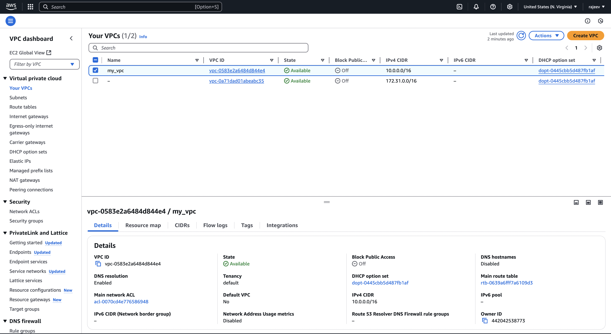
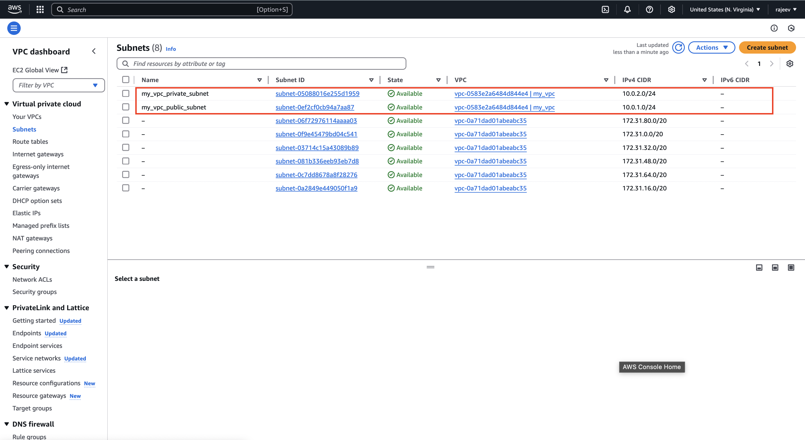
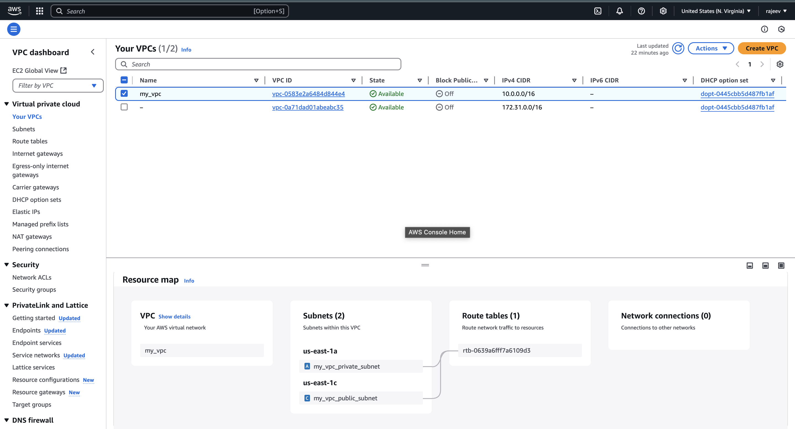
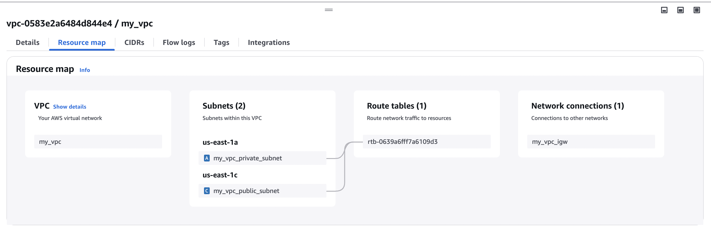
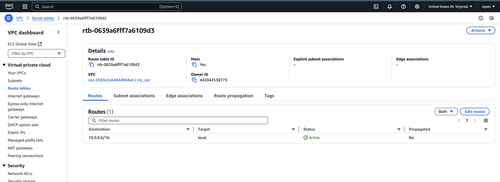
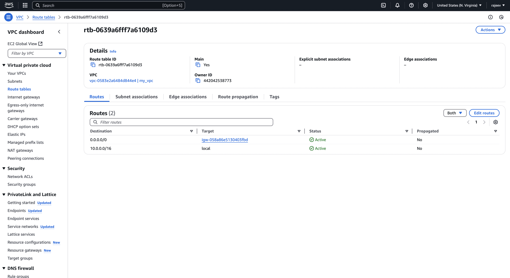
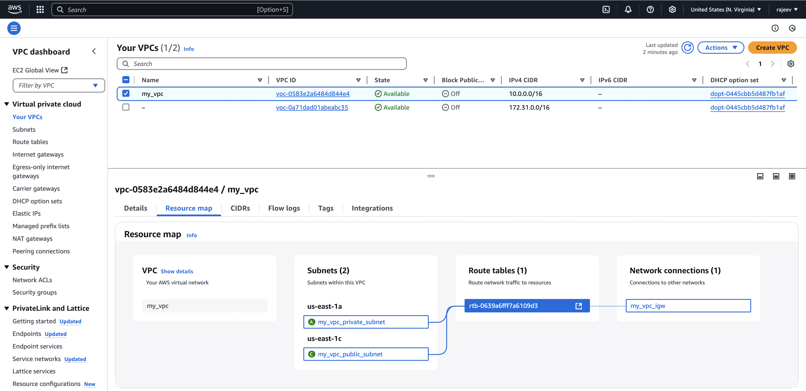
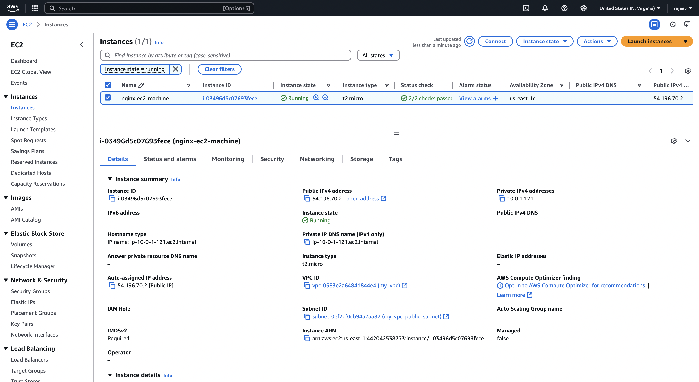
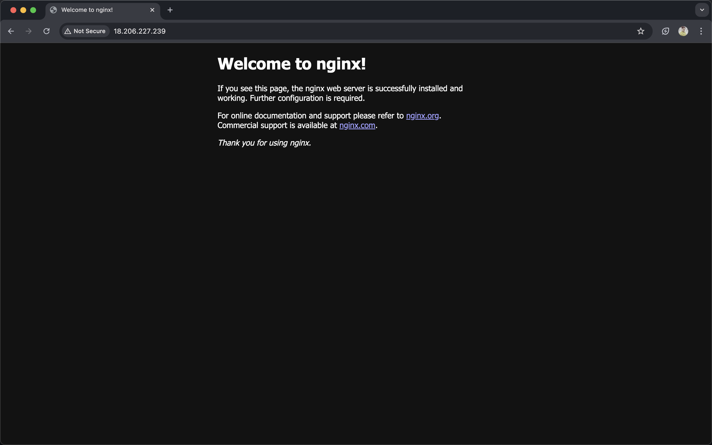

# Project

- used resources

1. VPC
2. EC2
3. NGINX
4. Get HTTP Access

---

# What all we have to create using `terraform`

- A VPC with public and private subnet.
- A EC2 instance using public subnet.
- Setup nginx web server
- Create security group rule to enable HTTP access.
- Output the webserver url at terminal

---

# Let's do step by step

## VPC Setup

1. Create only VPC

```sh
touch aws_providers.tf
```

```hcl
# AWS PROVIDER
terraform {
  required_providers {
    aws = {
      source = "hashicorp/aws"
      version = "5.88.0"
    }
  }
}
```

---

- Stores the state as a given key in a given bucket on Amazon S3

```sh
touch backend.tf
```

```hcl
# Stores the state as a given key in a given bucket on Amazon S3
terraform {
  backend "s3" {
    bucket = "my-bucket-e3fd3e6050"  # name of the bucket
    key = "backend.tfstate" # Name of the terraform state file
    region = "us-east-1" #Values of the region where S3 bucket (my-bucket-e3fd3e6050) resides in

  }
}
```

---

```sh
touch vpc.tf
```

```hcl
# 1. Name tag/ Name of the VPC
# 2. IPv4 CIDR block , if you want to use IPV6 then write IPV4 CIDR block
# 3. Tenancy
# 4. Tags
resource "aws_vpc" "my_vpc" {
  cidr_block = "10.0.0.0/16"
  instance_tenancy = "default"
  tags = {
    Name = "MyDemoVpc"
    Environment = "test"
    Tool = "terraform"
  }

}
```

2. Create `outputs.tf` file(Will write code to get all the resources id and other details)

```sh
touch outputs.tf
```

```hcl
# VPC ID
output "aws_vpc_id" {
  description = "AWS VPC ID TO CREATE INSTANCE AND OTHER RESOURCES"
  value = aws_vpc.my_vpc.id

}
```

`RUN`

```sh
terraform init
```

`Output:`

```sh
terraform init
Initializing the backend...

Successfully configured the backend "s3"! Terraform will automatically
use this backend unless the backend configuration changes.
Initializing provider plugins...
- Finding hashicorp/aws versions matching "5.88.0"...
- Installing hashicorp/aws v5.88.0...
- Installed hashicorp/aws v5.88.0 (signed by HashiCorp)
Terraform has created a lock file .terraform.lock.hcl to record the provider
selections it made above. Include this file in your version control repository
so that Terraform can guarantee to make the same selections by default when
you run "terraform init" in the future.

Terraform has been successfully initialized!

You may now begin working with Terraform. Try running "terraform plan" to see
any changes that are required for your infrastructure. All Terraform commands
should now work.

If you ever set or change modules or backend configuration for Terraform,
rerun this command to reinitialize your working directory. If you forget, other
commands will detect it and remind you to do so if necessary.
```

---

`RUN`

```sh
terraform validate
```

`Output:`

```sh
terraform validate
Success! The configuration is valid.
```

---

`RUN`

```sh
terraform plan
```

`Output:`

```sh
terraform plan -out=tfplan

Terraform used the selected providers to generate the following execution plan. Resource actions are
indicated with the following symbols:
  + create

Terraform will perform the following actions:

  # aws_vpc.my_vpc will be created
  + resource "aws_vpc" "my_vpc" {
      + arn                                  = (known after apply)
      + cidr_block                           = "10.0.0.0/16"
      + default_network_acl_id               = (known after apply)
      + default_route_table_id               = (known after apply)
      + default_security_group_id            = (known after apply)
      + dhcp_options_id                      = (known after apply)
      + enable_dns_hostnames                 = (known after apply)
      + enable_dns_support                   = true
      + enable_network_address_usage_metrics = (known after apply)
      + id                                   = (known after apply)
      + instance_tenancy                     = "default"
      + ipv6_association_id                  = (known after apply)
      + ipv6_cidr_block                      = (known after apply)
      + ipv6_cidr_block_network_border_group = (known after apply)
      + main_route_table_id                  = (known after apply)
      + owner_id                             = (known after apply)
      + tags                                 = {
          + "Environment" = "test"
          + "Name"        = "MyDemoVpc"
          + "Tool"        = "terraform"
        }
      + tags_all                             = {
          + "Environment" = "test"
          + "Name"        = "MyDemoVpc"
          + "Tool"        = "terraform"
        }
    }

Plan: 1 to add, 0 to change, 0 to destroy.

Changes to Outputs:
  + aws_vpc_id = (known after apply)

───────────────────────────────────────────────────────────────────────────────────────────────────────

Saved the plan to: tfplan

To perform exactly these actions, run the following command to apply:
    terraform apply "tfplan"
```

---

`RUN`

```sh
terraform apply -auto-approve
```

`Output:`

```sh
terraform apply -auto-approve

Terraform used the selected providers to generate the following execution plan. Resource actions are
indicated with the following symbols:
  + create

Terraform will perform the following actions:

  # aws_vpc.my_vpc will be created
  + resource "aws_vpc" "my_vpc" {
      + arn                                  = (known after apply)
      + cidr_block                           = "10.0.0.0/16"
      + default_network_acl_id               = (known after apply)
      + default_route_table_id               = (known after apply)
      + default_security_group_id            = (known after apply)
      + dhcp_options_id                      = (known after apply)
      + enable_dns_hostnames                 = (known after apply)
      + enable_dns_support                   = true
      + enable_network_address_usage_metrics = (known after apply)
      + id                                   = (known after apply)
      + instance_tenancy                     = "default"
      + ipv6_association_id                  = (known after apply)
      + ipv6_cidr_block                      = (known after apply)
      + ipv6_cidr_block_network_border_group = (known after apply)
      + main_route_table_id                  = (known after apply)
      + owner_id                             = (known after apply)
      + tags                                 = {
          + "Environment" = "test"
          + "Name"        = "MyDemoVpc"
          + "Tool"        = "terraform"
        }
      + tags_all                             = {
          + "Environment" = "test"
          + "Name"        = "MyDemoVpc"
          + "Tool"        = "terraform"
        }
    }

Plan: 1 to add, 0 to change, 0 to destroy.

Changes to Outputs:
  + aws_vpc_id = (known after apply)
aws_vpc.my_vpc: Creating...
aws_vpc.my_vpc: Creation complete after 6s [id=vpc-0da19e095c5bcc1a8]

Apply complete! Resources: 1 added, 0 changed, 0 destroyed.

Outputs:

aws_vpc_id = "vpc-0da19e095c5bcc1a8"
```

- Verify using console and from cli
  `using aws_console`
  
  `using cli`

```sh
terraform state list
```

`Output:`

```sh
terraform state list
aws_vpc.my_vpc
```

---

3. Create Public and Private Subnet

- Subnet

```sh
touch subnets.tf
```

```hcl
# Public Subnet
resource "aws_subnet" "my_vpc_public_subnet" {
  vpc_id = aws_vpc.my_vpc.id
  cidr_block = "10.0.1.0/24"
  tags = {
    Name = "my_vpc_public_subnet"
  }
}

# Private Subnet
resource "aws_subnet" "my_vpc_private_subnet" {
  vpc_id = aws_vpc.my_vpc.id
  cidr_block = "10.0.2.0/24"
  tags = {
    Name = "my_vpc_private_subnet"
  }

}
```

`RUN`

```sh
terraform validate
```

`Output:`

```sh
terraform validate
Success! The configuration is valid.
```

---

`RUN`

```sh
terraform plan -out=tfplan
```

`Output:`

```sh
terraform plan -out=tfplan
aws_vpc.my_vpc: Refreshing state... [id=vpc-0583e2a6484d844e4]

Terraform used the selected providers to generate the following execution plan. Resource actions are
indicated with the following symbols:
  + create

Terraform will perform the following actions:

  # aws_subnet.my_vpc_private_subnet will be created
  + resource "aws_subnet" "my_vpc_private_subnet" {
      + arn                                            = (known after apply)
      + assign_ipv6_address_on_creation                = false
      + availability_zone                              = (known after apply)
      + availability_zone_id                           = (known after apply)
      + cidr_block                                     = "10.0.2.0/24"
      + enable_dns64                                   = false
      + enable_resource_name_dns_a_record_on_launch    = false
      + enable_resource_name_dns_aaaa_record_on_launch = false
      + id                                             = (known after apply)
      + ipv6_cidr_block_association_id                 = (known after apply)
      + ipv6_native                                    = false
      + map_public_ip_on_launch                        = false
      + owner_id                                       = (known after apply)
      + private_dns_hostname_type_on_launch            = (known after apply)
      + tags                                           = {
          + "Name" = "my_vpc_private_subnet"
        }
      + tags_all                                       = {
          + "Name" = "my_vpc_private_subnet"
        }
      + vpc_id                                         = "vpc-0583e2a6484d844e4"
    }

  # aws_subnet.my_vpc_public_subnet will be created
  + resource "aws_subnet" "my_vpc_public_subnet" {
      + arn                                            = (known after apply)
      + assign_ipv6_address_on_creation                = false
      + availability_zone                              = (known after apply)
      + availability_zone_id                           = (known after apply)
      + cidr_block                                     = "10.0.1.0/24"
      + enable_dns64                                   = false
      + enable_resource_name_dns_a_record_on_launch    = false
      + enable_resource_name_dns_aaaa_record_on_launch = false
      + id                                             = (known after apply)
      + ipv6_cidr_block_association_id                 = (known after apply)
      + ipv6_native                                    = false
      + map_public_ip_on_launch                        = false
      + owner_id                                       = (known after apply)
      + private_dns_hostname_type_on_launch            = (known after apply)
      + tags                                           = {
          + "Name" = "my_vpc_public_subnet"
        }
      + tags_all                                       = {
          + "Name" = "my_vpc_public_subnet"
        }
      + vpc_id                                         = "vpc-0583e2a6484d844e4"
    }

Plan: 2 to add, 0 to change, 0 to destroy.

───────────────────────────────────────────────────────────────────────────────────────────────────────

Saved the plan to: tfplan

To perform exactly these actions, run the following command to apply:
    terraform apply "tfplan"

```

---

`RUN`

```sh
terraform apply -auto-approve
```

`Output:`

```sh
terraform apply -auto-approve
aws_vpc.my_vpc: Refreshing state... [id=vpc-0583e2a6484d844e4]

Terraform used the selected providers to generate the following execution plan. Resource actions are
indicated with the following symbols:
  + create

Terraform will perform the following actions:

  # aws_subnet.my_vpc_private_subnet will be created
  + resource "aws_subnet" "my_vpc_private_subnet" {
      + arn                                            = (known after apply)
      + assign_ipv6_address_on_creation                = false
      + availability_zone                              = (known after apply)
      + availability_zone_id                           = (known after apply)
      + cidr_block                                     = "10.0.2.0/24"
      + enable_dns64                                   = false
      + enable_resource_name_dns_a_record_on_launch    = false
      + enable_resource_name_dns_aaaa_record_on_launch = false
      + id                                             = (known after apply)
      + ipv6_cidr_block_association_id                 = (known after apply)
      + ipv6_native                                    = false
      + map_public_ip_on_launch                        = false
      + owner_id                                       = (known after apply)
      + private_dns_hostname_type_on_launch            = (known after apply)
      + tags                                           = {
          + "Name" = "my_vpc_private_subnet"
        }
      + tags_all                                       = {
          + "Name" = "my_vpc_private_subnet"
        }
      + vpc_id                                         = "vpc-0583e2a6484d844e4"
    }

  # aws_subnet.my_vpc_public_subnet will be created
  + resource "aws_subnet" "my_vpc_public_subnet" {
      + arn                                            = (known after apply)
      + assign_ipv6_address_on_creation                = false
      + availability_zone                              = (known after apply)
      + availability_zone_id                           = (known after apply)
      + cidr_block                                     = "10.0.1.0/24"
      + enable_dns64                                   = false
      + enable_resource_name_dns_a_record_on_launch    = false
      + enable_resource_name_dns_aaaa_record_on_launch = false
      + id                                             = (known after apply)
      + ipv6_cidr_block_association_id                 = (known after apply)
      + ipv6_native                                    = false
      + map_public_ip_on_launch                        = false
      + owner_id                                       = (known after apply)
      + private_dns_hostname_type_on_launch            = (known after apply)
      + tags                                           = {
          + "Name" = "my_vpc_public_subnet"
        }
      + tags_all                                       = {
          + "Name" = "my_vpc_public_subnet"
        }
      + vpc_id                                         = "vpc-0583e2a6484d844e4"
    }

Plan: 2 to add, 0 to change, 0 to destroy.
aws_subnet.my_vpc_private_subnet: Creating...
aws_subnet.my_vpc_public_subnet: Creating...
aws_subnet.my_vpc_public_subnet: Creation complete after 4s [id=subnet-0ef2cf0cb94a7aa87]
aws_subnet.my_vpc_private_subnet: Creation complete after 4s [id=subnet-05088016e255d1959]

Apply complete! Resources: 2 added, 0 changed, 0 destroyed.

Outputs:

aws_vpc_id = "vpc-0583e2a6484d844e4"
```

- Now lets add code to get subnets id in outputs.tf file

```hcl
# Public Subnet ID
output "my_vpc_public_subnet_id" {
  description = "Public Subnet ID"
  value = aws_subnet.my_vpc_public_subnet.id
}

# Private Subnet ID
output "my_vpc_private_subnet_id" {
  description = "Private Subnet ID"
  value = aws_subnet.my_vpc_private_subnet.id
}

```

`RUN`

```sh
terraform apply
```

`Output:`

```sh
terraform apply -auto-approve
aws_vpc.my_vpc: Refreshing state... [id=vpc-0583e2a6484d844e4]
aws_subnet.my_vpc_public_subnet: Refreshing state... [id=subnet-0ef2cf0cb94a7aa87]
aws_subnet.my_vpc_private_subnet: Refreshing state... [id=subnet-05088016e255d1959]

Changes to Outputs:
  + my_vpc_private_subnet_id = "subnet-05088016e255d1959"
  + my_vpc_public_subnet_id  = "subnet-0ef2cf0cb94a7aa87"

You can apply this plan to save these new output values to the Terraform state, without changing any
real infrastructure.

Apply complete! Resources: 0 added, 0 changed, 0 destroyed.

Outputs:

aws_vpc_id = "vpc-0583e2a6484d844e4"
my_vpc_private_subnet_id = "subnet-05088016e255d1959"
my_vpc_public_subnet_id = "subnet-0ef2cf0cb94a7aa87"
```

---

- Check terraform managed resources

```sh
terraform state list
```

`Output:`

```sh
terraform state list
aws_subnet.my_vpc_private_subnet
aws_subnet.my_vpc_public_subnet
aws_vpc.my_vpc
```

---

- Check for the owner of the account who created above resources

```sh
terraform state show aws_vpc.my_vpc
```

`Output:`

```sh
terraform state show aws_vpc.my_vpc

# aws_vpc.my_vpc:
resource "aws_vpc" "my_vpc" {
    arn                                  = "arn:aws:ec2:us-east-1:442042538773:vpc/vpc-0583e2a6484d844e4"
    assign_generated_ipv6_cidr_block     = false
    cidr_block                           = "10.0.0.0/16"
    default_network_acl_id               = "acl-0070cd4e776586948"
    default_route_table_id               = "rtb-0639a6fff7a6109d3"
    default_security_group_id            = "sg-0c236f73fb0ba3152"
    dhcp_options_id                      = "dopt-0445cbb5d487fb1af"
    enable_dns_hostnames                 = false
    enable_dns_support                   = true
    enable_network_address_usage_metrics = false
    id                                   = "vpc-0583e2a6484d844e4"
    instance_tenancy                     = "default"
    ipv6_association_id                  = null
    ipv6_cidr_block                      = null
    ipv6_cidr_block_network_border_group = null
    ipv6_ipam_pool_id                    = null
    ipv6_netmask_length                  = 0
    main_route_table_id                  = "rtb-0639a6fff7a6109d3"
    owner_id                             = "442042538773"
    tags                                 = {
        "Environment" = "test"
        "Name"        = "my_vpc"
        "Tool"        = "terraform"
    }
    tags_all                             = {
        "Environment" = "test"
        "Name"        = "my_vpc"
        "Tool"        = "terraform"
    }
}
```



---

`RUN`

```sh
terraform state list | grep aws_subnet
```

`Output:`

```sh
terraform state list | grep aws_subnet
aws_subnet.my_vpc_private_subnet
aws_subnet.my_vpc_public_subnet
```

---

- resource map of vpc
  

---

4. Create an Internet Gateway (For Public Subnets)

- If your public subnet needs internet access, attach an Internet Gateway (IGW) to your VPC.

```sh
touch internet_gateway.tf
```

```hcl
resource "aws_internet_gateway" "my_vpc_igw" {
  vpc_id = aws_vpc.my_vpc.id
  tags = {
    Name = "my_vpc_igw"
  }
}

```

---

`RUN`

```sh
terraform validate
```

`Output`

```sh
terraform validate
Success! The configuration is valid.
```

---

`RUN`

```sh
terraform plan -out=tfplan
```

`Output`

```sh
terraform plan -out=tfplan
aws_vpc.my_vpc: Refreshing state... [id=vpc-0583e2a6484d844e4]
aws_subnet.my_vpc_private_subnet: Refreshing state... [id=subnet-05088016e255d1959]
aws_subnet.my_vpc_public_subnet: Refreshing state... [id=subnet-0ef2cf0cb94a7aa87]

Terraform used the selected providers to generate the following execution plan. Resource actions are
indicated with the following symbols:
  + create

Terraform will perform the following actions:

  # aws_internet_gateway.my_vpc_igw will be created
  + resource "aws_internet_gateway" "my_vpc_igw" {
      + arn      = (known after apply)
      + id       = (known after apply)
      + owner_id = (known after apply)
      + tags     = {
          + "Name" = "my_vpc_igw"
        }
      + tags_all = {
          + "Name" = "my_vpc_igw"
        }
      + vpc_id   = "vpc-0583e2a6484d844e4"
    }

Plan: 1 to add, 0 to change, 0 to destroy.

───────────────────────────────────────────────────────────────────────────────────────────────────────

Saved the plan to: tfplan

To perform exactly these actions, run the following command to apply:
    terraform apply "tfplan"
```

---

`RUN`

```sh
terraform apply -auto-approve
```

`Output`

```sh
terraform apply -auto-approve
aws_vpc.my_vpc: Refreshing state... [id=vpc-0583e2a6484d844e4]
aws_subnet.my_vpc_public_subnet: Refreshing state... [id=subnet-0ef2cf0cb94a7aa87]
aws_subnet.my_vpc_private_subnet: Refreshing state... [id=subnet-05088016e255d1959]

Terraform used the selected providers to generate the following execution plan. Resource actions are
indicated with the following symbols:
  + create

Terraform will perform the following actions:

  # aws_internet_gateway.my_vpc_igw will be created
  + resource "aws_internet_gateway" "my_vpc_igw" {
      + arn      = (known after apply)
      + id       = (known after apply)
      + owner_id = (known after apply)
      + tags     = {
          + "Name" = "my_vpc_igw"
        }
      + tags_all = {
          + "Name" = "my_vpc_igw"
        }
      + vpc_id   = "vpc-0583e2a6484d844e4"
    }

Plan: 1 to add, 0 to change, 0 to destroy.
aws_internet_gateway.my_vpc_igw: Creating...
aws_internet_gateway.my_vpc_igw: Creation complete after 3s [id=igw-058a86e5130403fbd]

Apply complete! Resources: 1 added, 0 changed, 0 destroyed.

Outputs:

aws_vpc_id = "vpc-0583e2a6484d844e4"
my_vpc_private_subnet_id = "subnet-05088016e255d1959"
my_vpc_public_subnet_id = "subnet-0ef2cf0cb94a7aa87"
```

---

- Now let's write terraform code to get Internet gateway id in outputs.tf

```hcl
# Internet Gateway ID
output "my_vpc_igw_id" {
  description = "Internet Gateway ID"
  value = aws_internet_gateway.my_vpc_igw.id
}
```

`RUN`

```sh
terraform apply -auto-approve
```

`Output:`

```sh
terraform apply -auto-approve
aws_vpc.my_vpc: Refreshing state... [id=vpc-0583e2a6484d844e4]
aws_internet_gateway.my_vpc_igw: Refreshing state... [id=igw-058a86e5130403fbd]
aws_subnet.my_vpc_private_subnet: Refreshing state... [id=subnet-05088016e255d1959]
aws_subnet.my_vpc_public_subnet: Refreshing state... [id=subnet-0ef2cf0cb94a7aa87]

Changes to Outputs:
  + my_vpc_igw_id            = "igw-058a86e5130403fbd"

You can apply this plan to save these new output values to the Terraform state, without changing any
real infrastructure.

Apply complete! Resources: 0 added, 0 changed, 0 destroyed.

Outputs:

aws_vpc_id = "vpc-0583e2a6484d844e4"
my_vpc_igw_id = "igw-058a86e5130403fbd"
my_vpc_private_subnet_id = "subnet-05088016e255d1959"
my_vpc_public_subnet_id = "subnet-0ef2cf0cb94a7aa87"
```

---

- Check terraform managed resources

```sh

terraform state list
```

`Outpu:`

```sh
terraform state list
aws_internet_gateway.my_vpc_igw
aws_subnet.my_vpc_private_subnet
aws_subnet.my_vpc_public_subnet
aws_vpc.my_vpc
```

- Resource Map
  

---

5. Update Route Tables

- Defaul route table settings
  

---

- create route_table.tf

```sh
touch route_table.tf
```

```hcl
# Terraform resource to update main route table
resource "aws_route" "main_route_table" {
  route_table_id = aws_vpc.my_vpc.main_route_table_id
  destination_cidr_block = "0.0.0.0/0"
  gateway_id = aws_internet_gateway.my_vpc_igw.id
}
```

---

`RUN`

```sh
terraform apply -auto-approve
```

`Output:`

```sh
terraform apply -auto-approve
aws_vpc.my_vpc: Refreshing state... [id=vpc-0583e2a6484d844e4]
aws_internet_gateway.my_vpc_igw: Refreshing state... [id=igw-058a86e5130403fbd]
aws_subnet.my_vpc_public_subnet: Refreshing state... [id=subnet-0ef2cf0cb94a7aa87]
aws_subnet.my_vpc_private_subnet: Refreshing state... [id=subnet-05088016e255d1959]

Terraform used the selected providers to generate the following execution plan. Resource actions are
indicated with the following symbols:
  + create

Terraform will perform the following actions:

  # aws_route.main_route_table will be created
  + resource "aws_route" "main_route_table" {
      + destination_cidr_block = "0.0.0.0/0"
      + gateway_id             = "igw-058a86e5130403fbd"
      + id                     = (known after apply)
      + instance_id            = (known after apply)
      + instance_owner_id      = (known after apply)
      + network_interface_id   = (known after apply)
      + origin                 = (known after apply)
      + route_table_id         = "rtb-0639a6fff7a6109d3"
      + state                  = (known after apply)
    }

Plan: 1 to add, 0 to change, 0 to destroy.

Changes to Outputs:
  + route_table_id           = "rtb-0639a6fff7a6109d3"
aws_route.main_route_table: Creating...
aws_route.main_route_table: Creation complete after 3s [id=r-rtb-0639a6fff7a6109d31080289494]

Apply complete! Resources: 1 added, 0 changed, 0 destroyed.

Outputs:

aws_vpc_id = "vpc-0583e2a6484d844e4"
my_vpc_igw_id = "igw-058a86e5130403fbd"
my_vpc_private_subnet_id = "subnet-05088016e255d1959"
my_vpc_public_subnet_id = "subnet-0ef2cf0cb94a7aa87"
route_table_id = "rtb-0639a6fff7a6109d3"
```

---

```sh
terraform state list
```

`Output:`

```sh
terraform state list
aws_internet_gateway.my_vpc_igw
aws_route.main_route_table
aws_subnet.my_vpc_private_subnet
aws_subnet.my_vpc_public_subnet
aws_vpc.my_vpc
```

- Verify the route table change
  

---

- AWS VPC resource map
  

---

6. Create a Security Group

- Define a Security Group to control inbound and outbound traffic.

```sh
touch security_groups.tf
```

```hcl

# Allow SSH Security Group
resource "aws_security_group" "my_vpc_sg" {
  vpc_id = aws_vpc.my_vpc.id
  name   = "allow_ssh"

  # Corrected ingress block
  ingress {
    description = "Allow SSH traffic"
    from_port   = 22
    to_port     = 22
    protocol    = "tcp"
    cidr_blocks = ["0.0.0.0/0"] # Change to your IP for security
  }

  # Corrected egress block
  egress {
    description = "Allow all outbound traffic"
    from_port   = 0
    to_port     = 0
    protocol    = "-1"
    cidr_blocks = ["0.0.0.0/0"]
  }

  tags = {
    Name = "allow_ssh"
  }
}

# Allow HTTP Security Group
resource "aws_security_group" "allow_http" {
  vpc_id = aws_vpc.my_vpc.id
  name   = "allow_http"

  # Corrected ingress block
  ingress {
    description = "Allow HTTP traffic"
    from_port   = 80
    to_port     = 80
    protocol    = "tcp"
    cidr_blocks = ["0.0.0.0/0"] # Change to your IP for security
  }

  # Corrected egress block
  egress {
    description = "Allow all outbound traffic"
    from_port   = 0
    to_port     = 0
    protocol    = "-1"
    cidr_blocks = ["0.0.0.0/0"]
  }

  tags = {
    Name = "allow_http"
  }
}

```

`RUN`

```sh
terraform validate
```

If above command gets success message then

```sh
terraform apply -auto-approve
```

`Output:`

```sh
terraform apply -auto-approve
aws_vpc.my_vpc: Refreshing state... [id=vpc-0583e2a6484d844e4]
aws_internet_gateway.my_vpc_igw: Refreshing state... [id=igw-058a86e5130403fbd]
aws_subnet.my_vpc_public_subnet: Refreshing state... [id=subnet-0ef2cf0cb94a7aa87]
aws_subnet.my_vpc_private_subnet: Refreshing state... [id=subnet-05088016e255d1959]
aws_route.main_route_table: Refreshing state... [id=r-rtb-0639a6fff7a6109d31080289494]

Terraform used the selected providers to generate the following execution plan. Resource actions are
indicated with the following symbols:
  + create

Terraform will perform the following actions:

  # aws_security_group.allow_http will be created
  + resource "aws_security_group" "allow_http" {
      + arn                    = (known after apply)
      + description            = "Managed by Terraform"
      + egress                 = [
          + {
              + cidr_blocks      = [
                  + "0.0.0.0/0",
                ]
              + description      = "Allow all outbound traffic"
              + from_port        = 0
              + ipv6_cidr_blocks = []
              + prefix_list_ids  = []
              + protocol         = "-1"
              + security_groups  = []
              + self             = false
              + to_port          = 0
            },
        ]
      + id                     = (known after apply)
      + ingress                = [
          + {
              + cidr_blocks      = [
                  + "0.0.0.0/0",
                ]
              + description      = "Allow HTTP traffic"
              + from_port        = 80
              + ipv6_cidr_blocks = []
              + prefix_list_ids  = []
              + protocol         = "tcp"
              + security_groups  = []
              + self             = false
              + to_port          = 80
            },
        ]
      + name                   = "allow_http"
      + name_prefix            = (known after apply)
      + owner_id               = (known after apply)
      + revoke_rules_on_delete = false
      + tags                   = {
          + "Name" = "allow_http"
        }
      + tags_all               = {
          + "Name" = "allow_http"
        }
      + vpc_id                 = "vpc-0583e2a6484d844e4"
    }

  # aws_security_group.my_vpc_sg will be created
  + resource "aws_security_group" "my_vpc_sg" {
      + arn                    = (known after apply)
      + description            = "Managed by Terraform"
      + egress                 = [
          + {
              + cidr_blocks      = [
                  + "0.0.0.0/0",
                ]
              + description      = "Allow all outbound traffic"
              + from_port        = 0
              + ipv6_cidr_blocks = []
              + prefix_list_ids  = []
              + protocol         = "-1"
              + security_groups  = []
              + self             = false
              + to_port          = 0
            },
        ]
      + id                     = (known after apply)
      + ingress                = [
          + {
              + cidr_blocks      = [
                  + "0.0.0.0/0",
                ]
              + description      = "Allow SSH traffic"
              + from_port        = 22
              + ipv6_cidr_blocks = []
              + prefix_list_ids  = []
              + protocol         = "tcp"
              + security_groups  = []
              + self             = false
              + to_port          = 22
            },
        ]
      + name                   = "allow_ssh"
      + name_prefix            = (known after apply)
      + owner_id               = (known after apply)
      + revoke_rules_on_delete = false
      + tags                   = {
          + "Name" = "allow_ssh"
        }
      + tags_all               = {
          + "Name" = "allow_ssh"
        }
      + vpc_id                 = "vpc-0583e2a6484d844e4"
    }

Plan: 2 to add, 0 to change, 0 to destroy.
aws_security_group.my_vpc_sg: Creating...
aws_security_group.allow_http: Creating...
aws_security_group.my_vpc_sg: Creation complete after 8s [id=sg-026510eae898dddb4]
aws_security_group.allow_http: Creation complete after 8s [id=sg-0a0aa571f904a12ff]

Apply complete! Resources: 2 added, 0 changed, 0 destroyed.

Outputs:

aws_vpc_id = "vpc-0583e2a6484d844e4"
my_vpc_igw_id = "igw-058a86e5130403fbd"
my_vpc_private_subnet_id = "subnet-05088016e255d1959"
my_vpc_public_subnet_id = "subnet-0ef2cf0cb94a7aa87"
route_table_id = "rtb-0639a6fff7a6109d3"
```

---

- Let's add code to get security grops id in outputs.tf

```hcl
# allow_ssh
output "my_vpc_security_group_allow_ssh" {
  description = "allow_ssh security group id"
  value       = aws_security_group.my_vpc_sg.id
}

# allow_http
output "my_vpc_security_group_allow_http" {
  description = "allow_http security group id"
  value       = aws_security_group.allow_http.id
}

```

---

`RUN`

```sh
terraform validate
```

If above command returns success message then run below command or else fix the issue first

```sh
terraform apply -auto-approve
```

`Output:`

```sh
terraform apply -auto-approve
aws_vpc.my_vpc: Refreshing state... [id=vpc-0583e2a6484d844e4]
aws_internet_gateway.my_vpc_igw: Refreshing state... [id=igw-058a86e5130403fbd]
aws_subnet.my_vpc_public_subnet: Refreshing state... [id=subnet-0ef2cf0cb94a7aa87]
aws_subnet.my_vpc_private_subnet: Refreshing state... [id=subnet-05088016e255d1959]
aws_security_group.allow_http: Refreshing state... [id=sg-0a0aa571f904a12ff]
aws_security_group.my_vpc_sg: Refreshing state... [id=sg-026510eae898dddb4]
aws_route.main_route_table: Refreshing state... [id=r-rtb-0639a6fff7a6109d31080289494]

Changes to Outputs:
  + my_vpc_security_group_allow_http = "sg-0a0aa571f904a12ff"
  + my_vpc_security_group_allow_ssh  = "sg-026510eae898dddb4"

You can apply this plan to save these new output values to the Terraform state, without changing any
real infrastructure.

Apply complete! Resources: 0 added, 0 changed, 0 destroyed.

Outputs:

aws_vpc_id = "vpc-0583e2a6484d844e4"
my_vpc_igw_id = "igw-058a86e5130403fbd"
my_vpc_private_subnet_id = "subnet-05088016e255d1959"
my_vpc_public_subnet_id = "subnet-0ef2cf0cb94a7aa87"
my_vpc_security_group_allow_http = "sg-0a0aa571f904a12ff"
my_vpc_security_group_allow_ssh = "sg-026510eae898dddb4"
route_table_id = "rtb-0639a6fff7a6109d3"

```

7. Launch an EC2 Instance

```sh
touch ec2-instance.tf
```

```hcl
resource "aws_instance" "nginx-ec2-machine" {
  ami = "ami-04b4f1a9cf54c11d0"
  instance_type = "t2.micro"
  subnet_id = aws_subnet.my_vpc_public_subnet.id
  associate_public_ip_address = true
  tags = {
    Name = "nginx-ec2-machine"
  }

}
```

---

`RUN`

```sh
terraform validate
```

`Output:`

```sh
terraform validate
Success! The configuration is valid.
```

```sh
terraform apply -auto-approve
```

`Output:`

```sh
terraform apply -auto-approve
aws_vpc.my_vpc: Refreshing state... [id=vpc-0583e2a6484d844e4]
aws_subnet.my_vpc_private_subnet: Refreshing state... [id=subnet-05088016e255d1959]
aws_security_group.my_vpc_sg: Refreshing state... [id=sg-026510eae898dddb4]
aws_internet_gateway.my_vpc_igw: Refreshing state... [id=igw-058a86e5130403fbd]
aws_subnet.my_vpc_public_subnet: Refreshing state... [id=subnet-0ef2cf0cb94a7aa87]
aws_security_group.allow_http: Refreshing state... [id=sg-0a0aa571f904a12ff]
aws_route.main_route_table: Refreshing state... [id=r-rtb-0639a6fff7a6109d31080289494]

Terraform used the selected providers to generate the following execution plan. Resource actions are
indicated with the following symbols:
  + create

Terraform will perform the following actions:

  # aws_instance.nginx-ec2-machine will be created
  + resource "aws_instance" "nginx-ec2-machine" {
      + ami                                  = "ami-04b4f1a9cf54c11d0"
      + arn                                  = (known after apply)
      + associate_public_ip_address          = true
      + availability_zone                    = (known after apply)
      + cpu_core_count                       = (known after apply)
      + cpu_threads_per_core                 = (known after apply)
      + disable_api_stop                     = (known after apply)
      + disable_api_termination              = (known after apply)
      + ebs_optimized                        = (known after apply)
      + enable_primary_ipv6                  = (known after apply)
      + get_password_data                    = false
      + host_id                              = (known after apply)
      + host_resource_group_arn              = (known after apply)
      + iam_instance_profile                 = (known after apply)
      + id                                   = (known after apply)
      + instance_initiated_shutdown_behavior = (known after apply)
      + instance_lifecycle                   = (known after apply)
      + instance_state                       = (known after apply)
      + instance_type                        = "t2.micro"
      + ipv6_address_count                   = (known after apply)
      + ipv6_addresses                       = (known after apply)
      + key_name                             = (known after apply)
      + monitoring                           = (known after apply)
      + outpost_arn                          = (known after apply)
      + password_data                        = (known after apply)
      + placement_group                      = (known after apply)
      + placement_partition_number           = (known after apply)
      + primary_network_interface_id         = (known after apply)
      + private_dns                          = (known after apply)
      + private_ip                           = (known after apply)
      + public_dns                           = (known after apply)
      + public_ip                            = (known after apply)
      + secondary_private_ips                = (known after apply)
      + security_groups                      = (known after apply)
      + source_dest_check                    = true
      + spot_instance_request_id             = (known after apply)
      + subnet_id                            = "subnet-0ef2cf0cb94a7aa87"
      + tags                                 = {
          + "Name" = "nginx-ec2-machine"
        }
      + tags_all                             = {
          + "Name" = "nginx-ec2-machine"
        }
      + tenancy                              = (known after apply)
      + user_data                            = (known after apply)
      + user_data_base64                     = (known after apply)
      + user_data_replace_on_change          = false
      + vpc_security_group_ids               = (known after apply)

      + capacity_reservation_specification (known after apply)

      + cpu_options (known after apply)

      + ebs_block_device (known after apply)

      + enclave_options (known after apply)

      + ephemeral_block_device (known after apply)

      + instance_market_options (known after apply)

      + maintenance_options (known after apply)

      + metadata_options (known after apply)

      + network_interface (known after apply)

      + private_dns_name_options (known after apply)

      + root_block_device (known after apply)
    }

Plan: 1 to add, 0 to change, 0 to destroy.
aws_instance.nginx-ec2-machine: Creating...
aws_instance.nginx-ec2-machine: Still creating... [10s elapsed]
aws_instance.nginx-ec2-machine: Creation complete after 19s [id=i-03496d5c07693fece]

Apply complete! Resources: 1 added, 0 changed, 0 destroyed.

Outputs:

aws_vpc_id = "vpc-0583e2a6484d844e4"
my_vpc_igw_id = "igw-058a86e5130403fbd"
my_vpc_private_subnet_id = "subnet-05088016e255d1959"
my_vpc_public_subnet_id = "subnet-0ef2cf0cb94a7aa87"
my_vpc_security_group_allow_http = "sg-0a0aa571f904a12ff"
my_vpc_security_group_allow_ssh = "sg-026510eae898dddb4"
route_table_id = "rtb-0639a6fff7a6109d3"


```

---

- Let's add code to get instance id, public ip and private ip in `outputs.tf `

```hcl
# EC2 ID
output "nginx_ec2_machine_id" {
  description = "EC2 Machine ID"
  value = aws_instance.nginx-ec2-machine.id
}

# EC2 Public IP
output "nginx_ec2_machine_public_ip" {
  description = "EC2 machine public IP"
  value = aws_instance.nginx-ec2-machine.public_ip

}

# EC2 Private IP
output "nginx_ec2_machine_private_ip" {
  description = "EC2 machine private IP"
  value = aws_instance.nginx-ec2-machine.private_ip

}

```

---

`RUN`

```sh
terraform validate
```

`Output:`

```sh
terraform validate
Success! The configuration is valid.
```

```sh
terraform apply -auto-approve
```

`Output:`

```sh
terraform apply -auto-approve
aws_vpc.my_vpc: Refreshing state... [id=vpc-0583e2a6484d844e4]
aws_internet_gateway.my_vpc_igw: Refreshing state... [id=igw-058a86e5130403fbd]
aws_subnet.my_vpc_public_subnet: Refreshing state... [id=subnet-0ef2cf0cb94a7aa87]
aws_subnet.my_vpc_private_subnet: Refreshing state... [id=subnet-05088016e255d1959]
aws_security_group.my_vpc_sg: Refreshing state... [id=sg-026510eae898dddb4]
aws_security_group.allow_http: Refreshing state... [id=sg-0a0aa571f904a12ff]
aws_instance.nginx-ec2-machine: Refreshing state... [id=i-03496d5c07693fece]
aws_route.main_route_table: Refreshing state... [id=r-rtb-0639a6fff7a6109d31080289494]

Changes to Outputs:
  + nginx_ec2_machine_id             = "i-03496d5c07693fece"
  + nginx_ec2_machine_private_ip     = "10.0.1.121"
  + nginx_ec2_machine_public_ip      = "54.196.70.2"

You can apply this plan to save these new output values to the Terraform state, without changing any
real infrastructure.

Apply complete! Resources: 0 added, 0 changed, 0 destroyed.

Outputs:

aws_vpc_id = "vpc-0583e2a6484d844e4"
my_vpc_igw_id = "igw-058a86e5130403fbd"
my_vpc_private_subnet_id = "subnet-05088016e255d1959"
my_vpc_public_subnet_id = "subnet-0ef2cf0cb94a7aa87"
my_vpc_security_group_allow_http = "sg-0a0aa571f904a12ff"
my_vpc_security_group_allow_ssh = "sg-026510eae898dddb4"
nginx_ec2_machine_id = "i-03496d5c07693fece"
nginx_ec2_machine_private_ip = "10.0.1.121"
nginx_ec2_machine_public_ip = "54.196.70.2"
route_table_id = "rtb-0639a6fff7a6109d3"
```

---

- Veryfy EC2 using aws console
  

---

8. Install and enable `nginx` in our ec2 machine

- Update the ec2-instance.tf file

```hcl
resource "aws_instance" "nginx-ec2-machine" {
  ami = "ami-04b4f1a9cf54c11d0"
  instance_type = "t2.micro"
  subnet_id = aws_subnet.my_vpc_public_subnet.id
  associate_public_ip_address = true
  vpc_security_group_ids = [
    aws_security_group.my_vpc_sg.id, aws_security_group.allow_http.id

  ]

  user_data = <<-EOF
              #!/bin/bash
              sudo apt update -y
              sudo apt install -y nginx
              sudo systemctl start nginx
              sudo systemctl enable nginx
              EOF


  tags = {
    Name = "nginx-ec2-machine"
  }

}

```

`RUN`

```sh
terraform validate
```

`Output:`

```sh
terraform validate
Success! The configuration is valid.
```

`RUN`

```sh
terraform apply -auto-approve
```

`Output:`

```sh
terraform apply -auto-approve
aws_vpc.my_vpc: Refreshing state... [id=vpc-0583e2a6484d844e4]
aws_subnet.my_vpc_private_subnet: Refreshing state... [id=subnet-05088016e255d1959]
aws_internet_gateway.my_vpc_igw: Refreshing state... [id=igw-058a86e5130403fbd]
aws_subnet.my_vpc_public_subnet: Refreshing state... [id=subnet-0ef2cf0cb94a7aa87]
aws_security_group.my_vpc_sg: Refreshing state... [id=sg-026510eae898dddb4]
aws_security_group.allow_http: Refreshing state... [id=sg-0a0aa571f904a12ff]
aws_route.main_route_table: Refreshing state... [id=r-rtb-0639a6fff7a6109d31080289494]
aws_instance.nginx-ec2-machine: Refreshing state... [id=i-03496d5c07693fece]

Terraform used the selected providers to generate the following execution plan. Resource actions are
indicated with the following symbols:
  ~ update in-place

Terraform will perform the following actions:

  # aws_instance.nginx-ec2-machine will be updated in-place
  ~ resource "aws_instance" "nginx-ec2-machine" {
        id                                   = "i-03496d5c07693fece"
      + public_dns                           = (known after apply)
      ~ public_ip                            = "54.196.70.2" -> (known after apply)
        tags                                 = {
            "Name" = "nginx-ec2-machine"
        }
      + user_data                            = "1913ddcae85736ea3ea7d00a8b328b13194a6554"
        # (37 unchanged attributes hidden)

        # (8 unchanged blocks hidden)
    }

Plan: 0 to add, 1 to change, 0 to destroy.

Changes to Outputs:
  ~ nginx_ec2_machine_public_ip      = "54.196.70.2" -> (known after apply)
aws_instance.nginx-ec2-machine: Modifying... [id=i-03496d5c07693fece]
aws_instance.nginx-ec2-machine: Still modifying... [id=i-03496d5c07693fece, 10s elapsed]
aws_instance.nginx-ec2-machine: Still modifying... [id=i-03496d5c07693fece, 20s elapsed]
aws_instance.nginx-ec2-machine: Still modifying... [id=i-03496d5c07693fece, 30s elapsed]
aws_instance.nginx-ec2-machine: Modifications complete after 39s [id=i-03496d5c07693fece]

Apply complete! Resources: 0 added, 1 changed, 0 destroyed.

Outputs:

aws_vpc_id = "vpc-0583e2a6484d844e4"
my_vpc_igw_id = "igw-058a86e5130403fbd"
my_vpc_private_subnet_id = "subnet-05088016e255d1959"
my_vpc_public_subnet_id = "subnet-0ef2cf0cb94a7aa87"
my_vpc_security_group_allow_http = "sg-0a0aa571f904a12ff"
my_vpc_security_group_allow_ssh = "sg-026510eae898dddb4"
nginx_ec2_machine_id = "i-03496d5c07693fece"
nginx_ec2_machine_private_ip = "10.0.1.121"
nginx_ec2_machine_public_ip = "34.228.224.8"
route_table_id = "rtb-0639a6fff7a6109d3"

```

## 

- let's add code to get Output the full HTTP URL to access the NGINX server in `outputs.tf`

```hcl
# Output the full HTTP URL to access the NGINX server
output "nginx-ec2-machine-url" {
  description = "Access the NGINX Web Server"
  value = "http://${aws_instance.nginx-ec2-machine.public_ip}"

}

```

`RUN`

```sh
terraform validate
```

`Output:`

```sh
terraform validate
Success! The configuration is valid.
```

`RUN`

```sh
terraform apply -auto-approve
```

`Output:`

```sh

terraform apply -auto-approve
aws_vpc.my_vpc: Refreshing state... [id=vpc-0583e2a6484d844e4]
aws_internet_gateway.my_vpc_igw: Refreshing state... [id=igw-058a86e5130403fbd]
aws_subnet.my_vpc_private_subnet: Refreshing state... [id=subnet-05088016e255d1959]
aws_subnet.my_vpc_public_subnet: Refreshing state... [id=subnet-0ef2cf0cb94a7aa87]
aws_security_group.my_vpc_sg: Refreshing state... [id=sg-026510eae898dddb4]
aws_security_group.allow_http: Refreshing state... [id=sg-0a0aa571f904a12ff]
aws_route.main_route_table: Refreshing state... [id=r-rtb-0639a6fff7a6109d31080289494]
aws_instance.nginx-ec2-machine: Refreshing state... [id=i-03496d5c07693fece]

Changes to Outputs:
  + nginx-ec2-machine-url            = "http://34.228.224.8"

You can apply this plan to save these new output values to the Terraform state, without changing any
real infrastructure.

Apply complete! Resources: 0 added, 0 changed, 0 destroyed.

Outputs:

aws_vpc_id = "vpc-0583e2a6484d844e4"
my_vpc_igw_id = "igw-058a86e5130403fbd"
my_vpc_private_subnet_id = "subnet-05088016e255d1959"
my_vpc_public_subnet_id = "subnet-0ef2cf0cb94a7aa87"
my_vpc_security_group_allow_http = "sg-0a0aa571f904a12ff"
my_vpc_security_group_allow_ssh = "sg-026510eae898dddb4"
nginx-ec2-machine-url = "http://34.228.224.8"
nginx_ec2_machine_id = "i-03496d5c07693fece"
nginx_ec2_machine_private_ip = "10.0.1.121"
nginx_ec2_machine_public_ip = "34.228.224.8"
route_table_id = "rtb-0639a6fff7a6109d3"
```


9. Clean Up

```sh
terraform destroy -auto-approve
```

`Output:`

```sh
terraform destroy
aws_vpc.my_vpc: Refreshing state... [id=vpc-0382ac6239a0293a2]
aws_internet_gateway.my_vpc_igw: Refreshing state... [id=igw-0790b7b72fe215a99]
aws_subnet.my_vpc_public_subnet: Refreshing state... [id=subnet-034992f90c9d80a06]
aws_subnet.my_vpc_private_subnet: Refreshing state... [id=subnet-0dc15ccd6f84503f6]
aws_security_group.allow_http: Refreshing state... [id=sg-04ed01319c22c836f]
aws_security_group.my_vpc_sg: Refreshing state... [id=sg-0bed57e936f85c653]
aws_route.main_route_table: Refreshing state... [id=r-rtb-0478d16e365ae5c661080289494]
aws_instance.nginx-ec2-machine: Refreshing state... [id=i-07b7c3efda436181b]

Terraform used the selected providers to generate the following execution plan. Resource actions are
indicated with the following symbols:
  - destroy

Terraform will perform the following actions:

  # aws_instance.nginx-ec2-machine will be destroyed
  - resource "aws_instance" "nginx-ec2-machine" {
      - ami                                  = "ami-04b4f1a9cf54c11d0" -> null
      - arn                                  = "arn:aws:ec2:us-east-1:442042538773:instance/i-07b7c3efda436181b" -> null
      - associate_public_ip_address          = true -> null
      - availability_zone                    = "us-east-1a" -> null
      - cpu_core_count                       = 1 -> null
      - cpu_threads_per_core                 = 1 -> null
      - disable_api_stop                     = false -> null
      - disable_api_termination              = false -> null
      - ebs_optimized                        = false -> null
      - get_password_data                    = false -> null
      - hibernation                          = false -> null
      - id                                   = "i-07b7c3efda436181b" -> null
      - instance_initiated_shutdown_behavior = "stop" -> null
      - instance_state                       = "running" -> null
      - instance_type                        = "t2.micro" -> null
      - ipv6_address_count                   = 0 -> null
      - ipv6_addresses                       = [] -> null
      - monitoring                           = false -> null
      - placement_partition_number           = 0 -> null
      - primary_network_interface_id         = "eni-0de11b4ebbbe63dbd" -> null
      - private_dns                          = "ip-10-0-1-110.ec2.internal" -> null
      - private_ip                           = "10.0.1.110" -> null
      - public_ip                            = "18.206.227.239" -> null
      - secondary_private_ips                = [] -> null
      - security_groups                      = [] -> null
      - source_dest_check                    = true -> null
      - subnet_id                            = "subnet-034992f90c9d80a06" -> null
      - tags                                 = {
          - "Name" = "nginx-ec2-machine"
        } -> null
      - tags_all                             = {
          - "Name" = "nginx-ec2-machine"
        } -> null
      - tenancy                              = "default" -> null
      - user_data                            = "1913ddcae85736ea3ea7d00a8b328b13194a6554" -> null
      - user_data_replace_on_change          = false -> null
      - vpc_security_group_ids               = [
          - "sg-04ed01319c22c836f",
          - "sg-0bed57e936f85c653",
        ] -> null
        # (9 unchanged attributes hidden)

      - capacity_reservation_specification {
          - capacity_reservation_preference = "open" -> null
        }

      - cpu_options {
          - core_count       = 1 -> null
          - threads_per_core = 1 -> null
            # (1 unchanged attribute hidden)
        }

      - credit_specification {
          - cpu_credits = "standard" -> null
        }

      - enclave_options {
          - enabled = false -> null
        }

      - maintenance_options {
          - auto_recovery = "default" -> null
        }

      - metadata_options {
          - http_endpoint               = "enabled" -> null
          - http_protocol_ipv6          = "disabled" -> null
          - http_put_response_hop_limit = 2 -> null
          - http_tokens                 = "required" -> null
          - instance_metadata_tags      = "disabled" -> null
        }

      - private_dns_name_options {
          - enable_resource_name_dns_a_record    = false -> null
          - enable_resource_name_dns_aaaa_record = false -> null
          - hostname_type                        = "ip-name" -> null
        }

      - root_block_device {
          - delete_on_termination = true -> null
          - device_name           = "/dev/sda1" -> null
          - encrypted             = false -> null
          - iops                  = 3000 -> null
          - tags                  = {} -> null
          - tags_all              = {} -> null
          - throughput            = 125 -> null
          - volume_id             = "vol-0c9ce5e6eb7051b86" -> null
          - volume_size           = 8 -> null
          - volume_type           = "gp3" -> null
            # (1 unchanged attribute hidden)
        }
    }

  # aws_internet_gateway.my_vpc_igw will be destroyed
  - resource "aws_internet_gateway" "my_vpc_igw" {
      - arn      = "arn:aws:ec2:us-east-1:442042538773:internet-gateway/igw-0790b7b72fe215a99" -> null
      - id       = "igw-0790b7b72fe215a99" -> null
      - owner_id = "442042538773" -> null
      - tags     = {
          - "Name" = "my_vpc_igw"
        } -> null
      - tags_all = {
          - "Name" = "my_vpc_igw"
        } -> null
      - vpc_id   = "vpc-0382ac6239a0293a2" -> null
    }

  # aws_route.main_route_table will be destroyed
  - resource "aws_route" "main_route_table" {
      - destination_cidr_block      = "0.0.0.0/0" -> null
      - gateway_id                  = "igw-0790b7b72fe215a99" -> null
      - id                          = "r-rtb-0478d16e365ae5c661080289494" -> null
      - origin                      = "CreateRoute" -> null
      - route_table_id              = "rtb-0478d16e365ae5c66" -> null
      - state                       = "active" -> null
        # (13 unchanged attributes hidden)
    }

  # aws_security_group.allow_http will be destroyed
  - resource "aws_security_group" "allow_http" {
      - arn                    = "arn:aws:ec2:us-east-1:442042538773:security-group/sg-04ed01319c22c836f" -> null
      - description            = "Managed by Terraform" -> null
      - egress                 = [
          - {
              - cidr_blocks      = [
                  - "0.0.0.0/0",
                ]
              - description      = "Allow all outbound traffic"
              - from_port        = 0
              - ipv6_cidr_blocks = []
              - prefix_list_ids  = []
              - protocol         = "-1"
              - security_groups  = []
              - self             = false
              - to_port          = 0
            },
        ] -> null
      - id                     = "sg-04ed01319c22c836f" -> null
      - ingress                = [
          - {
              - cidr_blocks      = [
                  - "0.0.0.0/0",
                ]
              - description      = "Allow HTTP traffic"
              - from_port        = 80
              - ipv6_cidr_blocks = []
              - prefix_list_ids  = []
              - protocol         = "tcp"
              - security_groups  = []
              - self             = false
              - to_port          = 80
            },
        ] -> null
      - name                   = "allow_http" -> null
      - owner_id               = "442042538773" -> null
      - revoke_rules_on_delete = false -> null
      - tags                   = {
          - "Name" = "allow_http"
        } -> null
      - tags_all               = {
          - "Name" = "allow_http"
        } -> null
      - vpc_id                 = "vpc-0382ac6239a0293a2" -> null
        # (1 unchanged attribute hidden)
    }

  # aws_security_group.my_vpc_sg will be destroyed
  - resource "aws_security_group" "my_vpc_sg" {
      - arn                    = "arn:aws:ec2:us-east-1:442042538773:security-group/sg-0bed57e936f85c653" -> null
      - description            = "Managed by Terraform" -> null
      - egress                 = [
          - {
              - cidr_blocks      = [
                  - "0.0.0.0/0",
                ]
              - description      = "Allow all outbound traffic"
              - from_port        = 0
              - ipv6_cidr_blocks = []
              - prefix_list_ids  = []
              - protocol         = "-1"
              - security_groups  = []
              - self             = false
              - to_port          = 0
            },
        ] -> null
      - id                     = "sg-0bed57e936f85c653" -> null
      - ingress                = [
          - {
              - cidr_blocks      = [
                  - "0.0.0.0/0",
                ]
              - description      = "Allow SSH traffic"
              - from_port        = 22
              - ipv6_cidr_blocks = []
              - prefix_list_ids  = []
              - protocol         = "tcp"
              - security_groups  = []
              - self             = false
              - to_port          = 22
            },
        ] -> null
      - name                   = "allow_ssh" -> null
      - owner_id               = "442042538773" -> null
      - revoke_rules_on_delete = false -> null
      - tags                   = {
          - "Name" = "allow_ssh"
        } -> null
      - tags_all               = {
          - "Name" = "allow_ssh"
        } -> null
      - vpc_id                 = "vpc-0382ac6239a0293a2" -> null
        # (1 unchanged attribute hidden)
    }

  # aws_subnet.my_vpc_private_subnet will be destroyed
  - resource "aws_subnet" "my_vpc_private_subnet" {
      - arn                                            = "arn:aws:ec2:us-east-1:442042538773:subnet/subnet-0dc15ccd6f84503f6" -> null
      - assign_ipv6_address_on_creation                = false -> null
      - availability_zone                              = "us-east-1a" -> null
      - availability_zone_id                           = "use1-az2" -> null
      - cidr_block                                     = "10.0.2.0/24" -> null
      - enable_dns64                                   = false -> null
      - enable_lni_at_device_index                     = 0 -> null
      - enable_resource_name_dns_a_record_on_launch    = false -> null
      - enable_resource_name_dns_aaaa_record_on_launch = false -> null
      - id                                             = "subnet-0dc15ccd6f84503f6" -> null
      - ipv6_native                                    = false -> null
      - map_customer_owned_ip_on_launch                = false -> null
      - map_public_ip_on_launch                        = false -> null
      - owner_id                                       = "442042538773" -> null
      - private_dns_hostname_type_on_launch            = "ip-name" -> null
      - tags                                           = {
          - "Name" = "my_vpc_private_subnet"
        } -> null
      - tags_all                                       = {
          - "Name" = "my_vpc_private_subnet"
        } -> null
      - vpc_id                                         = "vpc-0382ac6239a0293a2" -> null
        # (4 unchanged attributes hidden)
    }

  # aws_subnet.my_vpc_public_subnet will be destroyed
  - resource "aws_subnet" "my_vpc_public_subnet" {
      - arn                                            = "arn:aws:ec2:us-east-1:442042538773:subnet/subnet-034992f90c9d80a06" -> null
      - assign_ipv6_address_on_creation                = false -> null
      - availability_zone                              = "us-east-1a" -> null
      - availability_zone_id                           = "use1-az2" -> null
      - cidr_block                                     = "10.0.1.0/24" -> null
      - enable_dns64                                   = false -> null
      - enable_lni_at_device_index                     = 0 -> null
      - enable_resource_name_dns_a_record_on_launch    = false -> null
      - enable_resource_name_dns_aaaa_record_on_launch = false -> null
      - id                                             = "subnet-034992f90c9d80a06" -> null
      - ipv6_native                                    = false -> null
      - map_customer_owned_ip_on_launch                = false -> null
      - map_public_ip_on_launch                        = false -> null
      - owner_id                                       = "442042538773" -> null
      - private_dns_hostname_type_on_launch            = "ip-name" -> null
      - tags                                           = {
          - "Name" = "my_vpc_public_subnet"
        } -> null
      - tags_all                                       = {
          - "Name" = "my_vpc_public_subnet"
        } -> null
      - vpc_id                                         = "vpc-0382ac6239a0293a2" -> null
        # (4 unchanged attributes hidden)
    }

  # aws_vpc.my_vpc will be destroyed
  - resource "aws_vpc" "my_vpc" {
      - arn                                  = "arn:aws:ec2:us-east-1:442042538773:vpc/vpc-0382ac6239a0293a2" -> null
      - assign_generated_ipv6_cidr_block     = false -> null
      - cidr_block                           = "10.0.0.0/16" -> null
      - default_network_acl_id               = "acl-06ec80d2583524404" -> null
      - default_route_table_id               = "rtb-0478d16e365ae5c66" -> null
      - default_security_group_id            = "sg-00fab5ca75c1297af" -> null
      - dhcp_options_id                      = "dopt-0445cbb5d487fb1af" -> null
      - enable_dns_hostnames                 = false -> null
      - enable_dns_support                   = true -> null
      - enable_network_address_usage_metrics = false -> null
      - id                                   = "vpc-0382ac6239a0293a2" -> null
      - instance_tenancy                     = "default" -> null
      - ipv6_netmask_length                  = 0 -> null
      - main_route_table_id                  = "rtb-0478d16e365ae5c66" -> null
      - owner_id                             = "442042538773" -> null
      - tags                                 = {
          - "Environment" = "test"
          - "Name"        = "my_vpc"
          - "Tool"        = "terraform"
        } -> null
      - tags_all                             = {
          - "Environment" = "test"
          - "Name"        = "my_vpc"
          - "Tool"        = "terraform"
        } -> null
        # (4 unchanged attributes hidden)
    }

Plan: 0 to add, 0 to change, 8 to destroy.

Changes to Outputs:
  - aws_vpc_id                       = "vpc-0382ac6239a0293a2" -> null
  - my_vpc_igw_id                    = "igw-0790b7b72fe215a99" -> null
  - my_vpc_private_subnet_id         = "subnet-0dc15ccd6f84503f6" -> null
  - my_vpc_public_subnet_id          = "subnet-034992f90c9d80a06" -> null
  - my_vpc_security_group_allow_http = "sg-04ed01319c22c836f" -> null
  - my_vpc_security_group_allow_ssh  = "sg-0bed57e936f85c653" -> null
  - nginx-ec2-machine-url            = "http://18.206.227.239" -> null
  - nginx_ec2_machine_id             = "i-07b7c3efda436181b" -> null
  - nginx_ec2_machine_private_ip     = "10.0.1.110" -> null
  - nginx_ec2_machine_public_ip      = "18.206.227.239" -> null
  - route_table_id                   = "rtb-0478d16e365ae5c66" -> null

Do you really want to destroy all resources?
  Terraform will destroy all your managed infrastructure, as shown above.
  There is no undo. Only 'yes' will be accepted to confirm.

  Enter a value: yes

aws_route.main_route_table: Destroying... [id=r-rtb-0478d16e365ae5c661080289494]
aws_subnet.my_vpc_private_subnet: Destroying... [id=subnet-0dc15ccd6f84503f6]
aws_instance.nginx-ec2-machine: Destroying... [id=i-07b7c3efda436181b]
aws_subnet.my_vpc_private_subnet: Destruction complete after 3s
aws_route.main_route_table: Destruction complete after 3s
aws_internet_gateway.my_vpc_igw: Destroying... [id=igw-0790b7b72fe215a99]
aws_instance.nginx-ec2-machine: Still destroying... [id=i-07b7c3efda436181b, 10s elapsed]
aws_internet_gateway.my_vpc_igw: Still destroying... [id=igw-0790b7b72fe215a99, 10s elapsed]
aws_instance.nginx-ec2-machine: Still destroying... [id=i-07b7c3efda436181b, 20s elapsed]
aws_internet_gateway.my_vpc_igw: Still destroying... [id=igw-0790b7b72fe215a99, 20s elapsed]
aws_instance.nginx-ec2-machine: Still destroying... [id=i-07b7c3efda436181b, 30s elapsed]
aws_internet_gateway.my_vpc_igw: Still destroying... [id=igw-0790b7b72fe215a99, 30s elapsed]
aws_instance.nginx-ec2-machine: Still destroying... [id=i-07b7c3efda436181b, 40s elapsed]
aws_internet_gateway.my_vpc_igw: Still destroying... [id=igw-0790b7b72fe215a99, 40s elapsed]
aws_instance.nginx-ec2-machine: Still destroying... [id=i-07b7c3efda436181b, 50s elapsed]
aws_internet_gateway.my_vpc_igw: Still destroying... [id=igw-0790b7b72fe215a99, 50s elapsed]
aws_instance.nginx-ec2-machine: Still destroying... [id=i-07b7c3efda436181b, 1m0s elapsed]
aws_internet_gateway.my_vpc_igw: Still destroying... [id=igw-0790b7b72fe215a99, 1m0s elapsed]
aws_instance.nginx-ec2-machine: Still destroying... [id=i-07b7c3efda436181b, 1m10s elapsed]
aws_internet_gateway.my_vpc_igw: Still destroying... [id=igw-0790b7b72fe215a99, 1m10s elapsed]
aws_internet_gateway.my_vpc_igw: Destruction complete after 1m16s
aws_instance.nginx-ec2-machine: Still destroying... [id=i-07b7c3efda436181b, 1m20s elapsed]
aws_instance.nginx-ec2-machine: Destruction complete after 1m28s
aws_subnet.my_vpc_public_subnet: Destroying... [id=subnet-034992f90c9d80a06]
aws_security_group.allow_http: Destroying... [id=sg-04ed01319c22c836f]
aws_security_group.my_vpc_sg: Destroying... [id=sg-0bed57e936f85c653]
aws_subnet.my_vpc_public_subnet: Destruction complete after 1s
aws_security_group.allow_http: Destruction complete after 2s
aws_security_group.my_vpc_sg: Destruction complete after 2s
aws_vpc.my_vpc: Destroying... [id=vpc-0382ac6239a0293a2]
aws_vpc.my_vpc: Destruction complete after 1s

Destroy complete! Resources: 8 destroyed.
```

---

10. 11. 12. 13.

---

# Important Links

# AWS Security Group

[Data Source: aws_security_group](https://registry.terraform.io/providers/hashicorp/aws/latest/docs/data-sources/security_group)
