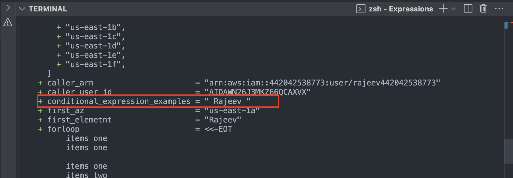
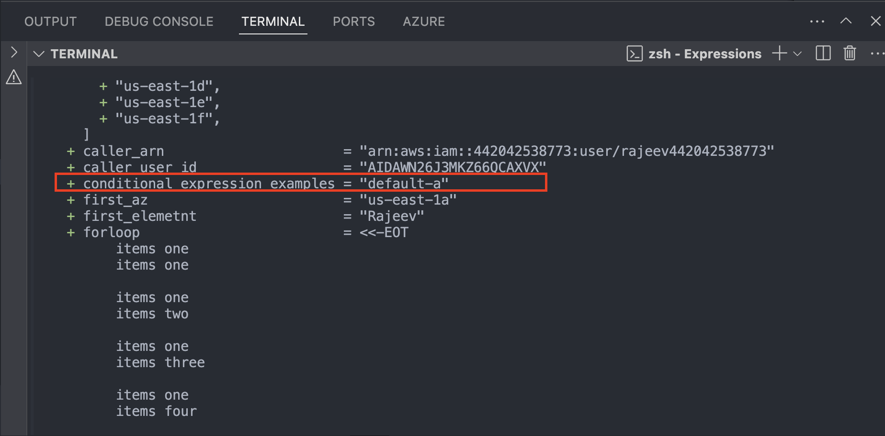

# Conditional Expressions

A _conditional expression_ uses the value of a boolean expression to select one of
two values.

> **Hands-on:** Try the [Create Dynamic Expressions](/terraform/tutorials/configuration-language/expressions?utm_source=WEBSITE&utm_medium=WEB_IO&utm_offer=ARTICLE_PAGE&utm_content=DOCS) tutorial.

## Syntax

The syntax of a conditional expression is as follows:

```hcl
condition ? true_val : false_val
```

If `condition` is `true` then the result is `true_val`. If `condition` is
`false` then the result is `false_val`.

A common use of conditional expressions is to define defaults to replace
invalid values:

```hcl
var.a == "" ? "default-a" : var.a
```

`Example`

```hcl
output "conditional_expression_examples" {
  description = "A common use of conditional expressions is to define defaults to replace invalid values:"
  value = trimspace(var.name) == "" ? "default-a" : var.name
  # If var.a is an empty string then the result is "default-a", but otherwise it is the actual value of var.a.


}
```




---

If `var.a` is an empty string then the result is `"default-a"`, but otherwise
it is the actual value of `var.a`.



## Conditions

The condition can be any expression that resolves to a boolean value. This will
usually be an expression that uses the equality, comparison, or logical
operators.

### Custom Condition Checks

You can create conditions that produce custom error messages for several types of objects in a configuration. For example, you can add a condition to an input variable that checks whether incoming image IDs are formatted properly.

Custom conditions can help capture assumptions, helping future maintainers understand the configuration design and intent. They also return useful information about errors earlier and in context, helping consumers more easily diagnose issues in their configurations.

Refer to [Custom Condition Checks](/terraform/language/expressions/custom-conditions#input-variable-validation) for details.

## Result Types

The two result values may be of any type, but they must both
be of the _same_ type so that Terraform can determine what type the whole
conditional expression will return without knowing the condition value.

If the two result expressions don't produce the same type then Terraform will
attempt to find a type that they can both convert to, and make those
conversions automatically if so.

For example, the following expression is valid and will always return a string,
because in Terraform all numbers can convert automatically to a string using
decimal digits:

```hcl
var.example ? 12 : "hello"
```

Relying on this automatic conversion behavior can be confusing for those who
are not familiar with Terraform's conversion rules though, so we recommend
being explicit using type conversion functions in any situation where there may
be some uncertainty about the expected result type.

The following example is contrived because it would be easier to write the
constant `"12"` instead of the type conversion in this case, but shows how to
use [`tostring`](/terraform/language/functions/tostring) to explicitly convert a number to
a string.

```hcl
var.example ? tostring(12) : "hello"
```
