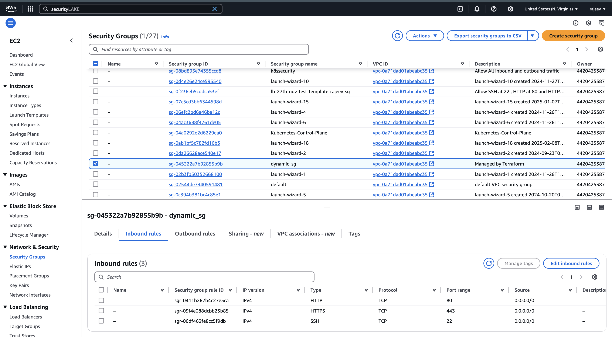

# **Dynamic Blocks in Terraform**

## **Introduction**

Terraform **dynamic blocks** allow you to generate nested configuration blocks dynamically. This is useful when dealing with repeated configurations that vary based on input variables, making your code more concise and maintainable.

---

## **Why Use Dynamic Blocks?**

- **Avoid Repetition**: Reduces manual duplication of similar blocks.
- **Parameterization**: Creates blocks dynamically based on input data.
- **Scalability**: Helps manage infrastructure changes efficiently.

---

## **Syntax of Dynamic Blocks**

A **`dynamic` block** follows this structure:

```hcl
dynamic "block_name" {
  for_each = some_list_or_map

  content {
    # Attributes inside the block
    attribute = each.value["key"]
  }
}
```

### **Components:**

- `"block_name"` → The name of the block to generate dynamically.
- `for_each` → List or map that Terraform loops over.
- `content {}` → Defines the content of the dynamically created block.
- `each.value["key"]` → Access values from the list or map.

---

## **Example 1: Dynamic Security Group Rules in AWS**

```hcl
variable "ingress_rules" {
  type = list(object({
    port        = number
    protocol    = string
    cidr_blocks = list(string)
  }))
  default = [
    { port = 22, protocol = "tcp", cidr_blocks = ["0.0.0.0/0"] },
    { port = 80, protocol = "tcp", cidr_blocks = ["0.0.0.0/0"] },
    { port = 443, protocol = "tcp", cidr_blocks = ["0.0.0.0/0"] }
  ]
}

resource "aws_security_group" "example" {
  name = "dynamic-sg"

  dynamic "ingress" {
    for_each = var.ingress_rules

    content {
      from_port   = ingress.value.port
      to_port     = ingress.value.port
      protocol    = ingress.value.protocol
      cidr_blocks = ingress.value.cidr_blocks
    }
  }
}
```

`Output:`


### **How It Works:**

- Iterates over `var.ingress_rules`.
- Dynamically generates `ingress` rules based on the input list.

---

## **Example 2: Dynamic EBS Volumes for an EC2 Instance**

```hcl
variable "ebs_volumes" {
  type = list(object({
    device_name = string
    volume_size = number
  }))
  default = [
    { device_name = "/dev/sdf", volume_size = 10 },
    { device_name = "/dev/sdg", volume_size = 20 }
  ]
}

resource "aws_instance" "example" {
  ami           = "ami-12345678"
  instance_type = "t2.micro"

  dynamic "ebs_block_device" {
    for_each = var.ebs_volumes

    content {
      device_name = ebs_block_device.value.device_name
      volume_size = ebs_block_device.value.volume_size
    }
  }
}
```

### **How It Works:**

- Loops through `var.ebs_volumes` and dynamically creates **EBS volumes**.

---

## **Example 3: Dynamic Tags in AWS Resources**

```hcl
variable "tags" {
  type = map(string)
  default = {
    Environment = "Dev"
    Project     = "Terraform-Demo"
  }
}

resource "aws_instance" "example" {
  ami           = "ami-12345678"
  instance_type = "t2.micro"

  tags = {
    for key, value in var.tags : key => value
  }
}
```

### **How It Works:**

- Uses a Terraform `for` loop inside the `tags` block.
- Dynamically applies tags from the `tags` variable.

---

## **Example 4: Dynamic Provisioner Block**

```hcl
variable "commands" {
  type = list(string)
  default = ["echo 'Hello, World!'", "uptime"]
}

resource "aws_instance" "example" {
  ami           = "ami-12345678"
  instance_type = "t2.micro"

  provisioner "remote-exec" {
    inline = [
      for command in var.commands : command
    ]
  }
}
```

### **How It Works:**

- Loops through `var.commands` and executes them dynamically.

---

## **Key Takeaways**

- **Use dynamic blocks for repeatable nested configurations**.
- **Eliminate unnecessary repetition** with `for_each`.
- **Improves maintainability and scalability**.
- **Common use cases**: AWS Security Groups, EBS Volumes, Tags, and Provisioners.
