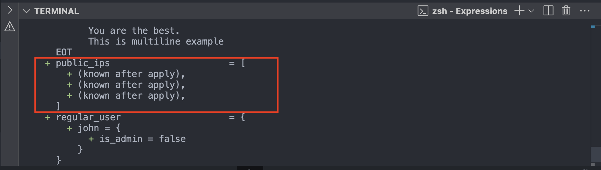
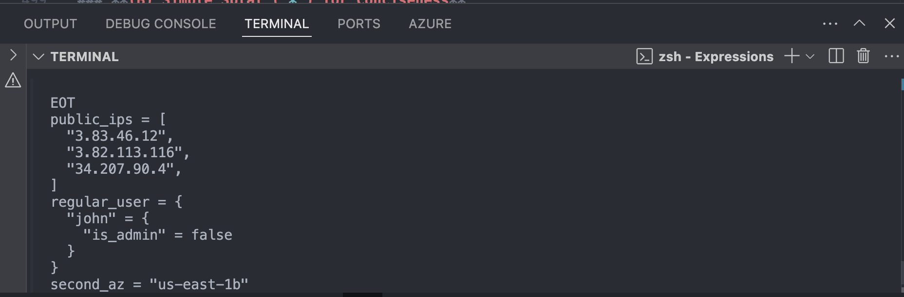
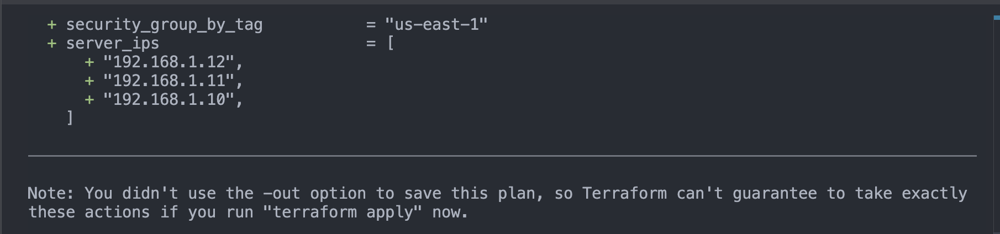

# **Splat Expressions in Terraform**

Splat expressions in Terraform (`*` and `[*]`) allow for concise and efficient extraction of values from lists, maps, and other complex structures. They help simplify expressions when dealing with multiple instances of a resource or module.

---

## **1. Types of Splat Expressions**

### **(A) Full Splat (`[*]`)**

- Used for extracting specific attributes from each element of a list or set.
- Returns a **list** of values.

### **(B) Simple Splat (`*`)**

- A shorthand version of `[*]`.
- Terraform automatically expands the expression to a list.

---

## **2. Examples of Splat Expressions**

### **(A) Full Splat (`[*]`) in Resource Attributes**

When dealing with multiple instances of a resource, you can use splat expressions to extract attributes from all instances.

#### **Example 1: Extracting Public IPs from Multiple AWS Instances**

```hcl
resource "aws_instance" "web" {
  count         = 3
  ami          = "ami-12345678"
  instance_type = "t2.micro"
}

output "public_ips" {
  value = aws_instance.web[*].public_ip
}
```

`Example`

```hcl
# splat Expression
# Examples of Splat Expressions
# (A) Full Splat ([*]) in Resource Attributes
resource "aws_instance" "webapp" {
  count = 3 # Creates 3 instances
  ami = data.aws_ami.ubuntu.id
  instance_type = "t2.micro"
}
output "public_ips" {
  description = "List all the public IPs if instance which name starts from web[*]"
  value = aws_instance.webapp[*].public_ip
}
```

> **RUN** `terrafom validate` and `terraform plan`

`Output`

```sh
terraform plan
data.aws_availability_zones.available: Reading...
data.aws_security_groups.find-sg-by-tag: Reading...
data.aws_caller_identity.current: Reading...
data.aws_security_group.find-by-name: Reading...
data.aws_ami.ubuntu: Reading...
data.aws_caller_identity.current: Read complete after 0s [id=442042538773]
data.aws_security_group.find-by-name: Read complete after 1s [id=sg-0f147807f26d8036b]
data.aws_availability_zones.available: Read complete after 2s [id=us-east-1]
data.aws_security_groups.find-sg-by-tag: Read complete after 2s [id=us-east-1]
data.aws_ami.ubuntu: Read complete after 2s [id=ami-07f9449c0b700566e]

Terraform used the selected providers to generate the following execution plan. Resource actions are
indicated with the following symbols:
  + create

Terraform will perform the following actions:

  # aws_instance.myapp_server will be created
  + resource "aws_instance" "myapp_server" {
      + ami                                  = "ami-07f9449c0b700566e"
      + arn                                  = (known after apply)
      + associate_public_ip_address          = (known after apply)
      + availability_zone                    = (known after apply)
      + cpu_core_count                       = (known after apply)
      + cpu_threads_per_core                 = (known after apply)
      + disable_api_stop                     = (known after apply)
      + disable_api_termination              = (known after apply)
      + ebs_optimized                        = (known after apply)
      + enable_primary_ipv6                  = (known after apply)
      + get_password_data                    = false
      + host_id                              = (known after apply)
      + host_resource_group_arn              = (known after apply)
      + iam_instance_profile                 = (known after apply)
      + id                                   = (known after apply)
      + instance_initiated_shutdown_behavior = (known after apply)
      + instance_lifecycle                   = (known after apply)
      + instance_state                       = (known after apply)
      + instance_type                        = "t2.micro"
      + ipv6_address_count                   = (known after apply)
      + ipv6_addresses                       = (known after apply)
      + key_name                             = (known after apply)
      + monitoring                           = (known after apply)
      + outpost_arn                          = (known after apply)
      + password_data                        = (known after apply)
      + placement_group                      = (known after apply)
      + placement_partition_number           = (known after apply)
      + primary_network_interface_id         = (known after apply)
      + private_dns                          = (known after apply)
      + private_ip                           = (known after apply)
      + public_dns                           = (known after apply)
      + public_ip                            = (known after apply)
      + secondary_private_ips                = (known after apply)
      + security_groups                      = [
          + "us-east-1",
        ]
      + source_dest_check                    = true
      + spot_instance_request_id             = (known after apply)
      + subnet_id                            = (known after apply)
      + tags                                 = {
          + "Name" = "myapp_server"
        }
      + tags_all                             = {
          + "Name" = "myapp_server"
        }
      + tenancy                              = (known after apply)
      + user_data                            = (known after apply)
      + user_data_base64                     = (known after apply)
      + user_data_replace_on_change          = false
      + vpc_security_group_ids               = (known after apply)

      + capacity_reservation_specification (known after apply)

      + cpu_options (known after apply)

      + ebs_block_device (known after apply)

      + enclave_options (known after apply)

      + ephemeral_block_device (known after apply)

      + instance_market_options (known after apply)

      + maintenance_options (known after apply)

      + metadata_options (known after apply)

      + network_interface (known after apply)

      + private_dns_name_options (known after apply)

      + root_block_device (known after apply)
    }

  # aws_instance.webapp[0] will be created
  + resource "aws_instance" "webapp" {
      + ami                                  = "ami-07f9449c0b700566e"
      + arn                                  = (known after apply)
      + associate_public_ip_address          = (known after apply)
      + availability_zone                    = (known after apply)
      + cpu_core_count                       = (known after apply)
      + cpu_threads_per_core                 = (known after apply)
      + disable_api_stop                     = (known after apply)
      + disable_api_termination              = (known after apply)
      + ebs_optimized                        = (known after apply)
      + enable_primary_ipv6                  = (known after apply)
      + get_password_data                    = false
      + host_id                              = (known after apply)
      + host_resource_group_arn              = (known after apply)
      + iam_instance_profile                 = (known after apply)
      + id                                   = (known after apply)
      + instance_initiated_shutdown_behavior = (known after apply)
      + instance_lifecycle                   = (known after apply)
      + instance_state                       = (known after apply)
      + instance_type                        = "t2.micro"
      + ipv6_address_count                   = (known after apply)
      + ipv6_addresses                       = (known after apply)
      + key_name                             = (known after apply)
      + monitoring                           = (known after apply)
      + outpost_arn                          = (known after apply)
      + password_data                        = (known after apply)
      + placement_group                      = (known after apply)
      + placement_partition_number           = (known after apply)
      + primary_network_interface_id         = (known after apply)
      + private_dns                          = (known after apply)
      + private_ip                           = (known after apply)
      + public_dns                           = (known after apply)
      + public_ip                            = (known after apply)
      + secondary_private_ips                = (known after apply)
      + security_groups                      = (known after apply)
      + source_dest_check                    = true
      + spot_instance_request_id             = (known after apply)
      + subnet_id                            = (known after apply)
      + tags_all                             = (known after apply)
      + tenancy                              = (known after apply)
      + user_data                            = (known after apply)
      + user_data_base64                     = (known after apply)
      + user_data_replace_on_change          = false
      + vpc_security_group_ids               = (known after apply)

      + capacity_reservation_specification (known after apply)

      + cpu_options (known after apply)

      + ebs_block_device (known after apply)

      + enclave_options (known after apply)

      + ephemeral_block_device (known after apply)

      + instance_market_options (known after apply)

      + maintenance_options (known after apply)

      + metadata_options (known after apply)

      + network_interface (known after apply)

      + private_dns_name_options (known after apply)

      + root_block_device (known after apply)
    }

  # aws_instance.webapp[1] will be created
  + resource "aws_instance" "webapp" {
      + ami                                  = "ami-07f9449c0b700566e"
      + arn                                  = (known after apply)
      + associate_public_ip_address          = (known after apply)
      + availability_zone                    = (known after apply)
      + cpu_core_count                       = (known after apply)
      + cpu_threads_per_core                 = (known after apply)
      + disable_api_stop                     = (known after apply)
      + disable_api_termination              = (known after apply)
      + ebs_optimized                        = (known after apply)
      + enable_primary_ipv6                  = (known after apply)
      + get_password_data                    = false
      + host_id                              = (known after apply)
      + host_resource_group_arn              = (known after apply)
      + iam_instance_profile                 = (known after apply)
      + id                                   = (known after apply)
      + instance_initiated_shutdown_behavior = (known after apply)
      + instance_lifecycle                   = (known after apply)
      + instance_state                       = (known after apply)
      + instance_type                        = "t2.micro"
      + ipv6_address_count                   = (known after apply)
      + ipv6_addresses                       = (known after apply)
      + key_name                             = (known after apply)
      + monitoring                           = (known after apply)
      + outpost_arn                          = (known after apply)
      + password_data                        = (known after apply)
      + placement_group                      = (known after apply)
      + placement_partition_number           = (known after apply)
      + primary_network_interface_id         = (known after apply)
      + private_dns                          = (known after apply)
      + private_ip                           = (known after apply)
      + public_dns                           = (known after apply)
      + public_ip                            = (known after apply)
      + secondary_private_ips                = (known after apply)
      + security_groups                      = (known after apply)
      + source_dest_check                    = true
      + spot_instance_request_id             = (known after apply)
      + subnet_id                            = (known after apply)
      + tags_all                             = (known after apply)
      + tenancy                              = (known after apply)
      + user_data                            = (known after apply)
      + user_data_base64                     = (known after apply)
      + user_data_replace_on_change          = false
      + vpc_security_group_ids               = (known after apply)

      + capacity_reservation_specification (known after apply)

      + cpu_options (known after apply)

      + ebs_block_device (known after apply)

      + enclave_options (known after apply)

      + ephemeral_block_device (known after apply)

      + instance_market_options (known after apply)

      + maintenance_options (known after apply)

      + metadata_options (known after apply)

      + network_interface (known after apply)

      + private_dns_name_options (known after apply)

      + root_block_device (known after apply)
    }

  # aws_instance.webapp[2] will be created
  + resource "aws_instance" "webapp" {
      + ami                                  = "ami-07f9449c0b700566e"
      + arn                                  = (known after apply)
      + associate_public_ip_address          = (known after apply)
      + availability_zone                    = (known after apply)
      + cpu_core_count                       = (known after apply)
      + cpu_threads_per_core                 = (known after apply)
      + disable_api_stop                     = (known after apply)
      + disable_api_termination              = (known after apply)
      + ebs_optimized                        = (known after apply)
      + enable_primary_ipv6                  = (known after apply)
      + get_password_data                    = false
      + host_id                              = (known after apply)
      + host_resource_group_arn              = (known after apply)
      + iam_instance_profile                 = (known after apply)
      + id                                   = (known after apply)
      + instance_initiated_shutdown_behavior = (known after apply)
      + instance_lifecycle                   = (known after apply)
      + instance_state                       = (known after apply)
      + instance_type                        = "t2.micro"
      + ipv6_address_count                   = (known after apply)
      + ipv6_addresses                       = (known after apply)
      + key_name                             = (known after apply)
      + monitoring                           = (known after apply)
      + outpost_arn                          = (known after apply)
      + password_data                        = (known after apply)
      + placement_group                      = (known after apply)
      + placement_partition_number           = (known after apply)
      + primary_network_interface_id         = (known after apply)
      + private_dns                          = (known after apply)
      + private_ip                           = (known after apply)
      + public_dns                           = (known after apply)
      + public_ip                            = (known after apply)
      + secondary_private_ips                = (known after apply)
      + security_groups                      = (known after apply)
      + source_dest_check                    = true
      + spot_instance_request_id             = (known after apply)
      + subnet_id                            = (known after apply)
      + tags_all                             = (known after apply)
      + tenancy                              = (known after apply)
      + user_data                            = (known after apply)
      + user_data_base64                     = (known after apply)
      + user_data_replace_on_change          = false
      + vpc_security_group_ids               = (known after apply)

      + capacity_reservation_specification (known after apply)

      + cpu_options (known after apply)

      + ebs_block_device (known after apply)

      + enclave_options (known after apply)

      + ephemeral_block_device (known after apply)

      + instance_market_options (known after apply)

      + maintenance_options (known after apply)

      + metadata_options (known after apply)

      + network_interface (known after apply)

      + private_dns_name_options (known after apply)

      + root_block_device (known after apply)
    }

Plan: 4 to add, 0 to change, 0 to destroy.

Changes to Outputs:
  + account_id                      = "442042538773"
  + admin_users                     = {
      + rajeev = {
          + is_admin = true
        }
    }
  + aws_ami                         = "ami-07f9449c0b700566e"
  + aws_availability_zones          = [
      + "us-east-1a",
      + "us-east-1b",
      + "us-east-1c",
      + "us-east-1d",
      + "us-east-1e",
      + "us-east-1f",
    ]
  + caller_arn                      = "arn:aws:iam::442042538773:user/rajeev442042538773"
  + caller_user_id                  = "AIDAWN26J3MKZ66QCAXVX"
  + conditional_expression_examples = "default-a"
  + filtering_example_output        = [
      + "FIRST_ELEMENT",
      + " ",
      + "TWO",
      + " ",
      + "THREE",
      + " ",
      + "FOUR",
      + " ",
      + "LAST_ELEMENT",
    ]
  + first_az                        = "us-east-1a"
  + first_elemetnt                  = "Rajeev"
  + for_expressions_example         = [
      + "ONE",
      + "TWO",
      + "THREE",
      + "FOUR",
      + "FIVE",
    ]
  + for_expressions_example_curly   = {
      + first  = "ONE"
      + fourth = "FOUR"
      + last   = "FIVE"
      + second = "TWO"
      + third  = "THREE"
    }
  + forloop                         = <<-EOT
        items one
        items one

        items one
        items two

        items one
        items three

        items one
        items four

        items one
        items five
    EOT
  + function_call_example           = <<-EOT
        The minimum value in this list is : 1

        List of Values:

        values: 1

        values: 2

        values: 3

        values: 4

        values: 5


        Another way to find min of list is:
        Minimum value of the given list is: 1
    EOT
  + greeting                        = "Hello,   "
  + heredocs_string                 = <<-EOT
        hello
        Rajeev
    EOT
  + heredocs_string1                = <<-EOT
        Hello
          world
    EOT
  + ifelse                          = "Hello,   !"
  + multiline_example               = <<-EOT
        Hello,   !
        You are the best.
        This is multiline example
    EOT
  + multiline_example1              = <<-EOT
        Hello,   !
          You are the best.
          This is multiline example
    EOT
  + public_ips                      = [
      + (known after apply),
      + (known after apply),
      + (known after apply),
    ]
  + regular_user                    = {
      + john = {
          + is_admin = false
        }
    }
  + second_az                       = "us-east-1b"
  + second_element                  = "Singh"
  + security_group_by_name          = "sg-0f147807f26d8036b"
  + security_group_by_tag           = "us-east-1"

─────────────────────────────────────────────────────────────────────────────────────────────────────

Note: You didn't use the -out option to save this plan, so Terraform can't guarantee to take exactly
these actions if you run "terraform apply" now.
```


`terraform apply -auto-approve`

```sh
terraform apply -auto-approve
data.aws_ami.ubuntu: Reading...
data.aws_caller_identity.current: Reading...
data.aws_security_group.find-by-name: Reading...
data.aws_security_groups.find-sg-by-tag: Reading...
data.aws_availability_zones.available: Reading...
data.aws_caller_identity.current: Read complete after 1s [id=442042538773]
data.aws_availability_zones.available: Read complete after 2s [id=us-east-1]
data.aws_security_group.find-by-name: Read complete after 2s [id=sg-0f147807f26d8036b]
data.aws_security_groups.find-sg-by-tag: Read complete after 2s [id=us-east-1]
data.aws_ami.ubuntu: Read complete after 3s [id=ami-07f9449c0b700566e]
aws_instance.webapp[1]: Refreshing state... [id=i-07c39772425743fe3]
aws_instance.webapp[2]: Refreshing state... [id=i-0cf284d4804ce6458]
aws_instance.webapp[0]: Refreshing state... [id=i-0dbc1a3852876f62d]

No changes. Your infrastructure matches the configuration.

Terraform has compared your real infrastructure against your configuration and found no differences,
so no changes are needed.

Apply complete! Resources: 0 added, 0 changed, 0 destroyed.

Outputs:

account_id = "442042538773"
admin_users = {
  "rajeev" = {
    "is_admin" = true
  }
}
aws_ami = "ami-07f9449c0b700566e"
aws_availability_zones = tolist([
  "us-east-1a",
  "us-east-1b",
  "us-east-1c",
  "us-east-1d",
  "us-east-1e",
  "us-east-1f",
])
caller_arn = "arn:aws:iam::442042538773:user/tf-user"
caller_user_id = "AIDAWN26J3MKZLUCNMU34"
conditional_expression_examples = "default-a"
filtering_example_output = [
  "FIRST_ELEMENT",
  " ",
  "TWO",
  " ",
  "THREE",
  " ",
  "FOUR",
  " ",
  "LAST_ELEMENT",
]
first_az = "us-east-1a"
first_elemetnt = "Rajeev"
for_expressions_example = [
  "ONE",
  "TWO",
  "THREE",
  "FOUR",
  "FIVE",
]
for_expressions_example_curly = {
  "first" = "ONE"
  "fourth" = "FOUR"
  "last" = "FIVE"
  "second" = "TWO"
  "third" = "THREE"
}
forloop = <<EOT

items one
items one

items one
items two

items one
items three

items one
items four

items one
items five


EOT
function_call_example = <<EOT
The minimum value in this list is : 1

List of Values:

values: 1

values: 2

values: 3

values: 4

values: 5


Another way to find min of list is:
Minimum value of the given list is: 1


EOT
greeting = "Hello,   "
heredocs_string = <<EOT
hello
Rajeev

EOT
heredocs_string1 = <<EOT
  Hello
  world

EOT
ifelse = "Hello,   !"
multiline_example = <<EOT
Hello,   !
You are the best.
This is multiline example

EOT
multiline_example1 = <<EOT
  Hello,   !
  You are the best.
  This is multiline example

EOT
public_ips = [
  "3.83.46.12",
  "3.82.113.116",
  "34.207.90.4",
]
regular_user = {
  "john" = {
    "is_admin" = false
  }
}
second_az = "us-east-1b"
second_element = "Singh"
security_group_by_name = "sg-0f147807f26d8036b"
security_group_by_tag = "us-east-1"
```



---

**Explanation:**

- `aws_instance.web[*].public_ip` extracts the `public_ip` of all instances and returns a list.
- Output might be: `public_ips = [
  "3.83.46.12",
  "3.82.113.116",
  "34.207.90.4",
]`.

---

### **(B) Simple Splat (`*`) for Conciseness**

A simpler way to achieve the same result is by using `*` without brackets.

#### **Example 2: Extracting Instance IDs**

```hcl
output "instance_ids" {
  value = aws_instance.web.*.id
}
```

**Explanation:**

- `aws_instance.web.*.id` extracts all instance IDs.
- Equivalent to `aws_instance.web[*].id`.
- Output: `["i-0abc123", "i-0def456", "i-0ghi789"]`.

---

### **(C) Using Splat Expressions in Maps**

Splat expressions can be applied to maps when used in combination with `values()`.

#### **Example 3: Extracting Values from a Map**

```hcl
variable "servers" {
  default = {
    web  = "192.168.1.10"
    db   = "192.168.1.11"
    cache = "192.168.1.12"
  }
}

output "server_ips" {
  value = values(var.servers)
}
```

> **Output** of `terraform plan`

```sh

```



---

**Explanation:**

- `values(var.servers)` returns all values as a list: `["192.168.1.10", "192.168.1.11", "192.168.1.12"]`.

---

### **(D) Combining Splat Expressions with Other Functions**

Splat expressions can be combined with functions like `join()`.

#### **Example 4: Joining All Security Group IDs**

```hcl
resource "aws_security_group" "sg" {
  count = 2
  name  = "sg-${count.index}"
}

output "sg_ids" {
  value = join(",", aws_security_group.sg[*].id)
}
```

**Explanation:**

- `aws_security_group.sg[*].id` extracts all IDs.
- `join(",", ...)` converts the list into a single string.

---

## **3. Summary Table**

| Type          | Syntax                 | Example                        | Output         |
| ------------- | ---------------------- | ------------------------------ | -------------- |
| Full Splat    | `[*]`                  | `aws_instance.web[*].id`       | List of IDs    |
| Simple Splat  | `*`                    | `aws_instance.web.*.public_ip` | List of IPs    |
| Map Values    | `values(map_variable)` | `values(var.servers)`          | List of values |
| Joining Lists | `join(",", list)`      | `join(",", aws_sg.sg[*].id)`   | Single string  |

---

## **Conclusion**

Splat expressions simplify the extraction of multiple values from lists, sets, and maps in Terraform. Whether using full (`[*]`) or simple (`*`) splat syntax, they make configurations more readable and reduce the need for complex loops.

Would you like any modifications or additional examples? 🚀
