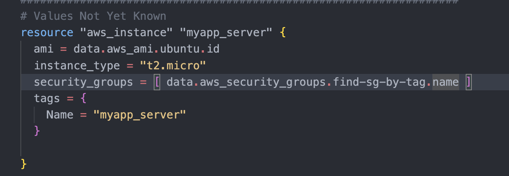

1. Error: Inconsistent dependency lock file
   The following dependency selections recorded in the lock file are inconsistent with the current
   │ configuration:
   │ - provider registry.terraform.io/hashicorp/aws: required by this configuration but no version is selected
   │
   │ To make the initial dependency selections that will initialize the dependency lock file, run:
   │ terraform init

---


---

2. Error: Reference to undeclared resource
   on main.tf line 170, in resource "aws_instance" "myapp_server":
   │ 170: security_groups = [ data.aws_security_groups.find-by-name.name ]
   │
   │ A data resource "aws_security_groups" "find-by-name" has not been declared in the root module.

---


`Solution`


---

3. Error: Unsupported attribute
   on main.tf line 170, in resource "aws_instance" "myapp_server":
   │ 170: security_groups = [ data.aws_security_groups.find-sg-by-tag.name ]
   │
   │ This object has no argument, nested block, or exported attribute named "name".

`Solution`

# Possible Reasons for the Error

1. Incorrect Attribute Reference – The aws_security_groups data source returns a list, so accessing .name directly is incorrect.
2. Wrong Data Source Usage – You might have meant to use aws_security_group (singular) instead of aws_security_groups (plural).

---

4. Error: Missing newline after argument
   Error: Missing newline after argument
   │
   │ on main.tf line 210, in output "for_expressions_example":
   │ 210: value = for s in var.for_expression_list : uppercase
   │
   │ An argument definition must end with a newline.

---

5. Error: Invalid 'for' expression
   on main.tf line 218, in output "for_expressions_example_curly":
   │ 218: value = {for i in var.var.for_expression_list : upper(i)}
   │
   │ Key expression is required when building an object.

`Solution`
`current_code`

```hcl
variable "for_expression_list" {
  description = "List of string"
  type = list(string)
  default = ["one", "two", "three", "four", "five"]
}

output "for_expressions_example_curly" {
  value = {for i in var.var.for_expression_list : upper(i)}
}

```

`Now add key value in  variable block`

```hcl

# With Curly brackets represent object
variable "for_expression_object" {
  description = "List of objects"
  type = list(object({
    first  = string
    second = string
    third  = string
    fourth = string
    last   = string
  }))
  default = [{
    first = "one"
    second = "two"
    third ="three"
    fourth =  "four"
    last= "five"
    }]
}
# with {} bracket
output "for_expressions_example_curly" {
  value = {for k, v  in var.for_expression_object[0] : k => upper(v)}

}
```


---

6. Error: Invalid default value for variable
   │
   │ on dynamic_blocks.tf line 9, in variable "ingress_rules":
   │ 9: default = [
   │ 10: {port = 22, prtocol = "tcp", cidr_blocks = [ "0.0.0.0/0" ]},
   │ 11: {port = 80, prtocol = "tcp", cidr_blocks = [ "0.0.0.0/0" ]},
   │ 12: {port = 443, prtocol = "tcp", cidr_blocks = [ "0.0.0.0/0" ]}
   │ 13: ]
   │
   │ This default value is not compatible with the variable's type constraint: element 0: attribute
   │ "protocol" is required.
   `Solution`
   > The error persists because the typo "prtocol" is still present in your default values. The attribute name should be "protocol" instead of "prtocol".
   > `Fixed Code`

```hcl

variable "ingress_rules" {
  type = list(object({
    port        = number
    protocol    = string  # Corrected attribute name
    cidr_blocks = list(string)
  }))

  default = [
    { port = 22, protocol = "tcp", cidr_blocks = ["0.0.0.0/0"] },
    { port = 80, protocol = "tcp", cidr_blocks = ["0.0.0.0/0"] },
    { port = 443, protocol = "tcp", cidr_blocks = ["0.0.0.0/0"] }
  ]
}

resource "aws_security_group" "ssh_http_https" {
  name = "dynamic_sg"
  dynamic "ingress" {
    for_each = var.ingress_rules
    content {
      from_port   = ingress.value.port
      to_port     = ingress.value.port
      protocol    = ingress.value.protocol  # Refers correctly to 'protocol'
      cidr_blocks = ingress.value.cidr_blocks
    }
  }
}

```

---

7.
