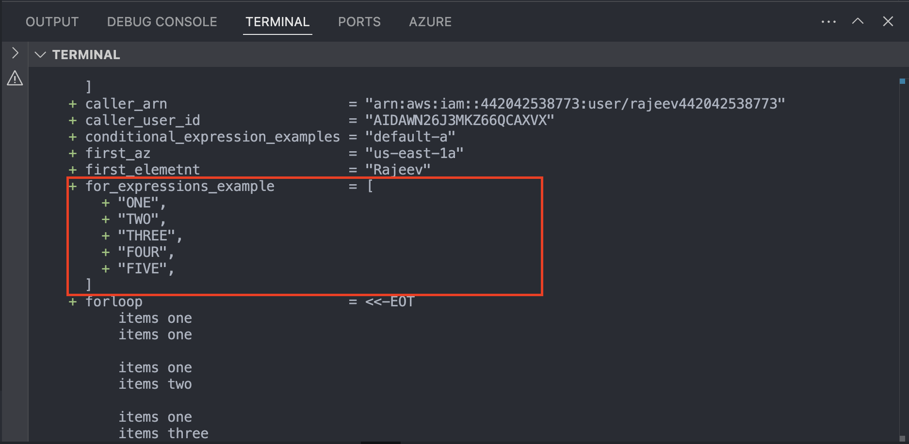
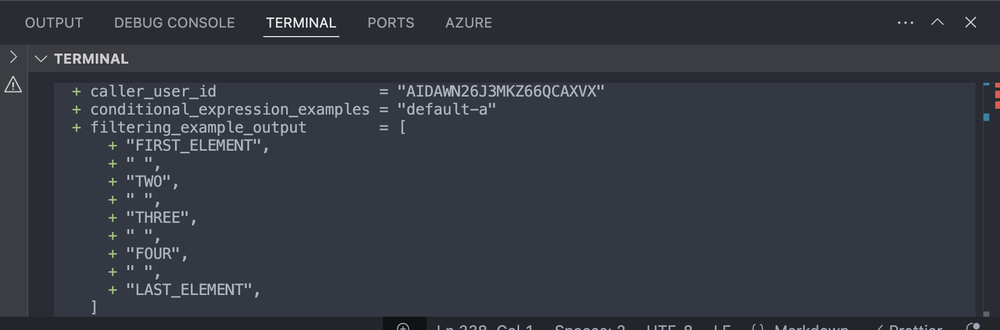
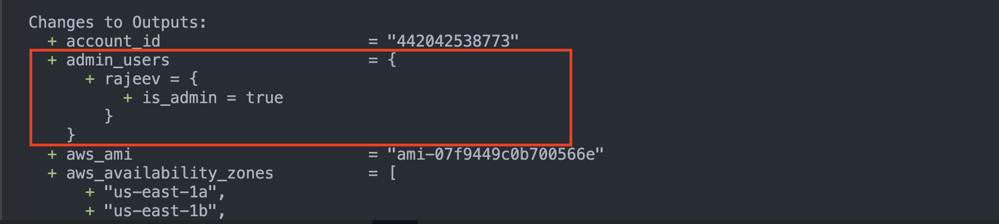
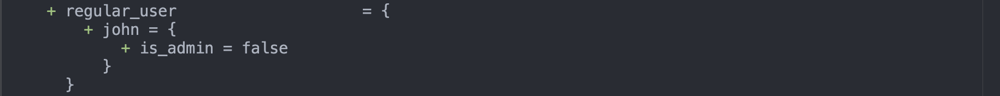

# `for` Expressions

A _`for` expression_ creates a complex type value by transforming
another complex type value. Each element in the input value
can correspond to either one or zero values in the result, and an arbitrary
expression can be used to transform each input element into an output element.

For example, if `var.list` were a list of strings, then the following expression
would produce a tuple of strings with all-uppercase letters:

```hcl
[for s in var.list : upper(s)]
```

`Example`

```hcl
variable "for_expression_list" {
  description = "List of string"
  type = list(string)
  default = ["one", "two", "three", "four", "five"]
}

# For example, if var.list were a list of strings, then the following expression would produce a tuple of strings with all-uppercase letters:
output "for_expressions_example" {
  description = "if var.list were a list of strings, then the following expression would produce a tuple of strings with all-uppercase letters"
  value = [for s in var.for_expression_list : upper(s)]


}
```

`Output`


---

This `for` expression iterates over each element of `var.list`, and then
evaluates the expression `upper(s)` with `s` set to each respective element.
It then builds a new tuple value with all of the results of executing that
expression in the same order.

## Input Types

A `for` expression's input (given after the `in` keyword) can be a list,
a set, a tuple, a map, or an object.

The above example showed a `for` expression with only a single temporary
symbol `s`, but a `for` expression can optionally declare a pair of temporary
symbols in order to use the key or index of each item too:

```hcl
[for k, v in var.map : length(k) + length(v)]
```

For a map or object type, like above, the `k` symbol refers to the key or
attribute name of the current element. You can also use the two-symbol form
with lists and tuples, in which case the additional symbol is the index
of each element starting from zero, which conventionally has the symbol name
`i` or `idx` unless it's helpful to choose a more specific name:

```hcl
[for i, v in var.list : "${i} is ${v}"]
```

The index or key symbol is always optional. If you specify only a single
symbol after the `for` keyword then that symbol will always represent the
_value_ of each element of the input collection.

## Result Types

The type of brackets around the `for` expression decide what type of result
it produces.

The above example uses `[` and `]`, which produces a tuple. If you use `{` and
`}` instead, the result is an object and you must provide two result
expressions that are separated by the `=>` symbol:

```hcl
{for s in var.list : s => upper(s)}
```

This expression produces an object whose attributes are the original elements
from `var.list` and their corresponding values are the uppercase versions.
For example, the resulting value might be as follows:

```hcl
{
  foo = "FOO"
  bar = "BAR"
  baz = "BAZ"
}
```

A `for` expression alone can only produce either an object value or a tuple
value, but Terraform's automatic type conversion rules mean that you can
typically use the results in locations where lists, maps, and sets are expected.

## Filtering Elements

A `for` expression can also include an optional `if` clause to filter elements
from the source collection, producing a value with fewer elements than
the source value:

```hcl
[for s in var.list : upper(s) if s != ""]
```

`Example`

```hcl
##### Filtering Elements#####
variable "filtering_element" {
  description = "for expression can also include an optional if clause to filter elements from the source collection, producing a value with fewer elements than the source value:"
  type = list(string)
  default = ["First_element"," ", "Two"," ", "Three"," ", "Four"," ", "Last_element"]
}

output "filtering_example_output" {
  description = "value"
  value = [for i in var.filtering_element: upper(i) if i != ""]

}
```

`Output`

```sh
terraform plan
data.aws_security_group.find-by-name: Reading...
data.aws_availability_zones.available: Reading...
data.aws_ami.ubuntu: Reading...
data.aws_security_groups.find-sg-by-tag: Reading...
data.aws_caller_identity.current: Reading...
data.aws_caller_identity.current: Read complete after 0s [id=442042538773]
data.aws_availability_zones.available: Read complete after 2s [id=us-east-1]
data.aws_security_group.find-by-name: Read complete after 2s [id=sg-0f147807f26d8036b]
data.aws_security_groups.find-sg-by-tag: Read complete after 2s [id=us-east-1]
data.aws_ami.ubuntu: Read complete after 3s [id=ami-07f9449c0b700566e]

Terraform used the selected providers to generate the following execution plan. Resource actions are
indicated with the following symbols:
  + create

Terraform will perform the following actions:

  # aws_instance.myapp_server will be created
  + resource "aws_instance" "myapp_server" {
      + ami                                  = "ami-07f9449c0b700566e"
      + arn                                  = (known after apply)
      + associate_public_ip_address          = (known after apply)
      + availability_zone                    = (known after apply)
      + cpu_core_count                       = (known after apply)
      + cpu_threads_per_core                 = (known after apply)
      + disable_api_stop                     = (known after apply)
      + disable_api_termination              = (known after apply)
      + ebs_optimized                        = (known after apply)
      + enable_primary_ipv6                  = (known after apply)
      + get_password_data                    = false
      + host_id                              = (known after apply)
      + host_resource_group_arn              = (known after apply)
      + iam_instance_profile                 = (known after apply)
      + id                                   = (known after apply)
      + instance_initiated_shutdown_behavior = (known after apply)
      + instance_lifecycle                   = (known after apply)
      + instance_state                       = (known after apply)
      + instance_type                        = "t2.micro"
      + ipv6_address_count                   = (known after apply)
      + ipv6_addresses                       = (known after apply)
      + key_name                             = (known after apply)
      + monitoring                           = (known after apply)
      + outpost_arn                          = (known after apply)
      + password_data                        = (known after apply)
      + placement_group                      = (known after apply)
      + placement_partition_number           = (known after apply)
      + primary_network_interface_id         = (known after apply)
      + private_dns                          = (known after apply)
      + private_ip                           = (known after apply)
      + public_dns                           = (known after apply)
      + public_ip                            = (known after apply)
      + secondary_private_ips                = (known after apply)
      + security_groups                      = [
          + "us-east-1",
        ]
      + source_dest_check                    = true
      + spot_instance_request_id             = (known after apply)
      + subnet_id                            = (known after apply)
      + tags                                 = {
          + "Name" = "myapp_server"
        }
      + tags_all                             = {
          + "Name" = "myapp_server"
        }
      + tenancy                              = (known after apply)
      + user_data                            = (known after apply)
      + user_data_base64                     = (known after apply)
      + user_data_replace_on_change          = false
      + vpc_security_group_ids               = (known after apply)

      + capacity_reservation_specification (known after apply)

      + cpu_options (known after apply)

      + ebs_block_device (known after apply)

      + enclave_options (known after apply)

      + ephemeral_block_device (known after apply)

      + instance_market_options (known after apply)

      + maintenance_options (known after apply)

      + metadata_options (known after apply)

      + network_interface (known after apply)

      + private_dns_name_options (known after apply)

      + root_block_device (known after apply)
    }

Plan: 1 to add, 0 to change, 0 to destroy.

Changes to Outputs:
  + account_id                      = "442042538773"
  + aws_ami                         = "ami-07f9449c0b700566e"
  + aws_availability_zones          = [
      + "us-east-1a",
      + "us-east-1b",
      + "us-east-1c",
      + "us-east-1d",
      + "us-east-1e",
      + "us-east-1f",
    ]
  + caller_arn                      = "arn:aws:iam::442042538773:user/rajeev442042538773"
  + caller_user_id                  = "AIDAWN26J3MKZ66QCAXVX"
  + conditional_expression_examples = "default-a"
  + filtering_example_output        = [
      + "FIRST_ELEMENT",
      + " ",
      + "TWO",
      + " ",
      + "THREE",
      + " ",
      + "FOUR",
      + " ",
      + "LAST_ELEMENT",
    ]
  + first_az                        = "us-east-1a"
  + first_elemetnt                  = "Rajeev"
  + for_expressions_example         = [
      + "ONE",
      + "TWO",
      + "THREE",
      + "FOUR",
      + "FIVE",
    ]
  + for_expressions_example_curly   = {
      + first  = "ONE"
      + fourth = "FOUR"
      + last   = "FIVE"
      + second = "TWO"
      + third  = "THREE"
    }
  + forloop                         = <<-EOT
        items one
        items one

        items one
        items two

        items one
        items three

        items one
        items four

        items one
        items five
    EOT
  + function_call_example           = <<-EOT
        The minimum value in this list is : 1

        List of Values:

        values: 1

        values: 2

        values: 3

        values: 4

        values: 5


        Another way to find min of list is:
        Minimum value of the given list is: 1
    EOT
  + greeting                        = "Hello,   "
  + heredocs_string                 = <<-EOT
        hello
        Rajeev
    EOT
  + heredocs_string1                = <<-EOT
        Hello
          world
    EOT
  + ifelse                          = "Hello,   !"
  + multiline_example               = <<-EOT
        Hello,   !
        You are the best.
        This is multiline example
    EOT
  + multiline_example1              = <<-EOT
        Hello,   !
          You are the best.
          This is multiline example
    EOT
  + second_az                       = "us-east-1b"
  + second_element                  = "Singh"
  + security_group_by_name          = "sg-0f147807f26d8036b"
  + security_group_by_tag           = "us-east-1"

─────────────────────────────────────────────────────────────────────────────────────────────────────

Note: You didn't use the -out option to save this plan, so Terraform can't guarantee to take exactly
these actions if you run "terraform apply" now.
```



---

One common reason for filtering collections in `for` expressions is to split
a single source collection into two separate collections based on some
criteria. For example, if the input `var.users` is a map of objects where the
objects each have an attribute `is_admin` then you may wish to produce separate
maps with admin vs non-admin objects:

```hcl
variable "users" {
  type = map(object({
    is_admin = bool
  }))
}

locals {
  admin_users = {
    for name, user in var.users : name => user
    if user.is_admin
  }
  regular_users = {
    for name, user in var.users : name => user
    if !user.is_admin
  }
}
```

---

`Example`

```sh
main.tf
```

```hcl

# type =  map(object({is_admin =bool}))
variable "users" {
  type = map(object({
    is_admin = bool
  }))
}
  locals {
    admin_users = {
      for name, user in var.users : name => user
      if user.is_admin
    }
    regular_user = {
      for name, user in var.users : name => user
      if !user.is_admin
    }

  }

  output "admin_users" {
    description = "if the input var.users is a map of objects where the objects each have an attribute is_admin then you may wish to produce separate maps with admin vs non-admin objects"
    value = local.admin_users

  }
  output "regular_user" {
    description = "Get regular users"
    value = local.regular_user

  }

```

---

```sh
terraform.tfvars
```

```hcl
users = {
  "rajeev" = {
    is_admin = true
  }
  "john" = {
    is_admin = false
  }
}

```

`Output:`

```sh
terraform plan
data.aws_availability_zones.available: Reading...
data.aws_security_group.find-by-name: Reading...
data.aws_caller_identity.current: Reading...
data.aws_ami.ubuntu: Reading...
data.aws_security_groups.find-sg-by-tag: Reading...
data.aws_caller_identity.current: Read complete after 0s [id=442042538773]
data.aws_availability_zones.available: Read complete after 2s [id=us-east-1]
data.aws_security_groups.find-sg-by-tag: Read complete after 2s [id=us-east-1]
data.aws_security_group.find-by-name: Read complete after 2s [id=sg-0f147807f26d8036b]
data.aws_ami.ubuntu: Read complete after 4s [id=ami-07f9449c0b700566e]

Terraform used the selected providers to generate the following execution plan. Resource actions are
indicated with the following symbols:
  + create

Terraform will perform the following actions:

  # aws_instance.myapp_server will be created
  + resource "aws_instance" "myapp_server" {
      + ami                                  = "ami-07f9449c0b700566e"
      + arn                                  = (known after apply)
      + associate_public_ip_address          = (known after apply)
      + availability_zone                    = (known after apply)
      + cpu_core_count                       = (known after apply)
      + cpu_threads_per_core                 = (known after apply)
      + disable_api_stop                     = (known after apply)
      + disable_api_termination              = (known after apply)
      + ebs_optimized                        = (known after apply)
      + enable_primary_ipv6                  = (known after apply)
      + get_password_data                    = false
      + host_id                              = (known after apply)
      + host_resource_group_arn              = (known after apply)
      + iam_instance_profile                 = (known after apply)
      + id                                   = (known after apply)
      + instance_initiated_shutdown_behavior = (known after apply)
      + instance_lifecycle                   = (known after apply)
      + instance_state                       = (known after apply)
      + instance_type                        = "t2.micro"
      + ipv6_address_count                   = (known after apply)
      + ipv6_addresses                       = (known after apply)
      + key_name                             = (known after apply)
      + monitoring                           = (known after apply)
      + outpost_arn                          = (known after apply)
      + password_data                        = (known after apply)
      + placement_group                      = (known after apply)
      + placement_partition_number           = (known after apply)
      + primary_network_interface_id         = (known after apply)
      + private_dns                          = (known after apply)
      + private_ip                           = (known after apply)
      + public_dns                           = (known after apply)
      + public_ip                            = (known after apply)
      + secondary_private_ips                = (known after apply)
      + security_groups                      = [
          + "us-east-1",
        ]
      + source_dest_check                    = true
      + spot_instance_request_id             = (known after apply)
      + subnet_id                            = (known after apply)
      + tags                                 = {
          + "Name" = "myapp_server"
        }
      + tags_all                             = {
          + "Name" = "myapp_server"
        }
      + tenancy                              = (known after apply)
      + user_data                            = (known after apply)
      + user_data_base64                     = (known after apply)
      + user_data_replace_on_change          = false
      + vpc_security_group_ids               = (known after apply)

      + capacity_reservation_specification (known after apply)

      + cpu_options (known after apply)

      + ebs_block_device (known after apply)

      + enclave_options (known after apply)

      + ephemeral_block_device (known after apply)

      + instance_market_options (known after apply)

      + maintenance_options (known after apply)

      + metadata_options (known after apply)

      + network_interface (known after apply)

      + private_dns_name_options (known after apply)

      + root_block_device (known after apply)
    }

Plan: 1 to add, 0 to change, 0 to destroy.

Changes to Outputs:
  + account_id                      = "442042538773"
  + admin_users                     = {
      + rajeev = {
          + is_admin = true
        }
    }
  + aws_ami                         = "ami-07f9449c0b700566e"
  + aws_availability_zones          = [
      + "us-east-1a",
      + "us-east-1b",
      + "us-east-1c",
      + "us-east-1d",
      + "us-east-1e",
      + "us-east-1f",
    ]
  + caller_arn                      = "arn:aws:iam::442042538773:user/rajeev442042538773"
  + caller_user_id                  = "AIDAWN26J3MKZ66QCAXVX"
  + conditional_expression_examples = "default-a"
  + filtering_example_output        = [
      + "FIRST_ELEMENT",
      + " ",
      + "TWO",
      + " ",
      + "THREE",
      + " ",
      + "FOUR",
      + " ",
      + "LAST_ELEMENT",
    ]
  + first_az                        = "us-east-1a"
  + first_elemetnt                  = "Rajeev"
  + for_expressions_example         = [
      + "ONE",
      + "TWO",
      + "THREE",
      + "FOUR",
      + "FIVE",
    ]
  + for_expressions_example_curly   = {
      + first  = "ONE"
      + fourth = "FOUR"
      + last   = "FIVE"
      + second = "TWO"
      + third  = "THREE"
    }
  + forloop                         = <<-EOT
        items one
        items one

        items one
        items two

        items one
        items three

        items one
        items four

        items one
        items five
    EOT
  + function_call_example           = <<-EOT
        The minimum value in this list is : 1

        List of Values:

        values: 1

        values: 2

        values: 3

        values: 4

        values: 5


        Another way to find min of list is:
        Minimum value of the given list is: 1
    EOT
  + greeting                        = "Hello,   "
  + heredocs_string                 = <<-EOT
        hello
        Rajeev
    EOT
  + heredocs_string1                = <<-EOT
        Hello
          world
    EOT
  + ifelse                          = "Hello,   !"
  + multiline_example               = <<-EOT
        Hello,   !
        You are the best.
        This is multiline example
    EOT
  + multiline_example1              = <<-EOT
        Hello,   !
          You are the best.
          This is multiline example
    EOT
  + regular_user                    = {
      + john = {
          + is_admin = false
        }
    }
  + second_az                       = "us-east-1b"
  + second_element                  = "Singh"
  + security_group_by_name          = "sg-0f147807f26d8036b"
  + security_group_by_tag           = "us-east-1"

─────────────────────────────────────────────────────────────────────────────────────────────────────

Note: You didn't use the -out option to save this plan, so Terraform can't guarantee to take exactly
these actions if you run "terraform apply" now.
```




---

## Element Ordering

Because `for` expressions can convert from unordered types (maps, objects, sets)
to ordered types (lists, tuples), Terraform must choose an implied ordering
for the elements of an unordered collection.

For maps and objects, Terraform sorts the elements by key or attribute name,
using lexical sorting.

For sets of strings, Terraform sorts the elements by their value, using
lexical sorting.

For sets of other types, Terraform uses an arbitrary ordering that may change in future versions. We recommend converting the expression result into a set to make it clear elsewhere in the configuration that the result is unordered. You can use [the `toset` function](/terraform/language/functions/toset)
to concisely convert a `for` expression result to be of a set type.

```hcl
toset([for e in var.set : e.example])
```

---

# **Element Ordering in Terraform**

Element ordering in Terraform refers to **how Terraform processes and maintains the order of elements** in different types of collections (lists, sets, maps, and objects). Understanding element ordering is crucial when working with expressions, loops, and transformations in Terraform.

---

## **1️⃣ Lists (Ordered)**

A **list** in Terraform maintains the order of elements. When you retrieve values from a list, they appear in the same sequence as they were defined.

### **Example: List Preserving Order**

```hcl
variable "ordered_list" {
  type    = list(string)
  default = ["apple", "banana", "cherry"]
}

output "list_output" {
  value = var.ordered_list
}
```

### **Output:**

```
list_output = [
  "apple",
  "banana",
  "cherry"
]
```

➡ **Lists always maintain the order** in which elements were declared.

---

## **2️⃣ Sets (Unordered)**

A **set** in Terraform is an unordered collection of unique values. Terraform does not maintain the order of elements in a set.

### **Example: Set with Unordered Elements**

```hcl
variable "unordered_set" {
  type    = set(string)
  default = ["apple", "banana", "cherry"]
}

output "set_output" {
  value = var.unordered_set
}
```

### **Possible Output (Order is NOT Guaranteed)**

```
set_output = [
  "cherry",
  "banana",
  "apple"
]
```

➡ **Sets automatically remove duplicates** and do **not** preserve order.

---

## **3️⃣ Maps (Unordered)**

A **map** in Terraform is a collection of key-value pairs. Maps do **not guarantee any specific order**, as they are meant for lookup operations rather than sequential access.

### **Example: Map with Key-Value Pairs**

```hcl
variable "user_roles" {
  type = map(string)
  default = {
    "alice"  = "admin"
    "bob"    = "user"
    "charlie" = "moderator"
  }
}

output "map_output" {
  value = var.user_roles
}
```

### **Possible Output (Order is NOT Guaranteed)**

```
map_output = {
  "bob" = "user"
  "alice" = "admin"
  "charlie" = "moderator"
}
```

➡ **Maps do not maintain the order** in which keys were defined.

---

## **4️⃣ Objects (Key-Value Ordered by Definition)**

An **object** in Terraform behaves similarly to a map but follows the order in which attributes were defined.

### **Example: Object with Ordered Attributes**

```hcl
variable "user_info" {
  type = object({
    name     = string
    age      = number
    is_admin = bool
  })
  default = {
    name     = "Rajeev"
    age      = 30
    is_admin = true
  }
}

output "object_output" {
  value = var.user_info
}
```

### **Output (Order Maintained by Definition)**

```
object_output = {
  "name"     = "Rajeev"
  "age"      = 30
  "is_admin" = true
}
```

➡ **Objects keep the order in which attributes were defined in the type.**

---

## **5️⃣ Ordering in `for` Expressions**

When using `for` loops, the ordering behavior depends on the data type:

- **Lists keep order**.
- **Sets and maps do not guarantee order**.

### **Example: Looping Over a List (Maintains Order)**

```hcl
variable "fruits" {
  type    = list(string)
  default = ["mango", "orange", "grape"]
}

output "ordered_fruits" {
  value = [for fruit in var.fruits : upper(fruit)]
}
```

### **Output:**

```
ordered_fruits = [
  "MANGO",
  "ORANGE",
  "GRAPE"
]
```

✅ **Order is preserved in lists.**

---

### **Example: Looping Over a Map (Order Not Guaranteed)**

```hcl
variable "user_roles" {
  type = map(string)
  default = {
    "alice"  = "admin"
    "bob"    = "user"
    "charlie" = "moderator"
  }
}

output "role_list" {
  value = [for user, role in var.user_roles : "${user} is ${role}"]
}
```

### **Possible Output (Order is NOT Guaranteed)**

```
role_list = [
  "bob is user",
  "alice is admin",
  "charlie is moderator"
]
```

❌ **Maps do not maintain a specific order.**

---

## **🔹 Key Takeaways**

| **Collection Type**         | **Ordering Behavior**                   |
| --------------------------- | --------------------------------------- |
| **List (`list`)**           | ✅ Ordered (Maintains insertion order)  |
| **Set (`set`)**             | ❌ Unordered (No guaranteed order)      |
| **Map (`map`)**             | ❌ Unordered (No guaranteed order)      |
| **Object (`object`)**       | ✅ Ordered by attribute definition      |
| **For Expressions (`for`)** | ✅ List: Ordered, ❌ Map/Set: Unordered |

---

## **🚀 Summary**

1. **Use `list` if you need to maintain order.**
2. **Use `set` if order doesn’t matter but uniqueness does.**
3. **Use `map` for key-value pairs, but don’t rely on order.**
4. **Objects keep attribute order, unlike maps.**
5. **For loops maintain order for lists but not for sets/maps.**

This knowledge helps you **structure your Terraform code correctly** and **avoid unexpected behavior** when working with ordered vs. unordered collections. 🚀😊

## Grouping Results

If the result type is an object (using `{` and `}` delimiters) then normally
the given key expression must be unique across all elements in the result,
or Terraform will return an error.

Sometimes the resulting keys are _not_ unique, and so to support that situation
Terraform supports a special _grouping mode_ which changes the result to support
multiple elements per key.

To activate grouping mode, add the symbol `...` after the value expression.
For example:

```hcl
variable "users" {
  type = map(object({
    role = string
  }))
}

locals {
  users_by_role = {
    for name, user in var.users : user.role => name...
  }
}
```

The above represents a situation where a module expects a map describing
various users who each have a single "role", where the map keys are usernames.
The usernames are guaranteed unique because they are map keys in the input,
but many users may all share a single role name.

The `local.users_by_role` expression inverts the input map so that the keys
are the role names and the values are usernames, but the expression is in
grouping mode (due to the `...` after `name`) and so the result will be a
map of lists of strings, such as the following:

```hcl
{
  "admin": [
    "ps",
  ],
  "maintainer": [
    "am",
    "jb",
    "kl",
    "ma",
  ],
  "viewer": [
    "st",
    "zq",
  ],
}
```

Due to [the element ordering rules](#element-ordering), Terraform will sort
the users lexically by username as part of evaluating the `for` expression,
and so the usernames associated with each role will be lexically sorted
after grouping.

---

# **Grouping Results in Terraform**

Grouping results in Terraform allows you to structure and categorize collections such as lists, sets, and maps based on shared attributes. This is particularly useful when organizing resources dynamically.

---

## **Methods of Grouping Results**

### **1️⃣ Using `for` Expressions with Conditional Filtering**

Terraform allows `for` expressions to iterate over a collection and group elements into different categories based on conditions.

#### **Example: Grouping Users by Admin Role**

```hcl
variable "users" {
  type = map(object({
    is_admin = bool
  }))
  default = {
    "Alice"  = { is_admin = true }
    "Bob"    = { is_admin = false }
    "Charlie"= { is_admin = true }
    "David"  = { is_admin = false }
  }
}

locals {
  admin_users = {
    for name, user in var.users : name => user
    if user.is_admin
  }

  regular_users = {
    for name, user in var.users : name => user
    if !user.is_admin
  }
}

output "admin_users" {
  value = local.admin_users
}

output "regular_users" {
  value = local.regular_users
}
```

### **Output:**

```
admin_users = {
  "Alice"  = { is_admin = true }
  "Charlie"= { is_admin = true }
}

regular_users = {
  "Bob"   = { is_admin = false }
  "David" = { is_admin = false }
}
```

✅ **Explanation:**

- The `for` expression filters users into two groups:
  - `admin_users`: Users with `is_admin = true`
  - `regular_users`: Users with `is_admin = false`

---

### **2️⃣ Grouping Elements Using `group_by()` (Terraform 1.5+)**

Terraform 1.5 introduced `group_by()`, which simplifies grouping elements dynamically.

#### **Example: Grouping Resources by Type**

```hcl
variable "resources" {
  type = list(object({
    name = string
    type = string
  }))
  default = [
    { name = "server1", type = "compute" },
    { name = "db1", type = "database" },
    { name = "server2", type = "compute" },
    { name = "cache1", type = "cache" }
  ]
}

output "grouped_resources" {
  value = group_by(var.resources, r -> r.type)
}
```

### **Output:**

```
grouped_resources = {
  "compute" = [
    { name = "server1", type = "compute" },
    { name = "server2", type = "compute" }
  ]
  "database" = [
    { name = "db1", type = "database" }
  ]
  "cache" = [
    { name = "cache1", type = "cache" }
  ]
}
```

✅ **Explanation:**

- The `group_by()` function organizes resources based on their `type` attribute.
- The result is a map where each key is a resource type, and the value is a list of resources of that type.

---

## **3️⃣ Grouping Objects by a Custom Attribute**

Sometimes, you need to group objects based on a specific attribute dynamically.

#### **Example: Categorizing Employees by Department**

```hcl
variable "employees" {
  type = list(object({
    name       = string
    department = string
  }))
  default = [
    { name = "Alice", department = "IT" },
    { name = "Bob", department = "HR" },
    { name = "Charlie", department = "IT" },
    { name = "David", department = "Finance" }
  ]
}

output "grouped_employees" {
  value = group_by(var.employees, e -> e.department)
}
```

### **Output:**

```
grouped_employees = {
  "IT" = [
    { name = "Alice", department = "IT" },
    { name = "Charlie", department = "IT" }
  ]
  "HR" = [
    { name = "Bob", department = "HR" }
  ]
  "Finance" = [
    { name = "David", department = "Finance" }
  ]
}
```

✅ **Explanation:**

- The `group_by()` function groups employees by their `department` field.
- The output contains departments as keys and lists of employees under each department.

---

## **🔹 Key Takeaways**

| **Method**                              | **Best Use Case**                                           |
| --------------------------------------- | ----------------------------------------------------------- |
| **For expressions with `if` filtering** | When grouping elements into different collections manually. |
| **`group_by()` (Terraform 1.5+)**       | When dynamically categorizing elements based on attributes. |
| **Nested Loops & Filtering**            | When complex conditions need to be applied.                 |

### **🚀 Summary**

1. **Use `for` expressions for basic grouping and filtering.**
2. **Leverage `group_by()` for structured grouping (Terraform 1.5+).**
3. **Grouping helps in structuring outputs and improving readability.**

This knowledge will help you efficiently organize and manage Terraform data structures! 🚀

## Repeated Configuration Blocks

The `for` expressions mechanism is for constructing collection values from
other collection values within expressions, which you can then assign to
individual resource arguments that expect complex values.

Some resource types also define _nested block types_, which typically represent
separate objects that belong to the containing resource in some way. You can't
dynamically generate nested blocks using `for` expressions, but you _can_
generate nested blocks for a resource dynamically using
[`dynamic` blocks](/terraform/language/expressions/dynamic-blocks).
