# Terraform Basic Commands

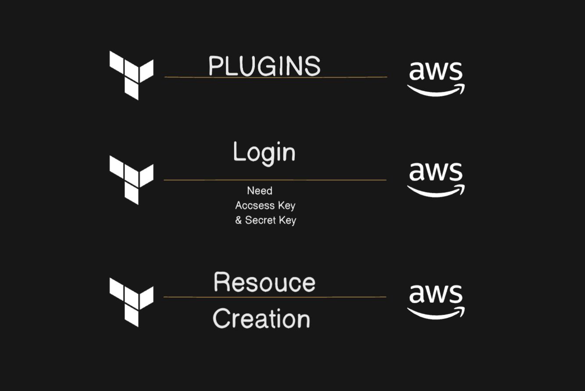

# Providers

- A provider is responsible for understanding API interactions and exposing resources.
- If an API is available, you can create a Provider.
- A Provider uses a plugin.
- In order to make a provider available on Terraform, we need to make a "<mark>terraform init</maek>"
- <mark>terraform init</mark>: This command download any plugin we need for our provider.

# Terraform Init

- terraform init command is used to initialize a working directory containing terraform configuration files.
- It is safe to run this commands multiple times
- This command will never delete your existing configuration or state.
- During init, the root configuration directory is consulted for Backend configuration and the choosen backend is initialized using given configuration settings.

# Terraform Plan

- Terraform plan command is used to create an execution plan.
- Terraform perform refresh, unless explicitly disabled and then determine what actions are necessary to achieve the desired state specifies in the Configuration file.

# Trraform Validate

- The terraform validate command validate the configuration file in a directory, refering only to the configuration and not accessing any remote services such as remote state, provider APIs etc.
- Validate run checks that verify that whether configuration syntactically valid and internally consistent, regardless of any provided variables or existing state.
- It is thus useful in general verification of reusable modules including correctness of attribute names and values type.

# Terraform Apply

- Terraform apply command is used to apply the changes required to reach the desired state of the configuration or the predetermine set of actions generated by a terraform plan execution plan.

# Terraform Destroy

- The terraform destroy command is used to destroy the terraform manages infrastructure.

# HCL Syntax

- HCL syntax is basic and should be radable by those familier
  with other scripting languages
- It has 3 parts
  1. Blocks: Block group expressions, arguments and other blocks into a labelable structure, which external block can then reference. It's curly bracket syntax is shared by most object oriented languages.
  2. Arguments: Arguments are an abstraction that enable it admin to assign values to descriptive names, which can represent or compute values. They can be simple, such as string or numeric values, or more complicated such as arithmatic or logical experssions.
  3. Expressions: Expressions either represent or compute values. They can be simple such as arithmatic or logical expressions.

```

<BLOCK-TYPE> "<BLOCL-LABEL>" "<RESOURCE-LOCAL-NAME>"
{
   <IDENTIFIER> = <EXPRESSION>
}

```

EX -

```

resource "aws-instance" "s1"
{
ami = "ami-id"
key-name = "keyname"
instance_type = "t2-micro"
}
```

#

```
cd ~/Documents/learning-terraform/AWS TERRAFORM/terraform-example/day01-04-02-2025
```

```
vim file1.tf
```

## [Terraform AWS Provider](https://registry.terraform.io/providers/hashicorp/aws/latest/docs)

Use the Amazon Web Services (AWS) provider to interact with the many resources supported by AWS.

```
terraform {
  required_providers {
    aws = {
      source  = "hashicorp/aws"
      version = "~> 5.0"
    }
  }
}

```

```
terraform init
```

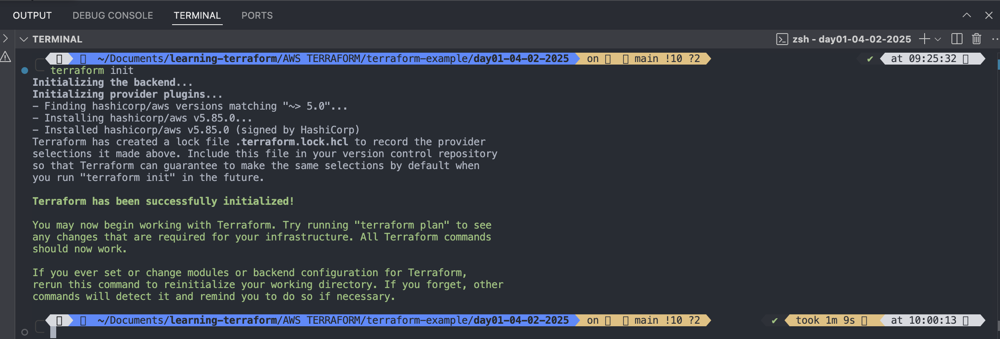

#

```
ls -a
```

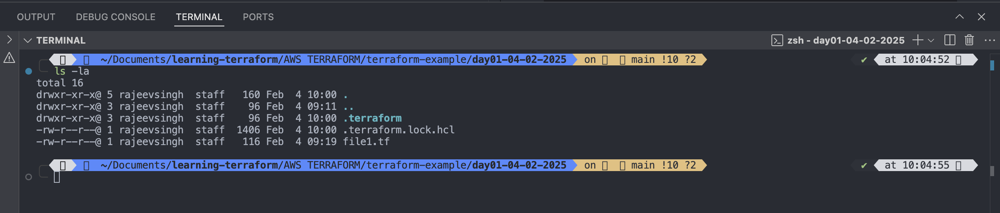

#

```
terraform plan
```

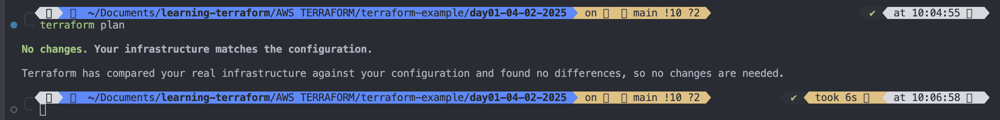

#

# Configure the AWS provider

```
provider "aws" {
  region     = "us-east-1"
  access_key = "access_key"
  secret_key = "secret_key"
}

```

```
terraform plan
```

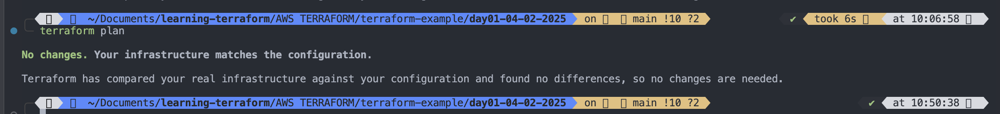

#

```
terraform apply
```

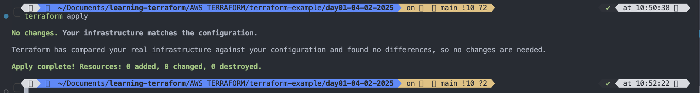

#

# Let's launch an EC2 instance with terraform

ami id - ami-0c614dee691cbbf37
Instance type - t2.micro
Key pair name - rajeev-ubuntu-server-key
instance-name = created-by-terraform

```
resource "aws_instance" "created-by-terraform" {
  ami           = "ami-0c614dee691cbbf37"
  instance_type = "t2.micro"
  key_name = "rajeev-ubuntu-server-key"

  tags = {
    Name = "terraform"
  }
}

```

```
terraform validate

```

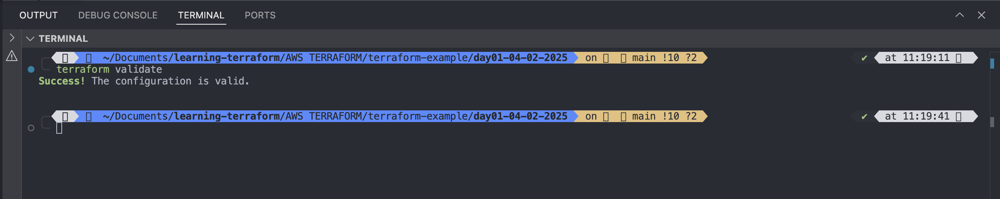

#

```
terraform plan
```

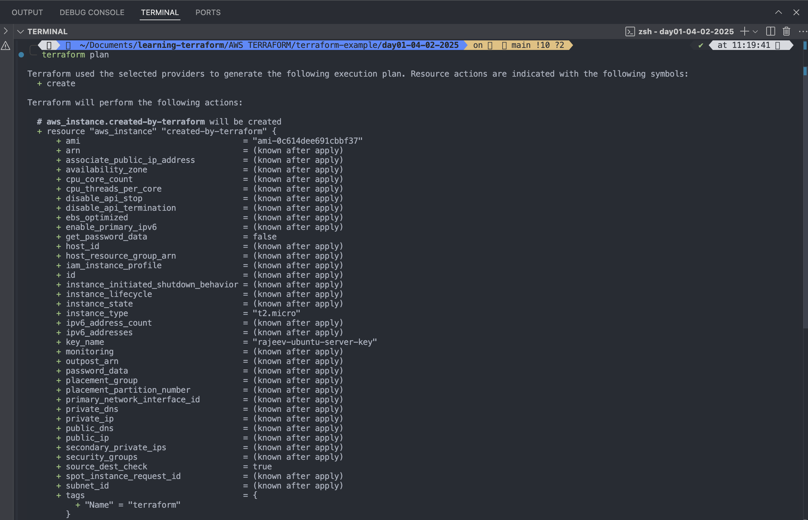
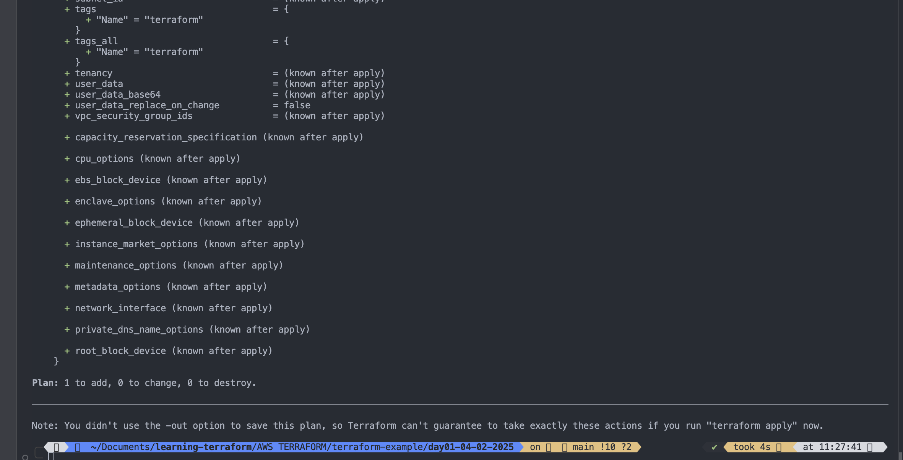

#

```
terraform apply
```

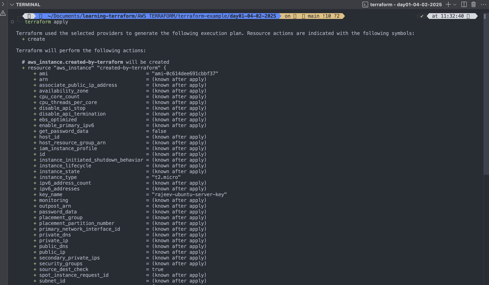
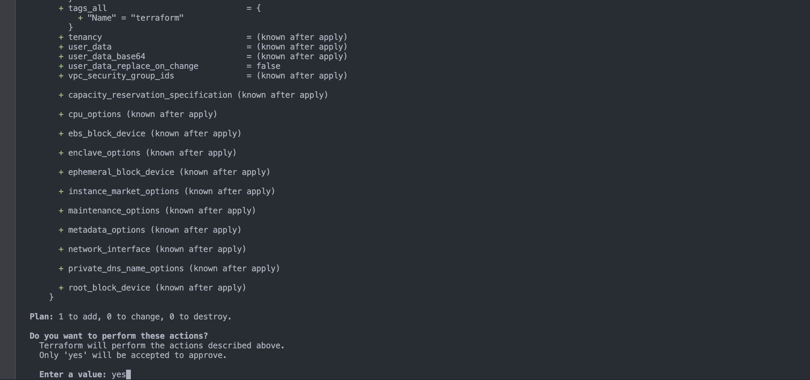
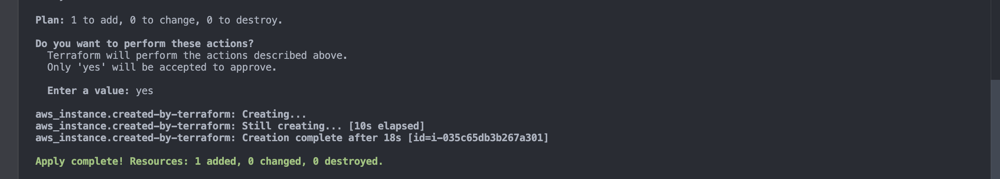
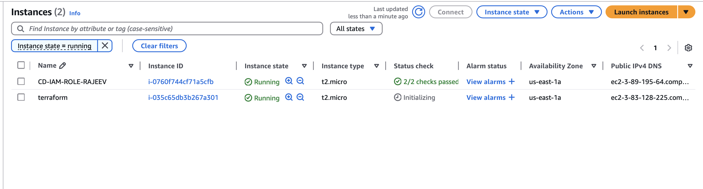

#

```
terraform destroy
```

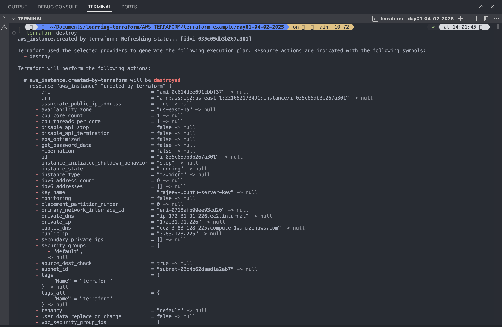
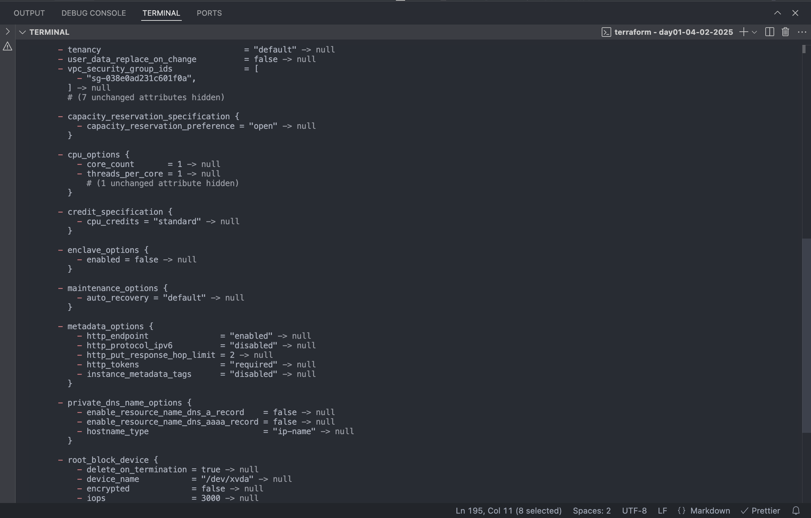
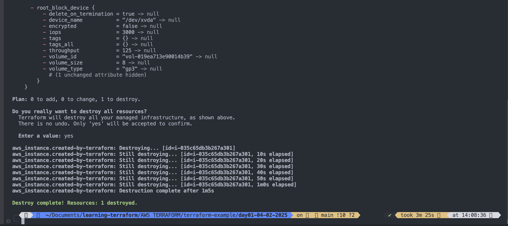
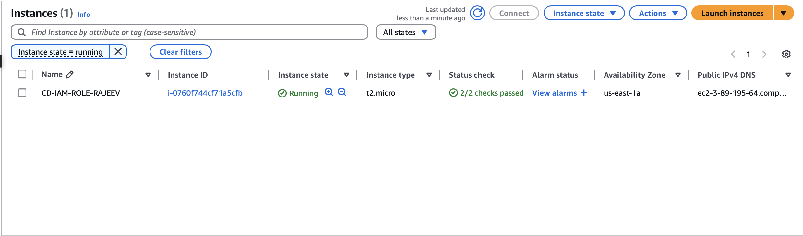

#
