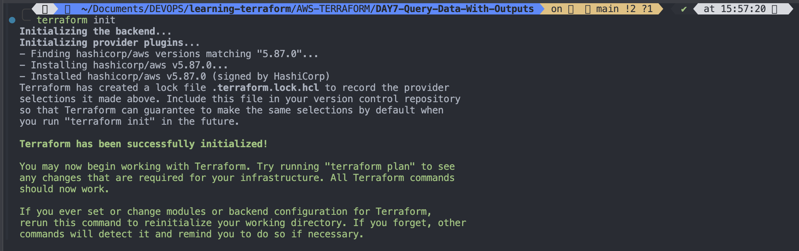
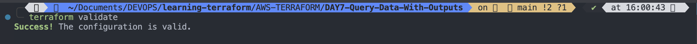
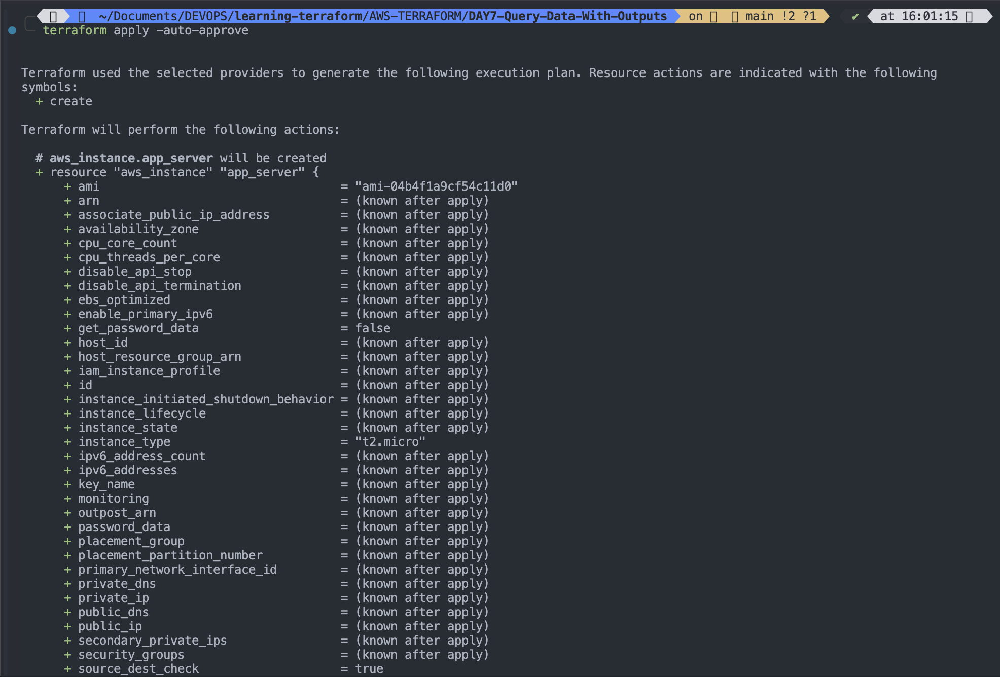
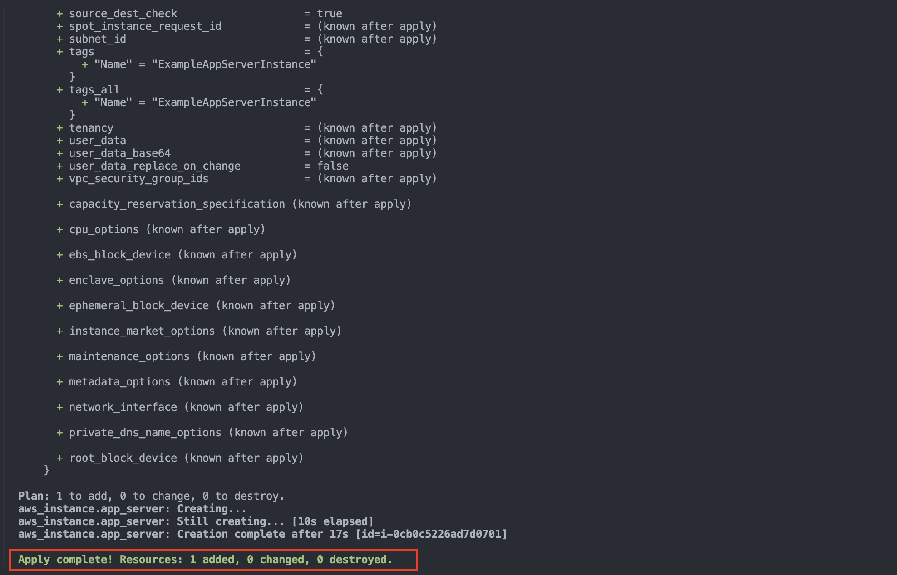
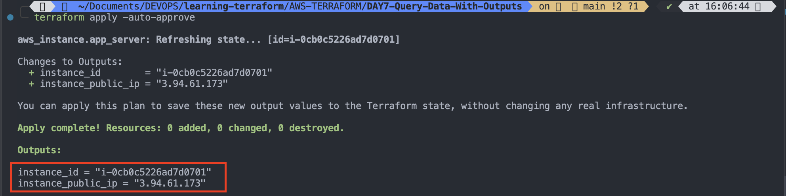
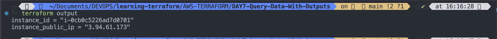
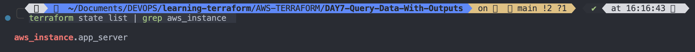
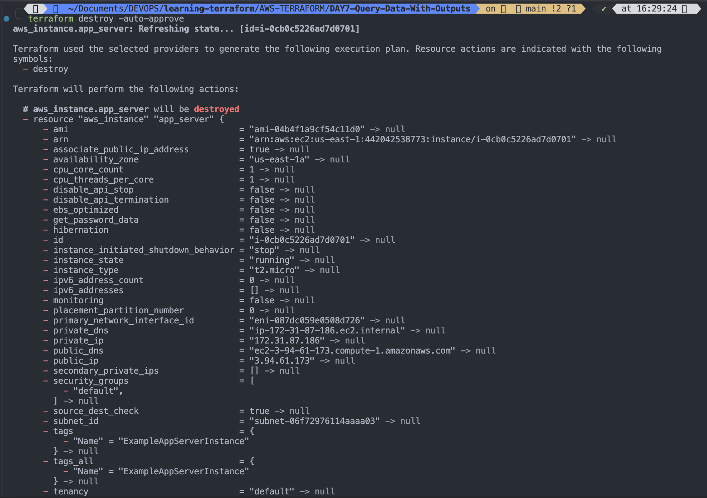
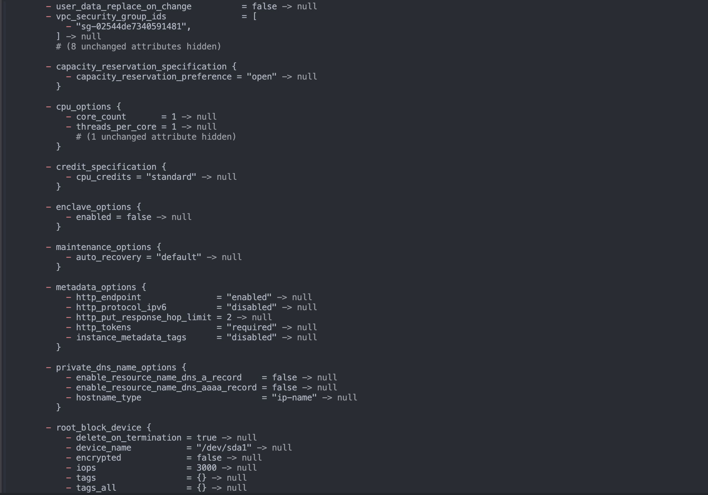
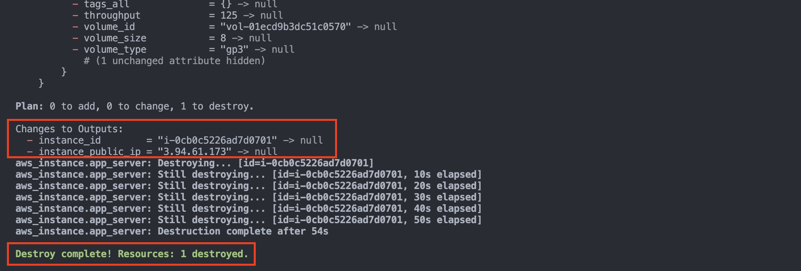

# Query Data with Output

- In the previous DAY6, you used an input variable to parameterize your Terraform configuration. In this, you will use output values to present useful information to the Terraform user.

# Initial configuration

## Create variables.tf file

```
variables.tf
```

```
terraform {
  required_providers {
    aws = {
      source = "hashicorp/aws"
      version = "5.87.0"
    }
  }
}

variable "aws_region" {
  description = "The AWS region to deploy resources"
  default = "us-east-1"
}

variable "instance_type" {
  description = "The type of EC2 instance"
  type = string
  default = "t2.micro"
}

variable "instance_name" {
  description = "Value of the Name tag for the EC2 instance"
  type = string
  default = "ExampleAppServerInstance"
}

variable "amazon_machine_image" {
  description = "Ubuntu Server 24.04 LTS (HVM),EBS General Purpose (SSD) Volume Type"
  type = string
  default = "ami-04b4f1a9cf54c11d0"

}
```

#

## Create main.tf file and call required variables from variables.tf file

```
main.tf
```

```

# Initializatio Terraform Block code is written in
# variables.tf file


# Terraform Configuration
provider "aws" {
  # Configuration options
  # Use variable for region
  region = var.aws_region
  #AWS_ACCESS_KEY_ID is written in .env file
  #AWS_Secret_ACCESS_KEY_ID is written in .env file
  # Don't forget to run `"source .env"
}

resource "aws_instance" "app_server" {
  ami = var.amazon_machine_image
  instance_type = var.instance_type
  tags = {
    Name = var.instance_name
  }

}
```

#

## Initialize the terraform

```
terraform init
```



## Validate the main.tf file syntax for errors

```
terraform validate
```



#

## Apply the configuration. Respond to the confirmation prompt with a yes. or use -auto-approve

```
terraform apply -auto-approve
```




#

# Output EC2 instance configuration

- Create a file called `outputs.tf` in your DAY7-Query-Data-With-Outputs directory.

```
vim outputs.tf
```

- Add the configuration below to `outputs.tf` to define outputs for your EC2 instance's ID and IP address.

```
output "instance_id" {
  description = "Id of the EC2 instance"
  value = aws_instance.app_server.id
}

output "instance_public_ip" {
  description = "Public IP address of the EC2 instance"
  value = aws_instance.app_server.public_ip
}
```

#

# Inspect output values

- You must apply this configuration before you can use these output values.
- Apply your configuration now. Respond to the confirmation prompt with `yes`.
- Terraform prints output values to the screen when you apply your configuration.

```
terraform apply -auto-approve
```



#

- Query the outputs with the `terraform output` command.

```
terraform output
```



- You can use Terraform outputs to connect your Terraform projects with other parts of your infrastructure, or with other Terraform projects.

#

- List all resources managed by Terraform

```
terraform state list | grep aws_instance
```



#

# Output VPC and load balancer information

- You can add output declarations anywhere in your Terraform configuration files. However, we recommend defining them in a separate file called `outputs.tf` to make it easier for users to understand your configuration and review its expected outputs.
- Add a block to outputs.tf to show the ID of the VPC.

```
output "vpc_id" {
  description = "ID of project VPC"
  value       = module.vpc.vpc_id
}

```

> Note: Must read and do Hands-on. Ref: [follow our in-depth tutorial, Output Data from Terraform.](https://developer.hashicorp.com/terraform/tutorials/configuration-language/outputs)

# Destroy terraform managed resources

```
terraform destroy -auto-approve
```





#

# Note: Must read and do Hands-on. Ref: [follow our in-depth tutorial, Output Data from Terraform.](https://developer.hashicorp.com/terraform/tutorials/configuration-language/outputs)

#
