# Terraform AWS S3(Simple Storage Service)

# Terraform AWS S3 Step-by-Step Guide

Terraform allows you to **create, manage, and configure AWS S3 buckets** efficiently using Infrastructure as Code (IaC). Below is a **step-by-step guide** with an example.

---

## **Step 1: Install Terraform**

Make sure you have Terraform installed on your system. If not, install it from [Terraform's official website](https://developer.hashicorp.com/terraform/downloads).

Check the installation:

```sh
terraform -version
```

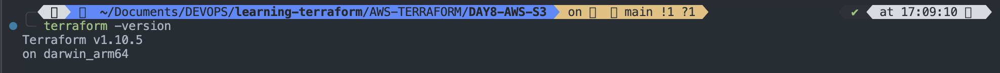

## **Step 2: Configure AWS Provider in Terraform**

Create a new directory for your Terraform project and navigate into it:

```sh
mkdir terraform-s3-example
cd terraform-s3-example
```

Create a **`main.tf`** file and define the **AWS provider**:

```hcl
terraform {
  required_providers {
    aws = {
      source  = "hashicorp/aws"
      version = "~> 5.0"
    }
  }
}

provider "aws" {
  region = "us-east-1"  # Change to your preferred region
}
```

---

## **Step 3: Create an AWS S3 Bucket**

Now, add an **S3 bucket resource** to `main.tf`:

```hcl
resource "aws_s3_bucket" "my_bucket" {
  bucket = "my-unique-terraform-bucket-name"  # Change this (must be unique globally)

  tags = {
    Name        = "MyTerraformS3Bucket"
    Environment = "Dev"
  }
}
```

- The `bucket` name **must be globally unique**.
- The `tags` block helps **organize resources** in AWS.

---

## **Step 4: Enable Bucket Versioning (Optional)**

To **enable versioning** for the bucket, add:

```hcl
resource "aws_s3_bucket_versioning" "versioning_example" {
  bucket = aws_s3_bucket.my_bucket.id

  versioning_configuration {
    status = "Enabled"
  }
}
```

---

## **Step 5: Make S3 Bucket Private/Public (Optional)**

To **control access** using ACL (Access Control List):

```hcl
resource "aws_s3_bucket_acl" "example_acl" {
  bucket = aws_s3_bucket.my_bucket.id
  acl    = "private"  # Options: private, public-read, public-read-write, authenticated-read
}
```

**Note**: Avoid making buckets **public** unless necessary.

---

## **Step 6: Initialize Terraform**

Run:

```sh
terraform init
```

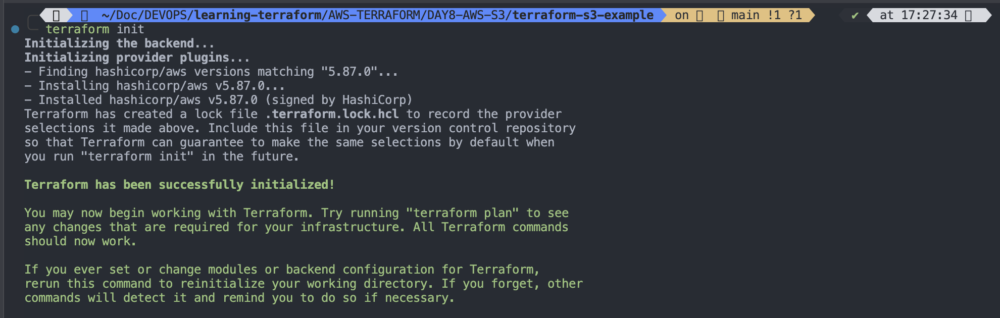

This downloads the required provider plugins.

---

## **Step 7: Validate & Apply Terraform Configuration**

Check for errors:

```sh
terraform validate
```

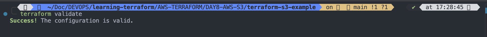
See what changes will be made:

```sh
terraform plan
```

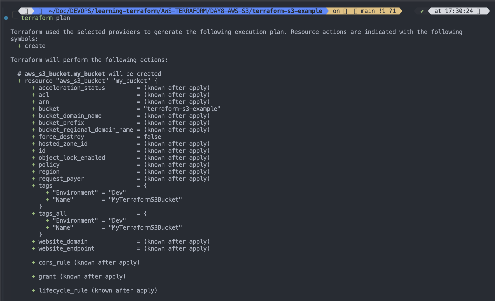
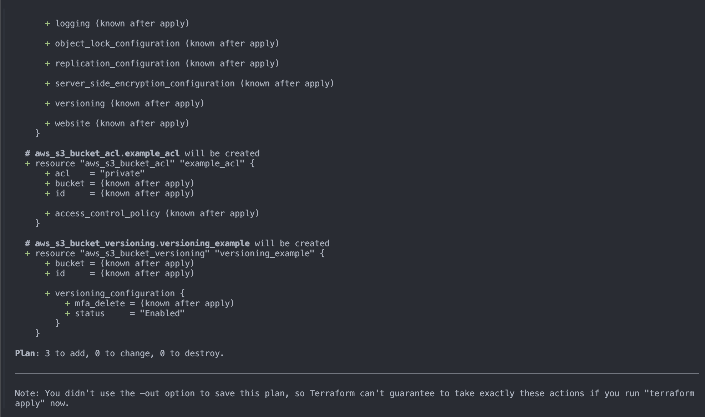

#

Apply the configuration:

```sh
terraform apply -auto-approve
```

When prompted, **type `yes`** to proceed.

---

## **Step 8: Verify the S3 Bucket**

After deployment, check the bucket:

```sh
aws s3 ls
```

Or log in to **AWS Console → S3** to confirm the bucket creation.

---

## **Step 9: Destroy Resources (Optional)**

If you want to **delete the S3 bucket** and other resources:

```sh
terraform destroy
```

Type **`yes`** to confirm.

---

## **Complete Example `main.tf` File**

```hcl
# AWS provider is written in variables.tf file

# AWS CONFIGURATION
provider "aws" {
  # Using variables.tf file variable
  region = var.aws_region

}

# Add an S3 bucket resource

resource "aws_s3_bucket" "my-unique-terraform-bucket-2025" {
  bucket = "my-unique-terraform-bucket-2025" # must be unique globaly
  tags = {
    Name = "MyTerraformS3Bucket"
    Environment = "Dev"
  }
}

# To enable bucket versioning for the bucket, add
resource "aws_s3_bucket_versioning" "versioning_example" {
  bucket = aws_s3_bucket.my-unique-terraform-bucket-2025.id
  versioning_configuration {
    status = "Disabled"
  }

}

# Make S3 Bucket Private/Public(Optional)
# To control access using ACL(Access Control List)
#resource "aws_s3_bucket_acl" "example_acl" {
  #bucket = aws_s3_bucket.my-unique-terraform-bucket-2025.id
  #acl = "private" # Options: private, public-read, public-read-write, authenticated-read

#}

# Use the Object Ownership setting instead: Modify your S3 bucket resource to explicitly set the ownership control:
resource "aws_s3_bucket_ownership_controls" "example" {
  bucket = aws_s3_bucket.my-unique-terraform-bucket-2025.id

  rule {
    object_ownership = "BucketOwnerEnforced"
  }
}
```

```
variables.tf
```

```
# AWS provider
terraform {
  required_providers {
    aws = {
      source = "hashicorp/aws"
      version = "5.87.0"
    }
  }
}

variable "aws_region" {
  description = "The AWS region to deploy resources"
  type = string
  default = "us-east-2"
}


```

```
terraform apply -auto-approve
```

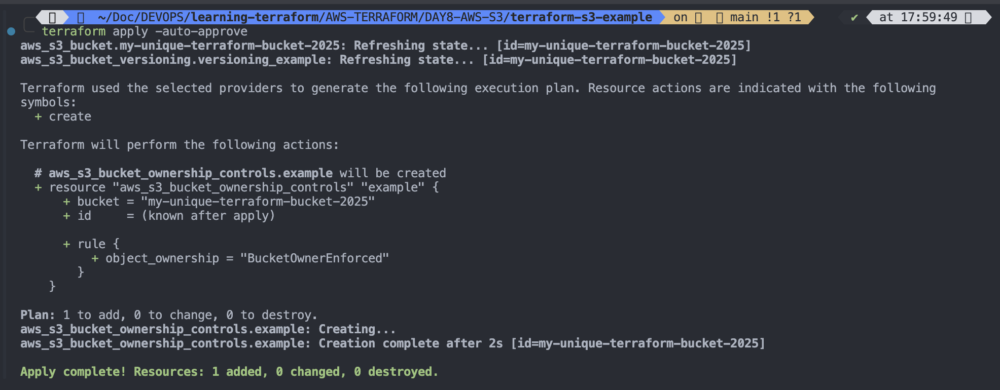

#

Verify S3 bucket

```
aws s3 ls
```

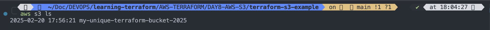
OR Through AWS Console
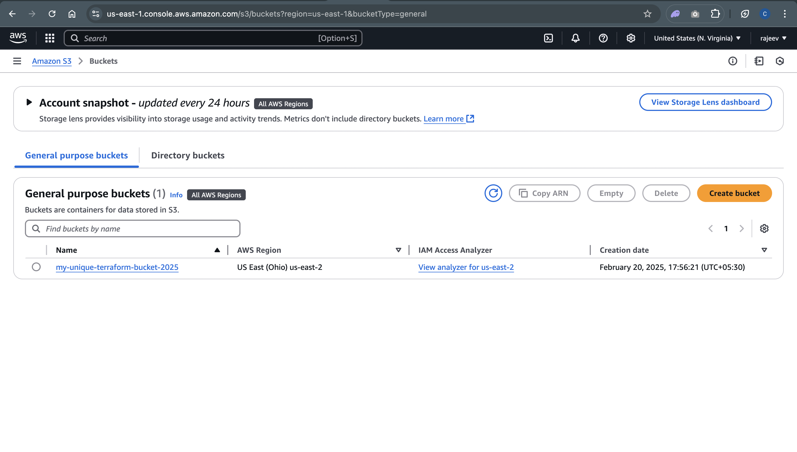
OR

```
terraform state list | grep aws_s3_bucket
```

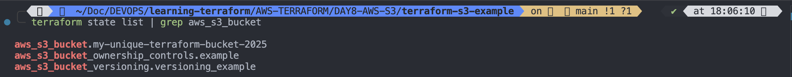

#

Destroy terraform managed resources

```
terraform destroy -auto-approve
```

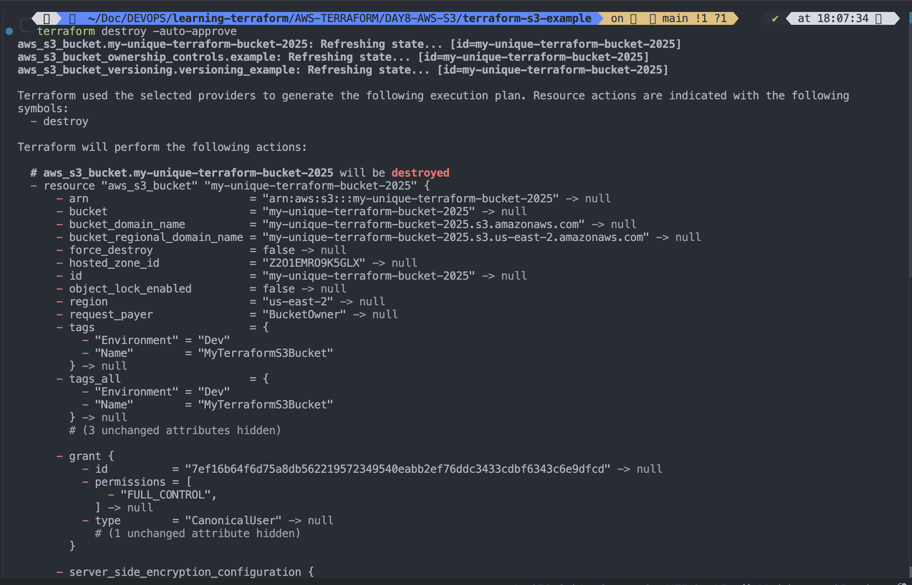
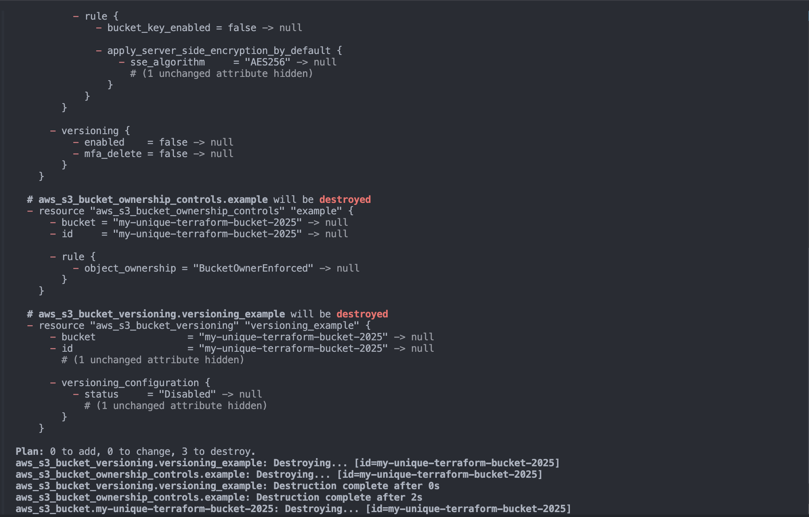
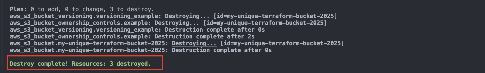
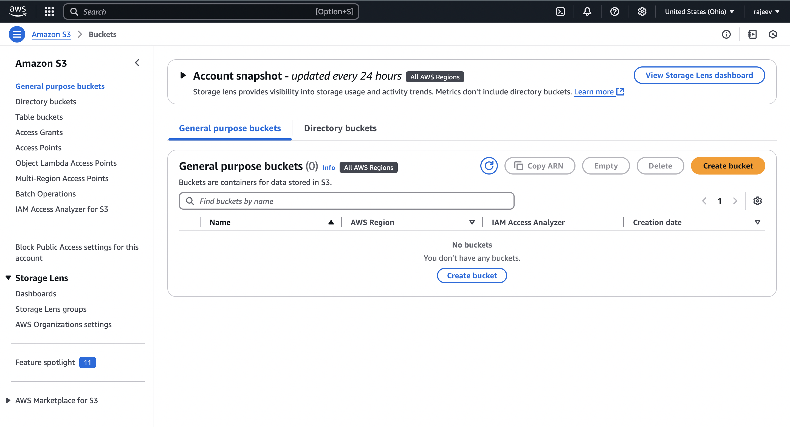

#

```
aws s3 ls
```

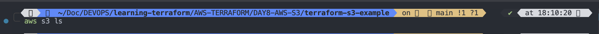

## **🔹 Key Takeaways**

✅ **Infrastructure as Code (IaC)** → Automates S3 bucket creation  
✅ **Versioning** → Enables backup and restore options  
✅ **Access Control** → Sets bucket permissions  
✅ **Fully Reproducible** → Can be managed using `terraform apply/destroy`

---

Now, try deploying your **Terraform AWS S3 bucket**!
