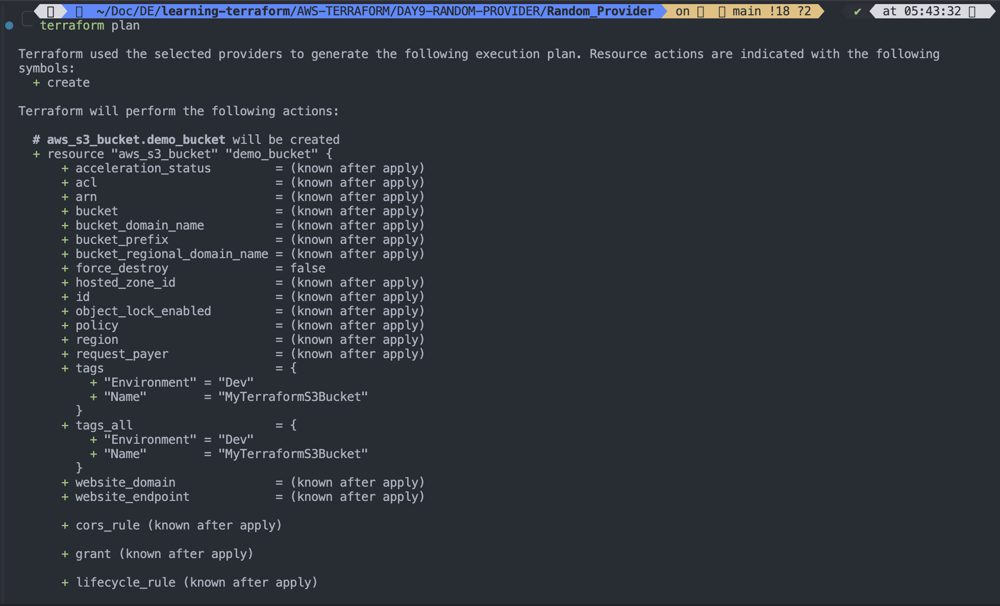
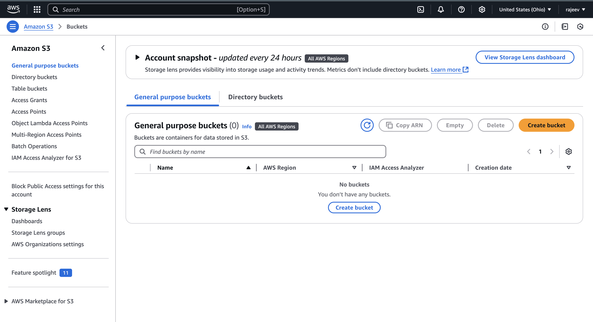

# Random Provider

Read Documentation at [Random Provider](https://registry.terraform.io/providers/hashicorp/random/latest/docs)

# Steps to use it

1. Use random provider in variables.tf

```sh
touch variables.tf

```

```hcl
# AWS provider
terraform {
  required_providers {
    aws = {
      source = "hashicorp/aws"
      version = "5.87.0"
    }
    # Random Provider
    random = {
      source = "hashicorp/random"
      version = "3.6.3"
    }
  }
}

variable "aws_region" {
  description = "The AWS region to deploy resources"
  type = string
  default = "us-east-2"
}


```

---

2. Now write main.tf

```sh
touch main.tf

```

```hcl
# AWS and RANDOM provider is written in variables.tf file


# AWS CONFIGURATION
provider "aws" {
  # Using variables.tf file variable
  region = var.aws_region

}

# Using Random Provider to generate random id
resource "random_id" "random_provider_example" {
  byte_length = 8

}

# Add an S3 bucket resource

resource "aws_s3_bucket" "demo_bucket" {
  bucket = "my_bucket_${random_id.random_provider_example.hex}" # must be unique globaly
  tags = {
    Name = "MyTerraformS3Bucket"
    Environment = "Dev"
  }
}

# To enable bucket versioning for the bucket, add
resource "aws_s3_bucket_versioning" "versioning_example" {
  bucket = aws_s3_bucket.demo_bucket.id
  versioning_configuration {
    status = "Disabled"
  }

}


# Make S3 Bucket Private/Public(Optional)
# To control access using ACL(Access Control List)
#resource "aws_s3_bucket_acl" "example_acl" {
  #bucket = aws_s3_bucket.my-unique-terraform-bucket-2025.id
  #acl = "private" # Options: private, public-read, public-read-write, authenticated-read
  #}

# Use the Object Ownership setting instead: Modify your S3 bucket resource to explicitly set the ownership control:
resource "aws_s3_bucket_ownership_controls" "example" {
  bucket = aws_s3_bucket.demo_bucket.id

  rule {
    object_ownership = "BucketOwnerEnforced"
  }
}

# Upload file to s3 bucket
resource "aws_s3_object" "bucket_file" {
  bucket = aws_s3_bucket.demo_bucket.bucket
  source = "./demofile.txt"
  key =  "myfile.txt"

}


```

---

3. Initialize Terraform

```hcl
terraform init
```


---

4. Validate syntax

```hcl
terraform validate
```


---

5. `terraform plan` to review the changes

```hcl
terraform plan
```




---

6. Apply to make changes

```hcl
terraform apply
```


---

7. To fix this error, create a file called demofile.txt

```sh
echo "Hello Rajeev" > demofile.txt

```

Apply again

```hcl
terraform apply -auto-approve
```


---

8. Verify the changes

```sh
terraform state list | grep aws_s3_bucket
```


---

Verify on `AWS CONSOLE`


---

Using AWS CLI command

```
aws s3 ls
```

---

9. Query output of terraform

```
terraform output
```


---

10. Detroy all Terraform managed resources

```
terraform destroy
```



