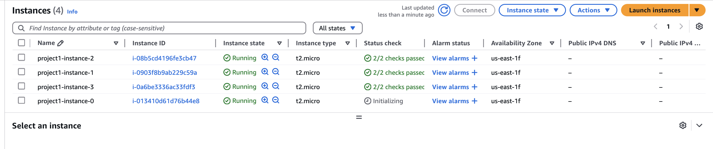
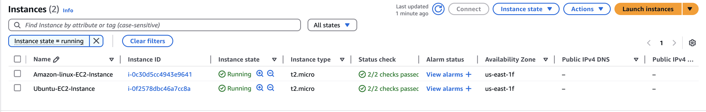

# Task

1. Create 2 subnets using count

```hcl
# Create 2 subnets using count
# CIDR 10.0.0.0/24 and 10.0.1.0/24
terraform {
  required_providers {
    aws = {
      source = "hashicorp/aws"
      version = "~>5.88.0"
    }
  }
}
variable "aws_region" {
  description = "Region of AWS where resources will get created"
  type = string
  default = "us-east-1"
}

locals {
  project = "project1"
}
provider "aws" {
  region = var.aws_region

}

resource "aws_vpc" "my-vpc" {
  cidr_block = "10.0.0.0/16"

  tags = {
    Name = "${local.project}-vpc" # O/P project1-vpc
  }


}
resource "aws_subnet" "my-subnet" {
  vpc_id = aws_vpc.my-vpc.id
  cidr_block = "10.0.${count.index}.0/24"
  count = 2
  tags = {
    Name = "${local.project}-subnet-${count.index}" # Ex O/P - project1-subnet-0 project1-subnet-1
  }

}

output "vpc_id" {
  description = "VPC ID to create resources"
  value = aws_vpc.my-vpc.id
}
output "subnet-id-1" {
  description = "Get Subnets ID"
  value = aws_subnet.my-subnet[0].id
}
output "subnet-id-2" {
  value = aws_subnet.my-subnet[1].id

}
```

```sh
terraform apply -auto-approve
```

`Output:`

```sh
terraform apply -auto-approve

Terraform used the selected providers to generate the following execution plan. Resource actions are
indicated with the following symbols:
  + create

Terraform will perform the following actions:

  # aws_subnet.my-subnet[0] will be created
  + resource "aws_subnet" "my-subnet" {
      + arn                                            = (known after apply)
      + assign_ipv6_address_on_creation                = false
      + availability_zone                              = (known after apply)
      + availability_zone_id                           = (known after apply)
      + cidr_block                                     = "10.0.0.0/24"
      + enable_dns64                                   = false
      + enable_resource_name_dns_a_record_on_launch    = false
      + enable_resource_name_dns_aaaa_record_on_launch = false
      + id                                             = (known after apply)
      + ipv6_cidr_block_association_id                 = (known after apply)
      + ipv6_native                                    = false
      + map_public_ip_on_launch                        = false
      + owner_id                                       = (known after apply)
      + private_dns_hostname_type_on_launch            = (known after apply)
      + tags                                           = {
          + "Name" = "project1-subnet-0"
        }
      + tags_all                                       = {
          + "Name" = "project1-subnet-0"
        }
      + vpc_id                                         = (known after apply)
    }

  # aws_subnet.my-subnet[1] will be created
  + resource "aws_subnet" "my-subnet" {
      + arn                                            = (known after apply)
      + assign_ipv6_address_on_creation                = false
      + availability_zone                              = (known after apply)
      + availability_zone_id                           = (known after apply)
      + cidr_block                                     = "10.0.1.0/24"
      + enable_dns64                                   = false
      + enable_resource_name_dns_a_record_on_launch    = false
      + enable_resource_name_dns_aaaa_record_on_launch = false
      + id                                             = (known after apply)
      + ipv6_cidr_block_association_id                 = (known after apply)
      + ipv6_native                                    = false
      + map_public_ip_on_launch                        = false
      + owner_id                                       = (known after apply)
      + private_dns_hostname_type_on_launch            = (known after apply)
      + tags                                           = {
          + "Name" = "project1-subnet-1"
        }
      + tags_all                                       = {
          + "Name" = "project1-subnet-1"
        }
      + vpc_id                                         = (known after apply)
    }

  # aws_vpc.my-vpc will be created
  + resource "aws_vpc" "my-vpc" {
      + arn                                  = (known after apply)
      + cidr_block                           = "10.0.0.0/16"
      + default_network_acl_id               = (known after apply)
      + default_route_table_id               = (known after apply)
      + default_security_group_id            = (known after apply)
      + dhcp_options_id                      = (known after apply)
      + enable_dns_hostnames                 = (known after apply)
      + enable_dns_support                   = true
      + enable_network_address_usage_metrics = (known after apply)
      + id                                   = (known after apply)
      + instance_tenancy                     = "default"
      + ipv6_association_id                  = (known after apply)
      + ipv6_cidr_block                      = (known after apply)
      + ipv6_cidr_block_network_border_group = (known after apply)
      + main_route_table_id                  = (known after apply)
      + owner_id                             = (known after apply)
      + tags                                 = {
          + "Name" = "project1-vpc"
        }
      + tags_all                             = {
          + "Name" = "project1-vpc"
        }
    }

Plan: 3 to add, 0 to change, 0 to destroy.

Changes to Outputs:
  + vpc_id = (known after apply)
aws_vpc.my-vpc: Creating...
aws_vpc.my-vpc: Creation complete after 6s [id=vpc-0ab43a0711895850d]
aws_subnet.my-subnet[1]: Creating...
aws_subnet.my-subnet[0]: Creating...
aws_subnet.my-subnet[1]: Creation complete after 3s [id=subnet-0008fab45b86f0008]
aws_subnet.my-subnet[0]: Creation complete after 3s [id=subnet-09fb2cf251fc83183]

Apply complete! Resources: 3 added, 0 changed, 0 destroyed.

Outputs:
subnet-id-1 = "subnet-09fb2cf251fc83183"
subnet-id-2 = "subnet-0008fab45b86f0008"
vpc_id = "vpc-0ab43a0711895850d"

```

2. Create 2 subnets and 4 ec2 instance, 2 in each subnet

```hcl
# Create 4 ec2 instances, 2 in each subnet
resource "aws_instance" "my-server" {
  ami = "ami-04b4f1a9cf54c11d0"
  instance_type = "t2.micro"
  count = 4 # Will create 4 EC2 Instances
  subnet_id = element(aws_subnet.my-subnet[*].id, count.index % length(aws_subnet.my-subnet))
  # count.index % length(aws_suubnet.my-subnet)
  # O/P -
  #0%2 = 0
  #1%2 = 1
  #2%2 = 0
  #3%2 = 1
  tags = {
    Name = "${local.project}-instance-${count.index}"
  }
}

```

`Run` - `terraform apply -auto-approve`
`Output: `

```sh
terraform apply -auto-approve
aws_vpc.my-vpc: Refreshing state... [id=vpc-0ab43a0711895850d]
aws_subnet.my-subnet[1]: Refreshing state... [id=subnet-0008fab45b86f0008]
aws_subnet.my-subnet[0]: Refreshing state... [id=subnet-09fb2cf251fc83183]

Terraform used the selected providers to generate the following execution plan. Resource actions are
indicated with the following symbols:
  + create

Terraform will perform the following actions:

  # aws_instance.my-server[0] will be created
  + resource "aws_instance" "my-server" {
      + ami                                  = "ami-04b4f1a9cf54c11d0"
      + arn                                  = (known after apply)
      + associate_public_ip_address          = (known after apply)
      + availability_zone                    = (known after apply)
      + cpu_core_count                       = (known after apply)
      + cpu_threads_per_core                 = (known after apply)
      + disable_api_stop                     = (known after apply)
      + disable_api_termination              = (known after apply)
      + ebs_optimized                        = (known after apply)
      + enable_primary_ipv6                  = (known after apply)
      + get_password_data                    = false
      + host_id                              = (known after apply)
      + host_resource_group_arn              = (known after apply)
      + iam_instance_profile                 = (known after apply)
      + id                                   = (known after apply)
      + instance_initiated_shutdown_behavior = (known after apply)
      + instance_lifecycle                   = (known after apply)
      + instance_state                       = (known after apply)
      + instance_type                        = "t2.micro"
      + ipv6_address_count                   = (known after apply)
      + ipv6_addresses                       = (known after apply)
      + key_name                             = (known after apply)
      + monitoring                           = (known after apply)
      + outpost_arn                          = (known after apply)
      + password_data                        = (known after apply)
      + placement_group                      = (known after apply)
      + placement_partition_number           = (known after apply)
      + primary_network_interface_id         = (known after apply)
      + private_dns                          = (known after apply)
      + private_ip                           = (known after apply)
      + public_dns                           = (known after apply)
      + public_ip                            = (known after apply)
      + secondary_private_ips                = (known after apply)
      + security_groups                      = (known after apply)
      + source_dest_check                    = true
      + spot_instance_request_id             = (known after apply)
      + subnet_id                            = "subnet-09fb2cf251fc83183"
      + tags                                 = {
          + "Name" = "project1-instance-0"
        }
      + tags_all                             = {
          + "Name" = "project1-instance-0"
        }
      + tenancy                              = (known after apply)
      + user_data                            = (known after apply)
      + user_data_base64                     = (known after apply)
      + user_data_replace_on_change          = false
      + vpc_security_group_ids               = (known after apply)

      + capacity_reservation_specification (known after apply)

      + cpu_options (known after apply)

      + ebs_block_device (known after apply)

      + enclave_options (known after apply)

      + ephemeral_block_device (known after apply)

      + instance_market_options (known after apply)

      + maintenance_options (known after apply)

      + metadata_options (known after apply)

      + network_interface (known after apply)

      + private_dns_name_options (known after apply)

      + root_block_device (known after apply)
    }

  # aws_instance.my-server[1] will be created
  + resource "aws_instance" "my-server" {
      + ami                                  = "ami-04b4f1a9cf54c11d0"
      + arn                                  = (known after apply)
      + associate_public_ip_address          = (known after apply)
      + availability_zone                    = (known after apply)
      + cpu_core_count                       = (known after apply)
      + cpu_threads_per_core                 = (known after apply)
      + disable_api_stop                     = (known after apply)
      + disable_api_termination              = (known after apply)
      + ebs_optimized                        = (known after apply)
      + enable_primary_ipv6                  = (known after apply)
      + get_password_data                    = false
      + host_id                              = (known after apply)
      + host_resource_group_arn              = (known after apply)
      + iam_instance_profile                 = (known after apply)
      + id                                   = (known after apply)
      + instance_initiated_shutdown_behavior = (known after apply)
      + instance_lifecycle                   = (known after apply)
      + instance_state                       = (known after apply)
      + instance_type                        = "t2.micro"
      + ipv6_address_count                   = (known after apply)
      + ipv6_addresses                       = (known after apply)
      + key_name                             = (known after apply)
      + monitoring                           = (known after apply)
      + outpost_arn                          = (known after apply)
      + password_data                        = (known after apply)
      + placement_group                      = (known after apply)
      + placement_partition_number           = (known after apply)
      + primary_network_interface_id         = (known after apply)
      + private_dns                          = (known after apply)
      + private_ip                           = (known after apply)
      + public_dns                           = (known after apply)
      + public_ip                            = (known after apply)
      + secondary_private_ips                = (known after apply)
      + security_groups                      = (known after apply)
      + source_dest_check                    = true
      + spot_instance_request_id             = (known after apply)
      + subnet_id                            = "subnet-0008fab45b86f0008"
      + tags                                 = {
          + "Name" = "project1-instance-1"
        }
      + tags_all                             = {
          + "Name" = "project1-instance-1"
        }
      + tenancy                              = (known after apply)
      + user_data                            = (known after apply)
      + user_data_base64                     = (known after apply)
      + user_data_replace_on_change          = false
      + vpc_security_group_ids               = (known after apply)

      + capacity_reservation_specification (known after apply)

      + cpu_options (known after apply)

      + ebs_block_device (known after apply)

      + enclave_options (known after apply)

      + ephemeral_block_device (known after apply)

      + instance_market_options (known after apply)

      + maintenance_options (known after apply)

      + metadata_options (known after apply)

      + network_interface (known after apply)

      + private_dns_name_options (known after apply)

      + root_block_device (known after apply)
    }

  # aws_instance.my-server[2] will be created
  + resource "aws_instance" "my-server" {
      + ami                                  = "ami-04b4f1a9cf54c11d0"
      + arn                                  = (known after apply)
      + associate_public_ip_address          = (known after apply)
      + availability_zone                    = (known after apply)
      + cpu_core_count                       = (known after apply)
      + cpu_threads_per_core                 = (known after apply)
      + disable_api_stop                     = (known after apply)
      + disable_api_termination              = (known after apply)
      + ebs_optimized                        = (known after apply)
      + enable_primary_ipv6                  = (known after apply)
      + get_password_data                    = false
      + host_id                              = (known after apply)
      + host_resource_group_arn              = (known after apply)
      + iam_instance_profile                 = (known after apply)
      + id                                   = (known after apply)
      + instance_initiated_shutdown_behavior = (known after apply)
      + instance_lifecycle                   = (known after apply)
      + instance_state                       = (known after apply)
      + instance_type                        = "t2.micro"
      + ipv6_address_count                   = (known after apply)
      + ipv6_addresses                       = (known after apply)
      + key_name                             = (known after apply)
      + monitoring                           = (known after apply)
      + outpost_arn                          = (known after apply)
      + password_data                        = (known after apply)
      + placement_group                      = (known after apply)
      + placement_partition_number           = (known after apply)
      + primary_network_interface_id         = (known after apply)
      + private_dns                          = (known after apply)
      + private_ip                           = (known after apply)
      + public_dns                           = (known after apply)
      + public_ip                            = (known after apply)
      + secondary_private_ips                = (known after apply)
      + security_groups                      = (known after apply)
      + source_dest_check                    = true
      + spot_instance_request_id             = (known after apply)
      + subnet_id                            = "subnet-09fb2cf251fc83183"
      + tags                                 = {
          + "Name" = "project1-instance-2"
        }
      + tags_all                             = {
          + "Name" = "project1-instance-2"
        }
      + tenancy                              = (known after apply)
      + user_data                            = (known after apply)
      + user_data_base64                     = (known after apply)
      + user_data_replace_on_change          = false
      + vpc_security_group_ids               = (known after apply)

      + capacity_reservation_specification (known after apply)

      + cpu_options (known after apply)

      + ebs_block_device (known after apply)

      + enclave_options (known after apply)

      + ephemeral_block_device (known after apply)

      + instance_market_options (known after apply)

      + maintenance_options (known after apply)

      + metadata_options (known after apply)

      + network_interface (known after apply)

      + private_dns_name_options (known after apply)

      + root_block_device (known after apply)
    }

  # aws_instance.my-server[3] will be created
  + resource "aws_instance" "my-server" {
      + ami                                  = "ami-04b4f1a9cf54c11d0"
      + arn                                  = (known after apply)
      + associate_public_ip_address          = (known after apply)
      + availability_zone                    = (known after apply)
      + cpu_core_count                       = (known after apply)
      + cpu_threads_per_core                 = (known after apply)
      + disable_api_stop                     = (known after apply)
      + disable_api_termination              = (known after apply)
      + ebs_optimized                        = (known after apply)
      + enable_primary_ipv6                  = (known after apply)
      + get_password_data                    = false
      + host_id                              = (known after apply)
      + host_resource_group_arn              = (known after apply)
      + iam_instance_profile                 = (known after apply)
      + id                                   = (known after apply)
      + instance_initiated_shutdown_behavior = (known after apply)
      + instance_lifecycle                   = (known after apply)
      + instance_state                       = (known after apply)
      + instance_type                        = "t2.micro"
      + ipv6_address_count                   = (known after apply)
      + ipv6_addresses                       = (known after apply)
      + key_name                             = (known after apply)
      + monitoring                           = (known after apply)
      + outpost_arn                          = (known after apply)
      + password_data                        = (known after apply)
      + placement_group                      = (known after apply)
      + placement_partition_number           = (known after apply)
      + primary_network_interface_id         = (known after apply)
      + private_dns                          = (known after apply)
      + private_ip                           = (known after apply)
      + public_dns                           = (known after apply)
      + public_ip                            = (known after apply)
      + secondary_private_ips                = (known after apply)
      + security_groups                      = (known after apply)
      + source_dest_check                    = true
      + spot_instance_request_id             = (known after apply)
      + subnet_id                            = "subnet-0008fab45b86f0008"
      + tags                                 = {
          + "Name" = "project1-instance-3"
        }
      + tags_all                             = {
          + "Name" = "project1-instance-3"
        }
      + tenancy                              = (known after apply)
      + user_data                            = (known after apply)
      + user_data_base64                     = (known after apply)
      + user_data_replace_on_change          = false
      + vpc_security_group_ids               = (known after apply)

      + capacity_reservation_specification (known after apply)

      + cpu_options (known after apply)

      + ebs_block_device (known after apply)

      + enclave_options (known after apply)

      + ephemeral_block_device (known after apply)

      + instance_market_options (known after apply)

      + maintenance_options (known after apply)

      + metadata_options (known after apply)

      + network_interface (known after apply)

      + private_dns_name_options (known after apply)

      + root_block_device (known after apply)
    }

Plan: 4 to add, 0 to change, 0 to destroy.
aws_instance.my-server[3]: Creating...
aws_instance.my-server[0]: Creating...
aws_instance.my-server[1]: Creating...
aws_instance.my-server[2]: Creating...
aws_instance.my-server[3]: Still creating... [10s elapsed]
aws_instance.my-server[1]: Still creating... [10s elapsed]
aws_instance.my-server[0]: Still creating... [10s elapsed]
aws_instance.my-server[2]: Still creating... [10s elapsed]
aws_instance.my-server[2]: Creation complete after 19s [id=i-08b5cd4196fe3cb47]
aws_instance.my-server[3]: Creation complete after 19s [id=i-0a6be3336ac33fdf3]
aws_instance.my-server[1]: Creation complete after 19s [id=i-0903f8b9ab229c59a]
aws_instance.my-server[0]: Creation complete after 19s [id=i-013410d61d76b44e8]

Apply complete! Resources: 4 added, 0 changed, 0 destroyed.

Outputs:

subnet-id-1 = "subnet-09fb2cf251fc83183"
subnet-id-2 = "subnet-0008fab45b86f0008"
vpc_id = "vpc-0ab43a0711895850d"
```



---

3. Create 2 Subnet, 2 ec2 instance, 1 in each subnet

- subnet1 : ec2-1(ubuntu)
- subnet2 : ec2-2(amazon-linux)

```hcl
resource "aws_instance" "my-server" {
  for_each = {
    "ubuntu" ={
      ami           = "ami-04b4f1a9cf54c11d0" # Ubuntu Image
      instance_type = "t2.micro"
      subnet_id     = aws_subnet.my-subnet[0].id
      tags = {
        Name = "Ubuntu-EC2-Instance"
      }
    }
    "amazon-linux" ={
      ami           = "ami-05b10e08d247fb927" # Amazon Linux
      instance_type = "t2.micro"
      subnet_id     = aws_subnet.my-subnet[1].id
      tags = {
        Name = "Amazon-linux-EC2-Instance"
      }
    }
  }
  ami = each.value.ami
  instance_type = each.value.instance_type
  subnet_id = each.value.subnet_id
  tags = each.value.tags
}

```

`terraform apply -auto-approve`
`Output:`

```sh
terraform apply -auto-approve

Terraform used the selected providers to generate the following execution plan. Resource actions are
indicated with the following symbols:
  + create

Terraform will perform the following actions:

  # aws_instance.my-server["amazon-linux"] will be created
  + resource "aws_instance" "my-server" {
      + ami                                  = "ami-05b10e08d247fb927"
      + arn                                  = (known after apply)
      + associate_public_ip_address          = (known after apply)
      + availability_zone                    = (known after apply)
      + cpu_core_count                       = (known after apply)
      + cpu_threads_per_core                 = (known after apply)
      + disable_api_stop                     = (known after apply)
      + disable_api_termination              = (known after apply)
      + ebs_optimized                        = (known after apply)
      + enable_primary_ipv6                  = (known after apply)
      + get_password_data                    = false
      + host_id                              = (known after apply)
      + host_resource_group_arn              = (known after apply)
      + iam_instance_profile                 = (known after apply)
      + id                                   = (known after apply)
      + instance_initiated_shutdown_behavior = (known after apply)
      + instance_lifecycle                   = (known after apply)
      + instance_state                       = (known after apply)
      + instance_type                        = "t2.micro"
      + ipv6_address_count                   = (known after apply)
      + ipv6_addresses                       = (known after apply)
      + key_name                             = (known after apply)
      + monitoring                           = (known after apply)
      + outpost_arn                          = (known after apply)
      + password_data                        = (known after apply)
      + placement_group                      = (known after apply)
      + placement_partition_number           = (known after apply)
      + primary_network_interface_id         = (known after apply)
      + private_dns                          = (known after apply)
      + private_ip                           = (known after apply)
      + public_dns                           = (known after apply)
      + public_ip                            = (known after apply)
      + secondary_private_ips                = (known after apply)
      + security_groups                      = (known after apply)
      + source_dest_check                    = true
      + spot_instance_request_id             = (known after apply)
      + subnet_id                            = (known after apply)
      + tags_all                             = (known after apply)
      + tenancy                              = (known after apply)
      + user_data                            = (known after apply)
      + user_data_base64                     = (known after apply)
      + user_data_replace_on_change          = false
      + vpc_security_group_ids               = (known after apply)

      + capacity_reservation_specification (known after apply)

      + cpu_options (known after apply)

      + ebs_block_device (known after apply)

      + enclave_options (known after apply)

      + ephemeral_block_device (known after apply)

      + instance_market_options (known after apply)

      + maintenance_options (known after apply)

      + metadata_options (known after apply)

      + network_interface (known after apply)

      + private_dns_name_options (known after apply)

      + root_block_device (known after apply)
    }

  # aws_instance.my-server["ubuntu"] will be created
  + resource "aws_instance" "my-server" {
      + ami                                  = "ami-04b4f1a9cf54c11d0"
      + arn                                  = (known after apply)
      + associate_public_ip_address          = (known after apply)
      + availability_zone                    = (known after apply)
      + cpu_core_count                       = (known after apply)
      + cpu_threads_per_core                 = (known after apply)
      + disable_api_stop                     = (known after apply)
      + disable_api_termination              = (known after apply)
      + ebs_optimized                        = (known after apply)
      + enable_primary_ipv6                  = (known after apply)
      + get_password_data                    = false
      + host_id                              = (known after apply)
      + host_resource_group_arn              = (known after apply)
      + iam_instance_profile                 = (known after apply)
      + id                                   = (known after apply)
      + instance_initiated_shutdown_behavior = (known after apply)
      + instance_lifecycle                   = (known after apply)
      + instance_state                       = (known after apply)
      + instance_type                        = "t2.micro"
      + ipv6_address_count                   = (known after apply)
      + ipv6_addresses                       = (known after apply)
      + key_name                             = (known after apply)
      + monitoring                           = (known after apply)
      + outpost_arn                          = (known after apply)
      + password_data                        = (known after apply)
      + placement_group                      = (known after apply)
      + placement_partition_number           = (known after apply)
      + primary_network_interface_id         = (known after apply)
      + private_dns                          = (known after apply)
      + private_ip                           = (known after apply)
      + public_dns                           = (known after apply)
      + public_ip                            = (known after apply)
      + secondary_private_ips                = (known after apply)
      + security_groups                      = (known after apply)
      + source_dest_check                    = true
      + spot_instance_request_id             = (known after apply)
      + subnet_id                            = (known after apply)
      + tags_all                             = (known after apply)
      + tenancy                              = (known after apply)
      + user_data                            = (known after apply)
      + user_data_base64                     = (known after apply)
      + user_data_replace_on_change          = false
      + vpc_security_group_ids               = (known after apply)

      + capacity_reservation_specification (known after apply)

      + cpu_options (known after apply)

      + ebs_block_device (known after apply)

      + enclave_options (known after apply)

      + ephemeral_block_device (known after apply)

      + instance_market_options (known after apply)

      + maintenance_options (known after apply)

      + metadata_options (known after apply)

      + network_interface (known after apply)

      + private_dns_name_options (known after apply)

      + root_block_device (known after apply)
    }

  # aws_subnet.my-subnet[0] will be created
  + resource "aws_subnet" "my-subnet" {
      + arn                                            = (known after apply)
      + assign_ipv6_address_on_creation                = false
      + availability_zone                              = (known after apply)
      + availability_zone_id                           = (known after apply)
      + cidr_block                                     = "10.0.0.0/24"
      + enable_dns64                                   = false
      + enable_resource_name_dns_a_record_on_launch    = false
      + enable_resource_name_dns_aaaa_record_on_launch = false
      + id                                             = (known after apply)
      + ipv6_cidr_block_association_id                 = (known after apply)
      + ipv6_native                                    = false
      + map_public_ip_on_launch                        = false
      + owner_id                                       = (known after apply)
      + private_dns_hostname_type_on_launch            = (known after apply)
      + tags                                           = {
          + "Name" = "project1-subnet-0"
        }
      + tags_all                                       = {
          + "Name" = "project1-subnet-0"
        }
      + vpc_id                                         = (known after apply)
    }

  # aws_subnet.my-subnet[1] will be created
  + resource "aws_subnet" "my-subnet" {
      + arn                                            = (known after apply)
      + assign_ipv6_address_on_creation                = false
      + availability_zone                              = (known after apply)
      + availability_zone_id                           = (known after apply)
      + cidr_block                                     = "10.0.1.0/24"
      + enable_dns64                                   = false
      + enable_resource_name_dns_a_record_on_launch    = false
      + enable_resource_name_dns_aaaa_record_on_launch = false
      + id                                             = (known after apply)
      + ipv6_cidr_block_association_id                 = (known after apply)
      + ipv6_native                                    = false
      + map_public_ip_on_launch                        = false
      + owner_id                                       = (known after apply)
      + private_dns_hostname_type_on_launch            = (known after apply)
      + tags                                           = {
          + "Name" = "project1-subnet-1"
        }
      + tags_all                                       = {
          + "Name" = "project1-subnet-1"
        }
      + vpc_id                                         = (known after apply)
    }

  # aws_vpc.my-vpc will be created
  + resource "aws_vpc" "my-vpc" {
      + arn                                  = (known after apply)
      + cidr_block                           = "10.0.0.0/16"
      + default_network_acl_id               = (known after apply)
      + default_route_table_id               = (known after apply)
      + default_security_group_id            = (known after apply)
      + dhcp_options_id                      = (known after apply)
      + enable_dns_hostnames                 = (known after apply)
      + enable_dns_support                   = true
      + enable_network_address_usage_metrics = (known after apply)
      + id                                   = (known after apply)
      + instance_tenancy                     = "default"
      + ipv6_association_id                  = (known after apply)
      + ipv6_cidr_block                      = (known after apply)
      + ipv6_cidr_block_network_border_group = (known after apply)
      + main_route_table_id                  = (known after apply)
      + owner_id                             = (known after apply)
      + tags                                 = {
          + "Name" = "project1-vpc"
        }
      + tags_all                             = {
          + "Name" = "project1-vpc"
        }
    }

Plan: 5 to add, 0 to change, 0 to destroy.

Changes to Outputs:
  + subnet-id-1 = (known after apply)
  + subnet-id-2 = (known after apply)
  + vpc_id      = (known after apply)
aws_vpc.my-vpc: Creating...
aws_vpc.my-vpc: Creation complete after 6s [id=vpc-0a9b2e8e893d69d3b]
aws_subnet.my-subnet[0]: Creating...
aws_subnet.my-subnet[1]: Creating...
aws_subnet.my-subnet[0]: Creation complete after 2s [id=subnet-0180b36bce8f9cf06]
aws_subnet.my-subnet[1]: Creation complete after 2s [id=subnet-09702d789a5418ce9]
aws_instance.my-server["ubuntu"]: Creating...
aws_instance.my-server["amazon-linux"]: Creating...
aws_instance.my-server["amazon-linux"]: Still creating... [10s elapsed]
aws_instance.my-server["ubuntu"]: Still creating... [10s elapsed]
aws_instance.my-server["amazon-linux"]: Creation complete after 17s [id=i-0c30d5cc4943e9641]
aws_instance.my-server["ubuntu"]: Creation complete after 17s [id=i-0f2578dbc46a7cc8a]

Apply complete! Resources: 5 added, 0 changed, 0 destroyed.

Outputs:

subnet-id-1 = "subnet-0180b36bce8f9cf06"
subnet-id-2 = "subnet-09702d789a5418ce9"
vpc_id = "vpc-0a9b2e8e893d69d3b"
```



---
