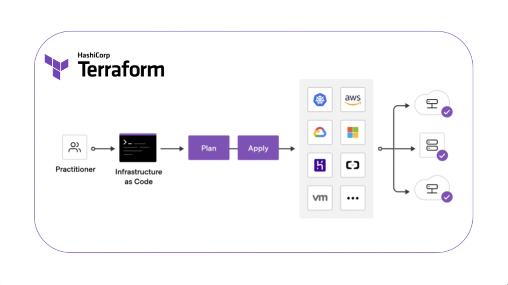

# What is Infrastructure as Code?

Infrastructure as Code (IaC) is a practice in DevOps and cloud computing that involves managing and provisioning computing infrastructure through machine-readable configuration files, rather than through physical hardware configuration or interactive configuration tools. This approach allows for version control, automation, and consistency in infrastructure deployment, making it easier to manage, scale, and replicate environments while reducing the risk of human error.

#
