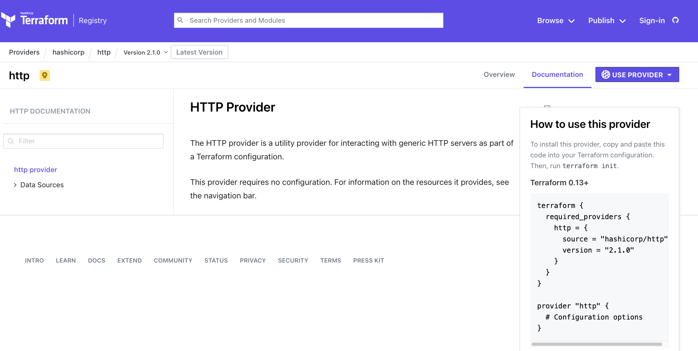

# Lab: Multiple Terraform Providers

Due to the plug-in based architecture of Terraform providers, it is easy to install and utilize multiple providers within the same Terraform configuration. Along with the already configured AWS provider, we will install both the HTTP and Random providers.

- Task 1: Install Terraform HTTP provider version
- Task 2: Configure Terraform HTTP Provider
- Task 3: Install Terraform Random provider version
- Task 4: Configure Terraform Random Provider
- Task 5: Install Terraform Local provider version

## Task 1: Install Terraform HTTP provider version

The HTTP provider is a utility provider for interacting with generic HTTP servers as part of a Terraform configuration.

As with any provider in can be installed by specifying it with with a terraform configuration block.



Add the following to the `terraform.tf` file

```hcl
terraform {
  required_providers {
    http = {
      source = "hashicorp/http"
      version = "2.1.0"
    }
  }
}
```

To install the provider execute a `terraform init`

```bash
terraform init
```

```bash
Initializing the backend...

Initializing provider plugins...
- Reusing previous version of hashicorp/aws from the dependency lock file
- Finding hashicorp/http versions matching "2.1.0"...
- Reusing previous version of hashicorp/random from the dependency lock file
- Using previously-installed hashicorp/aws v3.62.0
- Installing hashicorp/http v2.1.0...
- Installed hashicorp/http v2.1.0 (signed by HashiCorp)
- Using previously-installed hashicorp/random v3.0.0

Terraform has made some changes to the provider dependency selections recorded
in the .terraform.lock.hcl file. Review those changes and commit them to your
version control system if they represent changes you intended to make.

Terraform has been successfully initialized!

You may now begin working with Terraform. Try running "terraform plan" to see
any changes that are required for your infrastructure. All Terraform commands
should now work.

If you ever set or change modules or backend configuration for Terraform,
rerun this command to reinitialize your working directory. If you forget, other
commands will detect it and remind you to do so if necessary.
```

```bash
terraform version
```

```bash
Terraform v1.0.8
on linux_amd64
+ provider registry.terraform.io/hashicorp/aws v3.62.0
+ provider registry.terraform.io/hashicorp/http v2.1.0
+ provider registry.terraform.io/hashicorp/random v3.0.0
```

## Task 3: Install Terraform Random provider version

The "random" provider allows the use of randomness within Terraform configurations. This is a logical provider, which means that it works entirely within Terraform's logic, and doesn't interact with any other services.

Some previous labs may have already included installing this provider. This can be validate by running a `terraform version` and checking if the `+ provider registry.terraform.io/hashicorp/random v3.0.0` is present.

If it is not update the `terraform.tf` to include the provider.

`terraform .tf`

```hcl
terraform {
  required_version = ">= 1.0.0"
  required_providers {
    aws = {
      source  = "hashicorp/aws"
    }
    http = {
      source = "hashicorp/http"
      version = "2.1.0"
    }
    random = {
      source = "hashicorp/random"
      version = "3.1.0"
    }
  }
}
```

Run a `terraform init -upgrade` to validate you pull down the provider versions specified in the configuration and validate with a `terraform version` or a `terraform providers` command.

```bash
terraform init -upgrade
```

```bash
terraform version
```

```bash
Terraform v1.0.8
on linux_amd64
+ provider registry.terraform.io/hashicorp/aws v3.62.0
+ provider registry.terraform.io/hashicorp/http v2.1.0
+ provider registry.terraform.io/hashicorp/random v3.1.0
```

```bash
terraform providers
```

```bash
Providers required by configuration:
.
|-- provider[registry.terraform.io/hashicorp/http] 2.1.0
|-- provider[registry.terraform.io/hashicorp/random] 3.1.0
|-- provider[registry.terraform.io/hashicorp/aws]

Providers required by state:

    provider[registry.terraform.io/hashicorp/aws]

    provider[registry.terraform.io/hashicorp/random]
```

## Task 5: Install Terraform Local provider

The Local provider is used to manage local resources, such as files.

`terraform.tf`

```hcl
terraform {
  required_version = ">= 1.0.0"
  required_providers {
    aws = {
      source = "hashicorp/aws"
    }
    http = {
      source  = "hashicorp/http"
      version = "2.1.0"
    }
    random = {
      source  = "hashicorp/random"
      version = "3.1.0"
    }
    local = {
      source  = "hashicorp/local"
      version = "2.1.0"
    }
  }
}
```

```bash
terraform init -upgrade
```

```bash
terraform version
```

```bash
Terraform v1.0.8
on linux_amd64
+ provider registry.terraform.io/hashicorp/aws v3.62.0
+ provider registry.terraform.io/hashicorp/http v2.1.0
+ provider registry.terraform.io/hashicorp/local v2.1.0
+ provider registry.terraform.io/hashicorp/random v3.1.0
```

```bash
terraform providers
```

```bash
Providers required by configuration:
.
|-- provider[registry.terraform.io/hashicorp/http] 2.1.0
|-- provider[registry.terraform.io/hashicorp/random] 3.1.0
|-- provider[registry.terraform.io/hashicorp/local] 2.1.0
|-- provider[registry.terraform.io/hashicorp/aws]

Providers required by state:

    provider[registry.terraform.io/hashicorp/aws]

    provider[registry.terraform.io/hashicorp/random]
```

As you can see it is very easy to install multiple providers within a single Terraform configuration.
