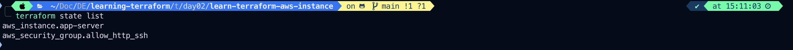

# Build Infrastructure

- We will provision an EC2 instance on Amazon Web Services (AWS). EC2 instances are virtual machines running on AWS, and a common component of many infrastructure projects.

## Prerequisites

- The [`Terraform CLI`](https://developer.hashicorp.com/terraform/tutorials/aws-get-started/install-cli) (1.2.0+) installed.
- The [`AWS CLI`](https://docs.aws.amazon.com/cli/latest/userguide/install-cliv2.html) installed.
- [`AWS account`](https://aws.amazon.com/free) and [`associated credentials`](https://docs.aws.amazon.com/general/latest/gr/aws-sec-cred-types.html) that allow you to create resources.
- To use your IAM credentials to authenticate the Terraform AWS provider, set the `AWS_ACCESS_KEY_ID` environment variable.

```bash
export AWS_ACCESS_KEY_ID=
```

Now, set your secret key.

```bash
export AWS_SECRET_ACCESS_KEY=
```

> `Note`: If you don't have access to IAM user credentials, use another authentication method described in the [`AWS provider documentation`](https://registry.terraform.io/providers/hashicorp/aws/latest/docs#environment-variables).

---

# Write configuration

- The set of files used to describe infrastructure in Terraform is known as a Terraform **_configuration_**. You will write your first configuration to define a single AWS EC2 instance.
- Each Terraform configuration must be in its own working directory. Create a directory for your configuration.

```bash
mkdir learn-terraform-aws-instance
```

Change into the directory.

```bash
cd learn-terraform-aws-instance
```

Create a file to define your infrastructure.

```bash
touch main.tf
```

Open main.tf in your text editor, paste in the configuration below, and save the file.

> `Tip`: The AMI ID used in this configuration is specific to the us-east-1 region. If you would like to use a different region, see the [`Troubleshooting section for guidance`](https://developer.hashicorp.com/terraform/tutorials/aws-get-started/aws-build#troubleshooting).

```hcl
terraform {
  required_providers {
    aws = {
      source  = "hashicorp/aws"
      version = "~> 4.16"
    }
  }

  required_version = ">= 1.2.0"
}

provider "aws" {
  region = "us-east-1"
}

resource "aws_instance" "app_server" {
  ami = "ami-020cba7c55df1f615"
  instance_type = "t2.micro"
  key_name = "866134557404_public_key"
  security_groups = ["sg-0b23952fd5885850a"]

  tags = {
    Name = "ExampleAppServerInstance"
  }

}

```

This is a complete configuration that you can deploy with Terraform. The following sections review each block of this configuration in more detail.

# Terraform Block

- The `terraform {}` block contains Terraform settings, including the required providers Terraform will use to provision your infrastructure. For each provider, the source attribute defines an optional hostname, a namespace, and the provider type. Terraform installs providers from the [`Terraform Registry`](https://registry.terraform.io/) by default. In this example configuration, the aws provider's source is defined as `hashicorp/aws`, which is shorthand for `registry.terraform.io/hashicorp/aws`.
- You can also set a version constraint for each provider defined in the `required_providers` block. The `version` attribute is optional, but we recommend using it to constrain the provider version so that Terraform does not install a version of the provider that does not work with your configuration. If you do not specify a provider version, Terraform will automatically download the most recent version during initialization.

To learn more, reference the [`provider source documentation`](https://developer.hashicorp.com/terraform/language/providers/requirements).

# Providers

- The provider block configures the specified provider, in this case aws. A provider is a plugin that Terraform uses to create and manage your resources.
- You can use multiple provider blocks in your Terraform configuration to manage resources from different providers. You can even use different providers together. For example, you could pass the IP address of your AWS EC2 instance to a monitoring resource from DataDog.

# Resources

- Use resource blocks to define components of your infrastructure. A resource might be a physical or virtual component such as an EC2 instance, or it can be a logical resource such as a Heroku application.
- Resource blocks have two strings before the block: the resource type and the resource name. In this example, the resource type is `aws_instance` and the name is `app_server`. The prefix of the type maps to the name of the provider. In the example configuration, Terraform manages the `aws_instance` resource with the `aws` provider. Together, the resource type and resource name form a unique ID for the resource. For example, the ID for your EC2 instance is `aws_instance.app_server`.
- Resource blocks contain arguments which you use to configure the resource. Arguments can include things like machine sizes, disk image names, or VPC IDs. Our [`providers reference`](https://developer.hashicorp.com/terraform/language/providers) lists the required and optional arguments for each resource. For your EC2 instance, the example configuration sets the AMI ID to an Ubuntu image, and the instance type to t2.micro, which qualifies for AWS' free tier. It also sets a tag to give the instance a name.

# Initialize the directory

- When you create a new configuration — or check out an existing configuration from version control — you need to initialize the directory with `terraform init`.
- Initializing a configuration directory downloads and installs the providers defined in the configuration, which in this case is the aws provider.

> Initialize the directory.

```bash
terraform init
```

`O/P`

```bash
terraform init
Initializing the backend...
Initializing provider plugins...
- Finding hashicorp/aws versions matching "~> 4.16"...
- Installing hashicorp/aws v4.67.0...
- Installed hashicorp/aws v4.67.0 (signed by HashiCorp)
Terraform has created a lock file .terraform.lock.hcl to record the provider
selections it made above. Include this file in your version control repository
so that Terraform can guarantee to make the same selections by default when
you run "terraform init" in the future.

Terraform has been successfully initialized!

You may now begin working with Terraform. Try running "terraform plan" to see
any changes that are required for your infrastructure. All Terraform commands
should now work.

If you ever set or change modules or backend configuration for Terraform,
rerun this command to reinitialize your working directory. If you forget, other
commands will detect it and remind you to do so if necessary.
```

Terraform downloads the `aws` provider and installs it in a hidden subdirectory of your current working directory, named `.terraform`. The `terraform init` command prints out which version of the provider was installed. Terraform also creates a lock file named `.terraform.lock.hcl` which specifies the exact provider versions used, so that you can control when you want to update the providers used for your project.

# Format and validate the configuration

- We recommend using consistent formatting in all of your configuration files. The `terraform fmt` command automatically updates configurations in the current directory for readability and consistency.
- Format your configuration. Terraform will print out the names of the files it modified, if any. In this case, your configuration file was already formatted correctly, so Terraform won't return any file names.

```bash
terraform fmt
```

`O/P`

```bash
terraform fmt
main.tf
versions.tf
```

- You can also make sure your configuration is syntactically valid and internally consistent by using the `terraform validate` command.

```bash
terraform validate
```

`O/P with an error`

```bash
terraform validate
╷
│ Error: Incorrect attribute value type
│
│   on main.tf line 9, in resource "aws_instance" "app_server":
│    9:   security_groups = "sg-0b23952fd5885850a"
│
│ Inappropriate value for attribute "security_groups": set of string required.
```

security_groups expects security group names, not IDs

✅ Fix:Define Security Group in Terraform (Recommended)

```hcl
resource "aws_security_group" "allow_http_ssh" {
  name        = "allow_http_ssh"
  description = "Allow HTTP and SSH inbound traffic"
  vpc_id      = "vpc-00708b1665b7af592"  # Use your VPC ID here

  ingress {
    from_port   = 22
    to_port     = 22
    protocol    = "tcp"
    cidr_blocks = ["0.0.0.0/0"]
  }

  ingress {
    from_port   = 80
    to_port     = 80
    protocol    = "tcp"
    cidr_blocks = ["0.0.0.0/0"]
  }

  egress {
    from_port   = 0
    to_port     = 0
    protocol    = "-1"
    cidr_blocks = ["0.0.0.0/0"]
  }

  tags = {
    Name = "allow_http_ssh"
  }
}

```

`Final code with security groups`

```hcl

provider "aws" {
  region = "us-east-1"
}

resource "aws_instance" "app-server" {
  ami = "ami-020cba7c55df1f615" # Amazon Linux UBUNTU
  instance_type = "t2.micro"
  key_name = "866134557404_public_key"
  security_groups = [aws_security_group.allow_http_ssh.name]

  tags = {
    Name = "TerraformAppServer"
  }
  }

 resource "aws_security_group" "allow_http_ssh" {
   name = "allow_http_ssh"
   description = "Allow SSH and HTTP"
   vpc_id = "vpc-00708b1665b7af592"

   ingress  {
    description = "HTTP"
    from_port = 80
    to_port = 80
    protocol = "tcp"
    cidr_blocks = ["0.0.0.0/0"]

   }
   ingress {
    description = "SSH"
    from_port = 22
    to_port = 22
    protocol ="tcp"
   }
   egress {
    from_port = 0
    to_port = 0
    cidr_blocks = ["0.0.0.0/0"]
    protocol = "-1"
   }

   tags = {
    Name = "allow_http_ssh"
   }


 }

```

```bash
terraform validate
Success! The configuration is valid.
```

---

# Create infrastructure

Apply the configuration now with the terraform apply command. Terraform will print output similar to what is shown below.

```bash
terraform apply
```

`O/P`

```bash
terraform plan

Terraform used the selected providers to generate the following execution plan. Resource actions are indicated with the following symbols:
  + create

Terraform will perform the following actions:

  # aws_instance.app-server will be created
  + resource "aws_instance" "app-server" {
      + ami                                  = "ami-020cba7c55df1f615"
      + arn                                  = (known after apply)
      + associate_public_ip_address          = (known after apply)
      + availability_zone                    = (known after apply)
      + cpu_core_count                       = (known after apply)
      + cpu_threads_per_core                 = (known after apply)
      + disable_api_stop                     = (known after apply)
      + disable_api_termination              = (known after apply)
      + ebs_optimized                        = (known after apply)
      + enable_primary_ipv6                  = (known after apply)
      + get_password_data                    = false
      + host_id                              = (known after apply)
      + host_resource_group_arn              = (known after apply)
      + iam_instance_profile                 = (known after apply)
      + id                                   = (known after apply)
      + instance_initiated_shutdown_behavior = (known after apply)
      + instance_lifecycle                   = (known after apply)
      + instance_state                       = (known after apply)
      + instance_type                        = "t2.micro"
      + ipv6_address_count                   = (known after apply)
      + ipv6_addresses                       = (known after apply)
      + key_name                             = "866134557404_public_key"
      + monitoring                           = (known after apply)
      + outpost_arn                          = (known after apply)
      + password_data                        = (known after apply)
      + placement_group                      = (known after apply)
      + placement_partition_number           = (known after apply)
      + primary_network_interface_id         = (known after apply)
      + private_dns                          = (known after apply)
      + private_ip                           = (known after apply)
      + public_dns                           = (known after apply)
      + public_ip                            = (known after apply)
      + secondary_private_ips                = (known after apply)
      + security_groups                      = [
          + "allow_http_ssh",
        ]
      + source_dest_check                    = true
      + spot_instance_request_id             = (known after apply)
      + subnet_id                            = (known after apply)
      + tags                                 = {
          + "Name" = "TerraformAppServer"
        }
      + tags_all                             = {
          + "Name" = "TerraformAppServer"
        }
      + tenancy                              = (known after apply)
      + user_data                            = (known after apply)
      + user_data_base64                     = (known after apply)
      + user_data_replace_on_change          = false
      + vpc_security_group_ids               = (known after apply)

      + capacity_reservation_specification (known after apply)

      + cpu_options (known after apply)

      + ebs_block_device (known after apply)

      + enclave_options (known after apply)

      + ephemeral_block_device (known after apply)

      + instance_market_options (known after apply)

      + maintenance_options (known after apply)

      + metadata_options (known after apply)

      + network_interface (known after apply)

      + private_dns_name_options (known after apply)

      + root_block_device (known after apply)
    }

  # aws_security_group.allow_http_ssh will be created
  + resource "aws_security_group" "allow_http_ssh" {
      + arn                    = (known after apply)
      + description            = "Allow SSH and HTTP"
      + egress                 = [
          + {
              + cidr_blocks      = [
                  + "0.0.0.0/0",
                ]
              + from_port        = 0
              + ipv6_cidr_blocks = []
              + prefix_list_ids  = []
              + protocol         = "-1"
              + security_groups  = []
              + self             = false
              + to_port          = 0
                # (1 unchanged attribute hidden)
            },
        ]
      + id                     = (known after apply)
      + ingress                = [
          + {
              + cidr_blocks      = [
                  + "0.0.0.0/0",
                ]
              + description      = "HTTP"
              + from_port        = 80
              + ipv6_cidr_blocks = []
              + prefix_list_ids  = []
              + protocol         = "tcp"
              + security_groups  = []
              + self             = false
              + to_port          = 80
            },
          + {
              + cidr_blocks      = []
              + description      = "SSH"
              + from_port        = 22
              + ipv6_cidr_blocks = []
              + prefix_list_ids  = []
              + protocol         = "tcp"
              + security_groups  = []
              + self             = false
              + to_port          = 22
            },
        ]
      + name                   = "allow_http_ssh"
      + name_prefix            = (known after apply)
      + owner_id               = (known after apply)
      + revoke_rules_on_delete = false
      + tags                   = {
          + "Name" = "allow_http_ssh"
        }
      + tags_all               = {
          + "Name" = "allow_http_ssh"
        }
      + vpc_id                 = "vpc-00708b1665b7af592"
    }

Plan: 2 to add, 0 to change, 0 to destroy.

─────────────────────────────────────────────────────────────────────────────────────────────────────────────────────────────────────────────────────────────────────────────────

Note: You didn't use the -out option to save this plan, so Terraform can't guarantee to take exactly these actions if you run "terraform apply" now.

╭─     ~/Doc/DE/learning-terraform/t/day02/learn-terraform-aws-instance  on    main !1 ?1                                              ✔  took 4s    at 15:00:34   
╰─ terraform apply

Terraform used the selected providers to generate the following execution plan. Resource actions are indicated with the following symbols:
  + create

Terraform will perform the following actions:

  # aws_instance.app-server will be created
  + resource "aws_instance" "app-server" {
      + ami                                  = "ami-020cba7c55df1f615"
      + arn                                  = (known after apply)
      + associate_public_ip_address          = (known after apply)
      + availability_zone                    = (known after apply)
      + cpu_core_count                       = (known after apply)
      + cpu_threads_per_core                 = (known after apply)
      + disable_api_stop                     = (known after apply)
      + disable_api_termination              = (known after apply)
      + ebs_optimized                        = (known after apply)
      + enable_primary_ipv6                  = (known after apply)
      + get_password_data                    = false
      + host_id                              = (known after apply)
      + host_resource_group_arn              = (known after apply)
      + iam_instance_profile                 = (known after apply)
      + id                                   = (known after apply)
      + instance_initiated_shutdown_behavior = (known after apply)
      + instance_lifecycle                   = (known after apply)
      + instance_state                       = (known after apply)
      + instance_type                        = "t2.micro"
      + ipv6_address_count                   = (known after apply)
      + ipv6_addresses                       = (known after apply)
      + key_name                             = "866134557404_public_key"
      + monitoring                           = (known after apply)
      + outpost_arn                          = (known after apply)
      + password_data                        = (known after apply)
      + placement_group                      = (known after apply)
      + placement_partition_number           = (known after apply)
      + primary_network_interface_id         = (known after apply)
      + private_dns                          = (known after apply)
      + private_ip                           = (known after apply)
      + public_dns                           = (known after apply)
      + public_ip                            = (known after apply)
      + secondary_private_ips                = (known after apply)
      + security_groups                      = [
          + "allow_http_ssh",
        ]
      + source_dest_check                    = true
      + spot_instance_request_id             = (known after apply)
      + subnet_id                            = (known after apply)
      + tags                                 = {
          + "Name" = "TerraformAppServer"
        }
      + tags_all                             = {
          + "Name" = "TerraformAppServer"
        }
      + tenancy                              = (known after apply)
      + user_data                            = (known after apply)
      + user_data_base64                     = (known after apply)
      + user_data_replace_on_change          = false
      + vpc_security_group_ids               = (known after apply)

      + capacity_reservation_specification (known after apply)

      + cpu_options (known after apply)

      + ebs_block_device (known after apply)

      + enclave_options (known after apply)

      + ephemeral_block_device (known after apply)

      + instance_market_options (known after apply)

      + maintenance_options (known after apply)

      + metadata_options (known after apply)

      + network_interface (known after apply)

      + private_dns_name_options (known after apply)

      + root_block_device (known after apply)
    }

  # aws_security_group.allow_http_ssh will be created
  + resource "aws_security_group" "allow_http_ssh" {
      + arn                    = (known after apply)
      + description            = "Allow SSH and HTTP"
      + egress                 = [
          + {
              + cidr_blocks      = [
                  + "0.0.0.0/0",
                ]
              + from_port        = 0
              + ipv6_cidr_blocks = []
              + prefix_list_ids  = []
              + protocol         = "-1"
              + security_groups  = []
              + self             = false
              + to_port          = 0
                # (1 unchanged attribute hidden)
            },
        ]
      + id                     = (known after apply)
      + ingress                = [
          + {
              + cidr_blocks      = [
                  + "0.0.0.0/0",
                ]
              + description      = "HTTP"
              + from_port        = 80
              + ipv6_cidr_blocks = []
              + prefix_list_ids  = []
              + protocol         = "tcp"
              + security_groups  = []
              + self             = false
              + to_port          = 80
            },
          + {
              + cidr_blocks      = []
              + description      = "SSH"
              + from_port        = 22
              + ipv6_cidr_blocks = []
              + prefix_list_ids  = []
              + protocol         = "tcp"
              + security_groups  = []
              + self             = false
              + to_port          = 22
            },
        ]
      + name                   = "allow_http_ssh"
      + name_prefix            = (known after apply)
      + owner_id               = (known after apply)
      + revoke_rules_on_delete = false
      + tags                   = {
          + "Name" = "allow_http_ssh"
        }
      + tags_all               = {
          + "Name" = "allow_http_ssh"
        }
      + vpc_id                 = "vpc-00708b1665b7af592"
    }

Plan: 2 to add, 0 to change, 0 to destroy.

Do you want to perform these actions?
  Terraform will perform the actions described above.
  Only 'yes' will be accepted to approve.

  Enter a value: yes

aws_security_group.allow_http_ssh: Creating...
aws_security_group.allow_http_ssh: Creation complete after 8s [id=sg-091d9b75aa810796b]
aws_instance.app-server: Creating...
aws_instance.app-server: Still creating... [00m10s elapsed]
aws_instance.app-server: Still creating... [00m20s elapsed]
aws_instance.app-server: Still creating... [00m30s elapsed]
aws_instance.app-server: Creation complete after 39s [id=i-0987efb857b0594a7]

Apply complete! Resources: 2 added, 0 changed, 0 destroyed.
```

---

## Check the state of terraform

```bash
terraform state list
```



# Continue from this link

https://developer.hashicorp.com/terraform/tutorials/aws-get-started/aws-build
