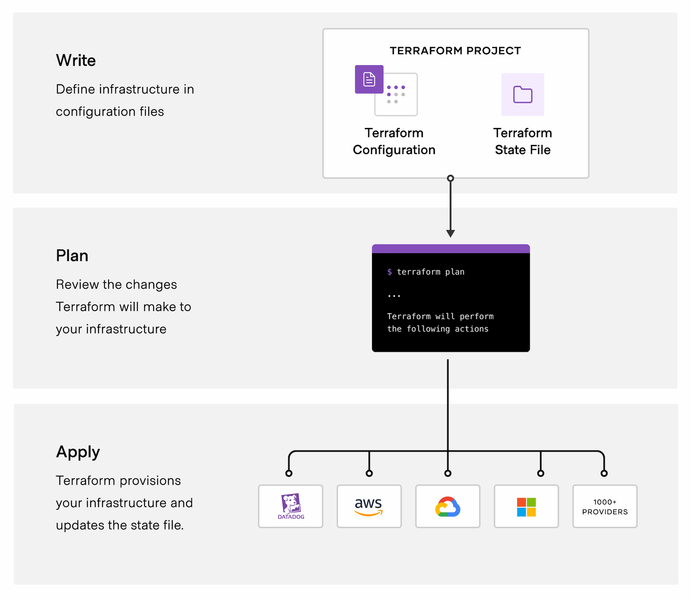
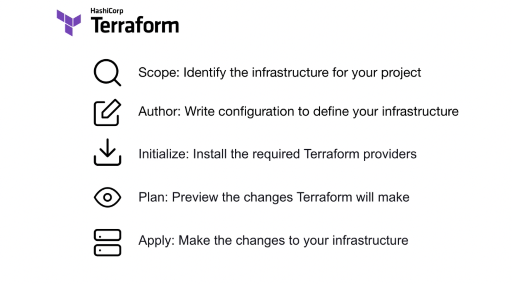
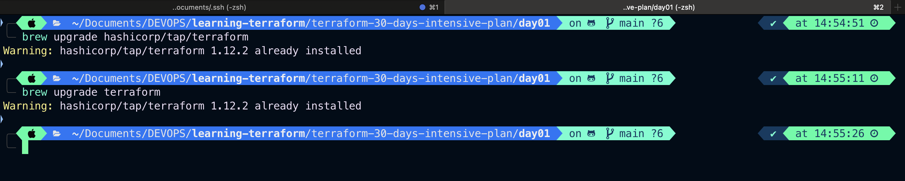

# What is Terraform?

- Terraform is an infrastructure as code tool that lets you build, change, and version cloud and on-prem resources safely and efficiently.
- HashiCorp Terraform is an infrastructure as code tool that lets you define both cloud and on-prem resources in human-readable configuration files that you can version, reuse, and share. You can then use a consistent workflow to provision and manage all of your infrastructure throughout its lifecycle. Terraform can manage low-level components like compute, storage, and networking resources, as well as high-level components like DNS entries and SaaS features.

---

# How does Terraform work?

Terraform creates and manages resources on cloud platforms and other services through their application programming interfaces (APIs). Providers enable Terraform to work with virtually any platform or service with an accessible API.

## 

- HashiCorp and the Terraform community have already written thousands of providers to manage many different types of resources and services. You can find all publicly available providers on the [`Terraform Registry`](https://registry.terraform.io/), including Amazon Web Services (AWS), Azure, Google Cloud Platform (GCP), Kubernetes, Helm, GitHub, Splunk, DataDog, and many more.
- The core Terraform workflow consists of three stages:
  - `Write`: You define resources, which may be across multiple cloud providers and services. For example, you might create a configuration to deploy an application on virtual machines in a Virtual Private Cloud (VPC) network with security groups and a load balancer.
  - `Plan`: Terraform creates an execution plan describing the infrastructure it will create, update, or destroy based on the existing infrastructure and your configuration.
  - `Apply`: On approval, Terraform performs the proposed operations in the correct order, respecting any resource dependencies. For example, if you update the properties of a VPC and change the number of virtual machines in that VPC, Terraform will recreate the VPC before scaling the virtual machines.
    

---

## Why Terraform?

### Manage any infrastructure

- Find providers for many of the platforms and services you already use in the [`Terraform Registry`](https://registry.terraform.io/). You can also [`write your own`](https://developer.hashicorp.com/terraform/plugin). Terraform takes an [`immutable approach to infrastructure`](https://www.hashicorp.com/en/resources/what-is-mutable-vs-immutable-infrastructure?product_intent=terraform), reducing the complexity of upgrading or modifying your services and infrastructure.

## Track your infrastructure

- Terraform generates a plan and prompts you for your approval before modifying your infrastructure. It also keeps track of your real infrastructure in a [`state file`](https://developer.hashicorp.com/terraform/language/state), which acts as a source of truth for your environment. Terraform uses the state file to determine the changes to make to your infrastructure so that it will match your configuration.

## Automate changes

Terraform configuration files are declarative, meaning that they describe the end state of your infrastructure. You do not need to write step-by-step instructions to create resources because Terraform handles the underlying logic. Terraform builds a resource graph to determine resource dependencies and creates or modifies non-dependent resources in parallel. This allows Terraform to provision resources efficiently.

## Standardize configurations

Terraform supports reusable configuration components called [`modules`](https://developer.hashicorp.com/terraform/language/modules) that define configurable collections of infrastructure, saving time and encouraging best practices. You can use publicly available modules from the Terraform Registry, or write your own.

## Collaborate

Since your configuration is written in a file, you can commit it to a Version Control System (VCS) and use [`HCP Terraform`](https://developer.hashicorp.com/terraform/intro/terraform-editions#hcp-terraform) to efficiently manage Terraform workflows across teams. HCP Terraform runs Terraform in a consistent, reliable environment and provides secure access to shared state and secret data, role-based access controls, a private registry for sharing both modules and providers, and more.

---

# What is Infrastructure as Code with Terraform?



- Infrastructure as Code (IaC) tools allow you to manage infrastructure with configuration files rather than through a graphical user interface. IaC allows you to build, change, and manage your infrastructure in a safe, consistent, and repeatable way by defining resource configurations that you can version, reuse, and share.

- Terraform is HashiCorp's infrastructure as code tool. It lets you define resources and infrastructure in human-readable, declarative configuration files, and manages your infrastructure's lifecycle. Using Terraform has several advantages over manually managing your infrastructure:

  - Terraform can manage infrastructure on multiple cloud platforms.

  - The human-readable configuration language helps you write infrastructure code quickly.
  - Terraform's state allows you to track resource changes throughout your deployments.

  - You can commit your configurations to version control to safely collaborate on infrastructure.

# Manage any infrastructure

- Terraform plugins called providers let Terraform interact with cloud platforms and other services via their application programming interfaces (APIs). HashiCorp and the Terraform community have written over 1,000 providers to manage resources on Amazon Web Services (AWS), Azure, Google Cloud Platform (GCP), Kubernetes, Helm, GitHub, Splunk, and DataDog, just to name a few. Find providers for many of the platforms and services you already use in the [`Terraform Registry`](https://registry.terraform.io/browse/providers). If you don't find the provider you're looking for, you can write your own.

# Standardize your deployment workflow

- Providers define individual units of infrastructure, for example compute instances or private networks, as resources. You can compose resources from different providers into reusable Terraform configurations called modules, and manage them with a consistent language and workflow.
- Terraform's configuration language is declarative, meaning that it describes the desired end-state for your infrastructure, in contrast to procedural programming languages that require step-by-step instructions to perform tasks. Terraform providers automatically calculate dependencies between resources to create or destroy them in the correct order.
  

### To deploy infrastructure with Terraform:

- `Scope` - Identify the infrastructure for your project.
- `Author` - Write the configuration for your infrastructure.
- `Initialize` - Install the plugins Terraform needs to manage the infrastructure.
- `Plan` - Preview the changes Terraform will make to match your configuration.
- `Apply` - Make the planned changes.

# Track your infrastructure

Terraform keeps track of your real infrastructure in a state file, which acts as a source of truth for your environment. Terraform uses the state file to determine the changes to make to your infrastructure so that it will match your configuration.

# Collaborate

- Terraform allows you to collaborate on your infrastructure with its remote state backends. When you use HCP Terraform (free for up to five users), you can securely share your state with your teammates, provide a stable environment for Terraform to run in, and prevent race conditions when multiple people make configuration changes at once.
- You can also connect HCP Terraform to version control systems (VCSs) like GitHub, GitLab, and others, allowing it to automatically propose infrastructure changes when you commit configuration changes to VCS. This lets you manage changes to your infrastructure through version control, as you would with application code.

---

# Install Terraform

- To use Terraform you will need to install it. HashiCorp distributes Terraform as a [`binary package`](https://developer.hashicorp.com/terraform/install). You can also install Terraform using popular package managers.

`Homebrew on Mac`

1. First, install the HashiCorp tap, a repository of all our Homebrew packages.

```bash
brew tap hashicorp/tap
```

2. Now, install Terraform with hashicorp/tap/terraform.

```bash
brew install hashicorp/tap/terraform
```

3. To update to the latest version of Terraform, first update Homebrew.

```bash
brew update
```

Then, run the upgrade command to download and use the latest Terraform version.

```bash
brew upgrade hashicorp/tap/terraform
```



4. Verify the installation

Verify that the installation worked by opening a new terminal session and listing Terraform's available subcommands.

```bash
terraform -help
terraform version
```

`O/P`

```bash
terraform -help
Usage: terraform [global options] <subcommand> [args]

The available commands for execution are listed below.
The primary workflow commands are given first, followed by
less common or more advanced commands.

Main commands:
  init          Prepare your working directory for other commands
  validate      Check whether the configuration is valid
  plan          Show changes required by the current configuration
  apply         Create or update infrastructure
  destroy       Destroy previously-created infrastructure

All other commands:
  console       Try Terraform expressions at an interactive command prompt
  fmt           Reformat your configuration in the standard style
  force-unlock  Release a stuck lock on the current workspace
  get           Install or upgrade remote Terraform modules
  graph         Generate a Graphviz graph of the steps in an operation
  import        Associate existing infrastructure with a Terraform resource
  login         Obtain and save credentials for a remote host
  logout        Remove locally-stored credentials for a remote host
  metadata      Metadata related commands
  modules       Show all declared modules in a working directory
  output        Show output values from your root module
  providers     Show the providers required for this configuration
  refresh       Update the state to match remote systems
  show          Show the current state or a saved plan
  state         Advanced state management
  taint         Mark a resource instance as not fully functional
  test          Execute integration tests for Terraform modules
  untaint       Remove the 'tainted' state from a resource instance
  version       Show the current Terraform version
  workspace     Workspace management

Global options (use these before the subcommand, if any):
  -chdir=DIR    Switch to a different working directory before executing the
                given subcommand.
  -help         Show this help output, or the help for a specified subcommand.
  -version      An alias for the "version" subcommand.

terraform version
Terraform v1.12.2
on darwin_arm64
```

## Troubleshoot

If you get an error that terraform could not be found, your `PATH` environment variable was not set up properly. Please go back and ensure that your `PATH` variable contains the directory where Terraform was installed.

## Enable tab completion

- If you use either Bash or Zsh, you can enable tab completion for Terraform commands. To enable autocomplete, first ensure that a config file exists for your chosen shell.

```bash
touch ~/.bashrc
```

Then install the autocomplete package.

```zsh
touch ~/.zshrc
```

---

```HCP
terraform {
  required_providers {
    docker = {
      source  = "kreuzwerker/docker"
      version = "~> 3.0.1"
    }
  }
}

provider "docker" {}

resource "docker_image" "nginx" {
  name         = "nginx"
  keep_locally = false
}

resource "docker_container" "nginx" {
  image = docker_image.nginx.image_id
  name  = "tutorial"

  ports {
    internal = 80
    external = 8000
  }
}

```

Initialize the project, which downloads a plugin called a provider that lets Terraform interact with Docker.

```bash
terraform init
```

`O/P`

```bash
terraform init
Initializing the backend...
Initializing provider plugins...
- Finding kreuzwerker/docker versions matching "~> 3.0.0"...
- Installing kreuzwerker/docker v3.0.2...
- Installed kreuzwerker/docker v3.0.2 (self-signed, key ID BD080C4571C6104C)
Partner and community providers are signed by their developers.
If you'd like to know more about provider signing, you can read about it here:
https://developer.hashicorp.com/terraform/cli/plugins/signing
Terraform has created a lock file .terraform.lock.hcl to record the provider
selections it made above. Include this file in your version control repository
so that Terraform can guarantee to make the same selections by default when
you run "terraform init" in the future.

Terraform has been successfully initialized!

You may now begin working with Terraform. Try running "terraform plan" to see
any changes that are required for your infrastructure. All Terraform commands
should now work.

If you ever set or change modules or backend configuration for Terraform,
rerun this command to reinitialize your working directory. If you forget, other
commands will detect it and remind you to do so if necessary.
```

Validate the hcp syntax

```bash
terraform validate

```

`O/P`

```bash
terraform validate
╷
│ Error: Invalid reference
│
│   on main.tf line 9, in resource "docker_container" "nginx":
│    9:   name = tutorial
│
│ A reference to a resource type must be followed by at least one attribute access, specifying the resource name.
```

```bash
terraform validate
Success! The configuration is valid.
```

Now plan the required resources are gonna create before apply any changes

```bash
terraform plan
```

`O/P`

```bash
terraform plan

Terraform used the selected providers to generate the following execution plan. Resource actions are indicated with the following symbols:
  + create

Terraform will perform the following actions:

  # docker_container.nginx will be created
  + resource "docker_container" "nginx" {
      + attach                                      = false
      + bridge                                      = (known after apply)
      + command                                     = (known after apply)
      + container_logs                              = (known after apply)
      + container_read_refresh_timeout_milliseconds = 15000
      + entrypoint                                  = (known after apply)
      + env                                         = (known after apply)
      + exit_code                                   = (known after apply)
      + hostname                                    = (known after apply)
      + id                                          = (known after apply)
      + image                                       = (known after apply)
      + init                                        = (known after apply)
      + ipc_mode                                    = (known after apply)
      + log_driver                                  = (known after apply)
      + logs                                        = false
      + must_run                                    = true
      + name                                        = "tutorial"
      + network_data                                = (known after apply)
      + read_only                                   = false
      + remove_volumes                              = true
      + restart                                     = "no"
      + rm                                          = false
      + runtime                                     = (known after apply)
      + security_opts                               = (known after apply)
      + shm_size                                    = (known after apply)
      + start                                       = true
      + stdin_open                                  = false
      + stop_signal                                 = (known after apply)
      + stop_timeout                                = (known after apply)
      + tty                                         = false
      + wait                                        = false
      + wait_timeout                                = 60

      + healthcheck (known after apply)

      + labels (known after apply)

      + ports {
          + external = 8080
          + internal = 80
          + ip       = "0.0.0.0"
          + protocol = "tcp"
        }
    }

  # docker_image.nginx will be created
  + resource "docker_image" "nginx" {
      + id           = (known after apply)
      + image_id     = (known after apply)
      + keep_locally = false
      + name         = "nginx"
      + repo_digest  = (known after apply)
    }

Plan: 2 to add, 0 to change, 0 to destroy.
```

Provision the NGINX server container with apply. When Terraform asks you to confirm type yes and press ENTER.

```bash
terraform apply
```

`O/P`

```bash
terraform apply

Terraform used the selected providers to generate the following execution plan. Resource actions are indicated with the following symbols:
  + create

Terraform will perform the following actions:

  # docker_container.nginx will be created
  + resource "docker_container" "nginx" {
      + attach                                      = false
      + bridge                                      = (known after apply)
      + command                                     = (known after apply)
      + container_logs                              = (known after apply)
      + container_read_refresh_timeout_milliseconds = 15000
      + entrypoint                                  = (known after apply)
      + env                                         = (known after apply)
      + exit_code                                   = (known after apply)
      + hostname                                    = (known after apply)
      + id                                          = (known after apply)
      + image                                       = (known after apply)
      + init                                        = (known after apply)
      + ipc_mode                                    = (known after apply)
      + log_driver                                  = (known after apply)
      + logs                                        = false
      + must_run                                    = true
      + name                                        = "tutorial"
      + network_data                                = (known after apply)
      + read_only                                   = false
      + remove_volumes                              = true
      + restart                                     = "no"
      + rm                                          = false
      + runtime                                     = (known after apply)
      + security_opts                               = (known after apply)
      + shm_size                                    = (known after apply)
      + start                                       = true
      + stdin_open                                  = false
      + stop_signal                                 = (known after apply)
      + stop_timeout                                = (known after apply)
      + tty                                         = false
      + wait                                        = false
      + wait_timeout                                = 60

      + healthcheck (known after apply)

      + labels (known after apply)

      + ports {
          + external = 8080
          + internal = 80
          + ip       = "0.0.0.0"
          + protocol = "tcp"
        }
    }

  # docker_image.nginx will be created
  + resource "docker_image" "nginx" {
      + id           = (known after apply)
      + image_id     = (known after apply)
      + keep_locally = false
      + name         = "nginx"
      + repo_digest  = (known after apply)
    }

Plan: 2 to add, 0 to change, 0 to destroy.

Do you want to perform these actions?
  Terraform will perform the actions described above.
  Only 'yes' will be accepted to approve.

  Enter a value: yes

docker_image.nginx: Creating...
docker_image.nginx: Still creating... [00m10s elapsed]
docker_image.nginx: Creation complete after 19s [id=sha256:889e2cc329c8ea157b2ac764f62dcc6b4f3e495d4a47583287c1f96df9823482nginx]
docker_container.nginx: Creating...
╷
│ Error: Unable to start container: Error response from daemon: Ports are not available: exposing port TCP 0.0.0.0:8080 -> 127.0.0.1:0: listen tcp 0.0.0.0:8080: bind: address already in use
│
│   with docker_container.nginx,
│   on main.tf line 7, in resource "docker_container" "nginx":
│    7: resource "docker_container" "nginx" {
```

> 8080 is not available so changed to 8000

```bash
terraform apply
docker_image.nginx: Refreshing state... [id=sha256:889e2cc329c8ea157b2ac764f62dcc6b4f3e495d4a47583287c1f96df9823482nginx]
docker_container.nginx: Refreshing state... [id=b3837513cb8035a1ac96514c32900c58dafc8ca6d69a6aa3b26559d00ce97cc4]

Terraform used the selected providers to generate the following execution plan. Resource actions are indicated with the following symbols:
  + create

Terraform will perform the following actions:

  # docker_container.nginx will be created
  + resource "docker_container" "nginx" {
      + attach                                      = false
      + bridge                                      = (known after apply)
      + command                                     = (known after apply)
      + container_logs                              = (known after apply)
      + container_read_refresh_timeout_milliseconds = 15000
      + entrypoint                                  = (known after apply)
      + env                                         = (known after apply)
      + exit_code                                   = (known after apply)
      + hostname                                    = (known after apply)
      + id                                          = (known after apply)
      + image                                       = "sha256:889e2cc329c8ea157b2ac764f62dcc6b4f3e495d4a47583287c1f96df9823482"
      + init                                        = (known after apply)
      + ipc_mode                                    = (known after apply)
      + log_driver                                  = (known after apply)
      + logs                                        = false
      + must_run                                    = true
      + name                                        = "tutorial"
      + network_data                                = (known after apply)
      + read_only                                   = false
      + remove_volumes                              = true
      + restart                                     = "no"
      + rm                                          = false
      + runtime                                     = (known after apply)
      + security_opts                               = (known after apply)
      + shm_size                                    = (known after apply)
      + start                                       = true
      + stdin_open                                  = false
      + stop_signal                                 = (known after apply)
      + stop_timeout                                = (known after apply)
      + tty                                         = false
      + wait                                        = false
      + wait_timeout                                = 60

      + healthcheck (known after apply)

      + labels (known after apply)

      + ports {
          + external = 8000
          + internal = 80
          + ip       = "0.0.0.0"
          + protocol = "tcp"
        }
    }

Plan: 1 to add, 0 to change, 0 to destroy.

Do you want to perform these actions?
  Terraform will perform the actions described above.
  Only 'yes' will be accepted to approve.

  Enter a value: yes

docker_container.nginx: Creating...
docker_container.nginx: Creation complete after 0s [id=5b4a1eda244a3001301cec05ed21400e355d9f352d13df2f94d12ef396698548]

Apply complete! Resources: 1 added, 0 changed, 0 destroyed.
```


> Chech state of terraform

```bash
terraform state list
```

`O/P`

```bash
terraform state list
docker_container.nginx
docker_image.nginx
```

```bash
terraform show
```

`O/P`

```bash
terraform show
# docker_container.nginx:
resource "docker_container" "nginx" {
    attach                                      = false
    bridge                                      = null
    command                                     = [
        "nginx",
        "-g",
        "daemon off;",
    ]
    container_read_refresh_timeout_milliseconds = 15000
    cpu_set                                     = null
    cpu_shares                                  = 0
    domainname                                  = null
    entrypoint                                  = [
        "/docker-entrypoint.sh",
    ]
    env                                         = []
    hostname                                    = "5b4a1eda244a"
    id                                          = "5b4a1eda244a3001301cec05ed21400e355d9f352d13df2f94d12ef396698548"
    image                                       = "sha256:889e2cc329c8ea157b2ac764f62dcc6b4f3e495d4a47583287c1f96df9823482"
    init                                        = false
    ipc_mode                                    = "private"
    log_driver                                  = "json-file"
    logs                                        = false
    max_retry_count                             = 0
    memory                                      = 0
    memory_swap                                 = 0
    must_run                                    = true
    name                                        = "tutorial"
    network_data                                = [
        {
            gateway                   = "172.17.0.1"
            global_ipv6_address       = null
            global_ipv6_prefix_length = 0
            ip_address                = "172.17.0.2"
            ip_prefix_length          = 16
            ipv6_gateway              = null
            mac_address               = "2a:40:86:8e:b9:83"
            network_name              = "bridge"
        },
    ]
    network_mode                                = "bridge"
    pid_mode                                    = null
    privileged                                  = false
    publish_all_ports                           = false
    read_only                                   = false
    remove_volumes                              = true
    restart                                     = "no"
    rm                                          = false
    runtime                                     = "runc"
    security_opts                               = []
    shm_size                                    = 64
    start                                       = true
    stdin_open                                  = false
    stop_signal                                 = "SIGQUIT"
    stop_timeout                                = 0
    tty                                         = false
    user                                        = null
    userns_mode                                 = null
    wait                                        = false
    wait_timeout                                = 60
    working_dir                                 = null

    ports {
        external = 8000
        internal = 80
        ip       = "0.0.0.0"
        protocol = "tcp"
    }
}

# docker_image.nginx:
resource "docker_image" "nginx" {
    id           = "sha256:889e2cc329c8ea157b2ac764f62dcc6b4f3e495d4a47583287c1f96df9823482nginx"
    image_id     = "sha256:889e2cc329c8ea157b2ac764f62dcc6b4f3e495d4a47583287c1f96df9823482"
    keep_locally = false
    name         = "nginx"
    repo_digest  = "nginx@sha256:93230cd54060f497430c7a120e2347894846a81b6a5dd2110f7362c5423b4abc"
```

> Clean Up with

```bash
terraform destroy
```

`O/P`

```bash
terraform destroy -auto-approve
docker_image.nginx: Refreshing state... [id=sha256:889e2cc329c8ea157b2ac764f62dcc6b4f3e495d4a47583287c1f96df9823482nginx]
docker_container.nginx: Refreshing state... [id=5b4a1eda244a3001301cec05ed21400e355d9f352d13df2f94d12ef396698548]

Terraform used the selected providers to generate the following execution plan. Resource actions are indicated with the following symbols:
  - destroy

Terraform will perform the following actions:

  # docker_container.nginx will be destroyed
  - resource "docker_container" "nginx" {
      - attach                                      = false -> null
      - command                                     = [
          - "nginx",
          - "-g",
          - "daemon off;",
        ] -> null
      - container_read_refresh_timeout_milliseconds = 15000 -> null
      - cpu_shares                                  = 0 -> null
      - dns                                         = [] -> null
      - dns_opts                                    = [] -> null
      - dns_search                                  = [] -> null
      - entrypoint                                  = [
          - "/docker-entrypoint.sh",
        ] -> null
      - env                                         = [] -> null
      - group_add                                   = [] -> null
      - hostname                                    = "5b4a1eda244a" -> null
      - id                                          = "5b4a1eda244a3001301cec05ed21400e355d9f352d13df2f94d12ef396698548" -> null
      - image                                       = "sha256:889e2cc329c8ea157b2ac764f62dcc6b4f3e495d4a47583287c1f96df9823482" -> null
      - init                                        = false -> null
      - ipc_mode                                    = "private" -> null
      - log_driver                                  = "json-file" -> null
      - log_opts                                    = {} -> null
      - logs                                        = false -> null
      - max_retry_count                             = 0 -> null
      - memory                                      = 0 -> null
      - memory_swap                                 = 0 -> null
      - must_run                                    = true -> null
      - name                                        = "tutorial" -> null
      - network_data                                = [
          - {
              - gateway                   = "172.17.0.1"
              - global_ipv6_prefix_length = 0
              - ip_address                = "172.17.0.2"
              - ip_prefix_length          = 16
              - mac_address               = "2a:40:86:8e:b9:83"
              - network_name              = "bridge"
                # (2 unchanged attributes hidden)
            },
        ] -> null
      - network_mode                                = "bridge" -> null
      - privileged                                  = false -> null
      - publish_all_ports                           = false -> null
      - read_only                                   = false -> null
      - remove_volumes                              = true -> null
      - restart                                     = "no" -> null
      - rm                                          = false -> null
      - runtime                                     = "runc" -> null
      - security_opts                               = [] -> null
      - shm_size                                    = 64 -> null
      - start                                       = true -> null
      - stdin_open                                  = false -> null
      - stop_signal                                 = "SIGQUIT" -> null
      - stop_timeout                                = 0 -> null
      - storage_opts                                = {} -> null
      - sysctls                                     = {} -> null
      - tmpfs                                       = {} -> null
      - tty                                         = false -> null
      - wait                                        = false -> null
      - wait_timeout                                = 60 -> null
        # (7 unchanged attributes hidden)

      - ports {
          - external = 8000 -> null
          - internal = 80 -> null
          - ip       = "0.0.0.0" -> null
          - protocol = "tcp" -> null
        }
    }

  # docker_image.nginx will be destroyed
  - resource "docker_image" "nginx" {
      - id           = "sha256:889e2cc329c8ea157b2ac764f62dcc6b4f3e495d4a47583287c1f96df9823482nginx" -> null
      - image_id     = "sha256:889e2cc329c8ea157b2ac764f62dcc6b4f3e495d4a47583287c1f96df9823482" -> null
      - keep_locally = false -> null
      - name         = "nginx" -> null
      - repo_digest  = "nginx@sha256:93230cd54060f497430c7a120e2347894846a81b6a5dd2110f7362c5423b4abc" -> null
    }

Plan: 0 to add, 0 to change, 2 to destroy.
docker_container.nginx: Destroying... [id=5b4a1eda244a3001301cec05ed21400e355d9f352d13df2f94d12ef396698548]
docker_container.nginx: Destruction complete after 0s
docker_image.nginx: Destroying... [id=sha256:889e2cc329c8ea157b2ac764f62dcc6b4f3e495d4a47583287c1f96df9823482nginx]
docker_image.nginx: Destruction complete after 1s

Destroy complete! Resources: 2 destroyed.
```
