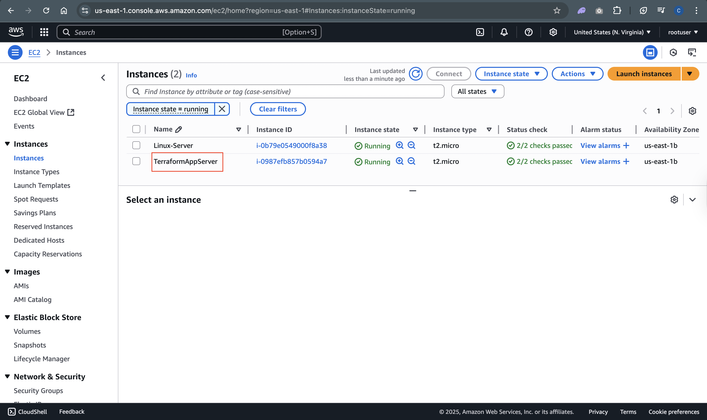
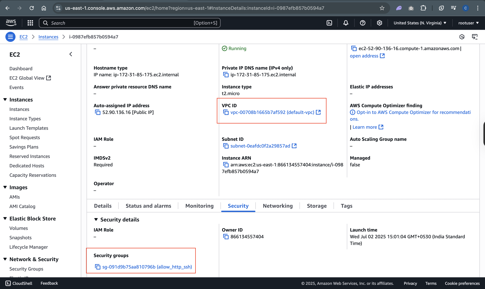
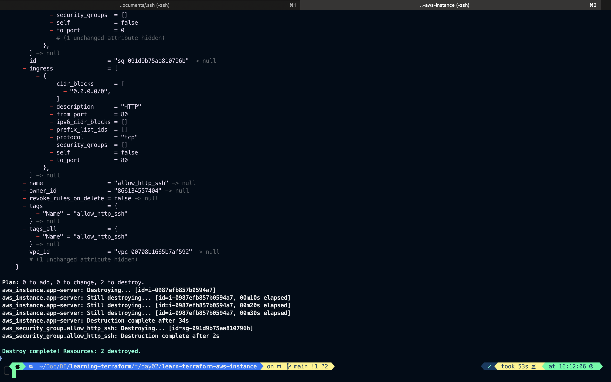

# Task

1. Configure AWS credential as environment values in .env files
2. Create AWS EC2 instance
3. Create security groups `engress` allows SSH and HTTP and `egress` allows on all port.
4.

# Solution

1.

```bash
touch .env # should be in the same project directory
source .env
```

Write aws access key and secret access key in .env file.

---

2.  2nd and 3rd quesions solution

```hcl
touch versions.tf  main.tf
# or
vim versions.tf main.tf
```

### `versions.tf`

```hcl
terraform{
  required_providers{
    aws = {
      source = "hashicorp/aws"
    version = "~> 5.92" # The string ~> 5.92 means your configuration supports any version of the provider with a major version of 5 and a minor version greater than or equal to 92.
    }
  }
  required_version = ">= 1.2" # The string >= 1.2 means your configuration supports any version of Terraform greater than or equal to 1.2
}
```

## `main.tf`

```hcl
provider "aws"{
  region = "us-east-1"
  # here also we can write AWS ACCESS and SECRET ACCESS KEY
}

resource "aws_instance" "app_server"{
  ami = "ami-020cba7c55df1f615" # UBUNTU AMI IMAGE ID
  instance_type = "t2.micro" #You can change as per your choice
  key_name = " " # Write your own key name
  security_groups = [aws_security_groups.allow_http_ssh.name]

  tags = {
    Name = "TerraformAppServer"
  }
}

resource "aws_security_group" "allow_http_ssh"{
  name = "allow_http_ssh"
  description = "Allow SSH and HTTP"
  vpc_id = "vpc-00708b1665b7af592" # Replace with your own VPC ID

  ingress {
    description = "HTTP"
    from_port = 80
    to_port =  80
    protocol = "tcp"
    cidr_block = ["0.0.0.0/0"]
  }
  ingress {
    description = "SSH"
    from_port = 22
    to_port = 22
    protocol = "tcp"
    cidr_block = ["0.0.0.0/0"]
  }
  egress {
    from_port = 0
    to_port = 0
    protocol = "-1"
    cidr_block = ["0.0.0.0/0"]
  }

  tags = {
    Name = "Allow_SSH_HTTP"
  }

}
```

---

## Format syntax

```bash
terraform fmt

```

> Output

```bash
terraform fmt
main.tf
versions.tf
```

## Validate your terraform syntax

```bash
terraform validate
```

## Plan your terraform resources

```bash
terraform plan
```

## Apply planned changes to AWS Infrastructure

```bash
terraform apply -auto-approve
```

## Check state list

```bash
terraform state list
```

## `show` COMMAND

```bash
terraform show
```




4. Terminate app-server instance

```bash
terraform destroy -auto-approve
```

## 

# Continue from end of the day01

## Data sources

- You can use `data` block to query your cloud provider for information about other resources. This data sources fetches the data about the latest AWS AMI that matches the filter, so you do not have to hardcode the AMI ID into your configuration. Data source helps keep your configuration dynamic and avoid hardcoded values that can become stale.

```hcl
data "aws_ami" "ubuntu"{
  most_recent = true

  filter {
    name = "name"
    values = ["ubuntu/images/hvm-ssd-gp3/ubuntu-noble-24.04-amd64-server-*"]
  }
  owners = ["866134557404"] # canonical
}
```

-
-
-
-
-
-
-
-
-
-
-

# Start day3 from Inspect state

https://developer.hashicorp.com/terraform/tutorials/aws-get-started/aws-create
