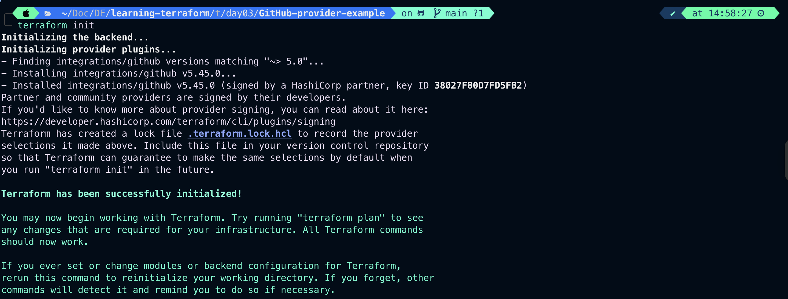
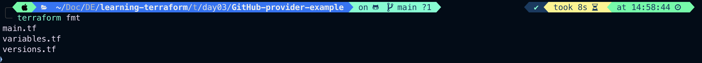
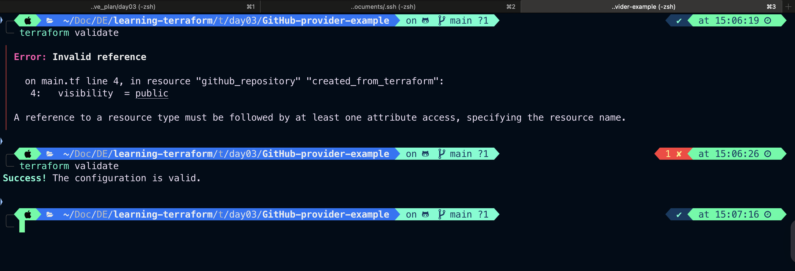
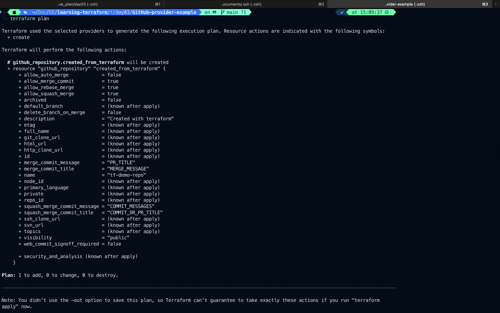
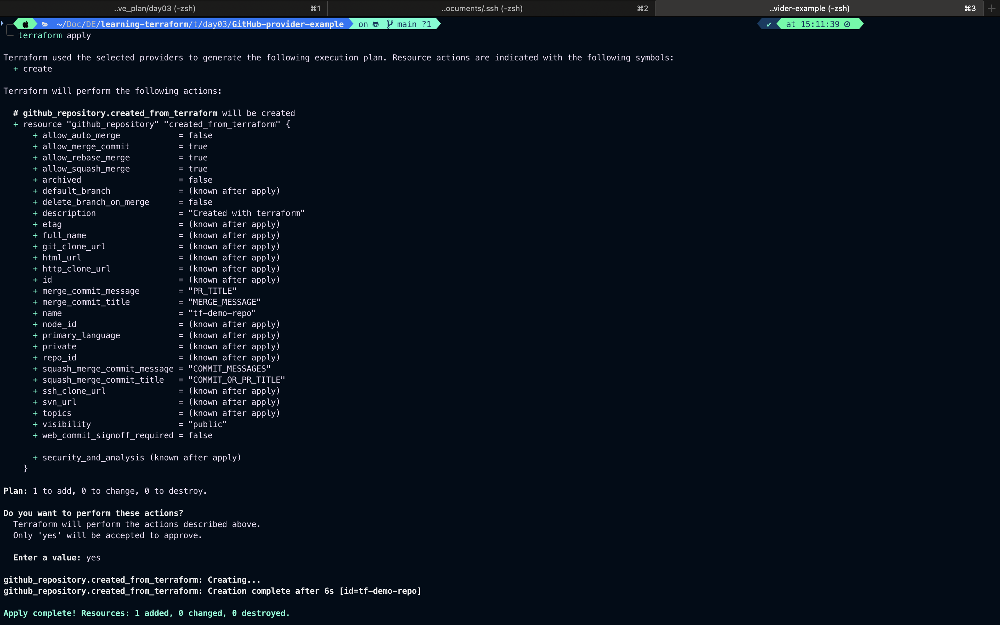
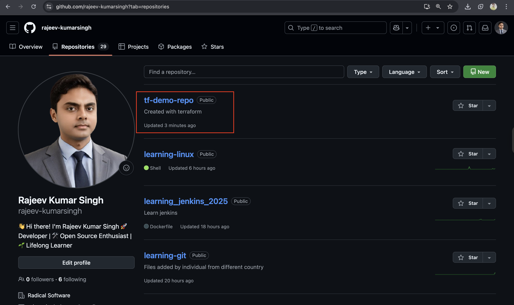
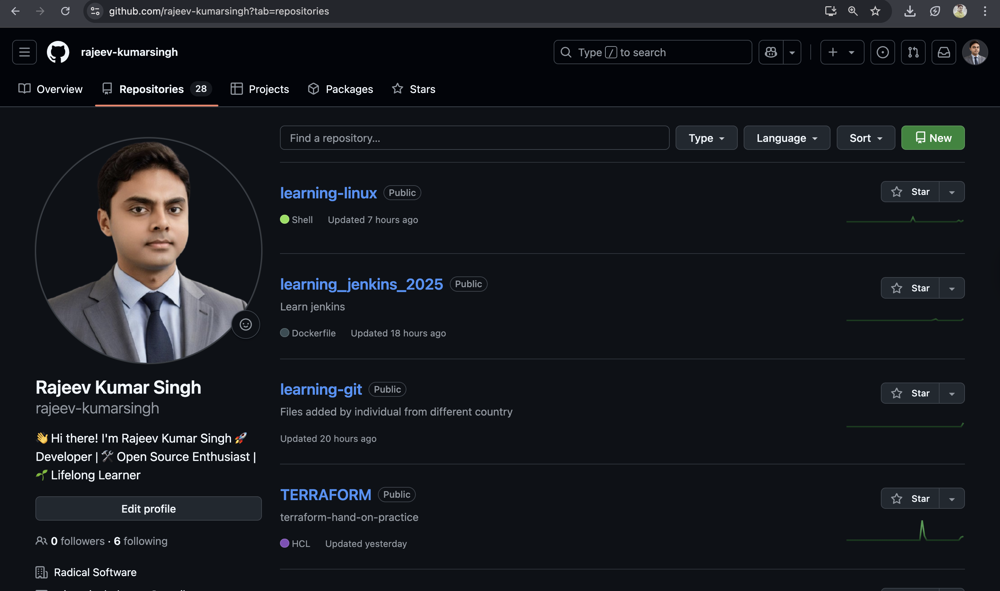

# Day-03: Task

## Topic:

1. Providers and Terraform Registry
2. Variables: Input Variables, Type Constraints, Validation Rules

---

## 1. Providers

- Providers are a logical abstraction of an upstream API. They are responsible for understanding API interactions and exposing resources.
- For detailed explanation check `terraform_providers_details.md` file.

---

## GitHub Provider Example

```hcl
terraform {
  required_providers {
    github = {
      source = "integrations/github"
      version = "~> 5.0"
    }
  }

}
provider "github" {
    token = var.github_token
    owner = "rajeev-kumarsingh"
  }

variable "github_token" {
  description = "GitHub persional access token"
  type = string
  sensitive = true
}

resource "github_repository" "created_from_terraform" {
  name = "tf-demo-repo"
  description = "Created with terraform"
  visibility = public

}
# Set your github token as environment variable
# export TF_VAR_github_token="YOUR_GitHub_TOKEN"
```

### Initialize Terraform

```bash
terraform init
```

## 

### Format the terraform syntax

```bash
terraform fmt
```

## 

### Validate

## 

### Plan the changes to be happen when apply

```bash
terraform plan
```

## 

---

### Apply the changes

```bash
terraform apply
```

## 

### Verify the changes on GitHub account



---

### Destroy

```bash
terraform destroy
```

`Output:`

```bash
terraform destroy
github_repository.created_from_terraform: Refreshing state... [id=tf-demo-repo]

Terraform used the selected providers to generate the following execution plan. Resource actions are indicated with the following symbols:
  - destroy

Terraform will perform the following actions:

  # github_repository.created_from_terraform will be destroyed
  - resource "github_repository" "created_from_terraform" {
      - allow_auto_merge            = false -> null
      - allow_merge_commit          = true -> null
      - allow_rebase_merge          = true -> null
      - allow_squash_merge          = true -> null
      - allow_update_branch         = false -> null
      - archived                    = false -> null
      - default_branch              = "main" -> null
      - delete_branch_on_merge      = false -> null
      - description                 = "Created with terraform" -> null
      - etag                        = "W/\"99b870f14362c1f3d1c9480b72002d767cd61bee5674ad7964a772e64387738d\"" -> null
      - full_name                   = "rajeev-kumarsingh/tf-demo-repo" -> null
      - git_clone_url               = "git://github.com/rajeev-kumarsingh/tf-demo-repo.git" -> null
      - has_discussions             = false -> null
      - has_downloads               = false -> null
      - has_issues                  = false -> null
      - has_projects                = false -> null
      - has_wiki                    = false -> null
      - html_url                    = "https://github.com/rajeev-kumarsingh/tf-demo-repo" -> null
      - http_clone_url              = "https://github.com/rajeev-kumarsingh/tf-demo-repo.git" -> null
      - id                          = "tf-demo-repo" -> null
      - is_template                 = false -> null
      - merge_commit_message        = "PR_TITLE" -> null
      - merge_commit_title          = "MERGE_MESSAGE" -> null
      - name                        = "tf-demo-repo" -> null
      - node_id                     = "R_kgDOPGIFHg" -> null
      - private                     = false -> null
      - repo_id                     = 1013056798 -> null
      - squash_merge_commit_message = "COMMIT_MESSAGES" -> null
      - squash_merge_commit_title   = "COMMIT_OR_PR_TITLE" -> null
      - ssh_clone_url               = "git@github.com:rajeev-kumarsingh/tf-demo-repo.git" -> null
      - svn_url                     = "https://github.com/rajeev-kumarsingh/tf-demo-repo" -> null
      - topics                      = [] -> null
      - visibility                  = "public" -> null
      - vulnerability_alerts        = false -> null
      - web_commit_signoff_required = false -> null
        # (2 unchanged attributes hidden)

      - security_and_analysis {
          - secret_scanning {
              - status = "enabled" -> null
            }
          - secret_scanning_push_protection {
              - status = "enabled" -> null
            }
        }
    }

Plan: 0 to add, 0 to change, 1 to destroy.

Do you really want to destroy all resources?
  Terraform will destroy all your managed infrastructure, as shown above.
  There is no undo. Only 'yes' will be accepted to confirm.

  Enter a value: yes

github_repository.created_from_terraform: Destroying... [id=tf-demo-repo]
╷
│ Error: DELETE https://api.github.com/repos/rajeev-kumarsingh/tf-demo-repo: 403 Must have admin rights to Repository. []
│
│
```

The error:

```bash
 DELETE https://api.github.com/repos/rajeev-kumarsingh/tf-demo-repo: 403 Must have admin rights to Repository
```

means that your GitHub token does not have the necessary permissions (admin access) to delete the repository tf-demo-repo.

✅ Here's how to fix it:

1. Check if your token has the right scopes:
   Go to: https://github.com/settings/tokens

Make sure your Personal Access Token (PAT) has the following scopes:

✅ repo (full access to private/public repos)

✅ delete_repo (required to delete repos)

✅ admin:repo_hook (if managing webhooks)

If delete_repo is missing, Terraform cannot delete repositories — this is exactly your case.

### After provide the required permission check the terraform state and then destroy

```bash
terraform state list
```

`Output:`

```bash
terraform state list
github_repository.created_from_terraform
```

---

### Now destroy the created repo

```bash
terraform destroy
```

`Output:`

```bash
terraform destroy
github_repository.created_from_terraform: Refreshing state... [id=tf-demo-repo]

Terraform used the selected providers to generate the following execution plan. Resource actions are indicated with the following symbols:
  - destroy

Terraform will perform the following actions:

  # github_repository.created_from_terraform will be destroyed
  - resource "github_repository" "created_from_terraform" {
      - allow_auto_merge            = false -> null
      - allow_merge_commit          = true -> null
      - allow_rebase_merge          = true -> null
      - allow_squash_merge          = true -> null
      - allow_update_branch         = false -> null
      - archived                    = false -> null
      - default_branch              = "main" -> null
      - delete_branch_on_merge      = false -> null
      - description                 = "Created with terraform" -> null
      - etag                        = "W/\"99b870f14362c1f3d1c9480b72002d767cd61bee5674ad7964a772e64387738d\"" -> null
      - full_name                   = "rajeev-kumarsingh/tf-demo-repo" -> null
      - git_clone_url               = "git://github.com/rajeev-kumarsingh/tf-demo-repo.git" -> null
      - has_discussions             = false -> null
      - has_downloads               = false -> null
      - has_issues                  = false -> null
      - has_projects                = false -> null
      - has_wiki                    = false -> null
      - html_url                    = "https://github.com/rajeev-kumarsingh/tf-demo-repo" -> null
      - http_clone_url              = "https://github.com/rajeev-kumarsingh/tf-demo-repo.git" -> null
      - id                          = "tf-demo-repo" -> null
      - is_template                 = false -> null
      - merge_commit_message        = "PR_TITLE" -> null
      - merge_commit_title          = "MERGE_MESSAGE" -> null
      - name                        = "tf-demo-repo" -> null
      - node_id                     = "R_kgDOPGIFHg" -> null
      - private                     = false -> null
      - repo_id                     = 1013056798 -> null
      - squash_merge_commit_message = "COMMIT_MESSAGES" -> null
      - squash_merge_commit_title   = "COMMIT_OR_PR_TITLE" -> null
      - ssh_clone_url               = "git@github.com:rajeev-kumarsingh/tf-demo-repo.git" -> null
      - svn_url                     = "https://github.com/rajeev-kumarsingh/tf-demo-repo" -> null
      - topics                      = [] -> null
      - visibility                  = "public" -> null
      - vulnerability_alerts        = false -> null
      - web_commit_signoff_required = false -> null
        # (2 unchanged attributes hidden)

      - security_and_analysis {
          - secret_scanning {
              - status = "enabled" -> null
            }
          - secret_scanning_push_protection {
              - status = "enabled" -> null
            }
        }
    }

Plan: 0 to add, 0 to change, 1 to destroy.

Do you really want to destroy all resources?
  Terraform will destroy all your managed infrastructure, as shown above.
  There is no undo. Only 'yes' will be accepted to confirm.

  Enter a value: yes

github_repository.created_from_terraform: Destroying... [id=tf-demo-repo]
github_repository.created_from_terraform: Destruction complete after 1s

Destroy complete! Resources: 1 destroyed.
```

## 

---

# Terraform Registry

- For more details, read terraform_registry_guide.md file
-
-
-
-
-

> Note: Start tomorrow with recap of provider then terraform registry
