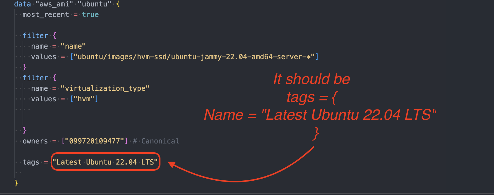

1. terraform validate  
   ╷
   │ Error: Missing required provider
   │
   │ This configuration requires provider registry.terraform.io/hashicorp/aws, but that provider isn't available. You may be able to install
   │ it automatically by running:
   │ terraform init

   ***

2. terraform validate
   ╷
   │ Error: Incorrect attribute value type
   │
   │ on main.tf line 31, in data "aws_ami" "ubuntu":
   │ 31: tags = "Latest Ubuntu 22.04 LTS"
   │
   │ Inappropriate value for attribute "tags": map of string required.
   ╵
   

   ***

3. terraform validate
   ╷
   │ Error: Reference to undeclared resource
   │
   │ on main.tf line 94, in resource "aws_instance" "web_server":
   │ 94: subnet_id = aws_subnet.public_subnet["public_subnet_1"].id
   │
   │ A managed resource "aws_subnet" "public_subnet" has not been declared in the root module.

---

4. Error: reading EC2 AMIs: operation error EC2: DescribeImages, https response error StatusCode: 400, RequestID: db343926-c49e-400f-9633-e1c881d9e67b, api error InvalidParameterValue: The filter 'virtualization_type' is invalid
   │
   │ with data.aws_ami.ubuntu,
   │ on main.tf line 16, in data "aws_ami" "ubuntu":
   │ 16: data "aws_ami" "ubuntu" {

---

5.
